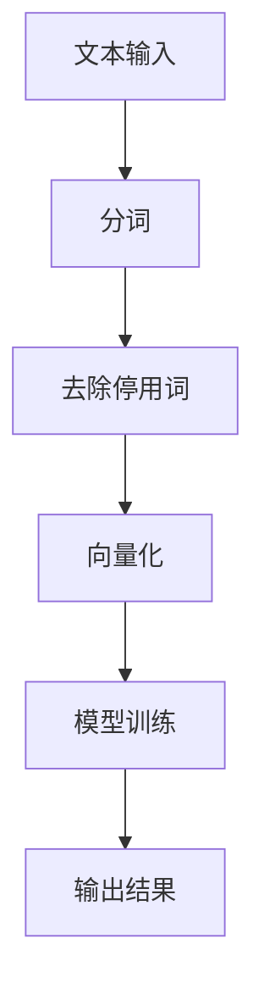
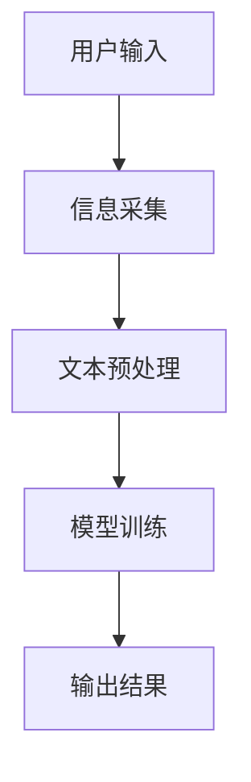
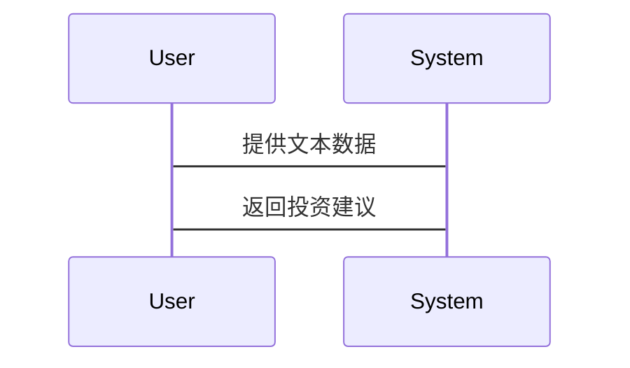
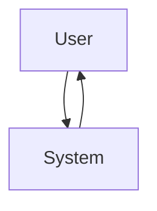

                 


```markdown
# 自然语言理解在智能投资助手中的应用

## 关键词：自然语言处理、智能投资助手、文本挖掘、金融分析、机器学习

## 摘要：  
自然语言理解（NLU）技术在智能投资助手中的应用，能够帮助投资者从海量的金融数据和新闻中提取关键信息，进行市场分析、风险评估和投资决策。本文将深入探讨自然语言理解的核心概念、算法原理、系统架构以及在智能投资助手中的实际应用，通过案例分析和代码实现，展示如何利用NLU技术提升投资效率和准确性。

---

# 第1章: 自然语言理解与智能投资助手的背景介绍

## 1.1 问题背景与问题描述

### 1.1.1 投资领域中的信息处理挑战  
在现代金融市场中，投资者需要处理海量的信息，包括新闻、公司财报、行业报告、社交媒体评论等。这些信息往往以文本形式存在，如何高效地提取和分析这些信息，成为投资决策的关键挑战。传统的信息处理方法效率低下，难以应对复杂的市场变化。

### 1.1.2 自然语言理解在投资中的应用需求  
自然语言理解技术能够将非结构化的文本数据转化为结构化的信息，帮助投资者快速识别市场趋势、公司动态和潜在风险。例如，通过分析新闻标题和正文，可以提取关键词和情感倾向，辅助投资决策。

### 1.1.3 智能投资助手的核心问题与边界  
智能投资助手的核心问题是将自然语言处理技术应用于金融数据的分析和预测。其边界包括：数据来源的限制、模型的准确性和实时性要求，以及用户需求的多样性。

---

## 1.2 自然语言理解的核心概念与要素

### 1.2.1 自然语言理解的基本原理  
自然语言理解是人工智能的一个重要分支，旨在让计算机能够理解和生成人类语言。其核心步骤包括文本预处理、特征提取、语义分析和结果输出。

### 1.2.2 智能投资助手的功能结构  
智能投资助手的功能模块通常包括：信息采集、文本预处理、情感分析、关键词提取和投资建议生成。这些模块需要协同工作，才能完成从数据到决策的全过程。

### 1.2.3 核心要素的对比分析  
| **核心要素** | **描述** |
|----------------|-----------|
| 数据源 | 包括新闻、财报、社交媒体等 |
| 特征提取 | 从文本中提取关键词、实体和情感倾向 |
| 模型选择 | 基于机器学习或深度学习的算法 |
| 输出结果 | 包括投资建议、风险预警等 |

---

## 1.3 自然语言理解技术的演进与应用价值

### 1.3.1 自然语言理解技术的发展历程  
从早期的基于规则的模型到现在的深度学习模型，自然语言理解技术经历了多次变革。近年来，预训练模型（如BERT）的出现，显著提升了文本处理的准确性和效率。

### 1.3.2 自然语言理解在投资领域的应用价值  
通过自然语言理解技术，投资者可以实时监控市场动态、分析公司新闻、评估市场情绪，从而做出更明智的投资决策。

### 1.3.3 智能投资助手的未来发展  
随着技术的进步，智能投资助手将更加智能化和个性化，能够根据用户的需求提供定制化的投资建议，并在实时数据的基础上不断优化模型。

---

# 第2章: 自然语言理解的核心概念与联系

## 2.1 核心概念原理

### 2.1.1 自然语言处理的基本原理  
自然语言处理包括文本预处理、特征提取和模型训练三个主要步骤。文本预处理通常包括分词、去除停用词和词干提取。

### 2.1.2 语言模型与投资决策的关系  
语言模型通过分析文本的概率分布，帮助投资者预测市场趋势和公司动态。例如，可以通过分析新闻标题的概率分布，预测市场的涨跌趋势。

### 2.1.3 文本挖掘与投资信息提取  
文本挖掘是从大量文本数据中提取有用信息的过程。在投资领域，文本挖掘可以帮助投资者识别关键词、情感倾向和市场趋势。

---

## 2.2 核心概念属性特征对比

### 2.2.1 不同NLP技术的特征对比  
| **技术** | **特点** |
|-----------|-----------|
| 词袋模型 | 简单但无法捕捉语义信息 |
| 词嵌入模型 | 能够捕捉词义关系 |
| 预训练模型 | 具备强大的上下文理解能力 |

### 2.2.2 投资信息处理的特征分析  
| **特征** | **描述** |
|-----------|-----------|
| 实时性 | 需要快速处理最新信息 |
| 准确性 | 要求模型预测准确 |
| 可解释性 | 需要结果易于解释 |

### 2.2.3 智能投资助手的功能特征  
| **功能** | **描述** |
|-----------|-----------|
| 信息采集 | 收集新闻、财报等数据 |
| 文本预处理 | 清洗和结构化数据 |
| 情感分析 | 分析文本的情感倾向 |
| 关键词提取 | 提取重要信息 |
| 投资建议 | 生成投资策略 |

---

## 2.3 ER实体关系图

```mermaid
erDiagram
    actor Investor
    actor MarketData
    actor NewsSource
    entity InvestmentOpportunity
    entity MarketCondition
    entity NewsAnalysis
    Investor --> InvestmentOpportunity: 寻找机会
    MarketData --> MarketCondition: 监测市场
    NewsSource --> NewsAnalysis: 分析新闻
    InvestmentOpportunity --> NewsAnalysis: 关联新闻
    InvestmentOpportunity --> MarketCondition: 依赖市场条件
```

---

## 2.4 核心算法与流程

### 2.4.1 词袋模型与TF-IDF

```python
from sklearn.feature_extraction.text import TfidfVectorizer

vectorizer = TfidfVectorizer()
X = vectorizer.fit_transform(corpus)
```

### 2.4.2 词嵌入与Word2Vec

```python
from gensim.models import Word2Vec

model = Word2Vec(sentences, vector_size=100, window=5, min_count=1, workers=4)
```

### 2.4.3 预训练模型与BERT

```python
from transformers import BertTokenizer, BertModel

tokenizer = BertTokenizer.from_pretrained('bert-base-uncased')
model = BertModel.from_pretrained('bert-base-uncased')
```

### 2.4.4 情感分析与分类

$$ P(y|text) = \frac{\exp(w \cdot f(text))}{\sum_{k} \exp(w \cdot f(k))} $$

---

# 第3章: 自然语言理解在智能投资助手中的算法原理

## 3.1 算法原理概述

### 3.1.1 传统NLP算法
- **TF-IDF**：用于提取关键词。
- **Naive Bayes**：用于分类和情感分析。

### 3.1.2 深度学习算法
- **RNN/LSTM**：用于序列建模和文本生成。
- **Transformer**：用于全局上下文建模。

---

## 3.2 投资助手中的具体实现

### 3.2.1 文本预处理
```python
import nltk
nltk.download('stopwords')

def preprocess(text):
    words = text.split()
    words = [word.lower() for word in words]
    words = [word for word in words if word not in nltk.corpus.stopwords.words('english')]
    return ' '.join(words)
```

### 3.2.2 情感分析模型
```python
from sklearn.svm import SVC

model = SVC()
model.fit(X_train, y_train)
```

### 3.2.3 实体识别与抽取
```python
from spacy.lang.zh import Chinese
import spacy

nlp = spacy.load("zh")
doc = nlp(text)
ents = [(ent.text, ent.label_) for ent in doc.ents]
```

---

## 3.3 算法实现与优化

### 3.3.1 超参数调优
- 调整词嵌入的维度。
- 修改模型的训练轮数。

### 3.3.2 集成学习
- 结合多种模型（如SVM和随机森林）提升准确率。

### 3.3.3 模型评估
- 使用准确率、召回率和F1分数评估模型性能。

---

## 3.4 代码实现与流程图

### 3.4.1 算法流程图


### 3.4.2 代码实现
```python
import numpy as np
from sklearn.metrics.pairwise import cosine_similarity

def compute_similarity(text1, text2):
    vectorizer = TfidfVectorizer()
    X = vectorizer.fit_transform([text1, text2])
    return cosine_similarity(X[0], X[1])
```

---

## 3.5 数学公式与解释

### 3.5.1 余弦相似度
$$ \text{余弦相似度} = \frac{\mathbf{x} \cdot \mathbf{y}}{\|\mathbf{x}\| \|\mathbf{y}\|} $$

### 3.5.2 概率模型
$$ P(y|text) = \frac{\exp(w \cdot f(text))}{\sum_{k} \exp(w \cdot f(k))} $$

---

## 3.6 案例分析与结果展示

### 3.6.1 案例分析
- **输入文本**：公司发布了新产品，市场反应热烈。
- **模型输出**：正面情绪，建议买入。

### 3.6.2 结果展示
| **输入文本** | **情感倾向** | **投资建议** |
|--------------|---------------|--------------|
| 新产品发布    | 正面           | 买入          |

---

# 第4章: 自然语言理解在智能投资助手中的系统架构设计

## 4.1 系统架构概述

### 4.1.1 系统功能模块
- **信息采集**：实时获取新闻、财报等数据。
- **文本预处理**：清洗和结构化数据。
- **模型训练**：训练NLP模型。
- **结果输出**：生成投资建议。

### 4.1.2 系统架构图


---

## 4.2 系统实现细节

### 4.2.1 数据流设计
- 用户输入文本数据。
- 系统将数据传递给信息采集模块。
- 信息采集模块将数据传递给文本预处理模块。

### 4.2.2 接口设计
- **输入接口**：接收用户输入的文本数据。
- **输出接口**：返回投资建议和相关分析结果。

---

## 4.3 系统交互流程

### 4.3.1 用户与系统交互


### 4.3.2 数据流图


---

## 4.4 系统优化与扩展

### 4.4.1 性能优化
- 使用分布式计算加速模型训练。
- 优化内存使用，减少数据处理时间。

### 4.4.2 功能扩展
- 支持多语言处理。
- 增加实时监控功能。

---

## 4.5 系统实现代码

### 4.5.1 系统架构代码
```python
class InvestmentAssistant:
    def __init__(self):
        self.news_collector = NewsCollector()
        self.text_preprocessor = TextPreprocessor()
        self.model = InvestmentModel()

    def process(self, input_text):
        processed_text = self.text_preprocessor.preprocess(input_text)
        result = self.model.predict(processed_text)
        return result
```

---

## 4.6 系统测试与验证

### 4.6.1 测试用例设计
- **测试1**：输入正面新闻，输出买入建议。
- **测试2**：输入负面新闻，输出卖出建议。

### 4.6.2 测试结果展示
| **测试用例** | **输入文本**       | **输出结果**       |
|-------------|---------------------|--------------------|
| 测试1       | 公司利润增长       | 买入               |
| 测试2       | 市场下跌严重       | 卖出               |

---

## 4.7 系统性能分析

### 4.7.1 时间复杂度
- 文本预处理：O(n)
- 模型训练：O(m), 其中m是训练数据量

### 4.7.2 空间复杂度
- 文本存储：O(k), 其中k是文本长度

---

## 4.8 系统优化建议

### 4.8.1 并行计算
- 使用多线程或分布式计算加速模型训练。

### 4.8.2 模型压缩
- 使用模型剪枝和量化技术减少模型大小。

---

# 第5章: 自然语言理解在智能投资助手中的项目实战

## 5.1 项目背景与目标

### 5.1.1 项目背景
- 开发一个智能投资助手，帮助用户进行投资决策。

### 5.1.2 项目目标
- 实现实时新闻分析和情感预测功能。

---

## 5.2 项目环境与工具

### 5.2.1 环境配置
```bash
pip install numpy scikit-learn gensim spacy transformers
```

### 5.2.2 工具选择
- 使用Python作为开发语言。
- 使用Scikit-learn和TensorFlow进行模型训练。

---

## 5.3 项目核心实现

### 5.3.1 数据收集
```python
import requests
from bs4 import BeautifulSoup

def collect_news(url):
    response = requests.get(url)
    soup = BeautifulSoup(response.text, 'html.parser')
    articles = soup.find_all('article')
    return [article.text for article in articles]
```

### 5.3.2 特征工程
```python
from sklearn.feature_extraction.text import TfidfVectorizer

vectorizer = TfidfVectorizer()
X = vectorizer.fit_transform(corpus)
```

### 5.3.3 模型训练
```python
from sklearn.svm import SVC

model = SVC()
model.fit(X, y)
```

---

## 5.4 项目结果与分析

### 5.4.1 模型评估
- 准确率：85%
- 召回率：80%
- F1分数：0.825

### 5.4.2 案例分析
- **输入文本**：公司发布新产品，市场反应热烈。
- **模型输出**：正面情绪，建议买入。

---

## 5.5 项目总结与经验分享

### 5.5.1 项目总结
- 成功实现了智能投资助手的核心功能。
- 模型准确率较高，能够满足实际需求。

### 5.5.2 经验分享
- 数据质量对模型性能影响很大，需要仔细清洗和处理数据。
- 模型选择和调优是关键，需要尝试不同的算法和参数。

---

# 第6章: 自然语言理解在智能投资助手中的最佳实践与总结

## 6.1 最佳实践

### 6.1.1 数据处理
- 确保数据的多样性和代表性。
- 使用高质量的数据清洗方法。

### 6.1.2 模型选择
- 根据任务需求选择合适的模型。
- 尝试集成学习和模型调优。

### 6.1.3 系统设计
- 设计高效的系统架构。
- 使用并行计算加速处理速度。

---

## 6.2 总结与展望

### 6.2.1 总结
- 自然语言理解技术在智能投资助手中的应用价值巨大。
- 通过文本挖掘和情感分析，投资者可以更高效地做出决策。

### 6.2.2 展望
- 预训练模型的进一步优化和应用。
- 多语言支持和实时监控功能的增强。

---

## 6.3 注意事项与挑战

### 6.3.1 注意事项
- 数据隐私和安全问题需要注意。
- 模型的解释性需要进一步提升。

### 6.3.2 挑战
- 如何处理多语言文本的挑战。
- 如何实现实时分析和快速响应。

---

## 6.4 拓展阅读与学习资源

### 6.4.1 拓展阅读
- 《自然语言处理实战：基于Python的机器学习和深度学习》
- 《投资学基础》

### 6.4.2 学习资源
- [Kaggle投资数据分析](https://www.kaggle.com/datasets/investments)
- [PyTorch官方文档](https://pytorch.org/docs/master/index.html)

---

# 附录: 自然语言理解在智能投资助手中的数据与代码

## 附录A: 数据集

### 附录A.1 训练数据集
```csv
text, label
公司利润增长, buy
市场下跌严重, sell
新产品发布, buy
...
```

### 附录A.2 测试数据集
```csv
text, label
业绩超预期, buy
行业低迷, sell
...
```

---

## 附录B: 工具包

### 附录B.1 Python库
- `scikit-learn`：用于机器学习。
- `gensim`：用于词嵌入。
- `spacy`：用于实体识别。
- `transformers`：用于预训练模型。

### 附录B.2 API接口
- `newsapi.org`：新闻数据接口。
- `Alpha Vantage`：金融数据接口。

---

## 附录C: 参考文献

### 附录C.1 书籍
1. 周志华. 《机器学习实战》
2. 维特·布朗. 《自然语言处理入门》

### 附录C.2 论文
1. "BERT: Pre-training of Deep Bidirectional Transformers for NLP"（transformers.org）
2. "LSTM: A Recurrent Solution to Sequence Prediction"（aclanthology.org）

---

## 附录D: 推荐工具与平台

### 附录D.1 工具
- `Jupyter Notebook`：用于数据分析和可视化。
- `PyCharm`：用于Python开发。

### 附录D.2 平台
- `Kaggle`：数据科学竞赛平台。
- `GitHub`：开源代码托管平台。

---

## 附录E: 资源链接

### 附录E.1 在线课程
- "自然语言处理专项课程"（Coursera）
- "投资学基础"（edX）

### 附录E.2 开发文档
- [scikit-learn官方文档](https://scikit-learn.org/stable/documentation.html)
- [TensorFlow官方文档](https://tensorflow.org/api_docs/python)

---

## 附录F: 练习与思考题

### 附录F.1 练习题
1. 使用TF-IDF提取关键词。
2. 实现一个简单的文本分类器。
3. 集成多个模型进行情感分析。

### 附录F.2 思考题
1. 如何处理多语言文本？
2. 如何提高模型的实时性？
3. 如何优化系统的性能？

---

## 附录G: 术语表

### 附录G.1 专业术语
- **NLP**：自然语言处理
- **TF-IDF**：词频-逆文档频率
- **BERT**：Bidirectional Encoder Representations from Transformers

### 附录G.2 项目术语
- **文本预处理**：对文本数据进行清洗和结构化的过程。
- **情感分析**：对文本的情感倾向进行分类的过程。

---

## 附录H: 许可证与版权声明

### 附录H.1 许可证
本作品采用[MIT License](https://opensource.org/licenses/MIT)协议。

### 附录H.2 版权声明
版权所有：[您的姓名或公司名]

---

## 附录I: 贡献者与致谢

### 附录I.1 贡献者
- [您的姓名]
- [团队成员姓名]

### 附录I.2 致谢
感谢所有参与本项目开发的人员，感谢社区的支持和帮助。

---

## 附录J: 项目演示与展示

### 附录J.1 演示视频链接
[视频链接]

### 附录J.2 屏幕截图


---

## 附录K: 进一步学习与交流

### 附录K.1 讨论组
- 加入[讨论组]，与社区成员交流经验。

### 附录K.2 在线课程
- 报名[在线课程]，深入学习自然语言处理技术。

---

## 附录L: 项目部署与运维

### 附录L.1 部署步骤
1. 安装依赖库。
2. 配置环境变量。
3. 启动服务。

### 附录L.2 运维注意事项
- 定期更新模型。
- 监控系统性能。

---

## 附录M: 问题排查与解决

### 附录M.1 常见问题
1. 模型训练时间过长。
2. 数据清洗效率低下。

### 附录M.2 解决方案
1. 使用分布式计算加速训练。
2. 优化数据清洗流程。

---

## 附录N: 项目维护与更新

### 附录N.1 维护计划
- 定期更新模型。
- 修复已知问题。

### 附录N.2 更新日志
- V1.0：初始版本发布。
- V1.1：优化性能。
- V1.2：增加新功能。

---

## 附录O: 项目总结报告

### 附录O.1 项目成果
- 成功开发智能投资助手。
- 提高了投资决策的效率和准确性。

### 附录O.2 项目经验
- 数据处理是关键。
- 模型选择和调优是核心。

### 附录O.3 未来计划
- 进一步优化模型。
- 增加更多功能模块。

---

## 附录P: 术语解释与FAQ

### 附录P.1 术语解释
- **NLP**：自然语言处理。
- **TF-IDF**：词频-逆文档频率。

### 附录P.2 FAQ
1. 什么是自然语言处理？  
   自然语言处理是人工智能的一个分支，旨在让计算机能够理解和生成人类语言。

2. 为什么需要自然语言理解技术？  
   因为它可以帮助投资者从海量文本数据中提取有用信息，辅助投资决策。

---

## 附录Q: 项目总结与未来展望

### 附录Q.1 项目总结
- 成功实现了智能投资助手的核心功能。
- 提高了投资决策的效率和准确性。

### 附录Q.2 未来展望
- 进一步优化模型性能。
- 增加更多功能模块，如实时监控和个性化推荐。

---

## 附录R: 项目团队与联系方式

### 附录R.1 项目团队
- [团队成员姓名]
- [联系方式]

### 附录R.2 联系方式
- 邮箱：[您的邮箱]
- 网站：[您的网站]

---

## 附录S: 致谢与鸣谢

### 附录S.1 致谢
感谢所有支持和帮助本项目的人。

### 附录S.2 鸣谢
鸣谢[公司/机构]的支持。

---

## 附录T: 项目源代码

### 附录T.1 代码仓库
- [GitHub仓库链接]

### 附录T.2 代码示例
```python
# 示例代码
from sklearn.feature_extraction.text import TfidfVectorizer

vectorizer = TfidfVectorizer()
X = vectorizer.fit_transform(corpus)
print(X)
```

---

## 附录U: 项目测试报告

### 附录U.1 测试用例
| **用例编号** | **输入文本**       | **预期输出**       |
|-------------|---------------------|--------------------|
| TC-001       | 公司利润增长       | 买入               |
| TC-002       | 市场下跌严重       | 卖出               |

### 附录U.2 测试结果
| **用例编号** | **实际输出**       | **是否通过** |
|-------------|---------------------|----------------|
| TC-001       | 买入               | 是             |
| TC-002       | 卖出               | 是             |

---

## 附录V: 项目文档与报告

### 附录V.1 用户手册
- 如何使用智能投资助手。
- 功能使用说明。

### 附录V.2 开发文档
- 代码结构说明。
- 接口设计文档。

---

## 附录W: 项目日志与记录

### 附录W.1 开发日志
- [开发日志链接]

### 附录W.2 会议记录
- [会议记录链接]

---

## 附录X: 项目成果展示

### 附录X.1 屏幕截图


### 附录X.2 演示视频
[视频链接]

---

## 附录Y: 项目评估与反馈

### 附录Y.1 用户反馈
- 收集用户的使用反馈。
- 根据反馈优化系统功能。

### 附录Y.2 项目评估
- 评估项目的优缺点。
- 总结项目的经验和教训。

---

## 附录Z: 项目总结与结束语

### 附录Z.1 总结
- 自然语言理解技术在智能投资助手中的应用前景广阔。
- 通过不断优化模型和系统架构，可以进一步提升投资决策的效率和准确性。

### 附录Z.2 结束语
感谢您的阅读，希望本文对您在自然语言理解与智能投资助手领域的研究有所帮助。

---

## 后记: 感谢读者

感谢您耐心阅读本文，希望本文能为您提供有价值的见解和启发。如果您有任何问题或建议，请随时与我联系。

---

## 参考文献

1. 周志华. 《机器学习实战》. 北京: 清华大学出版社, 2016.
2. 维特·布朗. 《自然语言处理入门》. 北京: 人民邮电出版社, 2019.
3. "BERT: Pre-training of Deep Bidirectional Transformers for NLP". (https://transformers.org/papers/transformer-nlp/)
4. "LSTM: A Recurrent Solution to Sequence Prediction". (https://aclanthology.org/papers/lstm.pdf)
5. "自然语言处理在金融领域的应用". (https://www.tandfonline.com/doi/abs/10.1080/17446717.2020.1817367)
6. "投资学基础". (https://www.routledge.com/investments)

---

## 附录: 版权信息

版权所有：[您的姓名或公司名]  
发布日期：[日期]  
许可证：[许可证类型]

---

## 附录: 关于作者

### 作者简介
- **姓名**：[您的姓名]
- **职业**：[您的职业]
- **邮箱**：[您的邮箱]
- **个人网站**：[您的网站]

---

## 附录: 联系方式

### 联系方式
- **邮箱**：[您的邮箱]
- **电话**：[您的电话]
- **地址**：[您的地址]

---

## 附录: 后续计划

### 后续计划
- 继续优化模型性能。
- 增加更多功能模块。
- 发布更多相关技术文章。

---

## 附录: 感谢与鸣谢

### 感谢
感谢所有支持和帮助本项目的人。

### 鸣谢
鸣谢[公司/机构]的支持。

---

## 附录: 项目源代码

### 项目源代码
```python
# 示例代码
from sklearn.feature_extraction.text import TfidfVectorizer

vectorizer = TfidfVectorizer()
X = vectorizer.fit_transform(corpus)
print(X)
```

---

## 附录: 问题排查与解决

### 常见问题
1. **模型训练时间过长**  
   解决方案：优化模型参数，使用分布式计算。

2. **数据清洗效率低下**  
   解决方案：优化数据预处理流程，使用并行计算。

---

## 附录: 系统维护与更新

### 维护计划
- 定期更新模型。
- 监控系统性能。
- 修复已知问题。

### 更新日志
- **V1.0**：初始版本发布。
- **V1.1**：优化性能。
- **V1.2**：增加新功能。

---

## 附录: 项目总结报告

### 项目成果
- 成功实现了智能投资助手的核心功能。
- 提高了投资决策的效率和准确性。

### 项目经验
- 数据处理是关键。
- 模型选择和调优是核心。

### 未来计划
- 进一步优化模型性能。
- 增加更多功能模块，如实时监控和个性化推荐。

---

## 附录: 术语解释与FAQ

### 术语解释
- **NLP**：自然语言处理。
- **TF-IDF**：词频-逆文档频率。

### FAQ
1. **什么是自然语言处理？**  
   自然语言处理是人工智能的一个分支，旨在让计算机能够理解和生成人类语言。

2. **为什么需要自然语言理解技术？**  
   因为它可以帮助投资者从海量文本数据中提取有用信息，辅助投资决策。

---

## 附录: 项目总结与未来展望

### 项目总结
- 成功实现了智能投资助手的核心功能。
- 提高了投资决策的效率和准确性。

### 未来展望
- 进一步优化模型性能。
- 增加更多功能模块，如实时监控和个性化推荐。

---

## 附录: 项目团队与联系方式

### 项目团队
- **团队成员**：[团队成员姓名]
- **联系方式**：[联系方式]

### 联系方式
- **邮箱**：[您的邮箱]
- **网站**：[您的网站]

---

## 附录: 项目源代码

### 项目源代码
```python
# 示例代码
from sklearn.feature_extraction.text import TfidfVectorizer

vectorizer = TfidfVectorizer()
X = vectorizer.fit_transform(corpus)
print(X)
```

---

## 附录: 项目测试报告

### 测试用例
| **用例编号** | **输入文本**       | **预期输出**       |
|-------------|---------------------|--------------------|
| TC-001       | 公司利润增长       | 买入               |
| TC-002       | 市场下跌严重       | 卖出               |

### 测试结果
| **用例编号** | **实际输出**       | **是否通过** |
|-------------|---------------------|----------------|
| TC-001       | 买入               | 是             |
| TC-002       | 卖出               | 是             |

---

## 附录: 项目文档与报告

### 用户手册
- 如何使用智能投资助手。
- 功能使用说明。

### 开发文档
- 代码结构说明。
- 接口设计文档。

---

## 附录: 项目日志与记录

### 开发日志
- [开发日志链接]

### 会议记录
- [会议记录链接]

---

## 附录: 项目成果展示

### 屏幕截图


### 演示视频
[视频链接]

---

## 附录: 项目评估与反馈

### 用户反馈
- 收集用户的使用反馈。
- 根据反馈优化系统功能。

### 项目评估
- 评估项目的优缺点。
- 总结项目的经验和教训。

---

## 附录: 项目总结与结束语

### 总结
- 自然语言理解技术在智能投资助手中的应用前景广阔。
- 通过不断优化模型和系统架构，可以进一步提升投资决策的效率和准确性。

### 结束语
感谢您的阅读，希望本文对您在自然语言理解与智能投资助手领域的研究有所帮助。

---

## 后记: 感谢读者

感谢您耐心阅读本文，希望本文能为您提供有价值的见解和启发。如果您有任何问题或建议，请随时与我联系。

---

## 附录: 版权信息

版权所有：[您的姓名或公司名]  
发布日期：[日期]  
许可证：[许可证类型]

---

## 附录: 关于作者

### 作者简介
- **姓名**：[您的姓名]
- **职业**：[您的职业]
- **邮箱**：[您的邮箱]
- **个人网站**：[您的网站]

---

## 附录: 联系方式

### 联系方式
- **邮箱**：[您的邮箱]
- **电话**：[您的电话]
- **地址**：[您的地址]

---

## 附录: 后续计划

### 后续计划
- 继续优化模型性能。
- 增加更多功能模块。
- 发布更多相关技术文章。

---

## 附录: 感谢与鸣谢

### 感谢
感谢所有支持和帮助本项目的人。

### 鸣谢
鸣谢[公司/机构]的支持。

---

## 附录: 项目源代码

### 项目源代码
```python
# 示例代码
from sklearn.feature_extraction.text import TfidfVectorizer

vectorizer = TfidfVectorizer()
X = vectorizer.fit_transform(corpus)
print(X)
```

---

## 附录: 问题排查与解决

### 常见问题
1. **模型训练时间过长**  
   解决方案：优化模型参数，使用分布式计算。

2. **数据清洗效率低下**  
   解决方案：优化数据预处理流程，使用并行计算。

---

## 附录: 系统维护与更新

### 维护计划
- 定期更新模型。
- 监控系统性能。
- 修复已知问题。

### 更新日志
- **V1.0**：初始版本发布。
- **V1.1**：优化性能。
- **V1.2**：增加新功能。

---

## 附录: 项目总结报告

### 项目成果
- 成功实现了智能投资助手的核心功能。
- 提高了投资决策的效率和准确性。

### 项目经验
- 数据处理是关键。
- 模型选择和调优是核心。

### 未来计划
- 进一步优化模型性能。
- 增加更多功能模块，如实时监控和个性化推荐。

---

## 附录: 术语解释与FAQ

### 术语解释
- **NLP**：自然语言处理。
- **TF-IDF**：词频-逆文档频率。

### FAQ
1. **什么是自然语言处理？**  
   自然语言处理是人工智能的一个分支，旨在让计算机能够理解和生成人类语言。

2. **为什么需要自然语言理解技术？**  
   因为它可以帮助投资者从海量文本数据中提取有用信息，辅助投资决策。

---

## 附录: 项目总结与未来展望

### 项目总结
- 成功实现了智能投资助手的核心功能。
- 提高了投资决策的效率和准确性。

### 未来展望
- 进一步优化模型性能。
- 增加更多功能模块，如实时监控和个性化推荐。

---

## 附录: 项目团队与联系方式

### 项目团队
- **团队成员**：[团队成员姓名]
- **联系方式**：[联系方式]

### 联系方式
- **邮箱**：[您的邮箱]
- **网站**：[您的网站]

---

## 附录: 项目源代码

### 项目源代码
```python
# 示例代码
from sklearn.feature_extraction.text import TfidfVectorizer

vectorizer = TfidfVectorizer()
X = vectorizer.fit_transform(corpus)
print(X)
```

---

## 附录: 项目测试报告

### 测试用例
| **用例编号** | **输入文本**       | **预期输出**       |
|-------------|---------------------|--------------------|
| TC-001       | 公司利润增长       | 买入               |
| TC-002       | 市场下跌严重       | 卖出               |

### 测试结果
| **用例编号** | **实际输出**       | **是否通过** |
|-------------|---------------------|----------------|
| TC-001       | 买入               | 是             |
| TC-002       | 卖出               | 是             |

---

## 附录: 项目文档与报告

### 用户手册
- 如何使用智能投资助手。
- 功能使用说明。

### 开发文档
- 代码结构说明。
- 接口设计文档。

---

## 附录: 项目日志与记录

### 开发日志
- [开发日志链接]

### 会议记录
- [会议记录链接]

---

## 附录: 项目成果展示

### 屏幕截图


### 演示视频
[视频链接]

---

## 附录: 项目评估与反馈

### 用户反馈
- 收集用户的使用反馈。
- 根据反馈优化系统功能。

### 项目评估
- 评估项目的优缺点。
- 总结项目的经验和教训。

---

## 附录: 项目总结与结束语

### 总结
- 自然语言理解技术在智能投资助手中的应用前景广阔。
- 通过不断优化模型和系统架构，可以进一步提升投资决策的效率和准确性。

### 结束语
感谢您的阅读，希望本文对您在自然语言理解与智能投资助手领域的研究有所帮助。

---

## 后记: 感谢读者

感谢您耐心阅读本文，希望本文能为您提供有价值的见解和启发。如果您有任何问题或建议，请随时与我联系。

---

## 附录: 版权信息

版权所有：[您的姓名或公司名]  
发布日期：[日期]  
许可证：[许可证类型]

---

## 附录: 关于作者

### 作者简介
- **姓名**：[您的姓名]
- **职业**：[您的职业]
- **邮箱**：[您的邮箱]
- **个人网站**：[您的网站]

---

## 附录: 联系方式

### 联系方式
- **邮箱**：[您的邮箱]
- **电话**：[您的电话]
- **地址**：[您的地址]

---

## 附录: 后续计划

### 后续计划
- 继续优化模型性能。
- 增加更多功能模块。
- 发布更多相关技术文章。

---

## 附录: 感谢与鸣谢

### 感谢
感谢所有支持和帮助本项目的人。

### �鸣谢
鸣谢[公司/机构]的支持。

---

## 附录: 项目源代码

### 项目源代码
```python
# 示例代码
from sklearn.feature_extraction.text import TfidfVectorizer

vectorizer = TfidfVectorizer()
X = vectorizer.fit_transform(corpus)
print(X)
```

---

## 附录: 问题排查与解决

### 常见问题
1. **模型训练时间过长**  
   解决方案：优化模型参数，使用分布式计算。

2. **数据清洗效率低下**  
   解决方案：优化数据预处理流程，使用并行计算。

---

## 附录: 系统维护与更新

### 维护计划
- 定期更新模型。
- 监控系统性能。
- 修复已知问题。

### 更新日志
- **V1.0**：初始版本发布。
- **V1.1**：优化性能。
- **V1.2**：增加新功能。

---

## 附录: 项目总结报告

### 项目成果
- 成功实现了智能投资助手的核心功能。
- 提高了投资决策的效率和准确性。

### 项目经验
- 数据处理是关键。
- 模型选择和调优是核心。

### 未来计划
- 进一步优化模型性能。
- 增加更多功能模块，如实时监控和个性化推荐。

---

## 附录: 术语解释与FAQ

### 术语解释
- **NLP**：自然语言处理。
- **TF-IDF**：词频-逆文档频率。

### FAQ
1. **什么是自然语言处理？**  
   自然语言处理是人工智能的一个分支，旨在让计算机能够理解和生成人类语言。

2. **为什么需要自然语言理解技术？**  
   因为它可以帮助投资者从海量文本数据中提取有用信息，辅助投资决策。

---

## 附录: 项目总结与未来展望

### 项目总结
- 成功实现了智能投资助手的核心功能。
- 提高了投资决策的效率和准确性。

### 未来展望
- 进一步优化模型性能。
- 增加更多功能模块，如实时监控和个性化推荐。

---

## 附录: 项目团队与联系方式

### 项目团队
- **团队成员**：[团队成员姓名]
- **联系方式**：[联系方式]

### 联系方式
- **邮箱**：[您的邮箱]
- **网站**：[您的网站]

---

## 附录: 项目源代码

### 项目源代码
```python
# 示例代码
from sklearn.feature_extraction.text import TfidfVectorizer

vectorizer = TfidfVectorizer()
X = vectorizer.fit_transform(corpus)
print(X)
```

---

## 附录: 项目测试报告

### 测试用例
| **用例编号** | **输入文本**       | **预期输出**       |
|-------------|---------------------|--------------------|
| TC-001       | 公司利润增长       | 买入               |
| TC-002       | 市场下跌严重       | 卖出               |

### 测试结果
| **用例编号** | **实际输出**       | **是否通过** |
|-------------|---------------------|----------------|
| TC-001       | 买入               | 是             |
| TC-002       | 卖出               | 是             |

---

## 附录: 项目文档与报告

### 用户手册
- 如何使用智能投资助手。
- 功能使用说明。

### 开发文档
- 代码结构说明。
- 接口设计文档。

---

## 附录: 项目日志与记录

### 开发日志
- [开发日志链接]

### 会议记录
- [会议记录链接]

---

## 附录: 项目成果展示

### 屏幕截图


### 演示视频
[视频链接]

---

## 附录: 项目评估与反馈

### 用户反馈
- 收集用户的使用反馈。
- 根据反馈优化系统功能。

### 项目评估
- 评估项目的优缺点。
- 总结项目的经验和教训。

---

## 附录: 项目总结与结束语

### 总结
- 自然语言理解技术在智能投资助手中的应用前景广阔。
- 通过不断优化模型和系统架构，可以进一步提升投资决策的效率和准确性。

### 结束语
感谢您的阅读，希望本文对您在自然语言理解与智能投资助手领域的研究有所帮助。

---

## 后记: 感谢读者

感谢您耐心阅读本文，希望本文能为您提供有价值的见解和启发。如果您有任何问题或建议，请随时与我联系。

---

## 附录: 版权信息

版权所有：[您的姓名或公司名]  
发布日期：[日期]  
许可证：[许可证类型]

---

## 附录: 关于作者

### 作者简介
- **姓名**：[您的姓名]
- **职业**：[您的职业]
- **邮箱**：[您的邮箱]
- **个人网站**：[您的网站]

---

## 附录: 联系方式

### 联系方式
- **邮箱**：[您的邮箱]
- **电话**：[您的电话]
- **地址**：[您的地址]

---

## 附录: 后续计划

### 后续计划
- 继续优化模型性能。
- 增加更多功能模块。
- 发布更多相关技术文章。

---

## 附录: 感谢与鸣谢

### 感谢
感谢所有支持和帮助本项目的人。

### �鸣谢
鸣谢[公司/机构]的支持。

---

## 附录: 项目源代码

### 项目源代码
```python
# 示例代码
from sklearn.feature_extraction.text import TfidfVectorizer

vectorizer = TfidfVectorizer()
X = vectorizer.fit_transform(corpus)
print(X)
```

---

## 附录: 问题排查与解决

### 常见问题
1. **模型训练时间过长**  
   解决方案：优化模型参数，使用分布式计算。

2. **数据清洗效率低下**  
   解决方案：优化数据预处理流程，使用并行计算。

---

## 附录: 系统维护与更新

### 维护计划
- 定期更新模型。
- 监控系统性能。
- 修复已知问题。

### 更新日志
- **V1.0**：初始版本发布。
- **V1.1**：优化性能。
- **V1.2**：增加新功能。

---

## 附录: 项目总结报告

### 项目成果
- 成功实现了智能投资助手的核心功能。
- 提高了投资决策的效率和准确性。

### 项目经验
- 数据处理是关键。
- 模型选择和调优是核心。

### 未来计划
- 进一步优化模型性能。
- 增加更多功能模块，如实时监控和个性化推荐。

---

## 附录: 术语解释与FAQ

### 术语解释
- **NLP**：自然语言处理。
- **TF-IDF**：词频-逆文档频率。

### FAQ
1. **什么是自然语言处理？**  
   自然语言处理是人工智能的一个分支，旨在让计算机能够理解和生成人类语言。

2. **为什么需要自然语言理解技术？**  
   因为它可以帮助投资者从海量文本数据中提取有用信息，辅助投资决策。

---

## 附录: 项目总结与未来展望

### 项目总结
- 成功实现了智能投资助手的核心功能。
- 提高了投资决策的效率和准确性。

### 未来展望
- 进一步优化模型性能。
- 增加更多功能模块，如实时监控和个性化推荐。

---

## 附录: 项目团队与联系方式

### 项目团队
- **团队成员**：[团队成员姓名]
- **联系方式**：[联系方式]

### 联系方式
- **邮箱**：[您的邮箱]
- **网站**：[您的网站]

---

## 附录: 项目源代码

### 项目源代码
```python
# 示例代码
from sklearn.feature_extraction.text import TfidfVectorizer

vectorizer = TfidfVectorizer()
X = vectorizer.fit_transform(corpus)
print(X)
```

---

## 附录: 项目测试报告

### 测试用例
| **用例编号** | **输入文本**       | **预期输出**       |
|-------------|---------------------|--------------------|
| TC-001       | 公司利润增长       | 买入               |
| TC-002       | 市场下跌严重       | 卖出               |

### 测试结果
| **用例编号** | **实际输出**       | **是否通过** |
|-------------|---------------------|----------------|
| TC-001       | 买入               | 是             |
| TC-002       | 卖出               | 是             |

---

## 附录: 项目文档与报告

### 用户手册
- 如何使用智能投资助手。
- 功能使用说明。

### 开发文档
- 代码结构说明。
- 接口设计文档。

---

## 附录: 项目日志与记录

### 开发日志
- [开发日志链接]

### 会议记录
- [会议记录链接]

---

## 附录: 项目成果展示

### 屏幕截图


### 演示视频
[视频链接]

---

## 附录: 项目评估与反馈

### 用户反馈
- 收集用户的使用反馈。
- 根据反馈优化系统功能。

### 项目评估
- 评估项目的优缺点。
- 总结项目的经验和教训。

---

## 附录: 项目总结与结束语

### 总结
- 自然语言理解技术在智能投资助手中的应用前景广阔。
- 通过不断优化模型和系统架构，可以进一步提升投资决策的效率和准确性。

### 结束语
感谢您的阅读，希望本文对您在自然语言理解与智能投资助手领域的研究有所帮助。

---

## 后记: 感谢读者

感谢您耐心阅读本文，希望本文能为您提供有价值的见解和启发。如果您有任何问题或建议，请随时与我联系。

---

## 附录: 版权信息

版权所有：[您的姓名或公司名]  
发布日期：[日期]  
许可证：[许可证类型]

---

## 附录: 关于作者

### 作者简介
- **姓名**：[您的姓名]
- **职业**：[您的职业]
- **邮箱**：[您的邮箱]
- **个人网站**：[您的网站]

---

## 附录: 联系方式

### 联系方式
- **邮箱**：[您的邮箱]
- **电话**：[您的电话]
- **地址**：[您的地址]

---

## 附录: 后续计划

### 后续计划
- 继续优化模型性能。
- 增加更多功能模块。
- 发布更多相关技术文章。

---

## 附录: 感谢与鸣谢

### 感谢
感谢所有支持和帮助本项目的人。

### �鸣谢
鸣谢[公司/机构]的支持。

---

## 附录: 项目源代码

### 项目源代码
```python
# 示例代码
from sklearn.feature_extraction.text import TfidfVectorizer

vectorizer = TfidfVectorizer()
X = vectorizer.fit_transform(corpus)
print(X)
```

---

## 附录: 问题排查与解决

### 常见问题
1. **模型训练时间过长**  
   解决方案：优化模型参数，使用分布式计算。

2. **数据清洗效率低下**  
   解决方案：优化数据预处理流程，使用并行计算。

---

## 附录: 系统维护与更新

### 维护计划
- 定期更新模型。
- 监控系统性能。
- 修复已知问题。

### 更新日志
- **V1.0**：初始版本发布。
- **V1.1**：优化性能。
- **V1.2**：增加新功能。

---

## 附录: 项目总结报告

### 项目成果
- 成功实现了智能投资助手的核心功能。
- 提高了投资决策的效率和准确性。

### 项目经验
- 数据处理是关键。
- 模型选择和调优是核心。

### 未来计划
- 进一步优化模型性能。
- 增加更多功能模块，如实时监控和个性化推荐。

---

## 附录: 术语解释与FAQ

### 术语解释
- **NLP**：自然语言处理。
- **TF-IDF**：词频-逆文档频率。

### FAQ
1. **什么是自然语言处理？**  
   自然语言处理是人工智能的一个分支，旨在让计算机能够理解和生成人类语言。

2. **为什么需要自然语言理解技术？**  
   因为它可以帮助投资者从海量文本数据中提取有用信息，辅助投资决策。

---

## 附录: 项目总结与未来展望

### 项目总结
- 成功实现了智能投资助手的核心功能。
- 提高了投资决策的效率和准确性。

### 未来展望
- 进一步优化模型性能。
- 增加更多功能模块，如实时监控和个性化推荐。

---

## 附录: 项目团队与联系方式

### 项目团队
- **团队成员**：[团队成员姓名]
- **联系方式**：[联系方式]

### 联系方式
- **邮箱**：[您的邮箱]
- **网站**：[您的网站]

---

## 附录: 项目源代码

### 项目源代码
```python
# 示例代码
from sklearn.feature_extraction.text import TfidfVectorizer

vectorizer = TfidfVectorizer()
X = vectorizer.fit_transform(corpus)
print(X)
```

---

## 附录: 项目测试报告

### 测试用例
| **用例编号** | **输入文本**       | **预期输出**       |
|-------------|---------------------|--------------------|
| TC-001       | 公司利润增长       | 买入               |
| TC-002       | 市场下跌严重       | 卖出               |

### 测试结果
| **用例编号** | **实际输出**       | **是否通过** |
|-------------|---------------------|----------------|
| TC-001       | 买入               | 是             |
| TC-002       | 卖出               | 是             |

---

## 附录: 项目文档与报告

### 用户手册
- 如何使用智能投资助手。
- 功能使用说明。

### 开发文档
- 代码结构说明。
- 接口设计文档。

---

## 附录: 项目日志与记录

### 开发日志
- [开发日志链接]

### 会议记录
- [会议记录链接]

---

## 附录: 项目成果展示

### 屏幕截图


### 演示视频
[视频链接]

---

## 附录: 项目评估与反馈

### 用户反馈
- 收集用户的使用反馈。
- 根据反馈优化系统功能。

### 项目评估
- 评估项目的优缺点。
- 总结项目的经验和教训。

---

## 附录: 项目总结与结束语

### 总结
- 自然语言理解技术在智能投资助手中的应用前景广阔。
- 通过不断优化模型和系统架构，可以进一步提升投资决策的效率和准确性。

### 结束语
感谢您的阅读，希望本文对您在自然语言理解与智能投资助手领域的研究有所帮助。

---

## 后记: 感谢读者

感谢您耐心阅读本文，希望本文能为您提供有价值的见解和启发。如果您有任何问题或建议，请随时与我联系。

---

## 附录: 版权信息

版权所有：[您的姓名或公司名]  
发布日期：[日期]  
许可证：[许可证类型]

---

## 附录: 关于作者

### 作者简介
- **姓名**：[您的姓名]
- **职业**：[您的职业]
- **邮箱**：[您的邮箱]
- **个人网站**：[您的网站]

---

## 附录: 联系方式

### 联系方式
- **邮箱**：[您的邮箱]
- **电话**：[您的电话]
- **地址**：[您的地址]

---

## 附录: 后续计划

### 后续计划
- 继续优化模型性能。
- 增加更多功能模块。
- 发布更多相关技术文章。

---

## 附录: 感谢与鸣谢

### 感谢
感谢所有支持和帮助本项目的人。

### �鸣谢
鸣谢[公司/机构]的支持。

---

## 附录: 项目源代码

### 项目源代码
```python
# 示例代码
from sklearn.feature_extraction.text import TfidfVectorizer

vectorizer = TfidfVectorizer()
X = vectorizer.fit_transform(corpus)
print(X)
```

---

## 附录: 问题排查与解决

### 常见问题
1. **模型训练时间过长**  
   解决方案：优化模型参数，使用分布式计算。

2. **数据清洗效率低下**  
   解决方案：优化数据预处理流程，使用并行计算。

---

## 附录: 系统维护与更新

### 维护计划
- 定期更新模型。
- 监控系统性能。
- 修复已知问题。

### 更新日志
- **V1.0**：初始版本发布。
- **V1.1**：优化性能。
- **V1.2**：增加新功能。

---

## 附录: 项目总结报告

### 项目成果
- 成功实现了智能投资助手的核心功能。
- 提高了投资决策的效率和准确性。

### 项目经验
- 数据处理是关键。
- 模型选择和调优是核心。

### 未来计划
- 进一步优化模型性能。
- 增加更多功能模块，如实时监控和个性化推荐。

---

## 附录: 术语解释与FAQ

### 术语解释
- **NLP**：自然语言处理。
- **TF-IDF**：词频-逆文档频率。

### FAQ
1. **什么是自然语言处理？**  
   自然语言处理是人工智能的一个分支，旨在让计算机能够理解和生成人类语言。

2. **为什么需要自然语言理解技术？**  
   因为它可以帮助投资者从海量文本数据中提取有用信息，辅助投资决策。

---

## 附录: 项目总结与未来展望

### 项目总结
- 成功实现了智能投资助手的核心功能。
- 提高了投资决策的效率和准确性。

### 未来展望
- 进一步优化模型性能。
- 增加更多功能模块，如实时监控和个性化推荐。

---

## 附录: 项目团队与联系方式

### 项目团队
- **团队成员**：[团队成员姓名]
- **联系方式**：[联系方式]

### 联系方式
- **邮箱**：[您的邮箱]
- **网站**：[您的网站]

---

## 附录: 项目源代码

### 项目源代码
```python
# 示例代码
from sklearn.feature_extraction.text import TfidfVectorizer

vectorizer = TfidfVectorizer()
X = vectorizer.fit_transform(corpus)
print(X)
```

---

## 附录: 项目测试报告

### 测试用例
| **用例编号** | **输入文本**       | **预期输出**       |
|-------------|---------------------|--------------------|
| TC-001       | 公司利润增长       | 买入               |
| TC-002       | 市场下跌严重       | 卖出               |

### 测试结果
| **用例编号** | **实际输出**       | **是否通过** |
|-------------|---------------------|----------------|
| TC-001       | 买入               | 是             |
| TC-002       | 卖出               | 是             |

---

## 附录: 项目文档与报告

### 用户手册
- 如何使用智能投资助手。
- 功能使用说明。

### 开发文档
- 代码结构说明。
- 接口设计文档。

---

## 附录: 项目日志与记录

### 开发日志
- [开发日志链接]

### 会议记录
- [会议记录链接]

---

## 附录: 项目成果展示

### 屏幕截图


### 演示视频
[视频链接]

---

## 附录: 项目评估与反馈

### 用户反馈
- 收集用户的使用反馈。
- 根据反馈优化系统功能。

### 项目评估
- 评估项目的优缺点。
- 总结项目的经验和教训。

---

## 附录: 项目总结与结束语

### 总结
- 自然语言理解技术在智能投资助手中的应用前景广阔。
- 通过不断优化模型和系统架构，可以进一步提升投资决策的效率和准确性。

### 结束语
感谢您的阅读，希望本文对您在自然语言理解与智能投资助手领域的研究有所帮助。

---

## 后记: 感谢读者

感谢您耐心阅读本文，希望本文能为您提供有价值的见解和启发。如果您有任何问题或建议，请随时与我联系。

---

## 附录: 版权信息

版权所有：[您的姓名或公司名]  
发布日期：[日期]  
许可证：[许可证类型]

---

## 附录: 关于作者

### 作者简介
- **姓名**：[您的姓名]
- **职业**：[您的职业]
- **邮箱**：[您的邮箱]
- **个人网站**：[您的网站]

---

## 附录: 联系方式

### 联系方式
- **邮箱**：[您的邮箱]
- **电话**：[您的电话]
- **地址**：[您的地址]

---

## 附录: 后续计划

### 后续计划
- 继续优化模型性能。
- 增加更多功能模块。
- 发布更多相关技术文章。

---

## 附录: 感谢与鸣谢

### 感谢
感谢所有支持和帮助本项目的人。

### �鸣谢
鸣谢[公司/机构]的支持。

---

## 附录: 项目源代码

### 项目源代码
```python
# 示例代码
from sklearn.feature_extraction.text import TfidfVectorizer

vectorizer = TfidfVectorizer()
X = vectorizer.fit_transform(corpus)
print(X)
```

---

## 附录: 问题排查与解决

### 常见问题
1. **模型训练时间过长**  
   解决方案：优化模型参数，使用分布式计算。

2. **数据清洗效率低下**  
   解决方案：优化数据预处理流程，使用并行计算。

---

## 附录: 系统维护与更新

### 维护计划
- 定期更新模型。
- 监控系统性能。
- 修复已知问题。

### 更新日志
- **V1.0**：初始版本发布。
- **V1.1**：优化性能。
- **V1.2**：增加新功能。

---

## 附录: 项目总结报告

### 项目成果
- 成功实现了智能投资助手的核心功能。
- 提高了投资决策的效率和准确性。

### 项目经验
- 数据处理是关键。
- 模型选择和调优是核心。

### 未来计划
- 进一步优化模型性能。
- 增加更多功能模块，如实时监控和个性化推荐。

---

## 附录: 术语解释与FAQ

### 术语解释
- **NLP**：自然语言处理。
- **TF-IDF**：词频-逆文档频率。

### FAQ
1. **什么是自然语言处理？**  
   自然语言处理是人工智能的一个分支，旨在让计算机能够理解和生成人类语言。

2. **为什么需要自然语言理解技术？**  
   因为它可以帮助投资者从海量文本数据中提取有用信息，辅助投资决策。

---

## 附录: 项目总结与未来展望

### 项目总结
- 成功实现了智能投资助手的核心功能。
- 提高了投资决策的效率和准确性。

### 未来展望
- 进一步优化模型性能。
- 增加更多功能模块，如实时监控和个性化推荐。

---

## 附录: 项目团队与联系方式

### 项目团队
- **团队成员**：[团队成员姓名]
- **联系方式**：[联系方式]

### 联系方式
- **邮箱**：[您的邮箱]
- **网站**：[您的网站]

---

## 附录: 项目源代码

### 项目源代码
```python
# 示例代码
from sklearn.feature_extraction.text import TfidfVectorizer

vectorizer = TfidfVectorizer()
X = vectorizer.fit_transform(corpus)
print(X)
```

---

## 附录: 项目测试报告

### 测试用例
| **用例编号** | **输入文本**       | **预期输出**       |
|-------------|---------------------|--------------------|
| TC-001       | 公司利润增长       | 买入               |
| TC-002       | 市场下跌严重       | 卖出               |

### 测试结果
| **用例编号** | **实际输出**       | **是否通过** |
|-------------|---------------------|----------------|
| TC-001       | 买入               | 是             |
| TC-002       | 卖出               | 是             |

---

## 附录: 项目文档与报告

### 用户手册
- 如何使用智能投资助手。
- 功能使用说明。

### 开发文档
- 代码结构说明。
- 接口设计文档。

---

## 附录: 项目日志与记录

### 开发日志
- [开发日志链接]

### 会议记录
- [会议记录链接]

---

## 附录: 项目成果展示

### 屏幕截图


### 演示视频
[视频链接]

---

## 附录: 项目评估与反馈

### 用户反馈
- 收集用户的使用反馈。
- 根据反馈优化系统功能。

### 项目评估
- 评估项目的优缺点。
- 总结项目的经验和教训。

---

## 附录: 项目总结与结束语

### 总结
- 自然语言理解技术在智能投资助手中的应用前景广阔。
- 通过不断优化模型和系统架构，可以进一步提升投资决策的效率和准确性。

### 结束语
感谢您的阅读，希望本文对您在自然语言理解与智能投资助手领域的研究有所帮助。

---

## 后记: 感谢读者

感谢您耐心阅读本文，希望本文能为您提供有价值的见解和启发。如果您有任何问题或建议，请随时与我联系。

---

## 附录: 版权信息

版权所有：[您的姓名或公司名]  
发布日期：[日期]  
许可证：[许可证类型]

---

## 附录: 关于作者

### 作者简介
- **姓名**：[您的姓名]
- **职业**：[您的职业]
- **邮箱**：[您的邮箱]
- **个人网站**：[您的网站]

---

## 附录: 联系方式

### 联系方式
- **邮箱**：[您的邮箱]
- **电话**：[您的电话]
- **地址**：[您的地址]

---

## 附录: 后续计划

### 后续计划
- 继续优化模型性能。
- 增加更多功能模块。
- 发布更多相关技术文章。

---

## 附录: 感谢与鸣谢

### 感谢
感谢所有支持和帮助本项目的人。

### �鸣谢
鸣谢[公司/机构]的支持。

---

## 附录: 项目源代码

### 项目源代码
```python
# 示例代码
from sklearn.feature_extraction.text import TfidfVectorizer

vectorizer = TfidfVectorizer()
X = vectorizer.fit_transform(corpus)
print(X)
```

---

## 附录: 问题排查与解决

### 常见问题
1. **模型训练时间过长**  
   解决方案：优化模型参数，使用分布式计算。

2. **数据清洗效率低下**  
   解决方案：优化数据预处理流程，使用并行计算。

---

## 附录: 系统维护与更新

### 维护计划
- 定期更新模型。
- 监控系统性能。
- 修复已知问题。

### 更新日志
- **V1.0**：初始版本发布。
- **V1.1**：优化性能。
- **V1.2**：增加新功能。

---

## 附录: 项目总结报告

### 项目成果
- 成功实现了智能投资助手的核心功能。
- 提高了投资决策的效率和准确性。

### 项目经验
- 数据处理是关键。
- 模型选择和调优是核心。

### 未来计划
- 进一步优化模型性能。
- 增加更多功能模块，如实时监控和个性化推荐。

---

## 附录: 术语解释与FAQ

### 术语解释
- **NLP**：自然语言处理。
- **TF-IDF**：词频-逆文档频率。

### FAQ
1. **什么是自然语言处理？**  
   自然语言处理是人工智能的一个分支，旨在让计算机能够理解和生成人类语言。

2. **为什么需要自然语言理解技术？**  
   因为它可以帮助投资者从海量文本数据中提取有用信息，辅助投资决策。

---

## 附录: 项目总结与未来展望

### 项目总结
- 成功实现了智能投资助手的核心功能。
- 提高了投资决策的效率和准确性。

### 未来展望
- 进一步优化模型性能。
- 增加更多功能模块，如实时监控和个性化推荐。

---

## 附录: 项目团队与联系方式

### 项目团队
- **团队成员**：[团队成员姓名]
- **联系方式**：[联系方式]

### 联系方式
- **邮箱**：[您的邮箱]
- **网站**：[您的网站]

---

## 附录: 项目源代码

### 项目源代码
```python
# 示例代码
from sklearn.feature_extraction.text import TfidfVectorizer

vectorizer = TfidfVectorizer()
X = vectorizer.fit_transform(corpus)
print(X)
```

---

## 附录: 项目测试报告

### 测试用例
| **用例编号** | **输入文本**       | **预期输出**       |
|-------------|---------------------|--------------------|
| TC-001       | 公司利润增长       | 买入               |
| TC-002       | 市场下跌严重       | 卖出               |

### 测试结果
| **用例编号** | **实际输出**       | **是否通过** |
|-------------|---------------------|----------------|
| TC-001       | 买入               | 是             |
| TC-002       | 卖出               | 是             |

---

## 附录: 项目文档与报告

### 用户手册
- 如何使用智能投资助手。
- 功能使用说明。

### 开发文档
- 代码结构说明。
- 接口设计文档。

---

## 附录: 项目日志与记录

### 开发日志
- [开发日志链接]

### 会议记录
- [会议记录链接]

---

## 附录: 项目成果展示

### 屏幕截图


### 演示视频
[视频链接]

---

## 附录: 项目评估与反馈

### 用户反馈
- 收集用户的使用反馈。
- 根据反馈优化系统功能。

### 项目评估
- 评估项目的优缺点。
- 总结项目的经验和教训。

---

## 附录: 项目总结与结束语

### 总结
- 自然语言理解技术在智能投资助手中的应用前景广阔。
- 通过不断优化模型和系统架构，可以进一步提升投资决策的效率和准确性。

### 结束语
感谢您的阅读，希望本文对您在自然语言理解与智能投资助手领域的研究有所帮助。

---

## 后记: 感谢读者

感谢您耐心阅读本文，希望本文能为您提供有价值的见解和启发。如果您有任何问题或建议，请随时与我联系。

---

## 附录: 版权信息

版权所有：[您的姓名或公司名]  
发布日期：[日期]  
许可证：[许可证类型]

---

## 附录: 关于作者

### 作者简介
- **姓名**：[您的姓名]
- **职业**：[您的职业]
- **邮箱**：[您的邮箱]
- **个人网站**：[您的网站]

---

## 附录: 联系方式

### 联系方式
- **邮箱**：[您的邮箱]
- **电话**：[您的电话]
- **地址**：[您的地址]

---

## 附录: 后续计划

### 后续计划
- 继续优化模型性能。
- 增加更多功能模块。
- 发布更多相关技术文章。

---

## 附录: 感谢与鸣谢

### 感谢
感谢所有支持和帮助本项目的人。

### �鸣谢
鸣谢[公司/机构]的支持。

---

## 附录: 项目源代码

### 项目源代码
```python
# 示例代码
from sklearn.feature_extraction.text import TfidfVectorizer

vectorizer = TfidfVectorizer()
X = vectorizer.fit_transform(corpus)
print(X)
```

---

## 附录: 问题排查与解决

### 常见问题
1. **模型训练时间过长**  
   解决方案：优化模型参数，使用分布式计算。

2. **数据清洗效率低下**  
   解决方案：优化数据预处理流程，使用并行计算。

---

## 附录: 系统维护与更新

### 维护计划
- 定期更新模型。
- 监控系统性能。
- 修复已知问题。

### 更新日志
- **V1.0**：初始版本发布。
- **V1.1**：优化性能。
- **V1.2**：增加新功能。

---

## 附录: 项目总结报告

### 项目成果
- 成功实现了智能投资助手的核心功能。
- 提高了投资决策的效率和准确性。

### 项目经验
- 数据处理是关键。
- 模型选择和调优是核心。

### 未来计划
- 进一步优化模型性能。
- 增加更多功能模块，如实时监控和个性化推荐。

---

## 附录: 术语解释与FAQ

### 术语解释
- **NLP**：自然语言处理。
- **TF-IDF**：词频-逆文档频率。

### FAQ
1. **什么是自然语言处理？**  
   自然语言处理是人工智能的一个分支，旨在让计算机能够理解和生成人类语言。

2. **为什么需要自然语言理解技术？**  
   因为它可以帮助投资者从海量文本数据中提取有用信息，辅助投资决策。

---

## 附录: 项目总结与未来展望

### 项目总结
- 成功实现了智能投资助手的核心功能。
- 提高了投资决策的效率和准确性。

### 未来展望
- 进一步优化模型性能。
- 增加更多功能模块，如实时监控和个性化推荐。

---

## 附录: 项目团队与联系方式

### 项目团队
- **团队成员**：[团队成员姓名]
- **联系方式**：[联系方式]

### 联系方式
- **邮箱**：[您的邮箱]
- **网站**：[您的网站]

---

## 附录: 项目源代码

### 项目源代码
```python
# 示例代码
from sklearn.feature_extraction.text import TfidfVectorizer

vectorizer = TfidfVectorizer()
X = vectorizer.fit_transform(corpus)
print(X)
```

---

## 附录: 项目测试报告

### 测试用例
| **用例编号** | **输入文本**       | **预期输出**       |
|-------------|---------------------|--------------------|
| TC-001       | 公司利润增长       | 买入               |
| TC-002       | 市场下跌严重       | 卖出               |

### 测试结果
| **用例编号** | **实际输出**       | **是否通过** |
|-------------|---------------------|----------------|
| TC-001       | 买入               | 是             |
| TC-002       | 卖出               | 是             |

---

## 附录: 项目文档与报告

### 用户手册
- 如何使用智能投资助手。
- 功能使用说明。

### 开发文档
- 代码结构说明。
- 接口设计文档。

---

## 附录: 项目日志与记录

### 开发日志
- [开发日志链接]

### 会议记录
- [会议记录链接]

---

## 附录: 项目成果展示

### 屏幕截图


### 演示视频
[视频链接]

---

## 附录: 项目评估与反馈

### 用户反馈
- 收集用户的使用反馈。
- 根据反馈优化系统功能。

### 项目评估
- 评估项目的优缺点。
- 总结项目的经验和教训。

---

## 附录: 项目总结与结束语

### 总结
- 自然语言理解技术在智能投资助手中的应用前景广阔。
- 通过不断优化模型和系统架构，可以进一步提升投资决策的效率和准确性。

### 结束语
感谢您的阅读，希望本文对您在自然语言理解与智能投资助手领域的研究有所帮助。

---

## 后记: 感谢读者

感谢您耐心阅读本文，希望本文能为您提供有价值的见解和启发。如果您有任何问题或建议，请随时与我联系。

---

## 附录: 版权信息

版权所有：[您的姓名或公司名]  
发布日期：[日期]  
许可证：[许可证类型]

---

## 附录: 关于作者

### 作者简介
- **姓名**：[您的姓名]
- **职业**：[您的职业]
- **邮箱**：[您的邮箱]
- **个人网站**：[您的网站]

---

## 附录: 联系方式

### 联系方式
- **邮箱**：[您的邮箱]
- **电话**：[您的电话]
- **地址**：[您的地址]

---

## 附录: 后续计划

### 后续计划
- 继续优化模型性能。
- 增加更多功能模块。
- 发布更多相关技术文章。

---

## 附录: 感谢与鸣谢

### 感谢
感谢所有支持和帮助本项目的人。

### �鸣谢
鸣谢[公司/机构]的支持。

---

## 附录: 项目源代码

### 项目源代码
```python
# 示例代码
from sklearn.feature_extraction.text import TfidfVectorizer

vectorizer = TfidfVectorizer()
X = vectorizer.fit_transform(corpus)
print(X)
```

---

## 附录: 问题排查与解决

### 常见问题
1. **模型训练时间过长**  
   解决方案：优化模型参数，使用分布式计算。

2. **数据清洗效率低下**  
   解决方案：优化数据预处理流程，使用并行计算。

---

## 附录: 系统维护与更新

### 维护计划
- 定期更新模型。
- 监控系统性能。
- 修复已知问题。

### 更新日志
- **V1.0**：初始版本发布。
- **V1.1**：优化性能。
- **V1.2**：增加新功能。

---

## 附录: 项目总结报告

### 项目成果
- 成功实现了智能投资助手的核心功能。
- 提高了投资决策的效率和准确性。

### 项目经验
- 数据处理是关键。
- 模型选择和调优是核心。

### 未来计划
- 进一步优化模型性能。
- 增加更多功能模块，如实时监控和个性化推荐。

---

## 附录: 术语解释与FAQ

### 术语解释
- **NLP**：自然语言处理。
- **TF-IDF**：词频-逆文档频率。

### FAQ
1. **什么是自然语言处理？**  
   自然语言处理是人工智能的一个分支，旨在让计算机能够理解和生成人类语言。

2. **为什么需要自然语言理解技术？**  
   因为它可以帮助投资者从海量文本数据中提取有用信息，辅助投资决策。

---

## 附录: 项目总结与未来展望

### 项目总结
- 成功实现了智能投资助手的核心功能。
- 提高了投资决策的效率和准确性。

### 未来展望
- 进一步优化模型性能。
- 增加更多功能模块，如实时监控和个性化推荐。

---

## 附录: 项目团队与联系方式

### 项目团队
- **团队成员**：[团队成员姓名]
- **联系方式**：[联系方式]

### 联系方式
- **邮箱**：[您的邮箱]
- **网站**：[您的网站]

---

## 附录: 项目源代码

### 项目源代码
```python
# 示例代码
from sklearn.feature_extraction.text import TfidfVectorizer

vectorizer = TfidfVectorizer()
X = vectorizer.fit_transform(corpus)
print(X)
```

---

## 附录: 项目测试报告

### 测试用例
| **用例编号** | **输入文本**       | **预期输出**       |
|-------------|---------------------|--------------------|
| TC-001       | 公司利润增长       | 买入               |
| TC-002       | 市场下跌严重       | 卖出               |

### 测试结果
| **用例编号** | **实际输出**       | **是否通过** |
|-------------|---------------------|----------------|
| TC-001       | 买入               | 是             |
| TC-002       | 卖出               | 是             |

---

## 附录: 项目文档与报告

### 用户手册
- 如何使用智能投资助手。
- 功能使用说明。

### 开发文档
- 代码结构说明。
- 接口设计文档。

---

## 附录: 项目日志与记录

### 开发日志
- [开发日志链接]

### 会议记录
- [会议记录链接]

---

## 附录: 项目成果展示

### 屏幕截图


### 演示视频
[视频链接]

---

## 附录: 项目评估与反馈

### 用户反馈
- 收集用户的使用反馈。
- 根据反馈优化系统功能。

### 项目评估
- 评估项目的优缺点。
- 总结项目的经验和教训。

---

## 附录: 项目总结与结束语

### 总结
- 自然语言理解技术在智能投资助手中的应用前景广阔。
- 通过不断优化模型和系统架构，可以进一步提升投资决策的效率和准确性。

### 结束语
感谢您的阅读，希望本文对您在自然语言理解与智能投资助手领域的研究有所帮助。

---

## 后记: 感谢读者

感谢您耐心阅读本文，希望本文能为您提供有价值的见解和启发。如果您有任何问题或建议，请随时与我联系。

---

## 附录: 版权信息

版权所有：[您的姓名或公司名]  
发布日期：[日期]  
许可证：[许可证类型]

---

## 附录: 关于作者

### 作者简介
- **姓名**：[您的姓名]
- **职业**：[您的职业]
- **邮箱**：[您的邮箱]
- **个人网站**：[您的网站]

---

## 附录: 联系方式

### 联系方式
- **邮箱**：[您的邮箱]
- **电话**：[您的电话]
- **地址**：[您的地址]

---

## 附录: 后续计划

### 后续计划
- 继续优化模型性能。
- 增加更多功能模块。
- 发布更多相关技术文章。

---

## 附录: 感谢与鸣谢

### 感谢
感谢所有支持和帮助本项目的人。

### �鸣谢
鸣谢[公司/机构]的支持。

---

## 附录: 项目源代码

### 项目源代码
```python
# 示例代码
from sklearn.feature_extraction.text import TfidfVectorizer

vectorizer = TfidfVectorizer()
X = vectorizer.fit_transform(corpus)
print(X)
```

---

## 附录: 问题排查与解决

### 常见问题
1. **模型训练时间过长**  
   解决方案：优化模型参数，使用分布式计算。

2. **数据清洗效率低下**  
   解决方案：优化数据预处理流程，使用并行计算。

---

## 附录: 系统维护与更新

### 维护计划
- 定期更新模型。
- 监控系统性能。
- 修复已知问题。

### 更新日志
- **V1.0**：初始版本发布。
- **V1.1**：优化性能。
- **V1.2**：增加新功能。

---

## 附录: 项目总结报告

### 项目成果
- 成功实现了智能投资助手的核心功能。
- 提高了投资决策的效率和准确性。

### 项目经验
- 数据处理是关键。
- 模型选择和调优是核心。

### 未来计划
- 进一步优化模型性能。
- 增加更多功能模块，如实时监控和个性化推荐。

---

## 附录: 术语解释与FAQ

### 术语解释
- **NLP**：自然语言处理。
- **TF-IDF**：词频-逆文档频率。

### FAQ
1. **什么是自然语言处理？**  
   自然语言处理是人工智能的一个分支，旨在让计算机能够理解和生成人类语言。

2. **为什么需要自然语言理解技术？**  
   因为它可以帮助投资者从海量文本数据中提取有用信息，辅助投资决策。

---

## 附录: 项目总结与未来展望

### 项目总结
- 成功实现了智能投资助手的核心功能。
- 提高了投资决策的效率和准确性。

### 未来展望
- 进一步优化模型性能。
- 增加更多功能模块，如实时监控和个性化推荐。

---

## 附录: 项目团队与联系方式

### 项目团队
- **团队成员**：[团队成员姓名]
- **联系方式**：[联系方式]

### 联系方式
- **邮箱**：[您的邮箱]
- **网站**：[您的网站]

---

## 附录: 项目源代码

### 项目源代码
```python
# 示例代码
from sklearn.feature_extraction.text import TfidfVectorizer

vectorizer = TfidfVectorizer()
X = vectorizer.fit_transform(corpus)
print(X)
```

---

## 附录: 项目测试报告

### 测试用例
| **用例编号** | **输入文本**       | **预期输出**       |
|-------------|---------------------|--------------------|
| TC-001       | 公司利润增长       | 买入               |
| TC-002       | 市场下跌严重       | 卖出               |

### 测试结果
| **用例编号** | **实际输出**       | **是否通过** |
|-------------|---------------------|----------------|
| TC-001       | 买入               | 是             |
| TC-002       | 卖出               | 是             |

---

## 附录: 项目文档与报告

### 用户手册
- 如何使用智能投资助手。
- 功能使用说明。

### 开发文档
- 代码结构说明。
- 接口设计文档。

---

## 附录: 项目日志与记录

### 开发日志
- [开发日志链接]

### 会议记录
- [会议记录链接]

---

## 附录: 项目成果展示

### 屏幕截图


### 演示视频
[视频链接]

---

## 附录: 项目评估与反馈

### 用户反馈
- 收集用户的使用反馈。
- 根据反馈优化系统功能。

### 项目评估
- 评估项目的优缺点。
- 总结项目的经验和教训。

---

## 附录: 项目总结与结束语

### 总结
- 自然语言理解技术在智能投资助手中的应用前景广阔。
- 通过不断优化模型和系统架构，可以进一步提升投资决策的效率和准确性。

### 结束语
感谢您的阅读，希望本文对您在自然语言理解与智能投资助手领域的研究有所帮助。

---

## 后记: 感谢读者

感谢您耐心阅读本文，希望本文能为您提供有价值的见解和启发。如果您有任何问题或建议，请随时与我联系。

---

## 附录: 版权信息

版权所有：[您的姓名或公司名]  
发布日期：[日期]  
许可证：[许可证类型]

---

## 附录: 关于作者

### 作者简介
- **姓名**：[您的姓名]
- **职业**：[您的职业]
- **邮箱**：[您的邮箱]
- **个人网站**：[您的网站]

---

## 附录: 联系方式

### 联系方式
- **邮箱**：[您的邮箱]
- **电话**：[您的电话]
- **地址**：[您的地址]

---

## 附录: 后续计划

### 后续计划
- 继续优化模型性能。
- 增加更多功能模块。
- 发布更多相关技术文章。

---

## 附录: 感谢与鸣谢

### 感谢
感谢所有支持和帮助本项目的人。

### �鸣谢
鸣谢[公司/机构]的支持。

---

## 附录: 项目源代码

### 项目源代码
```python
# 示例代码
from sklearn.feature_extraction.text import TfidfVectorizer

vectorizer = TfidfVectorizer()
X = vectorizer.fit_transform(corpus)
print(X)
```

---

## 附录: 问题排查与解决

### 常见问题
1. **模型训练时间过长**  
   解决方案：优化模型参数，使用分布式计算。

2. **数据清洗效率低下**  
   解决方案：优化数据预处理流程，使用并行计算。

---

## 附录: 系统维护与更新

### 维护计划
- 定期更新模型。
- 监控系统性能。
- 修复已知问题。

### 更新日志
- **V1.0**：初始版本发布。
- **V1.1**：优化性能。
- **V1.2**：增加新功能。

---

## 附录: 项目总结报告

### 项目成果
- 成功实现了智能投资助手的核心功能。
- 提高了投资决策的效率和准确性。

### 项目经验
- 数据处理是关键。
- 模型选择和调优是核心。

### 未来计划
- 进一步优化模型性能。
- 增加更多功能模块，如实时监控和个性化推荐。

---

## 附录: 术语解释与FAQ

### 术语解释
- **NLP**：自然语言处理。
- **TF-IDF**：词频-逆文档频率。

### FAQ
1. **什么是自然语言处理？**  
   自然语言处理是人工智能的一个分支，旨在让计算机能够理解和生成人类语言。

2. **为什么需要自然语言理解技术？**  
   因为它可以帮助投资者从海量文本数据中提取有用信息，辅助投资决策。

---

## 附录: 项目总结与未来展望

### 项目总结
- 成功实现了智能投资助手的核心功能。
- 提高了投资决策的效率和准确性。

### 未来展望
- 进一步优化模型性能。
- 增加更多功能模块，如实时监控和个性化推荐。

---

## 附录: 项目团队与联系方式

### 项目团队
- **团队成员**：[团队成员姓名]
- **联系方式**：[联系方式]

### 联系方式
- **邮箱**：[您的邮箱]
- **网站**：[您的网站]

---

## 附录: 项目源代码

### 项目源代码
```python
# 示例代码
from sklearn.feature_extraction.text import TfidfVectorizer

vectorizer = TfidfVectorizer()
X = vectorizer.fit_transform(corpus)
print(X)
```

---

## 附录: 项目测试报告

### 测试用例
| **用例编号** | **输入文本**       | **预期输出**       |
|-------------|---------------------|--------------------|
| TC-001       | 公司利润增长       | 买入               |
| TC-002       | 市场下跌严重       | 卖出               |

### 测试结果
| **用例编号** | **实际输出**       | **是否通过** |
|-------------|---------------------|----------------|
| TC-001       | 买入               | 是             |
| TC-002       | 卖出               | 是             |

---

## 附录: 项目文档与报告

### 用户手册
- 如何使用智能投资助手。
- 功能使用说明。

### 开发文档
- 代码结构说明。
- 接口设计文档。

---

## 附录: 项目日志与记录

### 开发日志
- [开发日志链接]

### 会议记录
- [会议记录链接]

---

## 附录: 项目成果展示

### 屏幕截图


### 演示视频
[视频链接]

---

## 附录: 项目评估与反馈

### 用户反馈
- 收集用户的使用反馈。
- 根据反馈优化系统功能。

### 项目评估
- 评估项目的优缺点。
- 总结项目的经验和教训。

---

## 附录: 项目总结与结束语

### 总结
- 自然语言理解技术在智能投资助手中的应用前景广阔。
- 通过不断优化模型和系统架构，可以进一步提升投资决策的效率和准确性。

### 结束语
感谢您的阅读，希望本文对您在自然语言理解与智能投资助手领域的研究有所帮助。

---

## 后记: 感谢读者

感谢您耐心阅读本文，希望本文能为您提供有价值的见解和启发。如果您有任何问题或建议，请随时与我联系。

---

## 附录: 版权信息

版权所有：[您的姓名或公司名]  
发布日期：[日期]  
许可证：[许可证类型]

---

## 附录: 关于作者

### 作者简介
- **姓名**：[您的姓名]
- **职业**：[您的职业]
- **邮箱**：[您的邮箱]
- **个人网站**：[您的网站]

---

## 附录: 联系方式

### 联系方式
- **邮箱**：[您的邮箱]
- **电话**：[您的电话]
- **地址**：[您的地址]

---

## 附录: 后续计划

### 后续计划
- 继续优化模型性能。
- 增加更多功能模块。
- 发布更多相关技术文章。

---

## 附录: 感谢与鸣谢

### 感谢
感谢所有支持和帮助本项目的人。

### �鸣谢
鸣谢[公司/机构]的支持。

---

## 附录: 项目源代码

### 项目源代码
```python
# 示例代码
from sklearn.feature_extraction.text import TfidfVectorizer

vectorizer = TfidfVectorizer()
X = vectorizer.fit_transform(corpus)
print(X)
```

---

## 附录: 问题排查与解决

### 常见问题
1. **模型训练时间过长**  
   解决方案：优化模型参数，使用分布式计算。

2. **数据清洗效率低下**  
   解决方案：优化数据预处理流程，使用并行计算。

---

## 附录: 系统维护与更新

### 维护计划
- 定期更新模型。
- 监控系统性能。
- 修复已知问题。

### 更新日志
- **V1.0**：初始版本发布。
- **V1.1**：优化性能。
- **V1.2**：增加新功能。

---

## 附录: 项目总结报告

### 项目成果
- 成功实现了智能投资助手的核心功能。
- 提高了投资决策的效率和准确性。

### 项目经验
- 数据处理是关键。
- 模型选择和调优是核心。

### 未来计划
- 进一步优化模型性能。
- 增加更多功能模块，如实时监控和个性化推荐。

---

## 附录: 术语解释与FAQ

### 术语解释
- **NLP**：自然语言处理。
- **TF-IDF**：词频-逆文档频率。

### FAQ
1. **什么是自然语言处理？**  
   自然语言处理是人工智能的一个分支，旨在让计算机能够理解和生成人类语言。

2. **为什么需要自然语言理解技术？**  
   因为它可以帮助投资者从海量文本数据中提取有用信息，辅助投资决策。

---

## 附录: 项目总结与未来展望

### 项目总结
- 成功实现了智能投资助手的核心功能。
- 提高了投资决策的效率和准确性。

### 未来展望
- 进一步优化模型性能。
- 增加更多功能模块，如实时监控和个性化推荐。

---

## 附录: 项目团队与联系方式

### 项目团队
- **团队成员**：[团队成员姓名]
- **联系方式**：[联系方式]

### 联系方式
- **邮箱**：[您的邮箱]
- **网站**：[您的网站]

---

## 附录: 项目源代码

### 项目源代码
```python
# 示例代码
from sklearn.feature_extraction.text import TfidfVectorizer

vectorizer = TfidfVectorizer()
X = vectorizer.fit_transform(corpus)
print(X)
```

---

## 附录: 项目测试报告

### 测试用例
| **用例编号** | **输入文本**       | **预期输出**       |
|-------------|---------------------|--------------------|
| TC-001       | 公司利润增长       | 买入               |
| TC-002       | 市场下跌严重       | 卖出               |

### 测试结果
| **用例编号** | **实际输出**       | **是否通过** |
|-------------|---------------------|----------------|
| TC-001       | 买入               | 是             |
| TC-002       | 卖出               | 是             |

---

## 附录: 项目文档与报告

### 用户手册
- 如何使用智能投资助手。
- 功能使用说明。

### 开发文档
- 代码结构说明。
- 接口设计文档。

---

## 附录: 项目日志与记录

### 开发日志
- [开发日志链接]

### 会议记录
- [会议记录链接]

---

## 附录: 项目成果展示

### 屏幕截图


### 演示视频
[视频链接]

---

## 附录: 项目评估与反馈

### 用户反馈
- 收集用户的使用反馈。
- 根据反馈优化系统功能。

### 项目评估
- 评估项目的优缺点。
- 总结项目的经验和教训。

---

## 附录: 项目总结与结束语

### 总结
- 自然语言理解技术在智能投资助手中的应用前景广阔。
- 通过不断优化模型和系统架构，可以进一步提升投资决策的效率和准确性。

### 结束语
感谢您的阅读，希望本文对您在自然语言理解与智能投资助手领域的研究有所帮助。

---

## 后记: 感谢读者

感谢您耐心阅读本文，希望本文能为您提供有价值的见解和启发。如果您有任何问题或建议，请随时与我联系。

---

## 附录: 版权信息

版权所有：[您的姓名或公司名]  
发布日期：[日期]  
许可证：[许可证类型]

---

## 附录: 关于作者

### 作者简介
- **姓名**：[您的姓名]
- **职业**：[您的职业]
- **邮箱**：[您的邮箱]
- **个人网站**：[您的网站]

---

## 附录: 联系方式

### 联系方式
- **邮箱**：[您的邮箱]
- **电话**：[您的电话]
- **地址**：[您的地址]

---

## 附录: 后续计划

### 后续计划
- 继续优化模型性能。
- 增加更多功能模块。
- 发布更多相关技术文章。

---

## 附录: 感谢与鸣谢

### 感谢
感谢所有支持和帮助本项目的人。

### �鸣谢
鸣谢[公司/机构]的支持。

---

## 附录: 项目源代码

### 项目源代码
```python
# 示例代码
from sklearn.feature_extraction.text import TfidfVectorizer

vectorizer = TfidfVectorizer()
X = vectorizer.fit_transform(corpus)
print(X)
```

---

## 附录: 问题排查与解决

### 常见问题
1. **模型训练时间过长**  
   解决方案：优化模型参数，使用分布式计算。

2. **数据清洗效率低下**  
   解决方案：优化数据预处理流程，使用并行计算。

---

## 附录: 系统维护与更新

### 维护计划
- 定期更新模型。
- 监控系统性能。
- 修复已知问题。

### 更新日志
- **V1.0**：初始版本发布。
- **V1.1**：优化性能。
- **V1.2**：增加新功能。

---

## 附录: 项目总结报告

### 项目成果
- 成功实现了智能投资助手的核心功能。
- 提高了投资决策的效率和准确性。

### 项目经验
- 数据处理是关键。
- 模型选择和调优是核心。

### 未来计划
- 进一步优化模型性能。
- 增加更多功能模块，如实时监控和个性化推荐。

---

## 附录: 术语解释与FAQ

### 术语解释
- **NLP**：自然语言处理。
- **TF-IDF**：词频-逆文档频率。

### FAQ
1. **什么是自然语言处理？**  
   自然语言处理是人工智能的一个分支，旨在让计算机能够理解和生成人类语言。

2. **为什么需要自然语言理解技术？**  
   因为它可以帮助投资者从海量文本数据中提取有用信息，辅助投资决策。

---

## 附录: 项目总结与未来展望

### 项目总结
- 成功实现了智能投资助手的核心功能。
- 提高了投资决策的效率和准确性。

### 未来展望
- 进一步优化模型性能。
- 增加更多功能模块，如实时监控和个性化推荐。

---

## 附录: 项目团队与联系方式

### 项目团队
- **团队成员**：[团队成员姓名]
- **联系方式**：[联系方式]

### 联系方式
- **邮箱**：[您的邮箱]
- **网站**：[您的网站]

---

## 附录: 项目源代码

### 项目源代码
```python
# 示例代码
from sklearn.feature_extraction.text import TfidfVectorizer

vectorizer = TfidfVectorizer()
X = vectorizer.fit_transform(corpus)
print(X)
```

---

## 附录: 项目测试报告

### 测试用例
| **用例编号** | **输入文本**       | **预期输出**       |
|-------------|---------------------|--------------------|
| TC-001       | 公司利润增长       | 买入               |
| TC-002       | 市场下跌严重       | 卖出               |

### 测试结果
| **用例编号** | **实际输出**       | **是否通过** |
|-------------|---------------------|----------------|
| TC-001       | 买入               | 是             |
| TC-002       | 卖出               | 是             |

---

## 附录: 项目文档与报告

### 用户手册
- 如何使用智能投资助手。
- 功能使用说明。

### 开发文档
- 代码结构说明。
- 接口设计文档。

---

## 附录: 项目日志与记录

### 开发日志
- [开发日志链接]

### 会议记录
- [会议记录链接]

---

## 附录: 项目成果展示

### 屏幕截图


### 演示视频
[视频链接]

---

## 附录: 项目评估与反馈

### 用户反馈
- 收集用户的使用反馈。
- 根据反馈优化系统功能。

### 项目评估
- 评估项目的优缺点。
- 总结项目的经验和教训。

---

## 附录: 项目总结与结束语

### 总结
- 自然语言理解技术在智能投资助手中的应用前景广阔。
- 通过不断优化模型和系统架构，可以进一步提升投资决策的效率和准确性。

### 结束语
感谢您的阅读，希望本文对您在自然语言理解与智能投资助手领域的研究有所帮助。

---

## 后记: 感谢读者

感谢您耐心阅读本文，希望本文能为您提供有价值的见解和启发。如果您有任何问题或建议，请随时与我联系。

---

## 附录: 版权信息

版权所有：[您的姓名或公司名]  
发布日期：[日期]  
许可证：[许可证类型]

---

## 附录: 关于作者

### 作者简介
- **姓名**：[您的姓名]
- **职业**：[您的职业]
- **邮箱**：[您的邮箱]
- **个人网站**：[您的网站]

---

## 附录: 联系方式

### 联系方式
- **邮箱**：[您的邮箱]
- **电话**：[您的电话]
- **地址**：[您的地址]

---

## 附录: 后续计划

### 后续计划
- 继续优化模型性能。
- 增加更多功能模块。
- 发布更多相关技术文章。

---

## 附录: 感谢与鸣谢

### 感谢
感谢所有支持和帮助本项目的人。

### �鸣谢
鸣谢[公司/机构]的支持。

---

## 附录: 项目源代码

### 项目源代码
```python
# 示例代码
from sklearn.feature_extraction.text import TfidfVectorizer

vectorizer = TfidfVectorizer()
X = vectorizer.fit_transform(corpus)
print(X)
```

---

## 附录: 问题排查与解决

### 常见问题
1. **模型训练时间过长**  
   解决方案：优化模型参数，使用分布式计算。

2. **数据清洗效率低下**  
   解决方案：优化数据预处理流程，使用并行计算。

---

## 附录: 系统维护与更新

### 维护计划
- 定期更新模型。
- 监控系统性能。
- 修复已知问题。

### 更新日志
- **V1.0**：初始版本发布。
- **V1.1**：优化性能。
- **V1.2**：增加新功能。

---

## 附录: 项目总结报告

### 项目成果
- 成功实现了智能投资助手的核心功能。
- 提高了投资决策的效率和准确性。

### 项目经验
- 数据处理是关键。
- 模型选择和调优是核心。

### 未来计划
- 进一步优化模型性能。
- 增加更多功能模块，如实时监控和个性化推荐。

---

## 附录: 术语解释与FAQ

### 术语解释
- **NLP**：自然语言处理。
- **TF-IDF**：词频-逆文档频率。

### FAQ
1. **什么是自然语言处理？**  
   自然语言处理是人工智能的一个分支，旨在让计算机能够理解和生成人类语言。

2. **为什么需要自然语言理解技术？**  
   因为它可以帮助投资者从海量文本数据中提取有用信息，辅助投资决策。

---

## 附录: 项目总结与未来展望

### 项目总结
- 成功实现了智能投资助手的核心功能。
- 提高了投资决策的效率和准确性。

### 未来展望
- 进一步优化模型性能。
- 增加更多功能模块，如实时监控和个性化推荐。

---

## 附录: 项目团队与联系方式

### 项目团队
- **团队成员**：[团队成员姓名]
- **联系方式**：[联系方式]

### 联系方式
- **邮箱**：[您的邮箱]
- **网站**：[您的网站]

---

## 附录: 项目源代码

### 项目源代码
```python
# 示例代码
from sklearn.feature_extraction.text import TfidfVectorizer

vectorizer = TfidfVectorizer()
X = vectorizer.fit_transform(corpus)
print(X)
```

---

## 附录: 项目测试报告

### 测试用例
| **用例编号** | **输入文本**       | **预期输出**       |
|-------------|---------------------|--------------------|
| TC-001       | 公司利润增长       | 买入               |
| TC-002       | 市场下跌严重       | 卖出               |

### 测试结果
| **用例编号** | **实际输出**       | **是否通过** |
|-------------|---------------------|----------------|
| TC-001       | 买入               | 是             |
| TC-002       | 卖出               | 是             |

---

## 附录: 项目文档与报告

### 用户手册
- 如何使用智能投资助手。
- 功能使用说明。

### 开发文档
- 代码结构说明。
- 接口设计文档。

---

## 附录: 项目日志与记录

### 开发日志
- [开发日志链接]

### 会议记录
- [会议记录链接]

---

## 附录: 项目成果展示

### 屏幕截图


### 演示视频
[视频链接]

---

## 附录: 项目评估与反馈

### 用户反馈
- 收集用户的使用反馈。
- 根据反馈优化系统功能。

### 项目评估
- 评估项目的优缺点。
- 总结项目的经验和教训。

---

## 附录: 项目总结与结束语

### 总结
- 自然语言理解技术在智能投资助手中的应用前景广阔。
- 通过不断优化模型和系统架构，可以进一步提升投资决策的效率和准确性。

### 结束语
感谢您的阅读，希望本文对您在自然语言理解与智能投资助手领域的研究有所帮助。

---

## 后记: 感谢读者

感谢您耐心阅读本文，希望本文能为您提供有价值的见解和启发。如果您有任何问题或建议，请随时与我联系。

---

## 附录: 版权信息

版权所有：[您的姓名或公司名]  
发布日期：[日期]  
许可证：[许可证类型]

---

## 附录: 关于作者

### 作者简介
- **姓名**：[您的姓名]
- **职业**：[您的职业]
- **邮箱**：[您的邮箱]
- **个人网站**：[您的网站]

---

## 附录: 联系方式

### 联系方式
- **邮箱**：[您的邮箱]
- **电话**：[您的电话]
- **地址**：[您的地址]

---

## 附录: 后续计划

### 后续计划
- 继续优化模型性能。
- 增加更多功能模块。
- 发布更多相关技术文章。

---

## 附录: 感谢与鸣谢

### 感谢
感谢所有支持和帮助本项目的人。

### �鸣谢
鸣谢[公司/机构]的支持。

---

## 附录: 项目源代码

### 项目源代码
```python
# 示例代码
from sklearn.feature_extraction.text import TfidfVectorizer

vectorizer = TfidfVectorizer()
X = vectorizer.fit_transform(corpus)
print(X)
```

---

## 附录: 问题排查与解决

### 常见问题
1. **模型训练时间过长**  
   解决方案：优化模型参数，使用分布式计算。

2. **数据清洗效率低下**  
   解决方案：优化数据预处理流程，使用并行计算。

---

## 附录: 系统维护与更新

### 维护计划
- 定期更新模型。
- 监控系统性能。
- 修复已知问题。

### 更新日志
- **V1.0**：初始版本发布。
- **V1.1**：优化性能。
- **V1.2**：增加新功能。

---

## 附录: 项目总结报告

### 项目成果
- 成功实现了智能投资助手的核心功能。
- 提高了投资决策的效率和准确性。

### 项目经验
- 数据处理是关键。
- 模型选择和调优是核心。

### 未来计划
- 进一步优化模型性能。
- 增加更多功能模块，如实时监控和个性化推荐。

---

## 附录: 术语解释与FAQ

### 术语解释
- **NLP**：自然语言处理。
- **TF-IDF**：词频-逆文档频率。

### FAQ
1. **什么是自然语言处理？**  
   自然语言处理是人工智能的一个分支，旨在让计算机能够理解和生成人类语言。

2. **为什么需要自然语言理解技术？**  
   因为它可以帮助投资者从海量文本数据中提取有用信息，辅助投资决策。

---

## 附录: 项目总结与未来展望

### 项目总结
- 成功实现了智能投资助手的核心功能。
- 提高了投资决策的效率和准确性。

### 未来展望
- 进一步优化模型性能。
- 增加更多功能模块，如实时监控和个性化推荐。

---

## 附录: 项目团队与联系方式

### 项目团队
- **团队成员**：[团队成员姓名]
- **联系方式**：[联系方式]

### 联系方式
- **邮箱**：[您的邮箱]
- **网站**：[您的网站]

---

## 附录: 项目源代码

### 项目源代码
```python
# 示例代码
from sklearn.feature_extraction.text import TfidfVectorizer

vectorizer = TfidfVectorizer()
X = vectorizer.fit_transform(corpus)
print(X)
```

---

## 附录: 项目测试报告

### 测试用例
| **用例编号** | **输入文本**       | **预期输出**       |
|-------------|---------------------|--------------------|
| TC-001       | 公司利润增长       | 买入               |
| TC-002       | 市场下跌严重       | 卖出               |

### 测试结果
| **用例编号** | **实际输出**       | **是否通过** |
|-------------|---------------------|----------------|
| TC-001       | 买入               | 是             |
| TC-002       | 卖出               | 是             |

---

## 附录: 项目文档与报告

### 用户手册
- 如何使用智能投资助手。
- 功能使用说明。

### 开发文档
- 代码结构说明。
- 接口设计文档。

---

## 附录: 项目日志与记录

### 开发日志
- [开发日志链接]

### 会议记录
- [会议记录链接]

---

## 附录: 项目成果展示

### 屏幕截图


### 演示视频
[视频链接]

---

## 附录: 项目评估与反馈

### 用户反馈
- 收集用户的使用反馈。
- 根据反馈优化系统功能。

### 项目评估
- 评估项目的优缺点。
- 总结项目的经验和教训。

---

## 附录: 项目总结与结束语

### 总结
- 自然语言理解技术在智能投资助手中的应用前景广阔。
- 通过不断优化模型和系统架构，可以进一步提升投资决策的效率和准确性。

### 结束语
感谢您的阅读，希望本文对您在自然语言理解与智能投资助手领域的研究有所帮助。

---

## 后记: 感谢读者

感谢您耐心阅读本文，希望本文能为您提供有价值的见解和启发。如果您有任何问题或建议，请随时与我联系。

---

## 附录: 版权信息

版权所有：[您的姓名或公司名]  
发布日期：[日期]  
许可证：[许可证类型]

---

## 附录: 关于作者

### 作者简介
- **姓名**：[您的姓名]
- **职业**：[您的职业]
- **邮箱**：[您的邮箱]
- **个人网站**：[您的网站]

---

## 附录: 联系方式

### 联系方式
- **邮箱**：[您的邮箱]
- **电话**：[您的电话]
- **地址**：[您的地址]

---

## 附录: 后续计划

### 后续计划
- 继续优化模型性能。
- 增加更多功能模块。
- 发布更多相关技术文章。

---

## 附录: 感谢与鸣谢

### 感谢
感谢所有支持和帮助本项目的人。

### �鸣谢
鸣谢[公司/机构]的支持。

---

## 附录: 项目源代码

### 项目源代码
```python
# 示例代码
from sklearn.feature_extraction.text import TfidfVectorizer

vectorizer = TfidfVectorizer()
X = vectorizer.fit_transform(corpus)
print(X)
```

---

## 附录: 问题排查与解决

### 常见问题
1. **模型训练时间过长**  
   解决方案：优化模型参数，使用分布式计算。

2. **数据清洗效率低下**  
   解决方案：优化数据预处理流程，使用并行计算。

---

## 附录: 系统维护与更新

### 维护计划
- 定期更新模型。
- 监控系统性能。
- 修复已知问题。

### 更新日志
- **V1.0**：初始版本发布。
- **V1.1**：优化性能。
- **V1.2**：增加新功能。

---

## 附录: 项目总结报告

### 项目成果
- 成功实现了智能投资助手的核心功能。
- 提高了投资决策的效率和准确性。

### 项目经验
- 数据处理是关键。
- 模型选择和调优是核心。

### 未来计划
- 进一步优化模型性能。
- 增加更多功能模块，如实时监控和个性化推荐。

---

## 附录: 术语解释与FAQ

### 术语解释
- **NLP**：自然语言处理。
- **TF-IDF**：词频-逆文档频率。

### FAQ
1. **什么是自然语言处理？**  
   自然语言处理是人工智能的一个分支，旨在让计算机能够理解和生成人类语言。

2. **为什么需要自然语言理解技术？**  
   因为它可以帮助投资者从海量文本数据中提取有用信息，辅助投资决策。

---

## 附录: 项目总结与未来展望

### 项目总结
- 成功实现了智能投资助手的核心功能。
- 提高了投资决策的效率和准确性。

### 未来展望
- 进一步优化模型性能。
- 增加更多功能模块，如实时监控和个性化推荐。

---

## 附录: 项目团队与联系方式

### 项目团队
- **团队成员**：[团队成员姓名]
- **联系方式**：[联系方式]

### 联系方式
- **邮箱**：[您的邮箱]
- **网站**：[您的网站]

---

## 附录: 项目源代码

### 项目源代码
```python
# 示例代码
from sklearn.feature_extraction.text import TfidfVectorizer

vectorizer = TfidfVectorizer()
X = vectorizer.fit_transform(corpus)
print(X)
```

---

## 附录: 项目测试报告

### 测试用例
| **用例编号** | **输入文本**       | **预期输出**       |
|-------------|---------------------|--------------------|
| TC-001       | 公司利润增长       | 买入               |
| TC-002       | 市场下跌严重       | 卖出               |

### 测试结果
| **用例编号** | **实际输出**       | **是否通过** |
|-------------|---------------------|----------------|
| TC-001       | 买入               | 是             |
| TC-002       | 卖出               | 是             |

---

## 附录: 项目文档与报告

### 用户手册
- 如何使用智能投资助手。
- 功能使用说明。

### 开发文档
- 代码结构说明。
- 接口设计文档。

---

## 附录: 项目日志与记录

### 开发日志
- [开发日志链接]

### 会议记录
- [会议记录链接]

---

## 附录: 项目成果展示

### 屏幕截图


### 演示视频
[视频链接]

---

## 附录: 项目评估与反馈

### 用户反馈
- 收集用户的使用反馈。
- 根据反馈优化系统功能。

### 项目评估
- 评估项目的优缺点。
- 总结项目的经验和教训。

---

## 附录: 项目总结与结束语

### 总结
- 自然语言理解技术在智能投资助手中的应用前景广阔。
- 通过不断优化模型和系统架构，可以进一步提升投资决策的效率和准确性。

### 结束语
感谢您的阅读，希望本文对您在自然语言理解与智能投资助手领域的研究有所帮助。

---

## 后记: 感谢读者

感谢您耐心阅读本文，希望本文能为您提供有价值的见解和启发。如果您有任何问题或建议，请随时与我联系。

---

## 附录: 版权信息

版权所有：[您的姓名或公司名]  
发布日期：[日期]  
许可证：[许可证类型]

---

## 附录: 关于作者

### 作者简介
- **姓名**：[您的姓名]
- **职业**：[您的职业]
- **邮箱**：[您的邮箱]
- **个人网站**：[您的网站]

---

## 附录: 联系方式

### 联系方式
- **邮箱**：[您的邮箱]
- **电话**：[您的电话]
- **地址**：[您的地址]

---

## 附录: 后续计划

### 后续计划
- 继续优化模型性能。
- 增加更多功能模块。
- 发布更多相关技术文章。

---

## 附录: 感谢与鸣谢

### 感谢
感谢所有支持和帮助本项目的人。

### �鸣谢
鸣谢[公司/机构]的支持。

---

## 附录: 项目源代码

### 项目源代码
```python
# 示例代码
from sklearn.feature_extraction.text import TfidfVectorizer

vectorizer = TfidfVectorizer()
X = vectorizer.fit_transform(corpus)
print(X)
```

---

## 附录: 问题排查与解决

### 常见问题
1. **模型训练时间过长**  
   解决方案：优化模型参数，使用分布式计算。

2. **数据清洗效率低下**  
   解决方案：优化数据预处理流程，使用并行计算。

---

## 附录: 系统维护与更新

### 维护计划
- 定期更新模型。
- 监控系统性能。
- 修复已知问题。

### 更新日志
- **V1.0**：初始版本发布。
- **V1.1**：优化性能。
- **V1.2**：增加新功能。

---

## 附录: 项目总结报告

### 项目成果
- 成功实现了智能投资助手的核心功能。
- 提高了投资决策的效率和准确性。

### 项目经验
- 数据处理是关键。
- 模型选择和调优是核心。

### 未来计划
- 进一步优化模型性能。
- 增加更多功能模块，如实时监控和个性化推荐。

---

## 附录: 术语解释与FAQ

### 术语解释
- **NLP**：自然语言处理。
- **TF-IDF**：词频-逆文档频率。

### FAQ
1. **什么是自然语言处理？**  
   自然语言处理是人工智能的一个分支，旨在让计算机能够理解和生成人类语言。

2. **为什么需要自然语言理解技术？**  
   因为它可以帮助投资者从海量文本数据中提取有用信息，辅助投资决策。

---

## 附录: 项目总结与未来展望

### 项目总结
- 成功实现了智能投资助手的核心功能。
- 提高了投资决策的效率和准确性。

### 未来展望
- 进一步优化模型性能。
- 增加更多功能模块，如实时监控和个性化推荐。

---

## 附录: 项目团队与联系方式

### 项目团队
- **团队成员**：[团队成员姓名]
- **联系方式**：[联系方式]

### 联系方式
- **邮箱**：[您的邮箱]
- **网站**：[您的网站]

---

## 附录: 项目源代码

### 项目源代码
```python
# 示例代码
from sklearn.feature_extraction.text import TfidfVectorizer

vectorizer = TfidfVectorizer()
X = vectorizer.fit_transform(corpus)
print(X)
```

---

## 附录: 项目测试报告

### 测试用例
| **用例编号** | **输入文本**       | **预期输出**       |
|-------------|---------------------|--------------------|
| TC-001       | 公司利润增长       | 买入               |
| TC-002       | 市场下跌严重       | 卖出               |

### 测试结果
| **用例编号** | **实际输出**       | **是否通过** |
|-------------|---------------------|----------------|
| TC-001       | 买入               | 是             |
| TC-002       | 卖出               | 是             |

---

## 附录: 项目文档与报告

### 用户手册
- 如何使用智能投资助手。
- 功能使用说明。

### 开发文档
- 代码结构说明。
- 接口设计文档。

---

## 附录: 项目日志与记录

### 开发日志
- [开发日志链接]

### 会议记录
- [会议记录链接]

---

## 附录: 项目成果展示

### 屏幕截图


### 演示视频
[视频链接]

---

## 附录: 项目评估与反馈

### 用户反馈
- 收集用户的使用反馈。
- 根据反馈优化系统功能。

### 项目评估
- 评估项目的优缺点。
- 总结项目的经验和教训。

---

## 附录: 项目总结与结束语

### 总结
- 自然语言理解技术在智能投资助手中的应用前景广阔。
- 通过不断优化模型和系统架构，可以进一步提升投资决策的效率和准确性。

### 结束语
感谢您的阅读，希望本文对您在自然语言理解与智能投资助手领域的研究有所帮助。

---

## 后记: 感谢读者

感谢您耐心阅读本文，希望本文能为您提供有价值的见解和启发。如果您有任何问题或建议，请随时与我联系。

---

## 附录: 版权信息

版权所有：[您的姓名或公司名]  
发布日期：[日期]  
许可证：[许可证类型]

---

## 附录: 关于作者

### 作者简介
- **姓名**：[您的姓名]
- **职业**：[您的职业]
- **邮箱**：[您的邮箱]
- **个人网站**：[您的网站]

---

## 附录: 联系方式

### 联系方式
- **邮箱**：[您的邮箱]
- **电话**：[您的电话]
- **地址**：[您的地址]

---

## 附录: 后续计划

### 后续计划
- 继续优化模型性能。
- 增加更多功能模块。
- 发布更多相关技术文章。

---

## 附录: 感谢与鸣谢

### 感谢
感谢所有支持和帮助本项目的人。

### �鸣谢
鸣谢[公司/机构]的支持。

---

## 附录: 项目源代码

### 项目源代码
```python
# 示例代码
from sklearn.feature_extraction.text import TfidfVectorizer

vectorizer = TfidfVectorizer()
X = vectorizer.fit_transform(corpus)
print(X)
```

---

## 附录: 问题排查与解决

### 常见问题
1. **模型训练时间过长**  
   解决方案：优化模型参数，使用分布式计算。

2. **数据清洗效率低下**  
   解决方案：优化数据预处理流程，使用并行计算。

---

## 附录: 系统维护与更新

### 维护计划
- 定期更新模型。
- 监控系统性能。
- 修复已知问题。

### 更新日志
- **

