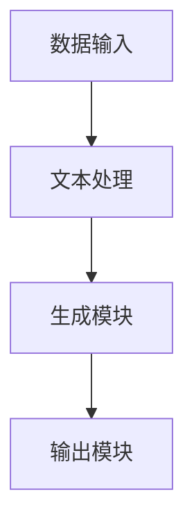
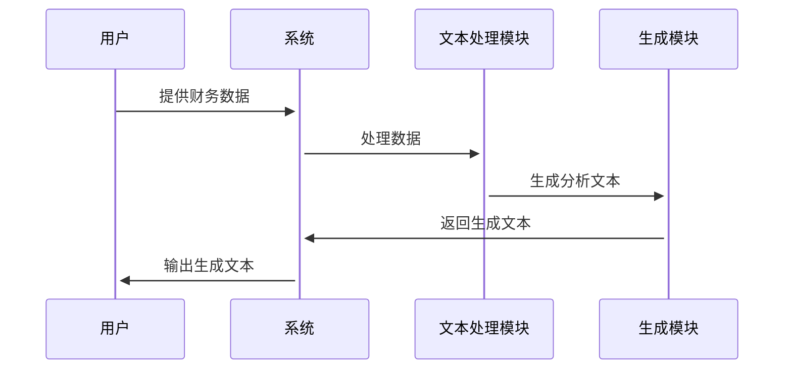

                 


# 自然语言生成在自动化财报分析中的应用

## 关键词：自然语言生成（NLP）、自动化财报分析、财务报告、文本生成、机器学习、Transformer模型

## 摘要：本文探讨了自然语言生成技术在自动化财报分析中的应用，详细介绍了NLP的核心概念、算法原理、系统架构设计，以及实际项目的实现与案例分析。文章旨在帮助读者理解如何利用NLP技术提升财务报告的分析效率与准确性。

---

# 第一部分: 自然语言生成与自动化财报分析的背景与基础

## 第1章: 自然语言生成与自动化财报分析的背景

### 1.1 自然语言生成的概述

#### 1.1.1 自然语言生成的定义
自然语言生成（Natural Language Generation, NLP）是指计算机生成人类可读文本的过程，旨在将结构化的数据或信息转化为自然语言文本。

#### 1.1.2 自然语言生成的核心技术
- **统计模型**：基于概率分布生成文本，如n-gram模型。
- **基于规则的生成**：通过预定义的语法规则生成文本。
- **深度学习模型**：如循环神经网络（RNN）和Transformer模型。

#### 1.1.3 自然语言生成的应用领域
- **文本摘要**：将长文本压缩为简洁的摘要。
- **机器翻译**：将一种语言翻译成另一种语言。
- **对话生成**：生成自然语言对话。
- **财务报告生成**：自动生成财务分析文本。

### 1.2 自动化财报分析的背景

#### 1.2.1 财务报告的基本概念
财务报告是企业在一定时期内财务状况、经营成果和现金流量的书面总结，主要包括利润表、资产负债表和现金流量表。

#### 1.2.2 自动化财报分析的必要性
- **提高效率**：减少人工分析的时间和成本。
- **提高准确性**：避免人为错误，确保分析结果的准确性。
- **实时分析**：快速响应财务数据的变化。

#### 1.2.3 自动化财报分析的现状与挑战
- **技术挑战**：如何准确理解复杂财务文本。
- **数据隐私**：处理敏感财务数据时的隐私保护问题。
- **模型可解释性**：生成结果的可解释性对财务分析至关重要。

### 1.3 自然语言生成在自动化财报分析中的作用

#### 1.3.1 自然语言生成在财报分析中的优势
- **自动化生成分析文本**：自动生成财务分析报告，节省时间。
- **提高可读性**：将复杂的数据转化为易于理解的文本。
- **实时更新**：根据最新的财务数据自动生成更新报告。

#### 1.3.2 自然语言生成如何提升财报分析效率
通过自动化生成分析文本，减少人工干预，提高分析速度和效率。

#### 1.3.3 自然语言生成在财报分析中的应用场景
- **财务摘要生成**：自动生成财务报告的摘要。
- **趋势预测**：基于历史数据生成未来财务状况的预测文本。
- **异常检测**：通过生成模型识别财务数据中的异常情况。

### 1.4 本章小结
本章介绍了自然语言生成的基本概念和其在自动化财报分析中的作用，强调了NLP在提升财务分析效率和准确性方面的重要性。

---

## 第2章: 自然语言生成的核心概念

### 2.1 自然语言生成的模型类型

#### 2.1.1 基于规则的生成模型
通过预定义的语法规则生成文本，简单但灵活性有限。

#### 2.1.2 统计模型
基于概率分布生成文本，如n-gram模型，依赖大量数据。

#### 2.1.3 基于深度学习的生成模型
如RNN和Transformer模型，能够捕捉长距离依赖关系。

### 2.2 自然语言生成的关键技术

#### 2.2.1 语言模型
语言模型通过概率分布预测下一个词，是生成模型的基础。

#### 2.2.2 解码器
解码器负责将输入序列转换为输出序列，如在Transformer模型中的解码器部分。

#### 2.2.3 注意力机制
注意力机制帮助模型关注输入中的重要部分，提升生成文本的质量。

### 2.3 自然语言生成的评估指标

#### 2.3.1 基于生成文本的评估指标
- **BLEU**：基于编辑距离的评估指标。
- **ROUGE**：基于召回率的评估指标。

#### 2.3.2 基于人类评价的评估指标
- **人类评估**：通过人工评分衡量生成文本的质量。

#### 2.3.3 综合评估方法
结合自动评估和人工评估，综合衡量生成文本的质量。

### 2.4 本章小结
本章详细介绍了自然语言生成的主要模型类型和技术，强调了注意力机制和深度学习模型在生成任务中的重要性。

---

## 第3章: 自然语言生成的算法原理与数学模型

### 3.1 基于Transformer的生成模型

#### 3.1.1 Transformer模型的基本结构
Transformer模型由编码器和解码器组成，编码器负责将输入序列编码为表示，解码器负责生成输出序列。

#### 3.1.2 自注意力机制的原理
自注意力机制允许模型在生成每个词时关注输入中的其他词，提升生成文本的连贯性。

#### 3.1.3 解码器的结构与作用
解码器通过自注意力和交叉注意力机制，逐步生成输出序列。

### 3.2 解码器的实现细节

#### 3.2.1 解码器的输入与输出
解码器以编码器输出的表示为输入，逐步生成输出词。

#### 3.2.2 解码器中的前馈网络
每个解码器层包含多头自注意力和前馈网络，提升模型的表达能力。

#### 3.2.3 解码器中的位置编码
位置编码将位置信息融入模型，帮助模型理解词的位置关系。

### 3.3 自然语言生成的数学模型

#### 3.3.1 语言模型的数学表示
语言模型的目标是最大化给定输入序列的概率，数学表示如下：
$$ P(w_1, w_2, ..., w_n) = \prod_{i=1}^{n} P(w_i | w_1, ..., w_{i-1}) $$

#### 3.3.2 Transformer模型的注意力机制
注意力机制的计算公式如下：
$$ \text{Attention}(Q, K, V) = \text{softmax}\left( \frac{QK^T}{\sqrt{d_k}} \right)V $$

#### 3.3.3 解码器的前馈网络
前馈网络由两个全连接层组成，激活函数通常使用ReLU：
$$ f(x) = \text{ReLU}(Wx + b) $$

### 3.4 本章小结
本章详细讲解了基于Transformer的生成模型的算法原理和数学模型，强调了注意力机制在提升生成质量中的作用。

---

## 第4章: 自然语言生成在自动化财报分析中的系统设计

### 4.1 系统架构设计

#### 4.1.1 模块划分
- **数据输入模块**：接收财务数据输入。
- **文本处理模块**：对财务文本进行预处理。
- **生成模块**：基于预处理的数据生成分析文本。
- **输出模块**：将生成的文本输出为报告或反馈给用户。

#### 4.1.2 模块交互流程
数据输入模块将财务数据传递给文本处理模块，处理后的数据输入生成模块，生成模块输出生成的文本，最后通过输出模块呈现给用户。

### 4.2 系统功能设计

#### 4.2.1 数据预处理
- **清洗数据**：去除无关信息，提取关键财务指标。
- **分词与标注**：对财务文本进行分词和词性标注。

#### 4.2.2 模型训练
- **数据集构建**：收集和标注训练数据。
- **模型训练**：使用训练数据训练生成模型。
- **模型调优**：通过交叉验证和网格搜索优化模型参数。

#### 4.2.3 文本生成
- **输入处理**：将预处理的财务数据输入生成模型。
- **生成过程**：模型逐步生成输出文本。
- **结果评估**：通过评估指标衡量生成文本的质量。

### 4.3 系统架构图


### 4.4 接口设计与交互流程

#### 4.4.1 接口设计
- **输入接口**：接收财务数据和生成指令。
- **输出接口**：输出生成的财务分析文本。

#### 4.4.2 交互流程


### 4.5 本章小结
本章详细设计了自然语言生成在自动化财报分析中的系统架构和功能模块，展示了系统的整体流程和模块交互。

---

## 第5章: 项目实战——自动化财报分析系统的实现

### 5.1 环境安装与配置

#### 5.1.1 安装Python环境
安装Python 3.x，推荐使用Anaconda或virtualenv管理环境。

#### 5.1.2 安装必要的库
安装TensorFlow、Keras、NLTK等自然语言处理库，以及Pandas、NumPy等数据处理库。

```bash
pip install tensorflow keras nltk pandas numpy
```

### 5.2 核心代码实现

#### 5.2.1 数据预处理代码
```python
import pandas as pd
import numpy as np
from tensorflow.keras.preprocessing.text import Tokenizer
from tensorflow.keras.preprocessing.sequence import pad_sequences

# 加载财务数据
df = pd.read_csv('financial_reports.csv')

# 分词与标注
tokenizer = Tokenizer(num_words=10000)
tokenizer.fit_on_texts(df['report_text'])
sequences = tokenizer.texts_to_sequences(df['report_text'])
padded_sequences = pad_sequences(sequences, maxlen=500)
```

#### 5.2.2 模型训练代码
```python
from tensorflow.keras.models import Model
from tensorflow.keras.layers import Input, LSTM, Dense, Dropout, Embedding

# 定义生成模型
input_layer = Input(shape=(500,))
embedding_layer = Embedding(10000, 100)(input_layer)
lstm_layer = LSTM(128, return_sequences=True)(embedding_layer)
dense_layer = Dense(64, activation='relu')(lstm_layer)
output_layer = Dense(len(tokenizer.word_index)+1, activation='softmax')(dense_layer)

model = Model(inputs=input_layer, outputs=output_layer)
model.compile(loss='sparse_categorical_crossentropy', optimizer='adam', metrics=['accuracy'])
model.summary()
```

#### 5.2.3 文本生成代码
```python
import numpy as np

# 生成随机种子
start_index = np.random.randint(0, len(padded_sequences) - 1)

# 生成文本
for _ in range(500):
    sampled_token_index = np.argmax(model.predict(np.array([padded_sequences[start_index]])), axis=2)[0][start_index]
    start_index = sampled_token_index
    print(tokenizer.index_to_word[sampled_token_index], end='')
```

### 5.3 代码解读与分析

#### 5.3.1 数据预处理
- 使用Tokenizer对财务文本进行分词和编码。
- 使用pad_sequences对分词后的文本进行填充，确保所有输入序列长度一致。

#### 5.3.2 模型训练
- 使用LSTM层捕捉文本中的时序关系。
- 通过Dense层输出每个词的概率分布，作为生成模型的输出。

#### 5.3.3 文本生成
- 从随机位置开始，逐步生成文本，利用模型的输出概率选择下一个词。

### 5.4 实际案例分析

#### 5.4.1 案例背景
假设我们有一份财务报告，需要自动生成分析摘要。

#### 5.4.2 数据处理
将财务报告文本预处理，提取关键信息。

#### 5.4.3 模型生成
使用训练好的模型生成财务分析摘要。

#### 5.4.4 结果评估
通过BLEU指标评估生成文本的质量，调整模型参数以优化生成结果。

### 5.5 本章小结
本章通过一个实际的项目案例，详细讲解了自然语言生成在自动化财报分析中的实现过程，展示了从数据预处理到模型训练再到文本生成的完整流程。

---

## 第6章: 最佳实践与小结

### 6.1 最佳实践

#### 6.1.1 模型调优技巧
- 使用交叉验证选择最优参数。
- 通过早停法防止过拟合。
- 使用更复杂的模型结构，如多层Transformer。

#### 6.1.2 数据处理注意事项
- 确保数据的多样性和代表性。
- 处理敏感数据时注意隐私保护。
- 对异常数据进行适当处理，避免影响模型性能。

#### 6.1.3 模型评估与优化
- 使用多种评估指标衡量生成质量。
- 定期更新模型，保持生成结果的准确性。
- 结合人工审核，提高生成文本的可解释性。

### 6.2 小结
自然语言生成技术为自动化财报分析提供了强大的工具，能够显著提高分析效率和准确性。通过合理设计系统架构，优化模型参数，可以充分发挥NLP技术在财务分析中的潜力。

### 6.3 未来展望
随着深度学习技术的不断进步，自然语言生成在财务分析中的应用将更加广泛。未来的研究方向包括开发更高效的生成模型，探索NLP与其他技术的结合，如大数据分析和人工智能，进一步提升财务分析的智能化水平。

---

## 第7章: 结语

### 7.1 注意事项
在实际应用中，需注意数据隐私保护，确保生成内容的合规性。同时，结合业务需求，灵活调整系统架构和模型参数。

### 7.2 拓展阅读
推荐读者进一步阅读《生成式人工智能：自然语言处理的革命》和《深度学习中的Transformer模型》等书籍，深入了解自然语言生成的前沿技术。

### 7.3 问题与思考
- 当前NLP模型在处理复杂财务文本时仍存在哪些挑战？
- 如何结合其他技术，进一步提升生成文本的准确性和可解释性？

---

通过以上章节的详细讲解，我们系统地探讨了自然语言生成在自动化财报分析中的应用，从理论基础到实际实现，全面解析了NLP技术在财务领域的潜力与挑战。希望本文能为相关领域的技术人员和研究者提供有价值的参考和启示。

