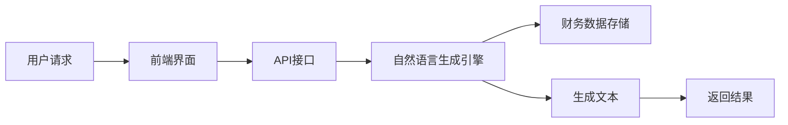
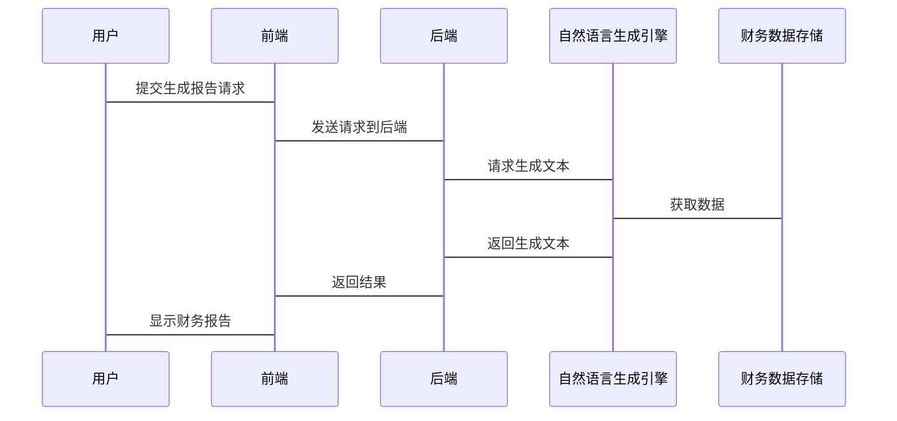

                 


```markdown
# 自然语言生成技术在财务报告中的应用

## 关键词
自然语言生成，财务报告，文本生成，NLP，深度学习，预训练模型

## 摘要
自然语言生成技术在财务报告中的应用通过自然语言处理技术，将结构化数据转化为自然流畅的文本，提高财务报告的效率和准确性。本文详细探讨了自然语言生成技术的核心原理、算法实现、系统架构设计以及在财务报告中的实际应用案例，为读者提供了从理论到实践的全面指南。

---

## 目录

# 第一部分：自然语言生成技术的背景与应用价值

## 第1章：背景与应用价值

### 1.1 自然语言生成技术的定义与核心概念
- **自然语言生成技术的定义**：自然语言生成（Natural Language Generation, NLP）是将结构化数据转化为自然语言文本的技术，涵盖文本生成、摘要生成、问答系统等多个方面。
- **核心要素**：
  - **输入数据**：结构化数据（如财务数据）和非结构化数据（如文本）。
  - **生成模型**：基于统计和深度学习的模型。
  - **输出文本**：符合语法和语义的自然语言文本。

### 1.2 财务报告的特点与生成需求
- **财务报告的特点**：包含大量结构化数据（如收入、支出、利润等）和非结构化数据（如市场分析、财务评论）。
- **生成需求**：
  - **自动化生成**：快速生成财务摘要。
  - **一致性**：保持报告格式和内容的一致性。
  - **可定制化**：根据不同需求生成不同类型的报告。

### 1.3 自然语言生成技术的发展历程
- **早期阶段**：基于规则的生成方法，生成文本缺乏自然性和准确性。
- **深度学习阶段**：引入神经网络模型（如RNN、Transformer）显著提升生成效果。
- **大模型时代**：预训练模型（如BERT、GPT）进一步推动自然语言生成技术的发展。

---

## 第二部分：自然语言生成技术的核心概念与原理

## 第2章：核心概念与联系

### 2.1 自然语言生成技术的核心原理
- **基于Seq2Seq的模型**：
  - **结构**：编码器-解码器结构，将输入数据转化为目标输出。
  - **注意力机制**：通过注意力机制提升生成文本的相关性。
- **基于Transformer的模型**：
  - **自注意力机制**：捕捉文本中长距离依赖关系。
  - **解码器结构**：生成自然语言文本。

### 2.2 实体关系图


### 2.3 领域模型


---

## 第三部分：自然语言生成技术的算法原理与数学模型

## 第3章：算法原理

### 3.1 Seq2Seq模型
- **基本结构**：
  - **编码器**：将输入数据转换为上下文向量。
  - **解码器**：根据上下文向量生成目标文本。
- **注意力机制**：
  - 引入注意力机制，提升生成文本的相关性。
  - 注意力权重计算公式：
    $$\text{attention}(i, j) = \frac{\exp(\text{score}(i, j))}{\sum_{k} \exp(\text{score}(i, k))}$$

### 3.2 Transformer模型
- **自注意力机制**：
  - 查询（Q）、键（K）、值（V）的计算：
    $$Q = W_q X, \quad K = W_k X, \quad V = W_v X$$
  - 注意力计算：
    $$\text{softmax}\left(\frac{QK^T}{\sqrt{d_k}}\right)$$

### 3.3 预训练模型
- **BERT模型**：
  - 基于Transformer的预训练语言模型。
  - 任务特定的微调（Fine-tuning）：
    $$\text{Loss} = -\sum_{i=1}^{n} \text{log}(\text{P}(y_i|x_i))$$

---

## 第四部分：系统分析与架构设计

## 第4章：系统分析与架构设计

### 4.1 需求分析
- **用户需求**：
  - 快速生成财务报告。
  - 高度可定制化的报告内容。
- **系统需求**：
  - 高效的数据处理能力。
  - 精准的文本生成能力。

### 4.2 系统架构设计


### 4.3 接口设计
- **输入接口**：接收财务数据和生成需求。
- **输出接口**：返回生成的财务报告文本。

### 4.4 交互流程


---

## 第五部分：项目实战

## 第5章：项目实战

### 5.1 环境配置
- **Python版本**：Python 3.8以上。
- **依赖库**：
  - `transformers`：用于加载预训练模型。
  - `torch`：用于模型训练和推理。

### 5.2 核心实现
```python
from transformers import BartForConditionalGeneration, BartTokenizer

model = BartForConditionalGeneration.from_pretrained('facebook/bart-large')
tokenizer = BartTokenizer.from_pretrained('facebook/bart-large')

def generate_report(financial_data):
    input_text = f"Generate a financial report based on {financial_data}."
    inputs = tokenizer(input_text, return_tensors='pt')
    outputs = model.generate(inputs.input_ids, max_length=500)
    report = tokenizer.decode(outputs[0], skip_special_tokens=True)
    return report
```

### 5.3 实际案例分析
- **输入数据**：公司财务数据（如收入、支出、利润等）。
- **生成文本**：
  - 自动生成财务摘要。
  - 自动生成财务评论。

### 5.4 代码解读
- **环境配置**：安装必要的Python库。
- **模型加载**：使用预训练的Bart模型进行文本生成。
- **生成函数**：定义生成财务报告的函数。

### 5.5 结果分析
- **生成文本的质量**：评估生成文本的流畅性和准确性。
- **生成时间**：分析模型的生成效率。

---

## 第六部分：最佳实践与未来展望

## 第6章：最佳实践与未来展望

### 6.1 项目小结
- **核心成果**：成功实现自然语言生成技术在财务报告中的应用。
- **经验总结**：
  - 数据质量对生成效果的影响。
  - 模型选择对生成效率的影响。

### 6.2 注意事项
- **数据隐私**：确保财务数据的安全性和隐私性。
- **模型优化**：持续优化模型以提高生成效果。

### 6.3 未来展望
- **技术进步**：探索更先进的生成模型（如GPT-3、GPT-4）。
- **应用场景扩展**：将自然语言生成技术应用于更多财务领域（如财务分析、预测报告）。

---

## 附录

### 附录A：参考文献
1. Vaswani, A., et al. "Attention Is All You Need." Advances in Neural Information Processing Systems, 2017.
2. Devlin, J., et al. "BERT: Pre-training of Deep Bidirectional Transformers for Natural Language Processing." arXiv preprint arXiv:1810.0469, 2018.

### 附录B：工具与资源
- **Python库**：
  - `transformers`: https://github.com/huggingface/transformers
  - `torch`: https://pytorch.org/

---

通过以上内容，读者可以系统地了解自然语言生成技术在财务报告中的应用，从理论到实践，全面掌握相关知识和技术实现。
```

