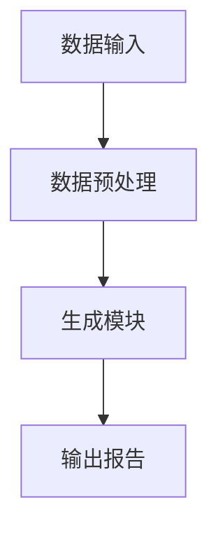
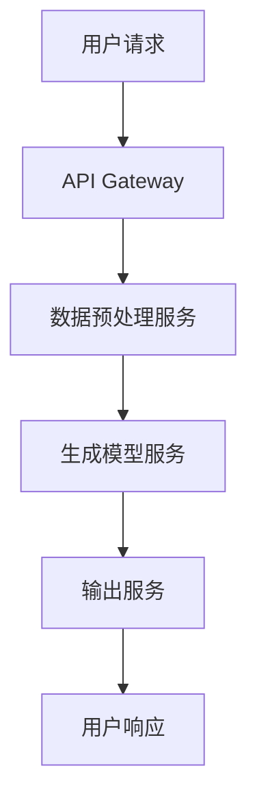
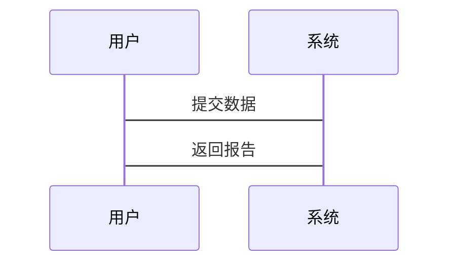

                 


# 自然语言生成技术在金融报告写作中的应用

## 关键词
自然语言生成，金融报告，文本生成模型，深度学习，金融数据分析，NLP技术应用

## 摘要
自然语言生成（NLP）技术在金融报告写作中的应用正变得越来越重要。随着金融市场的复杂化和数据量的爆炸式增长，金融机构对高效、准确的报告生成需求日益迫切。本文将深入探讨自然语言生成技术在金融报告写作中的应用，从技术原理到系统架构设计，再到实际案例分析，全面解析如何利用NLP技术提升金融报告的效率和质量。本文将详细分析自然语言生成技术的核心算法、金融报告的特点、生成模型在金融领域的应用，以及如何构建一个高效、可靠的金融报告生成系统。通过本文的分析，读者将能够全面理解自然语言生成技术在金融报告写作中的潜力和实际应用价值。

---

# 第1章: 自然语言生成技术概述

## 1.1 自然语言生成的基本概念

### 1.1.1 自然语言生成的定义
自然语言生成（Natural Language Generation, NLP）是指将结构化数据或信息转换为自然语言文本的过程。它利用计算机技术模拟人类语言生成能力，通过算法和模型生成符合语法规则、语义清晰的自然语言文本。

### 1.1.2 自然语言生成的核心要素
自然语言生成的核心要素包括：
- **输入数据**：通常为结构化数据（如表格、JSON）或半结构化数据（如文本、标记数据）。
- **生成模型**：包括基于规则的生成模型和基于深度学习的生成模型。
- **语言规则**：包括语法、语义和上下文规则。
- **输出文本**：生成的自然语言文本，需满足可读性和准确性要求。

### 1.1.3 自然语言生成的应用领域
自然语言生成技术广泛应用于多个领域，包括：
- **新闻报道**：自动生成新闻稿。
- **客服系统**：自动生成回复文本。
- **金融报告**：自动生成财务分析报告。
- **医疗领域**：生成病历报告和诊断建议。
- **教育领域**：自动生成学习总结和反馈。

---

## 1.2 自然语言生成的关键技术

### 1.2.1 生成模型的分类
自然语言生成模型可以分为以下几类：
- **基于规则的生成模型**：通过预定义的语法规则生成文本，适用于简单场景。
- **统计模型**：基于概率统计方法生成文本，如n-gram模型。
- **基于深度学习的生成模型**：如循环神经网络（RNN）、长短期记忆网络（LSTM）和变换器（Transformer）模型。

### 1.2.2 基于规则的生成方法
基于规则的生成方法通过预定义的语法规则生成文本，优点是简单易懂，但灵活性和创造性有限。

### 1.2.3 统计模型与深度学习模型的对比
- **统计模型**：优点是计算效率高，缺点是生成文本的质量受限。
- **深度学习模型**：优点是生成文本质量高，缺点是计算资源需求大。

---

## 1.3 自然语言生成的挑战与解决方案

### 1.3.1 生成结果的准确性和可解释性
- **挑战**：生成文本的准确性受数据质量和模型训练的影响。
- **解决方案**：通过引入领域知识和可解释性模型提高生成结果的准确性。

### 1.3.2 多语言与跨文化适应性
- **挑战**：不同语言和文化背景下的生成需求差异大。
- **解决方案**：引入多语言模型和文化适应性训练数据。

### 1.3.3 性能优化与计算资源分配
- **挑战**：大规模数据和复杂模型对计算资源的需求高。
- **解决方案**：通过分布式计算和模型优化技术降低计算成本。

---

# 第2章: 金融报告写作的特殊性与需求

## 2.1 金融报告的基本特点

### 2.1.1 金融报告的结构与内容
金融报告通常包括以下内容：
- **标题**：简明扼要地概括报告主题。
- **引言**：介绍报告背景和目的。
- **正文**：详细分析数据和结论。
- **结论**：总结主要发现和建议。

### 2.1.2 金融报告的语言风格
- **正式性**：语言需正式、专业。
- **准确性**：数据和结论需准确无误。
- **逻辑性**：内容需逻辑清晰、条理分明。

### 2.1.3 金融报告的读者需求
- **投资者**：关注市场趋势和投资建议。
- **分析师**：关注数据深度分析和预测模型。
- **管理层**：关注战略规划和决策支持。

---

## 2.2 金融领域的专业术语与数据特点

### 2.2.1 金融术语的复杂性
金融领域涉及大量专业术语，如“市盈率”、“ROE”、“波动率”等，生成模型需准确理解和使用这些术语。

### 2.2.2 金融数据的结构化与非结构化
金融数据包括结构化数据（如表格、数值）和非结构化数据（如新闻、评论），生成模型需同时处理两类数据。

### 2.2.3 金融报告的合规性要求
金融报告需符合相关法律法规和行业标准，生成模型需确保生成内容的合规性。

---

## 2.3 金融报告写作中的常见问题

### 2.3.1 数据准确性问题
- **问题**：生成报告时，数据来源和准确性需严格把控。
- **解决方案**：引入数据验证机制和多源数据交叉验证。

### 2.3.2 内容的逻辑性与连贯性
- **问题**：生成内容可能缺乏逻辑性和连贯性。
- **解决方案**：引入领域知识库和生成模型的后处理机制。

### 2.3.3 报告的可读性与可操作性
- **问题**：生成报告的可读性和可操作性需进一步提升。
- **解决方案**：优化生成模型的输出格式和语言表达。

---

# 第3章: 自然语言生成技术在金融报告中的核心应用

## 3.1 金融数据分析与生成

### 3.1.1 数据清洗与预处理
- **数据清洗**：去除无效数据、填补缺失值。
- **数据预处理**：对数据进行标准化和格式化处理。

### 3.1.2 数据驱动的报告生成
- **生成方法**：基于结构化数据生成报告。
- **案例分析**：生成公司财务报告。

### 3.1.3 数据可视化与语言生成的结合
- **数据可视化**：生成图表和图形。
- **语言生成**：在图表下方生成说明性文字。

---

## 3.2 金融事件自动摘要

### 3.2.1 事件抽取与摘要生成
- **事件抽取**：从新闻文本中抽取关键事件。
- **摘要生成**：自动生成事件摘要。

### 3.2.2 摘要的可读性优化
- **优化方法**：调整摘要语言风格和结构。

### 3.2.3 摘要的个性化定制
- **个性化需求**：根据读者需求生成不同版本的摘要。

---

## 3.3 金融报告的自动生成与优化

### 3.3.1 基于模板的生成方法
- **模板设计**：设计金融报告的标准模板。
- **生成过程**：将数据填充到模板中生成报告。

### 3.3.2 无模板的自由生成方法
- **生成方法**：直接生成报告内容，无需依赖模板。

### 3.3.3 报告生成的多轮优化
- **优化过程**：通过多次迭代优化生成内容。

---

# 第4章: 基于深度学习的自然语言生成模型

## 4.1 常见的自然语言生成模型

### 4.1.1 RNN与LSTM模型
- **RNN模型**：循环神经网络，适用于序列数据生成。
- **LSTM模型**：长短期记忆网络，适合处理长序列数据。

### 4.1.2 Transformer模型
- **模型结构**：基于自注意力机制，生成高质量文本。

### 4.1.3 GPT系列模型
- **GPT模型**：基于Transformer架构，生成自然语言文本。

---

## 4.2 模型在金融报告生成中的应用

### 4.2.1 模型的训练与调优
- **训练数据**：使用金融领域的文本数据进行训练。
- **模型调优**：通过微调（Fine-tuning）提高模型在金融领域的表现。

### 4.2.2 模型的领域适应性
- **领域适应**：通过引入领域数据和任务特定的训练策略，提升模型在金融领域的适应性。

### 4.2.3 模型的可解释性增强
- **可解释性方法**：通过可视化和解释模型决策过程，提升生成结果的可解释性。

---

## 4.3 深度学习模型的优缺点

### 4.3.1 深度学习模型的优势
- **生成质量高**：生成文本质量远高于传统方法。
- **适应性强**：可以处理复杂数据和任务。

### 4.3.2 深度学习模型的局限性
- **计算资源需求大**：训练和推理需要大量计算资源。
- **数据依赖性高**：生成结果严重依赖训练数据的质量和多样性。

### 4.3.3 深度学习模型的未来改进方向
- **优化模型结构**：改进模型结构，降低计算成本。
- **增强可解释性**：提高生成结果的可解释性和透明性。

---

# 第5章: 金融报告生成系统的整体架构

## 5.1 系统整体架构设计

### 5.1.1 系统功能模块
- **数据输入模块**：接收结构化和非结构化数据。
- **生成模块**：基于输入数据生成自然语言文本。
- **输出模块**：输出生成的金融报告。

### 5.1.2 系统交互流程
- **数据预处理**：清洗和格式化输入数据。
- **模型调用**：调用生成模型生成文本。
- **结果输出**：输出生成的报告并进行后处理。

---

## 5.2 系统功能设计

### 5.2.1 系统功能模块设计
- **数据预处理模块**：对输入数据进行清洗和格式化处理。
- **生成模块**：基于预处理后的数据生成自然语言文本。
- **输出模块**：将生成的文本输出为报告。

### 5.2.2 系统功能流程图


---

## 5.3 系统架构设计

### 5.3.1 系统架构设计图


---

## 5.4 系统接口设计

### 5.4.1 输入接口
- **输入格式**：支持JSON、CSV等多种格式。
- **输入数据**：结构化和非结构化数据混合。

### 5.4.2 输出接口
- **输出格式**：支持PDF、Word、文本等多种格式。
- **输出内容**：生成的金融报告。

---

## 5.5 系统交互设计

### 5.5.1 交互流程图


---

# 第6章: 金融报告生成系统的实现

## 6.1 系统实现的核心代码

### 6.1.1 数据预处理代码
```python
def preprocess_data(data):
    # 数据清洗
    cleaned_data = data.dropna()
    # 数据标准化
    normalized_data = (cleaned_data - cleaned_data.mean()) / cleaned_data.std()
    return normalized_data
```

### 6.1.2 生成模型代码
```python
def generate_report(model, data):
    # 生成文本
    generated_text = model.generate(data)
    return generated_text
```

---

## 6.2 系统实现的详细步骤

### 6.2.1 环境安装
- **安装Python**：Python 3.8+
- **安装深度学习框架**：TensorFlow/PyTorch
- **安装NLP库**：Transformers

### 6.2.2 数据准备
- **数据收集**：收集金融领域的结构化和非结构化数据。
- **数据预处理**：清洗和格式化数据。

### 6.2.3 模型训练
- **选择模型**：选择合适的生成模型（如GPT）。
- **训练模型**：使用金融数据对模型进行微调。

### 6.2.4 模型部署
- **部署模型**：将训练好的模型部署到服务器。
- **开发API**：开发API接口供其他系统调用。

---

## 6.3 项目实战

### 6.3.1 案例分析
- **案例背景**：某公司财务数据分析报告生成。
- **生成结果**：自动生成财务分析报告。

### 6.3.2 实际应用分析
- **应用效果**：生成报告的准确性和效率显著提高。
- **优缺点分析**：生成报告的质量依赖于模型和数据的质量。

---

# 第7章: 总结与未来展望

## 7.1 总结
自然语言生成技术在金融报告写作中的应用具有重要意义。通过深度学习模型和系统架构设计，可以显著提高金融报告的生成效率和质量。

## 7.2 未来展望
- **多模态生成**：结合图像、语音等多种模态信息生成报告。
- **实时数据整合**：实时处理和生成金融报告。
- **可解释性增强**：提高生成结果的可解释性和透明性。

---

# 参考文献
（此处列出相关的参考文献和进一步阅读的资料）

---

# 致谢
感谢读者的耐心阅读和对本文的支持。

---

# 附录
（此处可放置代码、数据或其他补充材料）

---

以上是《自然语言生成技术在金融报告写作中的应用》的技术博客文章的详细目录和内容。希望这篇文章能够为读者提供清晰、有深度的技术见解，并帮助他们理解自然语言生成技术在金融领域的实际应用价值。

