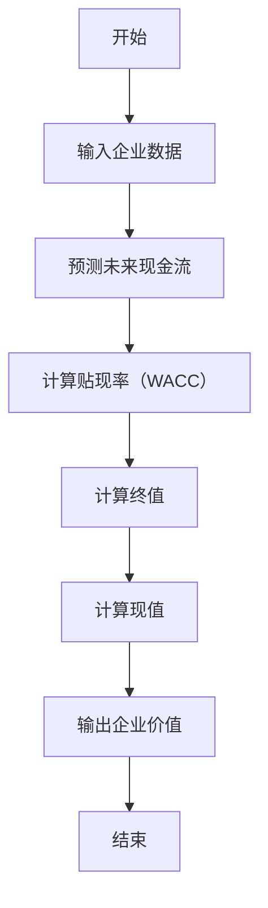
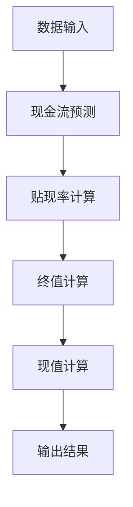
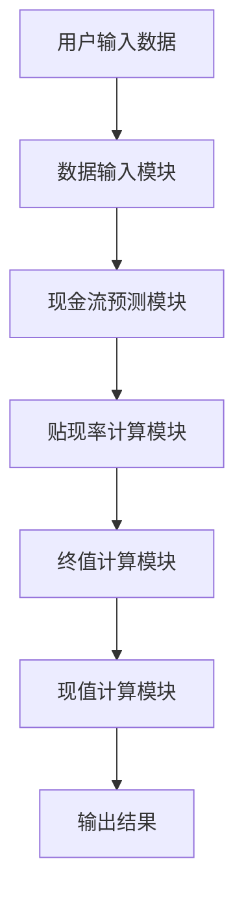

                 


# 自由现金流贴现：考虑资本支出的估值模型

## 关键词：自由现金流、贴现模型、资本支出、企业估值、WACC、DCF模型

## 摘要：  
自由现金流贴现（DCF）模型是一种广泛应用的企业估值方法，尤其在考虑资本支出时显得尤为重要。本文将详细介绍自由现金流贴现模型的原理、应用、计算方法及其实务中的注意事项。通过分析资本支出对现金流的影响，本文将引导读者如何正确应用DCF模型进行企业估值。

---

# 第1章: 自由现金流贴现模型的背景与基础

## 1.1 自由现金流贴现模型的定义与核心概念

### 1.1.1 自由现金流的定义  
自由现金流（Free Cash Flow，FCF）是指企业在扣除所有支出和债务偿还后，可用于股东分红或再投资的现金流量。它是企业财务健康状况的重要指标，也是DCF模型的核心输入。

### 1.1.2 自由现金流贴现模型的核心要素  
- **现金流预测**：未来几年内企业的自由现金流预测。  
- **贴现率（WACC）**：加权平均资本成本，用于将未来现金流折现为现值。  
- **终值（TV）**：企业在永续增长阶段的未来现金流的现值。  

### 1.1.3 资本支出在模型中的作用  
资本支出（Capex）是企业在生产活动中用于购买或维护固定资产的资金支出。在DCF模型中，资本支出直接影响自由现金流的计算，因为它从企业的收入中扣除。

---

## 1.2 自由现金流贴现模型的应用背景

### 1.2.1 企业价值评估的基本问题  
企业价值评估的核心问题是确定企业未来现金流的现值。DCF模型通过预测未来现金流并贴现，提供了一种系统化的方法。

### 1.2.2 股权自由现金流与整体企业价值的关系  
股权自由现金流是归属于股东的现金流，而整体企业价值包括债权的价值。DCF模型通常使用股权自由现金流来评估企业的整体价值。

### 1.2.3 资本市场中的估值需求  
在资本市场中，投资者需要准确评估企业的内在价值，以确定其股票的合理价格。DCF模型因其科学性和准确性，成为首选的估值工具之一。

---

# 第2章: 自由现金流贴现模型的核心概念与联系

## 2.1 自由现金流贴现模型的原理

### 2.1.1 现金流的现值计算  
通过将未来现金流贴现为现值，DCF模型能够评估企业的内在价值。公式如下：  
$$ \text{企业价值} = \sum_{t=1}^{n} \frac{\text{FCF}_t}{(1 + r)^t} + \frac{\text{TV}}{(1 + r)^n} $$  
其中，\( r \) 是贴现率，\( \text{FCF}_t \) 是第 \( t \) 年的自由现金流，\( \text{TV} \) 是终值。

### 2.1.2 加权平均资本成本（WACC）的计算  
WACC 是DCF模型中常用的贴现率，计算公式为：  
$$ \text{WACC} = w_d \cdot k_d + w_l \cdot k_l (1 - t) $$  
其中，\( w_d \) 和 \( w_l \) 是债务和股权的权重，\( k_d \) 和 \( k_l \) 是债务和股权的资本成本，\( t \) 是税率。

### 2.1.3 终值的计算与假设  
终值假设企业在永续增长阶段，通常使用永续增长率 \( g \) 进行计算。公式为：  
$$ \text{TV} = \frac{\text{FCF}_{n+1}}{g} $$  

---

## 2.2 自由现金流与资本支出的关系

### 2.2.1 资本支出的定义与分类  
资本支出分为两类：维护性资本支出和扩张性资本支出。前者用于维护现有生产能力，后者用于扩大生产能力。

### 2.2.2 资本支出对现金流的影响  
资本支出会减少企业的自由现金流，因为它属于经营活动中的一项支出。公式为：  
$$ \text{FCF} = \text{EBIT} - \text{利息} - \text{税} + \text{折旧} - \text{资本支出} $$  

### 2.2.3 资本支出在模型中的调整  
在DCF模型中，资本支出需要在现金流预测阶段进行调整，以准确反映企业的实际现金流情况。

---

# 第3章: 自由现金流贴现模型的算法原理讲解

## 3.1 算法流程图



---

## 3.2 Python代码实现

```python
def discounted_cash_flow_analysis(fcf, wacc, horizon, terminal_value):
    """
    计算企业价值的DCF模型。
    参数：
    fcf: 列表，各年份的自由现金流
    wacc: 贴现率
    horizon: 评估的年份范围
    terminal_value: 终值
    返回：
    企业价值现值
    """
    present_value = 0
    for t in range(len(fcf)):
        if t < horizon:
            present_value += fcf[t] / (1 + wacc) ** t
    present_value += terminal_value / (1 + wacc) ** horizon
    return present_value

# 示例
fcf = [100, 150, 200]  # 前三年现金流
wacc = 0.10  # 贴现率10%
horizon = 3  # 评估到第三年
terminal_value = 1000  # 第三年终值

enterprise_value = discounted_cash_flow_analysis(fcf, wacc, horizon, terminal_value)
print(f"企业价值现值为：{enterprise_value}")
```

---

## 3.3 数学模型和公式

### 3.3.1 自由现金流的计算公式  
$$ \text{FCF}_t = \text{EBIT}_t - \text{利息}_t - \text{税}_t + \text{折旧}_t - \text{资本支出}_t $$  

### 3.3.2 终值的计算公式  
$$ \text{TV} = \frac{\text{FCF}_{n+1}}{g} $$  
其中，\( g \) 是永续增长率。  

---

# 第4章: 自由现金流贴现模型的数学模型和公式

## 4.1 自由现金流的计算

### 4.1.1 自由现金流的计算步骤  
1. 计算企业的息税前利润（EBIT）。  
2. 扣除利息支出，得到税前利润。  
3. 扣除税款，得到净利润。  
4. 加回折旧和摊销。  
5. 扣除资本支出，得到自由现金流。

### 4.1.2 自由现金流的公式  
$$ \text{FCF} = \text{EBIT} - \text{利息} - \text{税} + \text{折旧} - \text{资本支出} $$  

---

## 4.2 贴现率的计算

### 4.2.1 加权平均资本成本（WACC）的计算  
$$ \text{WACC} = w_d \cdot k_d + w_l \cdot k_l (1 - t) $$  
其中，\( w_d \) 和 \( w_l \) 是债务和股权的权重，\( k_d \) 和 \( k_l \) 是债务和股权的资本成本，\( t \) 是税率。

### 4.2.2 贴现率的确定  
贴现率通常基于市场利率和企业的风险水平确定。  

---

## 4.3 终值的计算

### 4.3.1 永续增长率的假设  
通常假设永续增长率为零或一个较小的固定值，例如3%或5%。  

### 4.3.2 终值的计算公式  
$$ \text{TV} = \frac{\text{FCF}_{n+1}}{g} $$  
其中，\( g \) 是永续增长率。  

---

## 4.4 现金流的现值计算

### 4.4.1 现值公式  
$$ \text{现值} = \sum_{t=1}^{n} \frac{\text{FCF}_t}{(1 + r)^t} + \frac{\text{TV}}{(1 + r)^n} $$  
其中，\( r \) 是贴现率。  

---

## 4.5 案例分析

### 4.5.1 案例背景  
假设某企业未来三年的自由现金流分别为100、150、200万元，贴现率为10%，永续增长率为5%，终值计算为200 / (0.10 - 0.05) = 4000万元。  

### 4.5.2 计算过程  
现值计算如下：  
$$ \text{现值} = \frac{100}{1.10} + \frac{150}{1.10^2} + \frac{200}{1.10^3} + \frac{4000}{1.10^3} $$  

---

## 4.6 总结

通过以上分析，我们可以看到自由现金流贴现模型在考虑资本支出的情况下，能够准确地评估企业的内在价值。在实际应用中，需要准确预测现金流和合理确定贴现率，以确保模型的准确性。

---

# 第5章: 自由现金流贴现模型的系统分析与架构设计方案

## 5.1 系统分析

### 5.1.1 问题场景介绍  
企业需要进行估值，使用DCF模型考虑资本支出的影响。  

### 5.1.2 系统功能设计  
1. 数据输入模块：输入企业的财务数据和假设参数。  
2. 现金流预测模块：基于历史数据预测未来现金流。  
3. 贴现率计算模块：计算WACC。  
4. 终值计算模块：计算永续增长阶段的终值。  
5. 现值计算模块：将未来现金流贴现为现值。  

### 5.1.3 系统架构设计  



---

## 5.2 接口设计

### 5.2.1 数据输入接口  
- 输入参数：收入、成本、折旧、税率、资本支出等。  

### 5.2.2 现金流预测接口  
- 输入：财务数据和假设参数。  
- 输出：未来现金流预测值。  

### 5.2.3 贴现率计算接口  
- 输入：资本结构、债务成本、股权成本、税率。  
- 输出：WACC。  

---

## 5.3 交互流程图



---

# 第6章: 自由现金流贴现模型的项目实战

## 6.1 环境配置

### 6.1.1 Python环境安装  
安装Python和相关库（如Pandas、NumPy）。  

### 6.1.2 数据来源  
使用企业公开的财务报表数据。  

---

## 6.2 核心实现源代码

### 6.2.1 现金流预测代码  

```python
import pandas as pd

# 示例数据
data = {'年份': [2021, 2022, 2023],
        '收入': [1000, 1200, 1400],
        '成本': [600, 700, 800],
        '折旧': [100, 100, 100],
        '税率': [0.25, 0.25, 0.25],
        '资本支出': [200, 200, 200]}
df = pd.DataFrame(data)

# 计算自由现金流
df['EBIT'] = df['收入'] - df['成本']
df['税'] = df['EBIT'] * df['税率']
df['净利润'] = df['EBIT'] - df['税']
df['自由现金流'] = df['净利润'] + df['折旧'] - df['资本支出']

print(df)
```

---

## 6.3 应用解读与分析

### 6.3.1 数据处理  
使用Pandas库对财务数据进行清洗和整理。  

### 6.3.2 模型实现  
根据现金流预测和贴现率计算，得出企业的现值。  

### 6.3.3 结果分析  
比较企业的实际价值和内在价值，判断其是否被低估或高估。  

---

## 6.4 案例分析

### 6.4.1 案例背景  
某制造企业未来三年的自由现金流分别为100、150、200万元，贴现率为10%，终值为4000万元。  

### 6.4.2 计算过程  
现值计算如下：  
$$ \text{现值} = \frac{100}{1.10} + \frac{150}{1.10^2} + \frac{200}{1.10^3} + \frac{4000}{1.10^3} $$  

---

## 6.5 项目小结

通过本项目，读者可以掌握如何使用Python代码实现DCF模型，并能够将模型应用于实际的企业估值中。

---

# 第7章: 自由现金流贴现模型的总结与展望

## 7.1 最佳实践

### 7.1.1 数据质量的重要性  
确保财务数据的准确性和完整性。  

### 7.1.2 假设的合理性  
合理假设永续增长率和其他关键参数。  

### 7.1.3 模型的局限性  
DCF模型依赖于假设和预测，实际结果可能与模型预测值存在偏差。  

---

## 7.2 小结

自由现金流贴现模型是一种科学的企业估值方法，尤其在考虑资本支出时显得尤为重要。通过本文的详细讲解，读者可以掌握其核心原理和实际应用。

---

## 7.3 注意事项

1. 在使用DCF模型时，需结合企业的实际情况进行调整。  
2. 数据质量和假设的合理性直接影响模型的准确性。  
3. DCF模型适用于长期稳定的现金流预测，短期波动较大的企业可能不适合使用。  

---

## 7.4 拓展阅读

1. Fama, F. S. & French, K. R. (1993). A Multifactor Asset Pricing Model withobservable factors.  
2. 股权溢价和风险溢价的实证研究。  
3. 其他企业估值方法的比较与分析。  

---

通过以上分析，我们全面探讨了自由现金流贴现模型的背景、核心概念、算法原理、数学公式、系统架构设计、项目实战以及总结与展望。希望本文能够为读者在实际的企业估值中提供有价值的参考。

