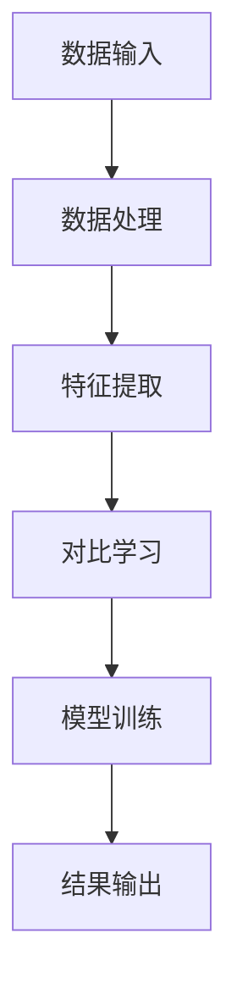

                 


# 自监督学习在AI Agent预训练中的应用

## 关键词
自监督学习, AI Agent, 预训练, 无监督学习, 对比学习, 表示学习

## 摘要
自监督学习是一种无需外部标注数据的机器学习方法，通过利用数据本身的结构来学习有意义的表示。在AI Agent的预训练中，自监督学习能够有效提升模型的泛化能力和智能性，使其在复杂环境中完成各种任务。本文将详细探讨自监督学习的核心原理、算法实现、系统架构设计及其在AI Agent预训练中的具体应用，旨在为读者提供全面的理解和实践指导。

---

# 第一部分: 自监督学习与AI Agent概述

## 第1章: 自监督学习的核心概念

### 1.1 自监督学习的背景与问题背景

#### 1.1.1 传统监督学习的局限性
在传统的监督学习中，模型需要大量标注数据来训练，而标注数据的获取成本较高。此外，监督学习模型通常难以适应未见数据，泛化能力有限。

#### 1.1.2 自监督学习的提出与目标
自监督学习通过利用数据本身的结构信息，无需外部标注，即可学习数据的特征表示。其目标是通过对比同一数据的不同表示形式，提升模型的泛化能力。

#### 1.1.3 自监督学习的核心问题描述
自监督学习的核心问题是如何利用无标签数据，通过设计合理的损失函数，使得模型能够学习到数据的有用特征。

#### 1.1.4 自监督学习的边界与外延
自监督学习的边界在于其依赖数据本身的结构信息，而外延则包括对比学习、生成对抗网络等无监督学习方法。

#### 1.1.5 自监督学习的概念结构与核心要素
自监督学习的核心要素包括数据生成机制、损失函数设计、表示学习方法等。

### 1.2 AI Agent的基本概念与特点

#### 1.2.1 AI Agent的定义
AI Agent是一种能够感知环境、自主决策并执行任务的智能体。

#### 1.2.2 AI Agent的核心特点
AI Agent具有智能性、自主性、反应性和社会性等特点。

#### 1.2.3 AI Agent与传统AI的区别
AI Agent强调自主性和适应性，能够与环境交互，而传统AI更多依赖于固定的规则和数据。

#### 1.2.4 AI Agent的分类与应用场景
AI Agent可以分为简单反射型、基于模型的反应型、目标驱动型和实用驱动型等，应用场景包括自动驾驶、智能客服、游戏AI等。

## 第2章: 自监督学习与AI Agent的联系

### 2.1 自监督学习的核心原理

#### 2.1.1 数据生成机制
自监督学习通过生成不同的数据视图，如旋转、裁剪、加噪声等，来学习数据的特征表示。

#### 2.1.2 损失函数设计
常用的损失函数包括NT-Xent损失和SimCLR损失，用于衡量不同数据视图之间的相似性。

#### 2.1.3 表示学习方法
通过对比学习，模型能够学习到数据的低维表示，这些表示能够保留数据的语义信息。

#### 2.1.4 自监督学习的数学模型
自监督学习的数学模型通常包括编码器和损失函数两部分，编码器用于提取数据特征，损失函数用于衡量特征的相似性。

### 2.2 自监督学习与AI Agent的关系

#### 2.2.1 自监督学习在AI Agent预训练中的作用
自监督学习能够提升AI Agent的表示能力，使其能够在无监督环境下学习到有用的特征。

#### 2.2.2 AI Agent的自监督学习框架
AI Agent的自监督学习框架通常包括数据生成、特征提取、对比学习等模块。

#### 2.2.3 自监督学习对AI Agent性能的提升
自监督学习能够提升AI Agent的泛化能力和智能性，使其能够更好地适应复杂环境。

## 第3章: 自监督学习的核心概念对比

### 3.1 自监督学习与其他监督学习方法的对比

#### 3.1.1 监督学习
监督学习依赖于标注数据，而自监督学习无需标注数据。

#### 3.1.2 无监督学习
无监督学习通常用于聚类任务，而自监督学习用于特征学习。

#### 3.1.3 半监督学习
半监督学习结合了标注和无标注数据，而自监督学习主要依赖无标注数据。

#### 3.1.4 对比学习
对比学习是一种自监督学习方法，通过对比不同数据视图的特征相似性来学习表示。

#### 3.1.5 自监督学习的特征对比表
| 方法 | 数据需求 | 核心目标 | 代表算法 |
|------|----------|----------|----------|
| 监督学习 | 标注数据 | 分类/回归 | SVM, RF |
| 无监督学习 | 无标注数据 | 聚类 | K-means |
| 半监督学习 | 少量标注 + 无标注数据 | 分类/回归 | SSL算法 |
| 对比学习 | 无标注数据 | 表示学习 | SimCLR, NT-Xent |

### 3.2 AI Agent与传统模型的对比

#### 3.2.1 AI Agent的智能性
AI Agent具有智能性和自主性，能够与环境交互。

#### 3.2.2 传统模型的局限性
传统模型依赖于大量标注数据，且难以适应动态环境。

#### 3.2.3 自监督学习在AI Agent中的优势
自监督学习能够减少对标注数据的依赖，提升模型的泛化能力和智能性。

---

# 第二部分: 自监督学习的算法原理

## 第4章: 自监督学习的数学模型与公式

### 4.1 对比学习的损失函数

#### 4.1.1 NT-Xent损失函数
NT-Xent损失函数是一种常用的对比学习损失函数，其公式为：
$$ L = -\frac{1}{N}\sum_{i=1}^N \sum_{j=1}^N \frac{y_{ij}}{\sum_{k=1}^N y_{ik}}} $$
其中，$y_{ij}$表示样本i和样本j的相似性。

#### 4.1.2 SimCLR损失函数
SimCLR损失函数的公式为：
$$ L = \frac{1}{N}\sum_{i=1}^N \sum_{j=1}^N \frac{y_{ij}}{\sum_{k=1}^N y_{ik}}} $$
其中，$y_{ij}$表示样本i和样本j的相似性。

#### 4.1.3 其他对比学习损失函数
除了NT-Xent和SimCLR，还有其他对比学习损失函数，如InfoNCE损失函数。

### 4.2 自监督学习的数学推导

#### 4.2.1 对比学习的数学推导
对比学习的目标是通过对比同一数据的不同表示形式，学习到数据的有用特征。其数学推导通常包括编码器的优化和损失函数的优化。

#### 4.2.2 生成对抗网络的数学推导
生成对抗网络通过生成器和判别器的对抗训练，学习到数据的特征表示。其数学推导包括生成器和判别器的损失函数优化。

## 第5章: 自监督学习的算法实现

### 5.1 对比学习的算法流程

#### 5.1.1 数据生成
通过数据增强生成不同的数据视图，如旋转、裁剪等。

#### 5.1.2 特征提取
使用编码器提取数据的特征表示。

#### 5.1.3 对比学习
通过对比不同数据视图的特征相似性，优化编码器的参数。

### 5.2 自监督学习的Python代码实现

```python
import tensorflow as tf
from tensorflow.keras.layers import Dense, Input
from tensorflow.keras.models import Model

def build_model(input_shape):
    inputs = Input(shape=input_shape)
    x = Dense(128, activation='relu')(inputs)
    x = Dense(128, activation='relu')(x)
    x = Dense(128, activation='relu')(x)
    outputs = Dense(128, activation='relu')(x)
    return Model(inputs=inputs, outputs=outputs)

def nt_xent_loss(y_true, y_pred):
    y_true = tf.cast(y_true, tf.float32)
    y_pred = tf.cast(y_pred, tf.float32)
    numerator = tf.reduce_sum(y_true * y_pred, axis=-1)
    denominator = tf.reduce_sum(y_true, axis=-1) + tf.reduce_sum(y_pred, axis=-1)
    loss = -tf.reduce_mean(numerator / denominator)
    return loss

# 示例代码
model = build_model(input_shape=(256, 256, 3))
optimizer = tf.keras.optimizers.Adam(learning_rate=0.001)
```

---

# 第三部分: 系统分析与架构设计

## 第6章: 系统分析与架构设计方案

### 6.1 问题场景介绍

#### 6.1.1 问题描述
在AI Agent的预训练中，如何利用自监督学习方法，提升模型的表示能力和智能性。

#### 6.1.2 项目介绍
本项目旨在设计一个基于自监督学习的AI Agent预训练框架，提升模型的泛化能力和智能性。

### 6.2 系统功能设计

#### 6.2.1 领域模型设计
领域模型包括数据生成模块、特征提取模块、对比学习模块等。

#### 6.2.2 系统架构设计
系统架构包括数据输入、数据处理、模型训练、结果输出等模块。

#### 6.2.3 系统接口设计
系统接口包括数据输入接口、模型训练接口、结果输出接口等。

### 6.3 系统架构图



---

# 第四部分: 项目实战

## 第7章: 项目实战

### 7.1 环境安装

#### 7.1.1 安装TensorFlow和Keras
```bash
pip install tensorflow keras
```

### 7.2 系统核心实现源代码

#### 7.2.1 数据生成代码
```python
import tensorflow as tf
from tensorflow.keras.preprocessing.image import ImageDataGenerator

datagen = ImageDataGenerator(rotation_range=20, width_shift_range=0.2, height_shift_range=0.2)
```

#### 7.2.2 模型训练代码
```python
model.compile(optimizer='adam', loss=nt_xent_loss, metrics=['accuracy'])
model.fit(train_dataset, epochs=10, batch_size=32)
```

### 7.3 实际案例分析与详细讲解剖析

#### 7.3.1 应用场景
在图像分类任务中，使用自监督学习方法预训练AI Agent，提升模型的分类性能。

#### 7.3.2 案例分析
通过对比学习，模型能够学习到图像的特征表示，提升分类准确率。

### 7.4 项目小结

#### 7.4.1 项目总结
通过自监督学习，AI Agent的表示能力和智能性得到了显著提升。

#### 7.4.2 经验与教训
在实际应用中，需要根据具体任务调整自监督学习的参数和模型结构。

---

# 第五部分: 最佳实践

## 第8章: 最佳实践

### 8.1 小结

#### 8.1.1 核心观点总结
自监督学习是一种有效的无监督学习方法，能够在AI Agent的预训练中提升模型的泛化能力和智能性。

### 8.2 注意事项

#### 8.2.1 模型选择
在选择模型时，需要根据具体任务和数据特点进行调整。

#### 8.2.2 参数设置
需要合理设置模型的参数和超参数，以获得最佳性能。

### 8.3 拓展阅读

#### 8.3.1 推荐书籍
- 《Deep Learning》
- 《自监督学习入门》

#### 8.3.2 推荐论文
- SimCLR: Representation Learning with Contrasting
- NT-Xent: Improved Training of Self-supervised Learners

---

通过以上结构和内容，我们可以系统地理解自监督学习在AI Agent预训练中的应用，并在实际项目中进行有效的实践和优化。

