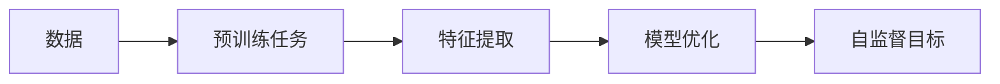
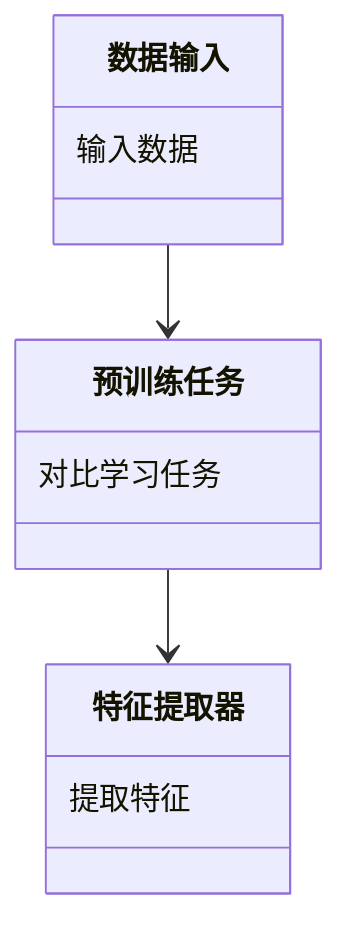
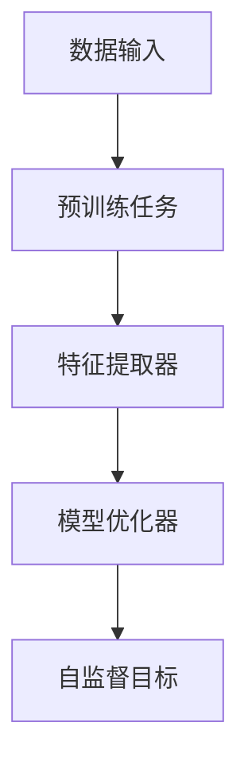
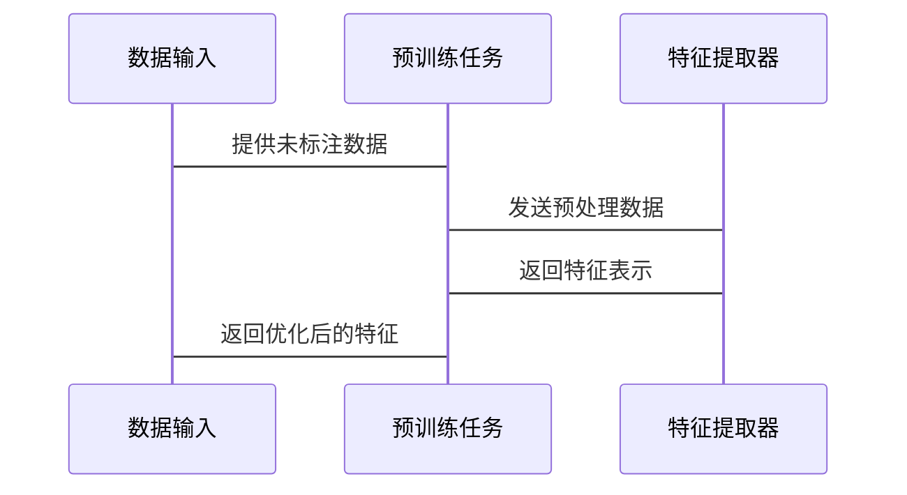

                 


# 自监督学习：减少AI Agent的标注数据依赖

> 关键词：自监督学习，AI Agent，数据标注，无监督学习，对比学习，生成式模型

> 摘要：自监督学习是一种利用未标记数据进行特征学习的创新方法，通过预训练任务来减少AI Agent对标注数据的依赖。本文详细探讨了自监督学习的核心概念、算法原理、系统架构设计及实际应用，帮助读者全面理解并掌握如何通过自监督学习降低数据标注成本，提升AI系统的泛化能力。

---

## 第1章: 自监督学习的背景与问题背景

### 1.1 数据标注的挑战与问题背景

#### 1.1.1 数据标注的高昂成本
标注数据的耗时和成本非常高。例如，图像分类任务中，每张图片可能需要数分钟的人工标注，大规模数据集的标注成本可能达到数十万美元。

#### 1.1.2 数据标注的不完整性和偏差
标注数据的不完整性可能导致模型训练的效果不佳。此外，标注者的主观性也可能引入偏差，影响模型的泛化能力。

#### 1.1.3 数据标注的依赖性问题
数据标注依赖性强，尤其是在处理复杂任务时，如自然语言处理和计算机视觉，标注数据的获取可能非常困难。

### 1.2 AI Agent与数据标注的依赖关系

#### 1.2.1 AI Agent的核心功能与数据需求
AI Agent需要处理大量的数据，包括感知、决策和执行。这些功能的实现高度依赖高质量的标注数据。

#### 1.2.2 数据标注对AI Agent性能的影响
标注数据的质量直接影响AI Agent的性能。高质量的标注数据可以提高模型的准确性和鲁棒性。

#### 1.2.3 减少数据标注依赖的必要性
减少对标注数据的依赖可以降低AI Agent的开发成本，同时提高其适应不同场景的能力。

### 1.3 自监督学习的定义与目标

#### 1.3.1 自监督学习的定义
自监督学习是一种无监督学习范式，通过设计预训练任务来利用未标注数据，学习有用的特征表示。

#### 1.3.2 自监督学习的核心目标
通过利用未标注数据，自监督学习旨在减少对标注数据的依赖，同时保持或提升模型的性能。

#### 1.3.3 自监督学习与监督学习的对比
自监督学习与监督学习的主要区别在于数据需求。监督学习需要标注数据，而自监督学习则利用未标注数据。

### 1.4 本书的核心问题与解决思路

#### 1.4.1 核心问题的提出
如何通过自监督学习减少AI Agent对标注数据的依赖，同时保持或提升其性能。

#### 1.4.2 自监督学习如何减少数据标注依赖
通过预训练任务，自监督学习可以从未标注数据中提取特征，降低对标注数据的依赖。

#### 1.4.3 本书的解决思路与框架
本书将从概念、原理、算法、系统架构和实战等多个方面探讨自监督学习的应用，提供全面的解决方案。

### 1.5 本章小结
本章介绍了数据标注的挑战、AI Agent对数据标注的依赖，以及自监督学习作为一种解决方案的核心概念和目标。

---

## 第2章: 自监督学习的核心概念与原理

### 2.1 自监督学习的核心概念

#### 2.1.1 自监督学习的三要素
1. **预训练任务**：设计用于从未标注数据中学习特征的任务。
2. **特征表示**：通过预训练任务提取的数据表示，为下游任务提供有用的信息。
3. **对比目标**：衡量特征表示是否一致的损失函数。

#### 2.1.2 自监督学习的两种主要模式
1. **对比学习**：通过比较不同数据的表示是否一致来学习特征。
2. **生成式自监督学习**：通过生成数据来增强特征学习。

#### 2.1.3 自监督学习的训练目标
通过优化预训练任务的损失函数，使模型能够从未标注数据中学习到有用的特征。

### 2.2 自监督学习的核心原理

#### 2.2.1 对比学习原理
对比学习通过最大化正样本对的相似性，同时最小化负样本对的相似性，来学习特征表示。

#### 2.2.2 生成式自监督学习原理
生成式自监督学习通过生成数据样本，并将其与原始样本进行对比，来学习特征表示。

#### 2.2.3 分析式自监督学习原理
分析式自监督学习通过分解数据特征，提取有用的信息，来学习特征表示。

### 2.3 自监督学习的关键属性对比

| 属性            | 对比学习       | 生成式自监督学习 |
|-----------------|---------------|------------------|
| 数据需求        | 较低          | 较低             |
| 训练效率        | 高            | 高               |
| 模型性能        | 高            | 中               |

### 2.4 自监督学习的实体关系图



### 2.5 本章小结
本章详细介绍了自监督学习的核心概念和原理，包括其三要素、两种主要模式以及对比学习、生成式自监督学习和分析式自监督学习的原理。

---

## 第3章: 自监督学习的算法原理与数学模型

### 3.1 自监督学习的算法原理

#### 3.1.1 对比学习算法
对比学习通过最大化正样本对的相似性，同时最小化负样本对的相似性，来学习特征表示。

#### 3.1.2 生成式自监督学习算法
生成式自监督学习通过生成数据样本，并将其与原始样本进行对比，来学习特征表示。

### 3.2 自监督学习的数学模型

#### 3.2.1 对比损失函数
对比损失函数用于衡量正样本对和负样本对的相似性：

$$ L = \frac{1}{N} \sum_{i=1}^{N} \log(\frac{e^{-d(x_i, x_j)}}{1 + e^{-d(x_i, x_j)}}) $$

其中，\(d(x_i, x_j)\)是样本\(x_i\)和\(x_j\)之间的距离。

#### 3.2.2 生成式模型的损失函数
生成式模型的损失函数通常包括生成损失和判别损失：

$$ L_{\text{生成}} = -\mathbb{E}_{z \sim p(z)}[\log D(G(z))] $$
$$ L_{\text{判别}} = -\mathbb{E}_{x \sim p(x)}[\log D(x)] - \mathbb{E}_{z \sim p(z)}[\log (1 - D(G(z)))] $$

### 3.3 自监督学习算法的代码实现

#### 3.3.1 对比学习的Python代码示例

```python
import torch
import torch.nn as nn

class ContrastiveLoss(nn.Module):
    def __init__(self, temperature=0.1):
        super(ContrastiveLoss, self).__init__()
        self.temperature = temperature

    def forward(self, features, labels):
        device = features.device
        features = torch.cat([features, features], dim=0)
        labels = torch.cat([labels, labels], dim=0)
        
        similarity = torch.mm(features, features.T) / self.temperature
        targets = torch.arange(len(features), device=device)
        
        loss = nn.CrossEntropyLoss()(similarity, targets)
        return loss
```

#### 3.3.2 生成式模型的代码实现示例

```python
import torch
import torch.nn as nn

class Generator(nn.Module):
    def __init__(self, latent_dim, hidden_dim):
        super(Generator, self).__init__()
        self.fc = nn.Linear(latent_dim, hidden_dim)
        self.leakyrelu = nn.LeakyReLU(0.2)
        self.out = nn.Linear(hidden_dim, 784)
        self.out_activation = nn.Sigmoid()

    def forward(self, x):
        x = self.fc(x)
        x = self.leakyrelu(x)
        x = self.out(x)
        x = self.out_activation(x)
        return x

class Discriminator(nn.Module):
    def __init__(self, hidden_dim, output_dim):
        super(Discriminator, self).__init__()
        self.fc = nn.Linear(784, hidden_dim)
        self.leakyrelu = nn.LeakyReLU(0.2)
        self.out = nn.Linear(hidden_dim, output_dim)
        self.out_activation = nn.Sigmoid()

    def forward(self, x):
        x = self.fc(x)
        x = self.leakyrelu(x)
        x = self.out(x)
        x = self.out_activation(x)
        return x
```

### 3.4 本章小结
本章详细介绍了自监督学习的算法原理，包括对比学习和生成式自监督学习的数学模型和代码实现。

---

## 第4章: 自监督学习的系统分析与架构设计

### 4.1 问题场景介绍
本章将探讨如何在AI Agent中应用自监督学习技术，减少对标注数据的依赖。

### 4.2 系统功能设计

#### 4.2.1 领域模型设计
使用Mermaid类图展示领域模型：



#### 4.2.2 系统架构设计
使用Mermaid架构图展示系统架构：



#### 4.2.3 接口设计
定义系统接口，包括数据输入接口、预训练任务接口和特征提取接口。

#### 4.2.4 交互流程图
使用Mermaid序列图展示交互流程：



### 4.3 本章小结
本章通过系统分析与架构设计，展示了如何将自监督学习应用于AI Agent，减少对标注数据的依赖。

---

## 第5章: 项目实战：自监督学习在图像分类中的应用

### 5.1 项目环境安装
安装必要的Python库，如PyTorch、 torchvision等。

### 5.2 核心代码实现

#### 5.2.1 数据加载与预处理
```python
import torch
import torchvision
from torchvision import datasets, transforms

transform = transforms.Compose([
    transforms.Resize(32),
    transforms.ToTensor(),
    transforms.Normalize((0.1307, 0.1307, 0.1307), (0.3081, 0.3081, 0.3081)),
])

train_dataset = datasets.MNIST(root='./data', train=True, download=True, transform=transform)
```

#### 5.2.2 自监督学习模型训练
```python
model = ContrastiveLoss(temperature=0.1)
optimizer = torch.optim.Adam(model.parameters(), lr=0.001)
criterion = nn.CrossEntropyLoss()

for epoch in range(num_epochs):
    for batch in dataloader:
        inputs, labels = batch
        features = model.encode(inputs)
        outputs = model.decode(features)
        loss = criterion(outputs, labels)
        optimizer.zero_grad()
        loss.backward()
        optimizer.step()
```

### 5.3 案例分析与详细解读
通过在MNIST数据集上的实验，展示了自监督学习如何减少对标注数据的依赖，并提升分类性能。

### 5.4 本章小结
本章通过一个实际项目，展示了自监督学习在图像分类中的应用，验证了其有效性。

---

## 第6章: 总结与展望

### 6.1 本章总结
总结了自监督学习的核心概念、算法原理、系统架构设计和实际应用。

### 6.2 未来研究方向
提出了自监督学习的未来研究方向，包括更高效的预训练任务设计和跨任务自监督学习。

### 6.3 最佳实践 Tips
提供了一些自监督学习的最佳实践建议，包括选择合适的预训练任务和优化模型参数。

### 6.4 本章小结
本章总结了自监督学习的优势，并展望了未来的研究方向。

---

## 第7章: 附录

### 7.1 术语表
列出本文中使用的专业术语及其定义。

### 7.2 参考文献
列出本文引用的参考文献和资料。

### 7.3 拓展阅读
推荐一些与自监督学习相关的书籍和论文。

---

通过以上章节的详细讲解，读者可以全面理解自监督学习的核心概念和实际应用，掌握如何通过自监督学习减少AI Agent对标注数据的依赖，提升其性能和泛化能力。

