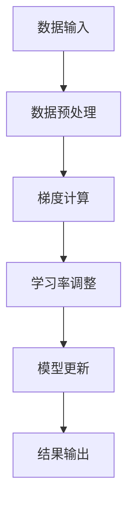
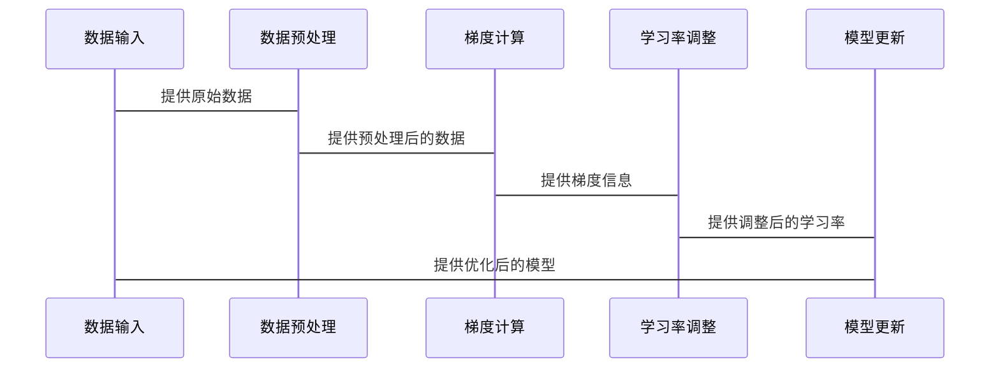

                 


# 自适应学习率：优化AI Agent的训练过程

---

## 关键词：
自适应学习率，AI Agent，强化学习，优化算法，机器学习，深度学习

---

## 摘要：
自适应学习率是一种优化AI Agent训练过程的重要技术，它通过动态调整学习率来提高模型的收敛速度和训练效率。本文详细探讨了自适应学习率的核心概念、算法原理、系统架构、项目实战以及最佳实践，帮助读者全面理解并掌握这一技术。

---

## 第一部分：自适应学习率的背景与基础

### 第1章：自适应学习率的核心概念

#### 1.1 传统学习率的局限性
在机器学习和深度学习中，学习率是一个关键的超参数，决定了模型参数更新的速度。然而，固定的学习率在实际应用中存在以下问题：
- **收敛速度慢**：在不同的数据分布或特征尺度下，固定学习率可能导致模型更新过慢或过快。
- **训练不稳定**：在某些情况下，固定学习率可能导致模型在训练过程中出现振荡或发散。

#### 1.2 自适应学习率的定义与特点
自适应学习率是一种动态调整学习率的技术，能够在训练过程中根据数据的特性自动调整学习率。其核心特点包括：
- **动态调整**：根据梯度信息或模型状态动态调整学习率。
- **全局最优**：通过自适应机制找到最优的学习率路径。
- **鲁棒性高**：适用于不同数据分布和模型架构。

#### 1.3 AI Agent的训练过程概述
AI Agent的训练过程通常涉及强化学习或监督学习。在强化学习中，AI Agent通过与环境交互，逐步优化策略以最大化奖励。自适应学习率在这一过程中起到关键作用，能够帮助AI Agent更快地找到最优策略。

---

### 第2章：自适应学习率的核心原理

#### 2.1 自适应学习率的核心原理
自适应学习率通过以下机制实现动态调整：
- **梯度统计**：利用梯度的统计信息（如均值、方差）来调整学习率。
- **动量机制**：结合动量概念，加速收敛并跳出局部最优。

#### 2.2 自适应学习率的关键算法
以下是几种常用的自适应学习率算法：
- **Adam算法**：结合动量和自适应学习率的优化算法。
- **Adagrad算法**：基于梯度累积的自适应优化算法。
- **RMSprop算法**：基于梯度平方平均的优化算法。

---

### 第3章：自适应学习率的数学模型与公式

#### 3.1 Adam算法的数学推导
Adam算法结合了动量和自适应学习率的思想，其更新公式如下：
$$
m_t = \beta_1 m_{t-1} + (1 - \beta_1) g_t
$$
$$
v_t = \beta_2 v_{t-1} + (1 - \beta_2) g_t^2
$$
$$
\theta_{t} = \theta_{t-1} - \frac{\eta}{\sqrt{v_t + \epsilon}} m_t
$$
其中，$m_t$ 表示动量，$v_t$ 表示梯度平方的加权平均，$\eta$ 表示基础学习率，$\epsilon$ 是防止除零的常数。

#### 3.2 Adagrad算法的数学推导
Adagrad算法通过累积梯度平方来动态调整学习率：
$$
s_t = s_{t-1} + g_t^2
$$
$$
\theta_t = \theta_{t-1} - \frac{\eta}{\sqrt{s_t}} g_t
$$
其中，$s_t$ 表示累积的梯度平方和。

#### 3.3 RMSprop算法的数学推导
RMSprop算法通过滑动平均梯度平方来调整学习率：
$$
s_t = \rho s_{t-1} + (1 - \rho) g_t^2
$$
$$
\theta_t = \theta_{t-1} - \frac{\eta}{\sqrt{s_t}} g_t
$$
其中，$\rho$ 是滑动平均的系数。

---

## 第二部分：自适应学习率的系统架构与项目实战

### 第4章：自适应学习率的系统架构设计

#### 4.1 问题场景介绍
在AI Agent的训练过程中，模型需要不断调整参数以优化性能。传统的固定学习率方法难以适应不同阶段的梯度变化，导致训练效率低下。

#### 4.2 系统功能设计
- **数据预处理模块**：对输入数据进行归一化或其他预处理操作。
- **梯度计算模块**：计算模型的梯度信息。
- **学习率调整模块**：根据梯度信息动态调整学习率。
- **模型更新模块**：基于调整后的学习率更新模型参数。

#### 4.3 系统架构设计
使用Mermaid绘制系统架构图如下：


#### 4.4 系统接口设计
- **输入接口**：接收训练数据和模型参数。
- **输出接口**：输出优化后的模型参数和训练结果。

#### 4.5 系统交互设计
使用Mermaid绘制交互序列图如下：


---

### 第5章：自适应学习率的项目实战

#### 5.1 环境安装
需要安装以下依赖：
- Python 3.6+
- TensorFlow或PyTorch
- matplotlib（可选，用于可视化）

#### 5.2 系统核心实现源代码
以下是基于Adam算法的实现代码：
```python
import numpy as np

class AdamOptimizer:
    def __init__(self, params, learning_rate=0.001, beta1=0.9, beta2=0.999, epsilon=1e-8):
        self.params = params
        self.learning_rate = learning_rate
        self.beta1 = beta1
        self.beta2 = beta2
        self.epsilon = epsilon
        self.m = [np.zeros_like(p) for p in params]
        self.v = [np.zeros_like(p) for p in params]
        self.t = 0

    def step(self, grads):
        self.t += 1
        for i, (p, m, v, g) in enumerate(zip(self.params, self.m, self.v, grads)):
            m_new = self.beta1 * m + (1 - self.beta1) * g
            v_new = self.beta2 * v + (1 - self.beta2) * g**2
            m_corrected = m_new / (1 - self.beta1**self.t)
            v_corrected = v_new / (1 - self.beta2**self.t)
            p_new = p - self.learning_rate * m_corrected / (np.sqrt(v_corrected) + self.epsilon)
            self.params[i] = p_new
            self.m[i] = m_new
            self.v[i] = v_new

    def get_params(self):
        return self.params
```

#### 5.3 代码解读与分析
- **初始化**：初始化模型参数、学习率、动量系数、方差系数和epsilon常数。
- **优化步骤**：计算动量和方差，并根据它们更新模型参数。
- **结果输出**：返回优化后的模型参数。

#### 5.4 实际案例分析
以一个简单的强化学习代理为例，展示自适应学习率的应用：
```python
# 定义环境
class Environment:
    def __init__(self):
        self.state_dim = 4
        self.action_dim = 2

    def get_state(self):
        return np.random.randn(self.state_dim)

    def step(self, action):
        # 简单环境，直接返回动作作为奖励
        return action, np.random.randn()

# 定义代理
class Agent:
    def __init__(self, state_dim, action_dim):
        self.state_dim = state_dim
        self.action_dim = action_dim
        self.theta = np.random.randn(state_dim, action_dim)

    def get_action(self, state):
        return np.argmax(state.dot(self.theta))

# 初始化环境和代理
env = Environment()
agent = Agent(env.state_dim, env.action_dim)
optimizer = AdamOptimizer(agent.theta, learning_rate=0.001)

# 训练过程
for _ in range(1000):
    state = env.get_state()
    action = agent.get_action(state)
    reward, next_state = env.step(action)
    # 假设简单损失函数
    loss = np.mean((state.dot(agent.theta) - action)**2)
    grads = [2 * state.T.dot(agent.theta) - 2 * action]
    optimizer.step(grads)

print("训练完成，优化后的模型参数为：")
print(optimizer.get_params())
```

---

## 第三部分：自适应学习率的最佳实践与总结

### 第6章：自适应学习率的最佳实践

#### 6.1 调优技巧
- **选择合适的算法**：根据具体任务选择Adam、Adagrad或RMSprop。
- **调整超参数**：适当调整$\beta_1$、$\beta_2$等超参数以获得更好的效果。
- **监控训练过程**：通过可视化工具监控损失函数和学习率的变化。

#### 6.2 分布式训练的注意事项
- **并行计算**：在分布式环境下，确保梯度计算的同步性。
- **通信开销**：合理管理参数更新的通信开销。

#### 6.3 在线学习的注意事项
- **实时调整**：根据在线反馈实时调整学习率。
- **鲁棒性设计**：确保系统在动态环境下的稳定性。

### 第7章：总结与展望

#### 7.1 总结
自适应学习率通过动态调整学习率，显著提高了AI Agent的训练效率和性能。本文详细探讨了其核心概念、算法原理、系统架构和项目实战，为读者提供了全面的指导。

#### 7.2 展望
未来，自适应学习率将在以下方面进一步发展：
- **更智能的调整机制**：结合模型状态和环境信息实现更智能的调整。
- **多任务优化**：在多任务学习中实现更高效的自适应学习率调整。
- **边缘计算应用**：在边缘计算场景下优化资源利用率。

---

## 结语
自适应学习率是优化AI Agent训练过程的关键技术，通过动态调整学习率，能够显著提升模型的训练效率和性能。希望本文能够为读者提供有价值的指导，并激发进一步的研究和探索。

