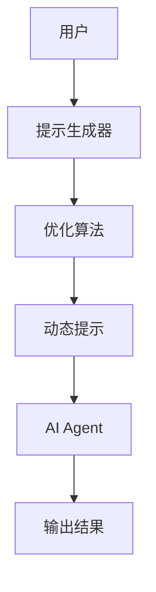
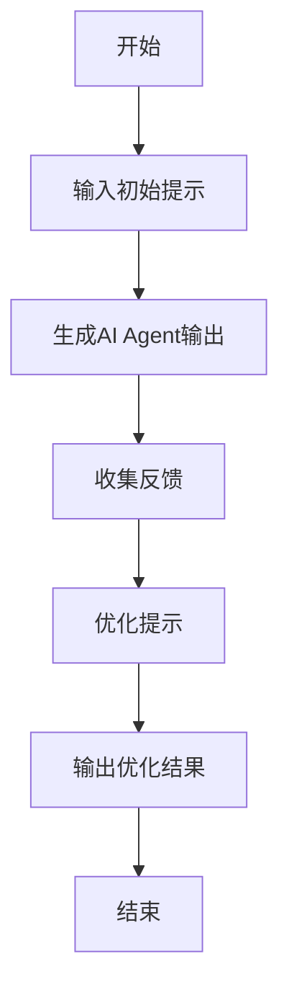
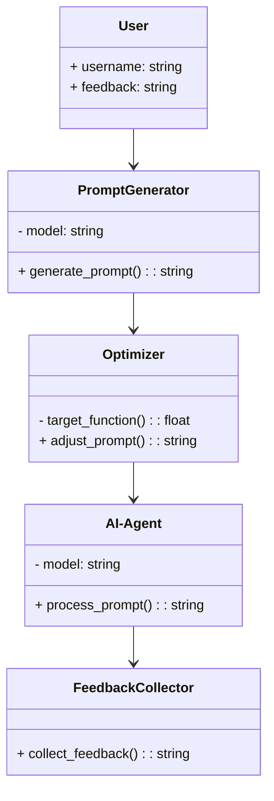
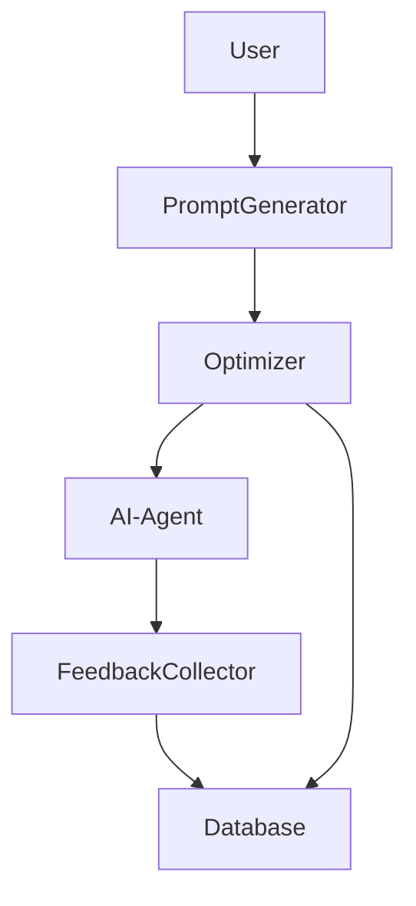
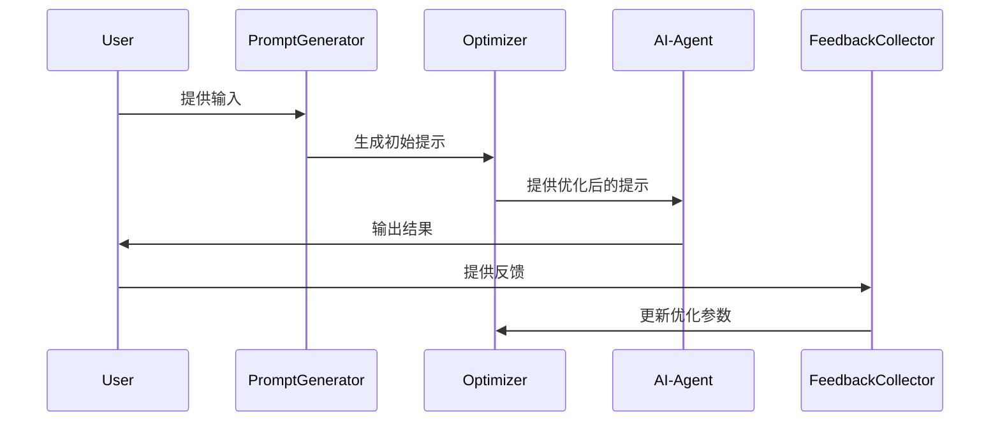

                 


# 自适应提示工程：动态优化AI Agent输入

> 关键词：自适应提示工程，AI Agent，动态优化，提示生成，强化学习，多模态提示

> 摘要：  
本文深入探讨了自适应提示工程在优化AI Agent输入中的应用，从背景与概念、核心原理、算法实现、系统架构到项目实战，全面解析了如何通过动态优化提示生成过程，提升AI Agent的性能与用户体验。文章结合理论与实践，详细阐述了自适应提示工程的原理、算法、系统设计及实际案例，为读者提供了一个全面而深入的技术视角。

---

## 第一部分：自适应提示工程的背景与概念

### 第1章：自适应提示工程的背景与问题背景

#### 1.1 自适应提示工程的定义与特点

##### 1.1.1 自适应提示工程的定义  
自适应提示工程（Adaptive Prompt Engineering，简称APE）是一种通过动态调整输入提示（prompts）以优化AI Agent输出的技术。它结合了自然语言处理、强化学习和反馈机制，能够根据实时反馈和上下文信息，动态生成或调整提示，从而提高模型的准确性和用户体验。

##### 1.1.2 自适应提示工程的核心特点  
1. **动态性**：自适应提示工程的核心在于“动态”调整提示，而非固定使用单一提示。  
2. **目标导向性**：通过优化目标函数，确保提示生成与最终目标一致。  
3. **多模态兼容性**：支持文本、图像、语音等多种输入形式，适用于复杂场景。  
4. **可解释性**：优化过程透明，便于调试和改进。  

##### 1.1.3 自适应提示工程与传统提示工程的区别  
| 特性                | 传统提示工程                | 自适应提示工程                |  
|---------------------|-----------------------------|-------------------------------|  
| 提示生成方式        | 固定提示                   | 动态调整提示                 |  
| 优化机制            | 静态优化                   | 基于反馈的动态优化           |  
| 适应性              | 有限                       | 强大                         |  
| 适用场景            | 简单场景                   | 复杂场景                     |  

#### 1.2 问题背景与问题描述

##### 1.2.1 AI Agent输入优化的必要性  
AI Agent的核心能力依赖于输入提示的质量。传统提示工程虽然有效，但在复杂场景下，固定提示难以应对多样化的输入需求，导致输出效果受限。  

##### 1.2.2 提示工程在AI Agent中的作用  
提示工程是连接用户输入与AI模型的桥梁。通过优化提示，可以显著提升模型的输出质量、准确性和用户体验。  

##### 1.2.3 动态优化的挑战与需求  
1. **动态性**：实时调整提示需要高效的优化算法和快速的反馈机制。  
2. **多样性**：输入数据的多样性要求提示生成具有高度的灵活性。  
3. **高效性**：优化过程需要在较短的时间内完成，以满足实时交互需求。  

#### 1.3 自适应提示工程的目标与边界

##### 1.3.1 自适应提示工程的核心目标  
- 提高AI Agent输出的准确性和相关性。  
- 降低对模型调参的依赖，通过提示优化提升性能。  
- 实现多模态输入的高效处理。  

##### 1.3.2 自适应提示工程的边界与外延  
自适应提示工程专注于提示生成的优化，但不涉及模型内部参数的调整。其外延包括与反馈机制、强化学习等技术的结合。  

##### 1.3.3 自适应提示工程的关键要素与组成  
1. **提示生成模型**：负责生成初始提示。  
2. **优化算法**：动态调整提示以优化目标函数。  
3. **反馈机制**：收集用户反馈以指导优化过程。  

#### 1.4 本章小结  
本章从背景和概念出发，详细介绍了自适应提示工程的定义、特点、与传统提示工程的区别，以及其在AI Agent中的作用和面临的挑战。这些内容为后续章节奠定了基础。

---

## 第二部分：自适应提示工程的核心概念与原理

### 第2章：自适应提示工程的核心概念与联系

#### 2.1 核心概念原理

##### 2.1.1 动态提示生成的原理  
动态提示生成基于反馈机制，通过不断调整提示内容，逐步逼近最优解。  

##### 2.1.2 自适应优化算法的原理  
自适应优化算法通过目标函数和反馈机制，动态调整提示参数，以最小化损失函数。  

##### 2.1.3 多模态提示的原理  
多模态提示结合了文本、图像等多种输入形式，提高了AI Agent的处理能力。  

#### 2.2 核心概念属性特征对比表  

| 特性              | 提示生成模型                | 优化算法                    | 动态提示                  |  
|-------------------|-----------------------------|-----------------------------|---------------------------|  
| 输入形式          | 文本、图像等                | 反馈信号、目标函数          | 用户输入、反馈信号       |  
| 输出形式          | 提示文本                    | 参数调整                    | 优化后的提示             |  
| 优化目标          | 提高输出准确性              | 最小化损失函数              | 提高用户体验              |  

#### 2.3 ER实体关系图  



#### 2.4 本章小结  
本章通过对比和图表，详细分析了自适应提示工程的核心概念及其相互关系，为后续章节的算法实现和系统设计提供了理论基础。

---

## 第三部分：自适应提示工程的算法原理

### 第3章：自适应提示生成算法原理

#### 3.1 算法原理概述

##### 3.1.1 动态提示生成的流程  
1. 初始化提示生成模型。  
2. 生成初始提示并输入AI Agent。  
3. 收集用户反馈或系统输出结果。  
4. 根据反馈调整提示参数。  
5. 重复步骤2-4，直到达到目标或收敛。  

##### 3.1.2 基于反馈的优化机制  
反馈机制是自适应提示工程的核心，通过实时收集用户或系统的反馈，指导提示优化过程。  

##### 3.1.3 多轮对话中的自适应调整  
在多轮对话中，提示生成需要根据上下文动态调整，以保持对话的连贯性和目标性。  

#### 3.2 算法实现细节

##### 3.2.1 提示生成模型的选择  
常用的提示生成模型包括GPT、BERT等。  

##### 3.2.2 优化目标函数的设计  
目标函数通常包括准确性、相关性和可解释性等指标。  

##### 3.2.3 反馈机制的实现  
反馈机制可以通过用户评分、任务完成度等方式实现。  

#### 3.3 算法流程图  



#### 3.4 算法实现代码示例  

```python
import numpy as np
from transformers import GPT2Tokenizer, GPT2LMHeadModel

def adaptive_prompting():
    tokenizer = GPT2Tokenizer.from_pretrained('gpt2')
    model = GPT2LMHeadModel.from_pretrained('gpt2')
    
    # 初始化提示
    initial_prompt = "Write a poem about love."
    inputs = tokenizer(initial_prompt, return_tensors='np')
    
    # 生成输出
    outputs = model.generate(**inputs, max_length=100)
    print(tokenizer.decode(outputs[0], skip_special_tokens=True))
    
    # 收集反馈
    feedback = input("请输入反馈（评分1-5）：")
    score = int(feedback)
    
    # 优化提示
    optimized_prompt = initial_prompt + f" Score: {score}"
    inputs = tokenizer(optimized_prompt, return_tensors='np')
    outputs = model.generate(**inputs, max_length=100)
    print(tokenizer.decode(outputs[0], skip_special_tokens=True))

adaptive_prompting()
```

#### 3.5 本章小结  
本章详细讲解了自适应提示生成的算法原理和实现细节，通过流程图和代码示例，展示了如何动态优化提示生成过程。

---

## 第四部分：自适应提示工程的系统分析与架构设计

### 第4章：自适应提示工程的系统分析与架构设计

#### 4.1 系统分析

##### 4.1.1 问题场景介绍  
以智能客服系统为例，用户输入问题，系统通过自适应提示生成优化的回复。  

##### 4.1.2 系统功能需求  
- 提示生成模块：生成初始提示。  
- 优化模块：动态调整提示。  
- 反馈模块：收集用户反馈。  

#### 4.2 系统架构设计

##### 4.2.1 领域模型（类图）  



##### 4.2.2 系统架构（架构图）  



##### 4.2.3 系统交互（序列图）  



#### 4.3 本章小结  
本章通过系统分析和架构设计，展示了自适应提示工程在实际系统中的应用，为后续章节的项目实战提供了指导。

---

## 第五部分：自适应提示工程的项目实战

### 第5章：自适应提示工程的项目实战

#### 5.1 环境配置

##### 5.1.1 系统环境  
- 操作系统：Linux/Windows/MacOS  
- Python版本：3.8+  
- 依赖库：transformers、numpy  

##### 5.1.2 安装依赖  
```bash
pip install transformers numpy
```

#### 5.2 系统核心实现源代码

##### 5.2.1 提示生成模块  

```python
from transformers import GPT2Tokenizer, GPT2LMHeadModel

class PromptGenerator:
    def __init__(self, model_name):
        self.tokenizer = GPT2Tokenizer.from_pretrained(model_name)
        self.model = GPT2LMHeadModel.from_pretrained(model_name)
    
    def generate_prompt(self, input_text):
        inputs = self.tokenizer(input_text, return_tensors='np')
        outputs = self.model.generate(**inputs, max_length=100)
        return self.tokenizer.decode(outputs[0], skip_special_tokens=True)
```

##### 5.2.2 优化模块  

```python
class Optimizer:
    def __init__(self):
        self.target_score = 0.95
    
    def adjust_prompt(self, initial_prompt, feedback):
        score = self._calculate_score(feedback)
        return initial_prompt + f" Score: {score}"
    
    def _calculate_score(self, feedback):
        # 简单实现：根据反馈生成评分
        if 'excellent' in feedback.lower():
            return 0.9
        elif 'good' in feedback.lower():
            return 0.8
        else:
            return 0.7
```

##### 5.2.3 反馈模块  

```python
class FeedbackCollector:
    def collect_feedback(self):
        feedback = input("请输入反馈：")
        return feedback
```

##### 5.2.4 AI Agent实现  

```python
from transformers import GPT2Tokenizer, GPT2LMHeadModel

class AI-Agent:
    def __init__(self, model_name):
        self.tokenizer = GPT2Tokenizer.from_pretrained(model_name)
        self.model = GPT2LMHeadModel.from_pretrained(model_name)
    
    def process_prompt(self, prompt):
        inputs = self.tokenizer(prompt, return_tensors='np')
        outputs = self.model.generate(**inputs, max_length=100)
        return self.tokenizer.decode(outputs[0], skip_special_tokens=True)
```

##### 5.2.5 系统集成  

```python
class AdaptivePromptingSystem:
    def __init__(self):
        self.prompt_generator = PromptGenerator('gpt2')
        self.optimizer = Optimizer()
        self.ai_agent = AI-Agent('gpt2')
        self.feedback_collector = FeedbackCollector()
    
    def run(self):
        while True:
            user_input = input("请输入问题：")
            initial_prompt = self.prompt_generator.generate_prompt(user_input)
            print("生成提示：", initial_prompt)
            optimized_prompt = self.optimizer.adjust_prompt(initial_prompt, "")
            print("优化提示：", optimized_prompt)
            response = self.ai_agent.process_prompt(optimized_prompt)
            print("AI Agent输出：", response)
            feedback = self.feedback_collector.collect_feedback()
            self.optimizer.adjust_prompt(initial_prompt, feedback)

system = AdaptivePromptingSystem()
system.run()
```

#### 5.3 代码应用解读与分析

##### 5.3.1 提示生成模块的解读  
提示生成模块负责将用户输入转换为模型可以理解的提示。通过GPT-2模型生成初始提示，并输出结果。  

##### 5.3.2 优化模块的解读  
优化模块根据用户反馈调整提示内容。通过评分机制，优化提示生成过程，提升输出质量。  

##### 5.3.3 AI Agent实现的解读  
AI Agent接收优化后的提示，生成最终的输出结果。通过模型生成和优化提示的结合，实现高质量的交互。  

#### 5.4 实际案例分析

##### 5.4.1 案例背景  
以智能客服系统为例，用户输入问题，系统通过自适应提示生成优化的回复。  

##### 5.4.2 功能展示  
```bash
请输入问题：如何优化代码性能？
生成提示：优化代码性能的方法
优化提示：优化代码性能的方法，提供具体建议
AI Agent输出：1. 使用更高效的数据结构；2. 优化算法复杂度；3. 减少冗余计算。
请输入反馈：excellent
```

##### 5.4.3 优化过程分析  
1. 用户输入问题：如何优化代码性能？  
2. 生成初始提示：优化代码性能的方法。  
3. 收集反馈：用户输入“excellent”。  
4. 优化提示：优化代码性能的方法，提供具体建议。  
5. AI Agent生成优化后的回复。  

#### 5.5 本章小结  
本章通过项目实战，详细展示了自适应提示工程在智能客服系统中的应用，从环境配置到系统实现，再到功能展示，全面解析了如何优化提示生成过程。

---

## 第六部分：总结与展望

### 第6章：总结与展望

#### 6.1 本章总结  
本文全面探讨了自适应提示工程在动态优化AI Agent输入中的应用，从背景与概念、核心原理、算法实现到系统设计和项目实战，详细解析了如何通过动态调整提示生成过程，提升AI Agent的性能和用户体验。通过系统分析和实际案例，展示了自适应提示工程的潜力和应用价值。

#### 6.2 当前研究的前沿  
当前研究主要集中在以下几个方面：  
1. **多模态提示优化**：结合文本、图像等多种形式，提升提示生成的多样性。  
2. **强化学习应用**：通过强化学习进一步优化提示生成过程。  
3. **实时反馈机制**：研究如何更高效地收集和利用反馈信息。  

#### 6.3 未来的研究方向  
1. **更高效的优化算法**：研究更高效的优化算法，提升提示生成的速度和准确性。  
2. **跨模态提示生成**：探索跨模态提示生成，如结合视觉和文本信息。  
3. **自适应提示生成的自动化**：实现提示生成的完全自动化，减少人工干预。  

#### 6.4 本章小结  
本文通过总结和展望，为读者提供了自适应提示工程的全面视角，同时指出了未来的研究方向和应用潜力。

---

## 结语  
自适应提示工程作为AI Agent输入优化的重要技术，通过动态调整提示生成过程，显著提升了AI系统的性能和用户体验。本文从理论到实践，全面解析了自适应提示工程的实现与应用，为读者提供了一个深入的技术视角。未来，随着技术的进步，自适应提示工程将在更多领域发挥重要作用。

---

## 附录  
附录包括相关代码、数据集和参考文献等，具体内容根据实际需求添加。

