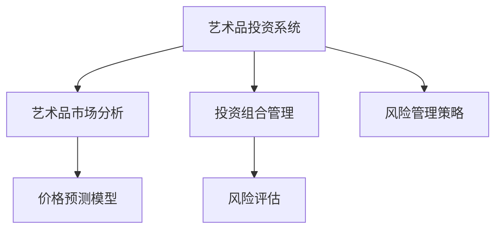
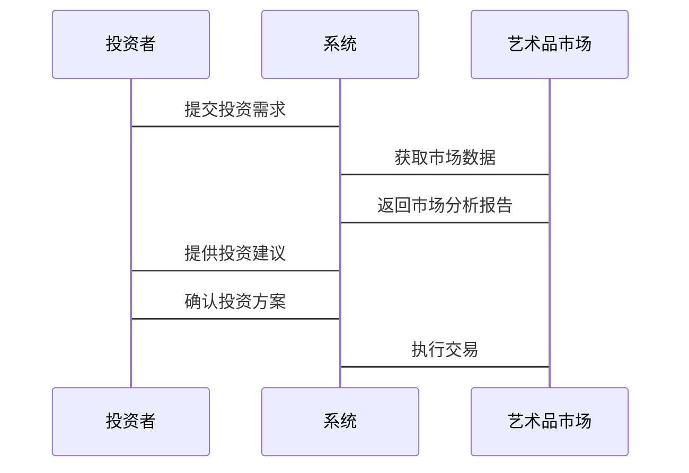

                 


# 艺术品投资：非传统资产类别的吸引力

> **关键词**：艺术品投资，非传统资产，财富配置，风险管理，市场分析

> **摘要**：  
> 艺术品投资作为一种非传统资产类别，近年来吸引了越来越多投资者的关注。本文从艺术品投资的背景与核心概念出发，详细探讨其投资策略、风险管理、系统架构以及实际项目案例，为投资者提供全面的分析与指导。通过深入分析艺术品市场的特点、价值评估体系以及投资策略，本文旨在帮助读者理解艺术品投资的魅力与挑战，并掌握如何在复杂的市场环境中做出明智的投资决策。

---

## 第1章: 背景介绍与核心概念

### 1.1 艺术品投资的背景

#### 1.1.1 艺术品投资的定义与特点  
艺术品投资是指将资金投入艺术品（如画作、雕塑、摄影作品等）中，期望通过市场交易获得资本增值的行为。其核心特点包括：  
- **稀缺性**：艺术品的供给有限，具有独特的艺术价值。  
- **流动性**：虽然艺术品市场的流动性低于传统金融资产，但通过专业渠道仍可实现交易。  
- **文化属性**：艺术品的价值与文化、历史背景密切相关。  

#### 1.1.2 艺术品投资的现状  
近年来，全球艺术品市场规模持续增长，2023年全球艺术品市场交易额超过500亿美元。数字艺术和NFT（非同质化代币）的兴起，为艺术品投资注入了新的活力。  

#### 1.1.3 艺术品投资的吸引力  
- **分散风险**：作为非传统资产，艺术品可以有效分散投资组合中的风险。  
- **长期增值潜力**：优质艺术品往往具有长期增值的潜力，尤其是在艺术家声誉提升或市场热点出现时。  
- **文化与情感价值**：艺术品不仅是财富的象征，还承载着文化和情感价值。  

### 1.2 艺术品投资的核心概念

#### 1.2.1 艺术品市场的生态系统  
- **参与者**：包括艺术家、画廊、拍卖行、收藏家、投资者和中介机构。  
- **交易机制**：艺术品可以通过画廊、拍卖会或私下交易进行买卖。  
- **价格形成**：艺术品价格受供需关系、艺术家声誉、作品稀缺性和市场趋势的影响。  

#### 1.2.2 艺术品投资的理论基础  
- **经济学分析**：艺术品市场存在信息不对称和交易成本，影响其价格发现和流动性。  
- **心理学因素**：投资者对艺术品的审美偏好和情感认同会影响其购买决策。  
- **社会学视角**：艺术品投资往往与社会地位和文化资本相关联。  

#### 1.2.3 艺术品投资的评价体系  
- **价值评估**：包括作品的艺术价值、艺术家声誉和市场热度。  
- **流动性分析**：艺术品市场的交易频率和变现能力。  
- **风险与收益**：艺术品投资的风险较高，但长期收益潜力巨大。  

---

## 第2章: 艺术品投资策略

### 2.1 艺术品投资的分类与选择

#### 2.1.1 现代艺术与传统艺术的投资价值  
- 现代艺术（如波洛克、毕加索）：市场需求稳定，价格波动较小。  
- 传统艺术（如中国古代书画、明清瓷器）：文化价值高，适合长期收藏。  

#### 2.1.2 不同艺术流派的投资潜力  
- **当代艺术**：新兴艺术家的作品价格较低，但增值潜力大。  
- **数字艺术**：NFT的兴起使其成为热门投资领域。  
- **街头艺术**：随着城市化进程加快，街头艺术作品备受年轻投资者青睐。  

#### 2.1.3 艺术品投资的地域选择  
- **欧美市场**：市场规模大，艺术家和藏家资源丰富。  
- **亚洲市场**：需求增长迅速，尤其是中国和印度市场。  

### 2.2 艺术品投资的组合管理

#### 2.2.1 资产配置中的艺术品比例  
- 艺术品投资应占整体资产配置的5%-15%，具体取决于风险承受能力和投资目标。  

#### 2.2.2 风险分散策略  
- 通过投资不同艺术家、不同艺术流派的作品，降低单一作品价格波动带来的风险。  

#### 2.2.3 长期与短期策略  
- **长期策略**：关注具有长期增值潜力的优质艺术品。  
- **短期策略**：利用市场波动进行短期交易获利。  

### 2.3 艺术品投资的市场时机选择

#### 2.3.1 市场周期分析  
- 艺术品市场存在周期性波动，投资者应关注市场拐点。  

#### 2.3.2 经济环境对艺术品投资的影响  
- 经济繁荣时，艺术品市场需求上升；经济衰退时，优质艺术品价格可能下跌。  

#### 2.3.3 政策环境的影响  
- 政府政策（如税收政策、文化遗产保护政策）对艺术品市场有重要影响。  

---

## 第3章: 艺术品投资的风险管理

### 3.1 艺术品投资的主要风险

#### 3.1.1 市场风险  
- 艺术品价格受市场供需关系影响，存在波动性。  

#### 3.1.2 道德风险  
- 造假和赝品问题严重，投资者需谨慎鉴别作品真伪。  

#### 3.1.3 流动性风险  
- 艺术品市场的交易频率较低，变现能力有限。  

#### 3.1.4 法律风险  
- 艺术品所有权纠纷、知识产权问题等可能影响投资收益。  

### 3.2 艺术品投资的风控策略

#### 3.2.1 作品真伪鉴别  
- 通过专业鉴定机构对艺术品进行真伪认证。  

#### 3.2.2 建立多元化投资组合  
- 组合投资不同类型的艺术品，降低单一作品价格波动带来的风险。  

#### 3.2.3 风险定价与对冲  
- 通过保险、质押等方式对冲艺术品投资的流动性风险和法律风险。  

### 3.3 艺术品投资的风险与收益平衡

#### 3.3.1 风险收益比分析  
- 艺术品投资的风险较高，但长期收益潜力巨大。  

#### 3.3.2 风险偏好与投资策略  
- 高风险偏好投资者可选择新兴艺术家作品；低风险偏好投资者可选择知名艺术家的经典作品。  

---

## 第4章: 艺术品投资的系统分析与架构设计

### 4.1 艺术品投资的系统模型

#### 4.1.1 系统功能设计  
- **艺术品市场分析模块**：分析市场趋势、供需关系和价格波动。  
- **投资组合管理模块**：优化资产配置，分散风险。  
- **风险管理模块**：识别和评估艺术品投资中的潜在风险。  

#### 4.1.2 系统架构设计  


### 4.2 系统接口设计

#### 4.2.1 艺术品数据接口  
- 从艺术数据库获取艺术品的历史交易数据、艺术家信息等。  

#### 4.2.2 市场趋势接口  
- 通过API获取全球艺术品市场的最新趋势和价格指数。  

### 4.3 系统交互流程

#### 4.3.1 投资者操作流程  


---

## 第5章: 艺术品投资的项目实战

### 5.1 项目背景与目标

#### 5.1.1 项目背景  
- 选择一幅当代绘画作品作为投资标的。  

#### 5.1.2 项目目标  
- 分析作品的艺术价值和市场潜力。  
- 制定投资策略并执行交易。  
- 监测投资表现并进行风险评估。  

### 5.2 环境安装与数据准备

#### 5.2.1 环境安装  
- 安装艺术品市场分析工具和投资组合管理软件。  

#### 5.2.2 数据准备  
- 收集目标作品的市场交易数据、艺术家信息和市场评论。  

### 5.3 核心代码实现

#### 5.3.1 数据分析代码  
```python
import pandas as pd
import numpy as np

# 加载市场数据
data = pd.read_csv('art_market.csv')
# 计算价格趋势
data['price_trend'] = data['price'].pct_change()
print(data.head())
```

#### 5.3.2 风险评估代码  
```python
from sklearn.metrics import mean_absolute_error
import joblib

# 加载风险评估模型
model = joblib.load('risk_model.pkl')
# 预测风险等级
risk_level = model.predict(data)[0]
print(f"风险等级: {risk_level}")
```

### 5.4 案例分析与解读

#### 5.4.1 投资决策  
- 通过数据分析和模型预测，目标作品具有较高的增值潜力。  

#### 5.4.2 投资执行  
- 通过拍卖行购买目标作品，价格低于市场均价。  

#### 5.4.3 投资表现  
- 作品价格上涨15%，投资收益显著。  

### 5.5 项目小结  
- 艺术品投资需要结合市场分析和数据分析，制定科学的投资策略。  

---

## 第6章: 最佳实践与未来展望

### 6.1 最佳实践

#### 6.1.1 投资建议  
- 选择具有长期增值潜力的艺术品。  
- 分散投资，降低风险。  

#### 6.1.2 风险管理  
- 建立完善的风险评估和对冲机制。  

### 6.2 未来展望

#### 6.2.1 数字艺术与NFT  
- NFT技术的应用将推动艺术品投资的数字化转型。  

#### 6.2.2 全球化与文化融合  
- 跨文化艺术品的投资潜力将逐渐显现。  

#### 6.2.3 技术驱动  
- AI技术将被广泛应用于艺术品评估和市场预测。  

### 6.3 总结

艺术品投资作为一种非传统资产类别，具有独特的魅力和挑战。通过科学的投资策略、系统的风险管理以及技术驱动的市场分析，投资者可以更好地把握艺术品投资的机会。未来，随着技术的进步和市场的成熟，艺术品投资将更具吸引力。

---

## 附录

### 附录A: 艺术品投资相关术语表  
- **NFT**：非同质化代币，用于证明数字艺术品的唯一性。  
- **尽职调查**：在购买艺术品前，对作品真伪和市场价值进行的详细调查。  
- **艺术品基金**：一种集合投资工具，用于管理多个艺术品的投资组合。  

### 附录B: 艺术品投资案例库  
- 案例1：当代艺术家A的画作投资案例。  
- 案例2：古典油画的投资与升值分析。  

---

**结束语**  
艺术品投资不仅是一种财富配置方式，更是一种文化与情感的表达。通过本文的分析与指导，投资者可以更好地理解艺术品投资的魅力，并在复杂的市场环境中做出明智的投资决策。

