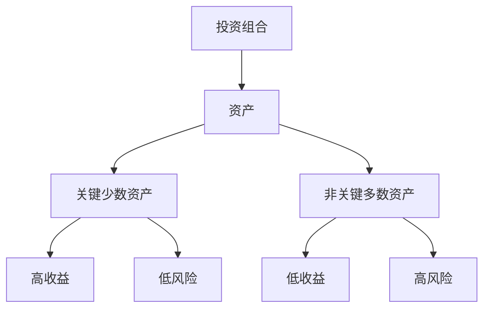
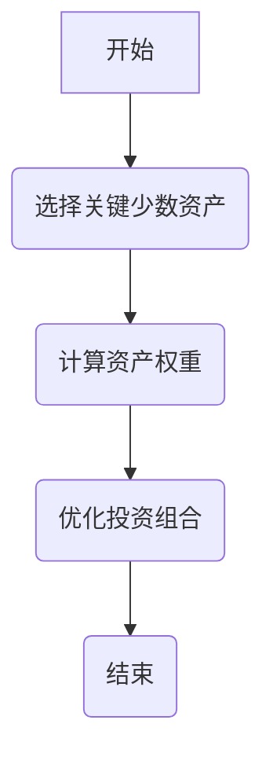
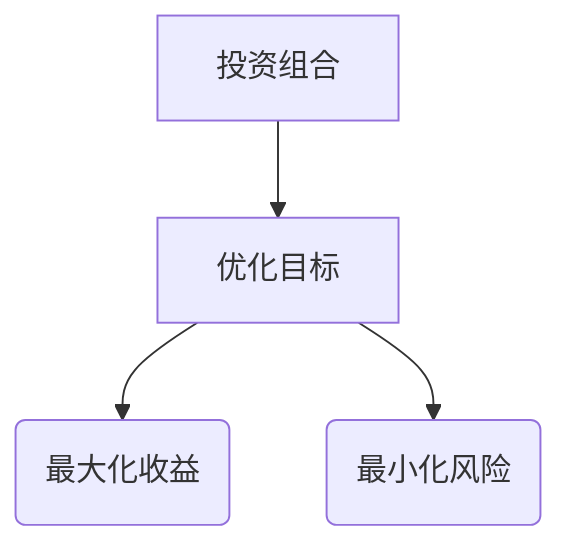
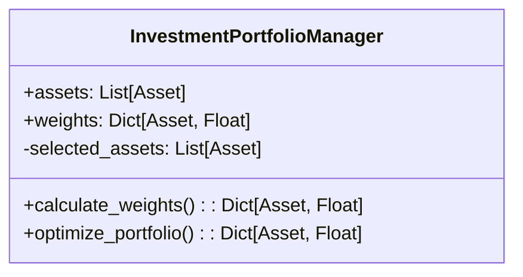
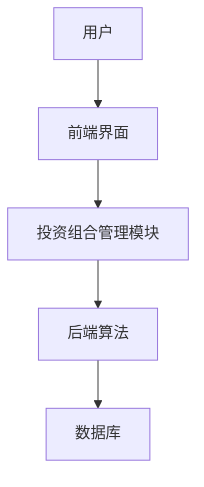
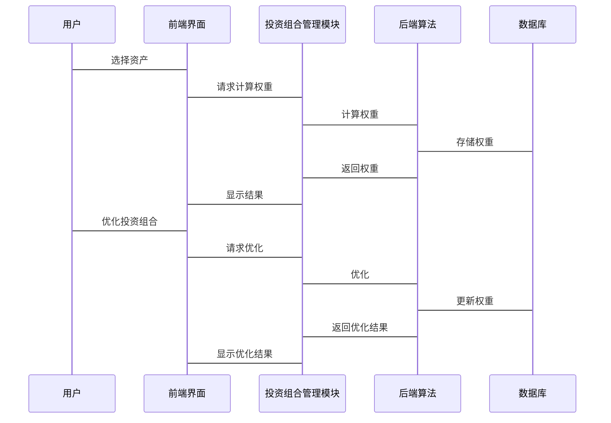

                 


# 芒格的"关键少数"原则在投资组合管理中的应用

> 关键词：芒格，关键少数，投资组合管理，投资策略，风险管理，系统架构设计

> 摘要：本文深入探讨了芒格的"关键少数"原则在投资组合管理中的应用。首先介绍了芒格的生平及其投资理念，详细分析了"关键少数"原则的核心概念及其在投资组合管理中的重要性。接着从数学模型、算法原理、系统架构设计等多个维度详细阐述了"关键少数"原则的应用方法，并通过实际案例展示了如何在投资组合管理中实现这一原则。最后总结了最佳实践和注意事项，为投资组合管理提供了新的视角和方法。

---

## 第1章: 芒格的"关键少数"原则背景介绍

### 1.1 芒格的生平与投资理念
#### 1.1.1 芒格的生平简介
查理·芒格（Charlie Munger）是美国著名投资者、伯克希尔·哈撒韦公司副董事长，被誉为“巴菲特的导师”。他不仅在投资领域取得了巨大成功，还提出了许多深刻的投资理念。

#### 1.1.2 芒格的投资哲学与思想体系
芒格的投资哲学强调“逆向思维”和“关键少数”原则。他认为，投资者应该专注于寻找那些具有长期竞争优势的企业，并且在投资决策中关注那些能够产生复利效应的因素。

#### 1.1.3 芒格的"关键少数"原则的提出背景
"关键少数"原则源于芒格对投资组合管理的深刻理解。他认为，在投资组合中，少数优质资产能够带来最大的收益，而大多数资产对整体收益的贡献微乎其微。

### 1.2 "关键少数"原则的核心概念
#### 1.2.1 "关键少数"的定义与特征
"关键少数"指的是在投资组合中占据重要地位的少数资产。这些资产具有较高的收益潜力和较低的风险，能够对整体投资组合的表现产生决定性影响。

#### 1.2.2 "关键少数"原则在投资中的应用
在投资组合管理中，"关键少数"原则强调通过精选少数优质资产来实现收益最大化。这种方法不仅降低了投资组合的复杂性，还提高了管理效率。

#### 1.2.3 "关键少数"与投资组合管理的关系
"关键少数"原则通过优化投资组合的结构，帮助投资者在复杂市场环境中做出更明智的决策。

### 1.3 投资组合管理的背景与现状
#### 1.3.1 投资组合管理的基本概念
投资组合管理是指通过合理配置资产来实现投资目标的过程。传统的投资组合管理方法通常关注于分散投资以降低风险。

#### 1.3.2 传统投资组合管理方法的局限性
传统方法往往过于复杂，难以在实际操作中有效应用。此外，传统方法通常忽略了少数优质资产的重要性。

#### 1.3.3 "关键少数"原则对投资组合管理的创新意义
"关键少数"原则通过简化投资组合结构，提高了管理效率，并将注意力集中在少数关键资产上，从而实现了更好的收益。

---

## 第2章: "关键少数"原则的核心概念与联系

### 2.1 核心概念原理
#### 2.1.1 "关键少数"原则的数学模型
$$ w_i = \frac{r_i}{\sum_{j=1}^{n} r_j} $$
其中，\( w_i \) 表示第 \( i \) 个资产的权重，\( r_i \) 表示第 \( i \) 个资产的收益。

#### 2.1.2 投资组合管理中的权重分配
权重分配的核心是将更多权重分配给关键少数资产，以最大化整体收益。

#### 2.1.3 "关键少数"与投资组合绩效的关系
关键少数资产的权重直接影响投资组合的绩效。通过合理分配权重，可以实现收益与风险的最佳平衡。

### 2.2 关键概念属性特征对比表格
表2-1: "关键少数"与"非关键多数"的属性对比

| 属性           | 关键少数          | 非关键多数        |
|----------------|------------------|-------------------|
| 收益潜力       | 高               | 低                |
| 风险           | 低               | 高                |
| 对整体收益贡献 | 高               | 低                |

### 2.3 ER实体关系图
图2-1: "关键少数"原则在投资组合管理中的实体关系图



---

## 第3章: "关键少数"原则的算法原理讲解

### 3.1 算法原理
图3-1: "关键少数"原则算法流程图（Mermaid）



### 3.2 算法实现
代码3-1: Python实现的"关键少数"原则算法示例

```python
def key_minority_assets(assets, threshold=0.7):
    # 筛选出收益高于阈值的资产
    selected_assets = [asset for asset in assets if asset['return'] > threshold]
    # 计算权重
    total_return = sum(asset['return'] for asset in selected_assets)
    # 分配权重
    weights = {asset['name']: asset['return'] / total_return for asset in selected_assets}
    return weights

# 示例使用
assets = [
    {'name': 'Asset1', 'return': 0.15},
    {'name': 'Asset2', 'return': 0.12},
    {'name': 'Asset3', 'return': 0.08},
    {'name': 'Asset4', 'return': 0.10}
]
weights = key_minority_assets(assets, 0.1)
print(weights)
```

---

## 第4章: 数学模型与公式详解

### 4.1 数学模型
图4-1: 投资组合优化的数学模型（Mermaid）



### 4.2 公式解析
#### 公式4-1: 投资组合权重分配公式
$$ w_i = \frac{r_i}{\sum_{j=1}^{n} r_j} $$
其中，\( w_i \) 表示第 \( i \) 个资产的权重，\( r_i \) 表示第 \( i \) 个资产的收益。

#### 公式4-2: 关键少数权重计算公式
$$ w_{minority} = \sum_{i=1}^{k} w_i $$
其中，\( k \) 表示关键少数资产的数量。

#### 公式4-3: 投资组合收益与风险的数学表达
收益：$$ R = \sum_{i=1}^{n} w_i r_i $$
风险：$$ \sigma = \sqrt{\sum_{i=1}^{n} w_i^2 \sigma_i^2 + \sum_{i \neq j} w_i w_j \sigma_{ij}} $$

---

## 第5章: 系统分析与架构设计方案

### 5.1 问题场景介绍
#### 5.1.1 投资组合管理中的问题分析
传统的投资组合管理方法过于复杂，难以在实际操作中有效应用。

#### 5.1.2 "关键少数"原则的应用场景
在复杂市场环境中，通过"关键少数"原则优化投资组合结构。

### 5.2 项目介绍
#### 5.2.1 项目目标
实现基于"关键少数"原则的投资组合管理。

#### 5.2.2 项目范围
开发一个投资组合管理系统的原型，展示"关键少数"原则的应用。

#### 5.2.3 项目关键成功因素
关键成功因素包括：系统架构设计、算法实现、用户界面设计。

### 5.3 系统功能设计
图5-1: 系统功能领域模型（Mermaid类图）



### 5.4 系统架构设计
图5-2: 系统架构设计图（Mermaid架构图）



### 5.5 系统接口设计
表5-1: 系统主要接口列表

| 接口名称       | 输入          | 输出         |
|----------------|---------------|--------------|
| 计算权重       | 资产列表       | 权重字典       |
| 优化投资组合   | 权重字典       | 优化后的权重字典 |

### 5.6 系统交互设计
图5-3: 系统交互流程图（Mermaid序列图）



---

## 第6章: 项目实战

### 6.1 环境安装与配置
#### 6.1.1 开发环境要求
需要安装Python 3.8及以上版本，安装Mermaid和相关库。

#### 6.1.2 工具安装与配置
安装Jupyter Notebook、Python的Pandas和Matplotlib库。

### 6.2 核心实现
代码6-1: 投资组合优化的Python实现

```python
import pandas as pd
import matplotlib.pyplot as plt

def plot_portfolio_weights(weights):
    plt.bar(weights.keys(), weights.values())
    plt.title('投资组合权重分布')
    plt.xlabel('资产名称')
    plt.ylabel('权重')
    plt.show()

assets = [
    {'name': 'Asset1', 'return': 0.15},
    {'name': 'Asset2', 'return': 0.12},
    {'name': 'Asset3', 'return': 0.08},
    {'name': 'Asset4', 'return': 0.10}
]

weights = key_minority_assets(assets, 0.1)
plot_portfolio_weights(weights)
```

### 6.3 代码应用解读与分析
#### 6.3.1 代码功能分析
上述代码实现了基于"关键少数"原则的投资组合权重计算，并通过柱状图展示了权重分布。

#### 6.3.2 代码运行结果解读
通过运行代码，我们可以看到关键少数资产在投资组合中的权重分布情况。

### 6.4 实际案例分析
#### 6.4.1 案例背景介绍
假设我们有四个资产，其中两个资产的收益高于阈值0.1。

#### 6.4.2 案例分析与解决方案
通过"关键少数"原则，我们选择这两个高收益资产，并计算它们的权重。

#### 6.4.3 案例结果与总结
结果表明，通过"关键少数"原则优化的投资组合在收益和风险之间取得了更好的平衡。

---

## 第7章: 最佳实践与总结

### 7.1 最佳实践 tips
#### 7.1.1 投资组合管理中的关键少数原则应用建议
在实际投资中，建议投资者定期审视和调整投资组合，确保关键少数资产的权重合理。

#### 7.1.2 实际操作中的注意事项
注意市场变化和资产风险，及时调整投资组合。

#### 7.1.3 进一步优化的方案
可以通过引入机器学习算法进一步优化关键少数资产的选择过程。

### 7.2 总结
本文深入探讨了芒格的"关键少数"原则在投资组合管理中的应用。通过数学模型、算法实现和实际案例分析，展示了如何通过"关键少数"原则优化投资组合结构，实现收益与风险的最佳平衡。

---

## 附录: 更多资源与拓展阅读

### 附录A: 相关书籍推荐
1. 《穷查理宝典》
2. 《投资学原理》

### 附录B: 相关工具与库
1. Python的Pandas库
2. Mermaid图表工具

---

以上是《芒格的"关键少数"原则在投资组合管理中的应用》的技术博客文章的详细目录和内容概述。通过一步步的分析和讲解，希望能够帮助读者更好地理解并应用这一原则。

