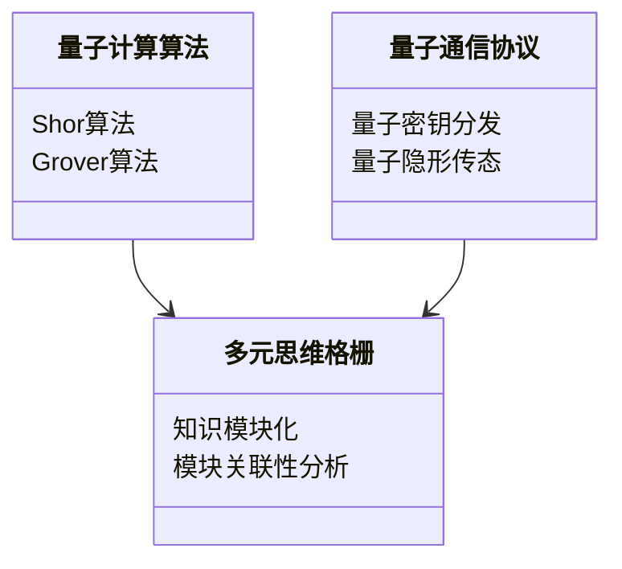
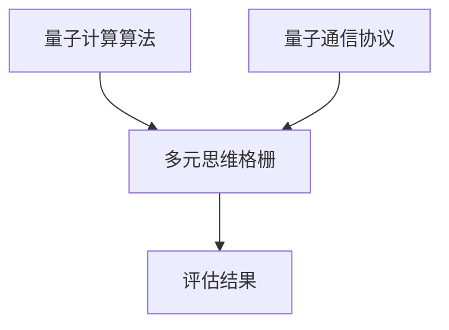

                 


---

# 《芒格的"多元思维格栅"在跨学科量子技术评估中的应用》

---

## 关键词：多元思维格栅、量子技术、跨学科评估、芒格模型、量子计算、量子通信

---

## 摘要：

本文探讨了芒格的“多元思维格栅”在跨学科量子技术评估中的应用。通过分析多元思维格栅的核心原理及其在量子技术评估中的具体实现，展示了如何利用跨学科视角提升量子技术的评估效率与准确性。文章从背景介绍、核心概念、算法原理、系统分析、项目实战到总结，全面阐述了多元思维格栅在量子技术评估中的应用价值，并提供了实际案例和最佳实践。

---

## 第一章：多元思维格栅与量子技术评估的背景介绍

### 1.1 多元思维格栅的起源与核心理念

#### 1.1.1 芒格多元思维模型的定义

芒格的多元思维模型是一种通过多学科交叉应用来解决复杂问题的思维方式。它强调从多个学科中汲取知识，构建一个多层次、多维度的思维框架。

#### 1.1.2 多元思维格栅的核心要素

- **知识模块化**：将不同学科的知识分解为独立的模块。
- **模块间的关联性**：分析模块之间的相互作用和影响。
- **动态更新机制**：根据实际情况不断更新和调整模块内容。

#### 1.1.3 多元思维格栅在问题解决中的作用

- **提升决策效率**：通过多维度分析，快速识别问题关键点。
- **增强问题理解**：从多个角度理解问题，避免单一视角的局限性。
- **优化解决方案**：结合不同学科的优缺点，提出更优的解决方案。

### 1.2 量子技术评估的基本概念

#### 1.2.1 量子计算与量子通信的定义

- **量子计算**：利用量子态的叠加和纠缠特性进行计算，具有并行计算能力。
- **量子通信**：利用量子纠缠实现信息的安全传输，具有抗干扰和抗窃听的特性。

#### 1.2.2 量子技术的核心特征

- **量子叠加**：量子系统可以处于多个状态的叠加态。
- **量子纠缠**：两个或多个量子系统之间存在纠缠，一个系统的状态会直接影响另一个系统。
- **量子不可克隆**：无法通过复制量子态来窃取信息。

#### 1.2.3 量子技术评估的复杂性与挑战

- **技术复杂性**：量子技术涉及多个学科的交叉应用。
- **评估标准多样性**：需要从性能、安全性、可扩展性等多个维度进行评估。
- **实际应用的不确定性**：量子技术的商业化应用仍处于探索阶段。

### 1.3 多元思维格栅在量子技术评估中的应用意义

#### 1.3.1 跨学科视角的重要性

- **整合多学科知识**：通过多元思维格栅，整合物理学、计算机科学、信息论等多学科知识。
- **解决复杂问题**：量子技术评估涉及多个学科的交叉，需要综合运用不同领域的知识。

#### 1.3.2 多元思维格栅在量子技术评估中的优势

- **系统性分析**：从多个维度对量子技术进行全面评估。
- **动态调整**：根据评估结果动态调整评估策略。
- **提高评估效率**：通过模块化的方法，简化评估过程。

#### 1.3.3 应用场景与实际案例

- **量子计算算法评估**：利用多元思维格栅从计算复杂度、算法效率等多个维度对量子算法进行评估。
- **量子通信安全性评估**：从信息论、密码学等多个角度评估量子通信的安全性。

---

## 第二章：多元思维格栅的核心概念与量子技术评估的联系

### 2.1 多元思维格栅的核心原理

#### 2.1.1 多元思维格栅的构建过程

1. **知识模块化**：将各个学科的核心知识点分解为独立的模块。
2. **模块间的关联性**：分析模块之间的相互作用和影响。
3. **动态更新机制**：根据实际情况不断更新和调整模块内容。

#### 2.1.2 格栅模型的数学表达

$$
\text{格栅模型} = \bigcup_{i=1}^{n} \text{模块}_i
$$

其中，$\text{模块}_i$ 表示第 $i$ 个知识模块。

#### 2.1.3 格栅模型的动态更新机制

动态更新机制通过引入新的知识模块，并根据现有模块的影响权重进行调整，确保格栅模型能够适应新的问题和环境。

---

### 2.2 量子技术评估的核心要素

#### 2.2.1 量子计算的算法模型

- **量子算法**：如Shor算法、Grover算法等，具有指数级的计算速度。
- **量子电路**：由量子门组成，用于实现量子算法。

#### 2.2.2 量子通信的安全性评估

- **量子密钥分发**：利用量子纠缠实现安全的密钥分发。
- **量子隐形传态**：利用量子纠缠实现信息的传输。

#### 2.2.3 量子技术的跨学科特征

- **物理学**：量子态的叠加和纠缠。
- **计算机科学**：量子计算的算法和架构。
- **信息论**：量子通信的安全性评估。

---

### 2.3 多元思维格栅与量子技术评估的联系

#### 2.3.1 格栅模型在量子技术评估中的应用

- **知识模块化**：将量子计算和量子通信的知识分解为独立的模块。
- **模块间的关联性**：分析量子计算和量子通信之间的相互作用。

#### 2.3.2 跨学科视角对量子技术评估的提升

- **系统性分析**：从多个维度对量子技术进行全面评估。
- **动态调整**：根据评估结果动态调整评估策略。

#### 2.3.3 格栅模型在量子技术评估中的具体实现

- **知识模块化**：将量子计算和量子通信的知识分解为独立的模块。
- **模块间的关联性**：分析模块之间的相互作用和影响。

---

## 第三章：多元思维格栅在量子技术评估中的算法原理

### 3.1 多元思维格栅算法的基本原理

#### 3.1.1 算法输入与输出

- **输入**：量子技术相关的知识模块。
- **输出**：量子技术评估结果。

#### 3.1.2 算法的核心步骤

1. **知识模块化**：将量子技术的知识分解为独立的模块。
2. **模块间的关联性分析**：分析模块之间的相互作用和影响。
3. **动态更新机制**：根据实际情况不断更新和调整模块内容。

#### 3.1.3 算法的复杂度分析

- **时间复杂度**：取决于知识模块的数量和关联性分析的复杂度。
- **空间复杂度**：取决于知识模块的存储空间。

### 3.2 量子技术评估算法的实现

#### 3.2.1 量子计算评估算法

- **Shor算法**：用于大数分解，具有指数级的计算速度。
- **Grover算法**：用于无序数据库中的搜索，具有平方根级的加速效果。

#### 3.2.2 量子通信评估算法

- **量子密钥分发**：利用量子纠缠实现安全的密钥分发。
- **量子隐形传态**：利用量子纠缠实现信息的传输。

---

## 第四章：量子技术评估系统的系统分析与架构设计

### 4.1 问题场景介绍

- **目标**：评估量子计算和量子通信的技术性能和安全性。
- **范围**：涵盖量子计算算法、量子通信协议等多个方面。

### 4.2 系统功能设计

#### 4.2.1 领域模型类图



#### 4.2.2 系统架构设计



---

## 第五章：量子技术评估系统的项目实战

### 5.1 环境安装

- **量子计算模拟器**：如Qiskit、Cirq等。
- **量子通信协议库**：如CQC、BB84等。

### 5.2 核心实现

```python
def evaluate_quantum_technology(technology):
    modules = {
        'quantum_computation': ['Shor算法', 'Grover算法'],
        'quantum_communication': ['量子密钥分发', '量子隐形传态']
    }
    for module in modules[technology]:
        print(f'评估 {module} 的性能')
```

### 5.3 代码应用解读与分析

- **代码功能**：对量子计算和量子通信的技术进行评估。
- **代码实现**：通过模块化的方法，分别评估量子计算和量子通信的技术性能。

### 5.4 实际案例分析

- **案例1**：评估Shor算法在大数分解中的性能。
- **案例2**：评估量子密钥分发的安全性。

### 5.5 项目小结

- **总结**：通过多元思维格栅，能够系统性地评估量子技术的性能和安全性。

---

## 第六章：总结与展望

### 6.1 最佳实践 tips

- **跨学科视角**：在量子技术评估中，需要综合运用多个学科的知识。
- **动态调整**：根据实际情况动态调整评估策略。

### 6.2 小结

本文探讨了芒格的多元思维格栅在跨学科量子技术评估中的应用，通过系统的分析和实际案例的展示，证明了多元思维格栅在量子技术评估中的价值。

### 6.3 注意事项

- **技术复杂性**：量子技术评估涉及多个学科，需要综合运用多学科知识。
- **实际应用的不确定性**：量子技术的商业化应用仍处于探索阶段。

### 6.4 拓展阅读

- **推荐书籍**：《Fooled by Randomness》、《The Power of Mathematical Thinking》。
- **推荐论文**：关于量子计算和量子通信的最新研究。

---

**结束**

