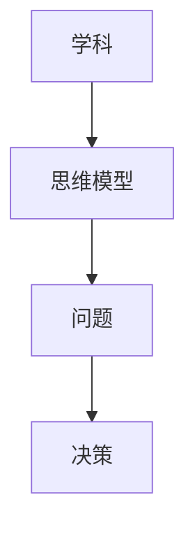
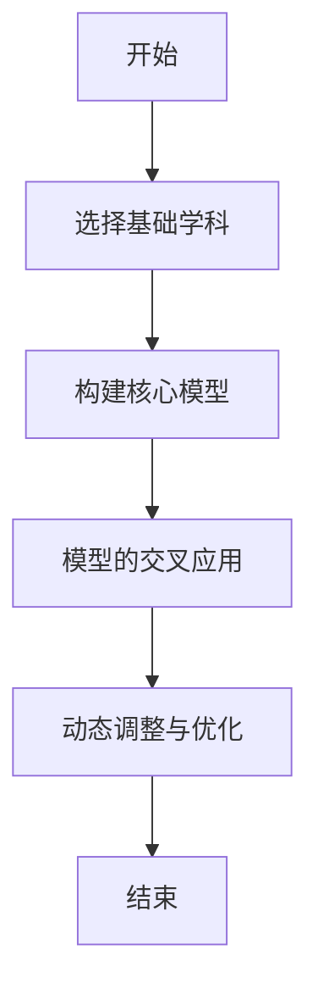
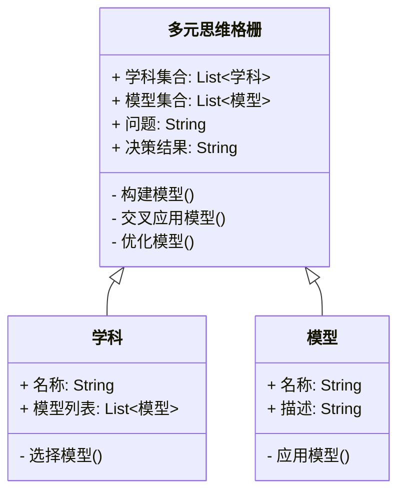

                 


# 芦格的"多元思维格栅"：提高决策质量的系统方法

## 关键词：芒格、多元思维格栅、决策质量、系统方法、思维模型、决策优化、认知升级

## 摘要：芒格的"多元思维格栅"是一种通过多学科思维模型提升决策质量的系统方法。本文将详细探讨芒格的背景、格栅的核心思想、构建方法以及在实际决策中的应用，帮助读者掌握这一强大的决策工具。

---

# 第一部分: 芮格的"多元思维格栅"背景介绍

## 第1章: 芮格的背景与思想体系

### 1.1 芮格的生平简介

芒格，全名查理·芒格（Charlie Munger），1924年出生于美国 Omaha，是著名投资者、作家和演讲家。他以合伙人的身份与沃伦·巴菲特共同创立了伯克希尔·哈撒韦公司，并在投资领域取得了巨大成功。芒格不仅是一位成功的投资者，更是一位深刻的思想家，他的多元思维格栅理论影响了无数人。

### 1.2 芮格的投资理念与决策哲学

芒格的投资理念以“价值投资”为核心，强调长期投资、安全边际和内在价值。他的决策哲学则强调多元思维模型的应用，认为通过多学科的交叉思考可以更好地理解问题的本质，从而做出更明智的决策。

### 1.3 多元思维格栅的起源与核心思想

多元思维格栅的起源可以追溯到芒格对知识体系的系统性思考。他认为，人类的认知是通过多个学科的交叉和整合来实现的，而格栅模型正是这种交叉整合的体现。其核心思想是通过构建一个多学科的知识框架，将不同领域的思维模型整合起来，从而提高决策的质量和效率。

## 第2章: 多元思维格栅的定义与特点

### 2.1 多元思维格栅的定义

多元思维格栅是一种通过多学科思维模型的交叉应用，构建一个系统化的知识框架，以提高决策质量的方法。它强调从不同学科的角度看待问题，从而避免单一思维的局限性。

### 2.2 多元思维格栅的核心特点

- **多维性**：格栅模型涵盖了多个学科的思维模型，如心理学、经济学、物理学等，通过多维视角分析问题。
- **系统性**：格栅模型强调系统性思考，将各个学科的模型整合起来，形成一个完整的知识体系。
- **动态性**：格栅模型不是静态的，而是动态调整和优化的，根据实际情况不断更新和改进。

### 2.3 多元思维格栅与传统决策方法的区别

传统决策方法往往依赖单一学科的思维模型，容易忽视问题的复杂性和多面性。而多元思维格栅则通过多学科模型的交叉应用，全面分析问题，从而做出更全面、更合理的决策。

---

# 第二部分: 多元思维格栅的核心概念与联系

## 第3章: 多元思维格栅的核心概念

### 3.1 多元思维格栅的原理与机制

多元思维格栅的原理在于通过多学科模型的交叉应用，发现不同模型之间的共性和差异，从而更好地理解问题的本质。其机制包括以下几个步骤：

1. **选择基础学科**：从多个学科中选择一些基础学科，如心理学、经济学、物理学等。
2. **构建核心模型**：从每个学科中选择几个核心思维模型，如心理学中的“心理账户”模型，经济学中的“边际成本”模型等。
3. **模型的交叉应用**：将不同学科的模型结合起来，分析问题的多面性。
4. **动态调整与优化**：根据实际反馈，不断调整和优化模型的组合。

### 3.2 格栅的核心概念属性对比

为了更好地理解多元思维格栅的核心概念，我们可以从以下几个方面进行对比：

| **属性**         | **传统决策方法**                 | **多元思维格栅**               |
|------------------|----------------------------------|----------------------------------|
| 分析视角         | 单一学科视角                   | 多学科交叉视角                 |
| 决策质量         | 可能存在片面性                   | 更全面、更准确                   |
| 知识体系         | 分散的知识点                   | 系统化的知识框架                 |
| 适应性           | 较低                           | 较高                           |

### 3.3 格栅的实体关系图与流程图

为了更好地理解多元思维格栅的构建过程，我们可以用ER图和流程图来展示其结构和流程。

#### 实体关系图（ER图）



#### 构建流程图



---

# 第三部分: 多元思维格栅的算法原理

## 第4章: 多元思维格栅的算法原理

### 4.1 多元思维格栅的数学模型

多元思维格栅的构建过程可以通过以下数学模型来描述：

$$
\text{格栅质量} = \sum_{i=1}^{n} \text{模型质量}_i \times \text{权重}_i
$$

其中，模型质量是每个思维模型的有效性，权重是模型在整体决策中的重要性。

### 4.2 算法步骤

1. **确定目标问题**：明确需要解决的问题。
2. **选择相关学科**：从多个学科中选择与问题相关的学科。
3. **构建核心模型**：从每个学科中选择几个核心模型。
4. **模型的交叉应用**：将不同学科的模型结合起来，分析问题的多面性。
5. **动态调整与优化**：根据实际反馈，不断调整和优化模型的组合。

### 4.3 代码实现

以下是一个简单的Python代码示例，用于实现多元思维格栅的核心算法：

```python
def build思维格栅(问题):
    学科 = ["心理学", "经济学", "物理学"]
    模型 = []
    for 学 in 学科:
        模型.append(选择核心模型(学))
    return 模型交叉应用(问题, 模型)

def 选择核心模型(学科):
    if 学科 == "心理学":
        return ["心理账户", "社会认同"]
    elif 学科 == "经济学":
        return ["边际成本", "机会成本"]
    elif 学科 == "物理学":
        return ["能量守恒", "热力学"]
    else:
        return []

def 模型交叉应用(问题, 模型):
    结果 = []
    for m in 模型:
        结果.append(应用模型(问题, m))
    return 结果

def 应用模型(问题, 模型):
    return f"{问题}通过{模型}分析后的结果"
```

---

# 第四部分: 多元思维格栅的系统分析与架构设计

## 第5章: 多元思维格栅的系统分析

### 5.1 问题场景介绍

假设我们需要构建一个多元思维格栅来优化企业的决策过程。企业面临的问题包括市场分析、成本控制、风险管理等，需要通过多学科的视角来全面分析。

### 5.2 系统功能设计

为了实现多元思维格栅的系统化应用，我们可以设计一个基于领域模型的系统架构。

#### 领域模型（Mermaid类图）



### 5.3 系统架构设计

为了实现多元思维格栅的系统化应用，我们可以设计一个基于微服务架构的系统。

#### 系统架构图（Mermaid架构图）

```mermaid
docker
graph LR
    A[用户] --> B[API Gateway]
    B --> C[决策服务]
    C --> D[学科模型服务]
    C --> E[模型应用服务]
    D --> F[数据库]
    E --> G[结果存储]
```

---

# 第五部分: 多元思维格栅的项目实战

## 第6章: 多元思维格栅的项目实战

### 6.1 环境配置

为了实现多元思维格栅的系统化应用，我们需要配置以下环境：

- **编程语言**：Python 3.8+
- **框架**：Django或Flask
- **数据库**：MySQL或PostgreSQL
- **开发工具**：PyCharm或VS Code

### 6.2 核心代码实现

以下是一个简单的Python代码示例，用于实现多元思维格栅的核心算法：

```python
from typing import List

class 多元思维格栅:
    def __init__(self, 问题: str):
        self.问题 = 问题
        self.学科 = ["心理学", "经济学", "物理学"]
        self.模型 = []

    def 构建模型(self):
        for 学 in self.学科:
            self.模型.extend(self.选择核心模型(学))
    
    def 选择核心模型(self, 学科: str) -> List[str]:
        if 学科 == "心理学":
            return ["心理账户", "社会认同"]
        elif 学科 == "经济学":
            return ["边际成本", "机会成本"]
        elif 学科 == "物理学":
            return ["能量守恒", "热力学"]
        else:
            return []

    def 交叉应用模型(self):
        结果 = []
        for m in self.模型:
            结果.append(self.应用模型(self.问题, m))
        return 结果

    def 应用模型(self, 问题: str, 模型: str) -> str:
        return f"{问题}通过{模型}分析后的结果"

# 示例用法
栅格 = 多元思维格栅("如何优化企业成本?")
栅格.构建模型()
print(栅格.交叉应用模型())
```

### 6.3 案例分析

假设我们有一个企业需要优化其成本结构。我们可以使用多元思维格栅来分析问题：

1. **选择基础学科**：经济学、心理学、物理学。
2. **构建核心模型**：经济学中的“边际成本”和“机会成本”，心理学中的“心理账户”，物理学中的“能量守恒”。
3. **模型的交叉应用**：通过不同学科模型的交叉应用，全面分析成本优化的可能性和可行性。
4. **动态调整与优化**：根据实际反馈，不断调整和优化模型的组合。

---

# 第六部分: 总结与最佳实践

## 第7章: 总结与最佳实践

### 7.1 本章小结

多元思维格栅是一种通过多学科思维模型提升决策质量的系统方法。它强调系统性思考和动态调整，能够帮助我们更好地理解和解决复杂问题。

### 7.2 注意事项

- **模型的选择**：选择合适的学科和模型是关键。
- **动态调整**：根据实际情况不断优化模型组合。
- **实践应用**：通过实际案例不断验证和改进。

### 7.3 拓展阅读

- 《芒格的决策哲学》
- 《系统思维与决策优化》
- 《多学科交叉应用指南》

---

# 附录: 代码与工具

## 附录A: 代码示例

```python
# 附录A代码示例
class 多元思维格栅:
    def __init__(self, 问题: str):
        self.问题 = 问题
        self.学科 = ["心理学", "经济学", "物理学"]
        self.模型 = []

    def 构建模型(self):
        for 学 in self.学科:
            self.模型.extend(self.选择核心模型(学))
    
    def 选择核心模型(self, 学科: str) -> List[str]:
        if 学科 == "心理学":
            return ["心理账户", "社会认同"]
        elif 学科 == "经济学":
            return ["边际成本", "机会成本"]
        elif 学科 == "物理学":
            return ["能量守恒", "热力学"]
        else:
            return []

    def 交叉应用模型(self):
        结果 = []
        for m in self.模型:
            结果.append(self.应用模型(self.问题, m))
        return 结果

    def 应用模型(self, 问题: str, 模型: str) -> str:
        return f"{问题}通过{模型}分析后的结果"
```

## 附录B: 工具推荐

- **代码编辑工具**：PyCharm、VS Code
- **数据分析工具**：Pandas、NumPy
- **流程图工具**：Mermaid、Lucidchart
- **项目管理工具**：Jira、Trello

---

通过以上步骤，我们可以全面理解和掌握芒格的"多元思维格栅"，并在实际决策中应用这一系统方法，提升决策质量。

