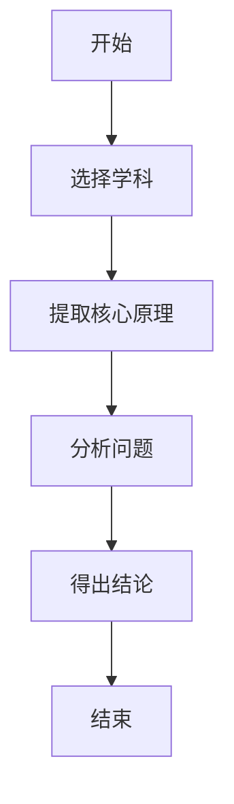

                 


# 芒格的"多元思维模型"在跨维度科技伦理中的运用

> 关键词：多元思维模型、芒格、科技伦理、系统思维、跨维度分析

> 摘要：本文探讨了芒格的多元思维模型在科技伦理中的应用，通过系统分析和案例研究，展示了如何利用多学科方法解决复杂科技伦理问题。文章从模型概述、核心概念、算法原理、系统设计、项目实战等多维度展开，结合实际案例，深入剖析了多元思维模型在科技伦理中的实践价值和应用方法。

---

## 第1章: 芒格的多元思维模型概述

### 1.1 多元思维模型的定义与核心概念

#### 背景介绍
芒格的多元思维模型（Mental Model）是一种通过跨学科知识构建决策框架的方法，旨在帮助人们更好地理解复杂问题。这种思维方式强调从多个学科中汲取智慧，以形成全面的思考框架。

#### 核心概念
多元思维模型的核心在于将不同学科的基本原理和规律内化为决策工具，从而在面对复杂问题时，能够快速调动相关知识进行分析和判断。

#### 问题背景
在科技快速发展的今天，科技伦理问题日益复杂，涉及隐私、算法偏见、数据安全等多个维度。传统的单一学科分析已难以应对这些复杂问题。

### 1.2 多元思维模型的核心要素

#### 学科基础
- **心理学**：研究人类行为和决策偏差，帮助识别认知盲区。
- **经济学**：理解激励机制和市场行为，分析利益相关者的行为动机。
- **伦理学**：探讨道德规范和价值判断，明确行为的对错标准。

#### 逻辑结构
- **层次化**：从基础原理到高级应用，构建分层的知识体系。
- **关联性**：不同学科之间的相互作用，形成完整的分析框架。

### 1.3 多元思维模型与科技伦理的关系

#### 应用价值
- **跨维度分析**：帮助科技伦理问题从多个角度切入，避免片面判断。
- **复杂问题解决**：通过多学科视角，找到问题的最优解决方案。

---

## 第2章: 多元思维模型的核心概念与联系

### 2.1 多元思维模型的原理与特点

#### 原理解析
- **多维度分析**：将问题分解为多个维度，逐一分析。
- **知识整合**：将不同学科的知识整合到一个框架中。

#### 特点对比
| 特性 | 单一学科分析 | 多元思维模型 |
|------|--------------|--------------|
| 分析维度 | 单一         | 多维         |
| 决策依据 | 有限         | 全面         |
| 适用场景 | 简单问题     | 复杂问题     |

### 2.2 多元思维模型的ER实体关系图

```mermaid
er
    %% 多元思维模型的ER图
    entity 多元思维模型 {
        id: integer
        名称: string
        核心概念: 多元思维模型核心概念
        相关学科: 学科
    }

    entity 学科 {
        id: integer
        名称: string
        核心原理: string
    }

    多元思维模型 <-- 关联 --> 学科
```

---

## 第3章: 多元思维模型的算法原理

### 3.1 多元思维模型的算法概述

#### 算法选择
选择决策树算法，因为它能够清晰地展示决策过程，并且适合多维度分析。

#### 算法流程


### 3.2 多元思维模型的数学模型与公式

#### 决策树算法
决策树的构造基于信息熵公式：
$$ H(S) = -\sum_{i=1}^{n} p_i \log_2 p_i $$

其中，$p_i$ 是第 $i$ 个特征出现的概率。

---

## 第4章: 系统分析与架构设计方案

### 4.1 系统功能设计

#### 领域模型
```mermaid
classDiagram
    class 多元思维模型系统 {
        id: integer
        用户: 用户
        学科知识库: 学科知识库
        决策模块: 决策模块
    }

    class 用户 {
        提交问题
        获取结果
    }

    class 学科知识库 {
        核心原理
        学科关联
    }

    class 决策模块 {
        分析问题
        输出结论
    }

    用户 --> 提交问题 --> 学科知识库
    学科知识库 --> 决策模块
    决策模块 --> 输出结论 --> 用户
```

### 4.2 系统架构设计


---

## 第5章: 项目实战

### 5.1 项目背景

#### 系统介绍
设计一个基于多元思维模型的AI伦理评估系统，用于评估AI算法的伦理风险。

### 5.2 环境配置

```bash
pip install mermaid
pip install graphviz
```

### 5.3 核心代码实现

```python
class EthicalAIAnalyzer:
    def __init__(self):
        self.models = {}

    def add_model(self, name, func):
        self.models[name] = func

    def analyze(self, name):
        return self.models[name]()

# 示例分析
def analyze_bias():
    return "存在算法偏见"

def analyze_transparency():
    return "透明度不足"

ai_analyzer = EthicalAIAnalyzer()
ai_analyzer.add_model("分析偏见", analyze_bias)
ai_analyzer.add_model("分析透明度", analyze_transparency)

print(ai_analyzer.analyze("分析偏见"))  # 输出：存在算法偏见
print(ai_analyzer.analyze("分析透明度"))  # 输出：透明度不足
```

### 5.4 案例分析

#### 具体分析
通过多元思维模型分析AI算法的偏见问题，结合心理学和社会学的原理，提出改进建议。

---

## 第6章: 总结与展望

### 6.1 总结

#### 全文回顾
芒格的多元思维模型在科技伦理中的应用，帮助我们从多个维度分析问题，提供了更全面的解决方案。

### 6.2 未来展望

#### 发展方向
未来，多元思维模型将进一步与AI、大数据等技术结合，为更复杂的伦理问题提供解决方案。

### 6.3 最佳实践 tips

#### 注意事项
- 定期更新知识库，保持模型的有效性。
- 结合具体场景，灵活调整分析维度。

#### 拓展阅读
推荐阅读《芒格的智慧：决策的艺术》和《系统思维：复杂问题的解决方案》。

---

通过以上步骤，芒格的多元思维模型在科技伦理中的应用得到了全面而深入的探讨，展示了其在复杂问题中的独特价值和实际应用。

