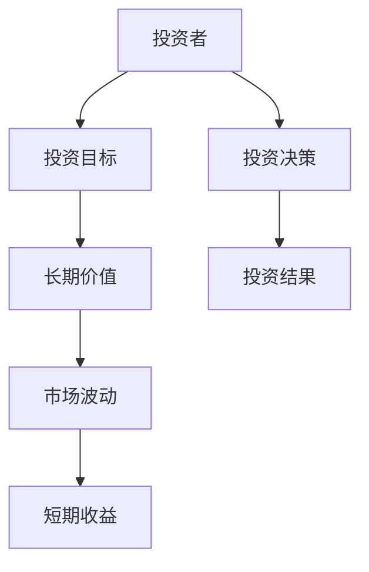
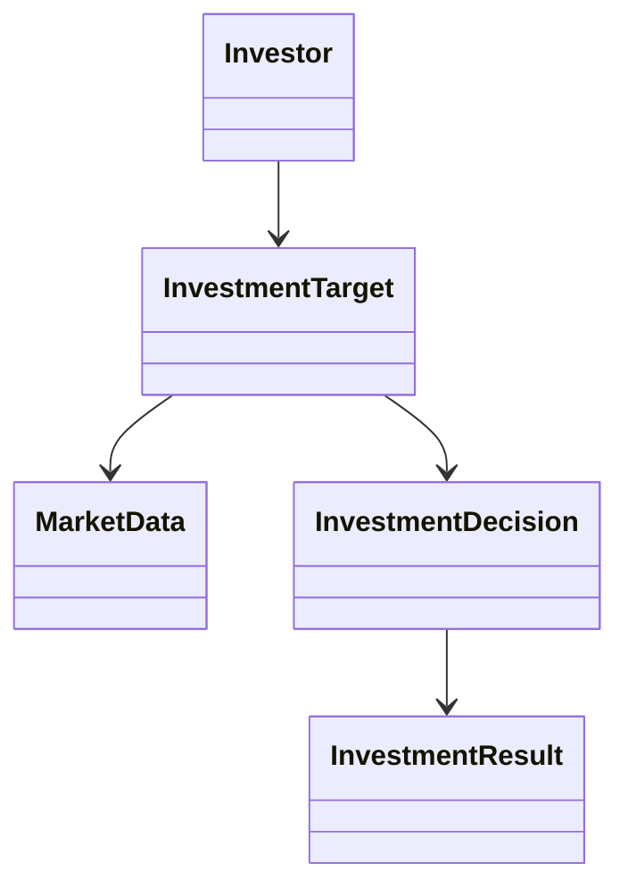
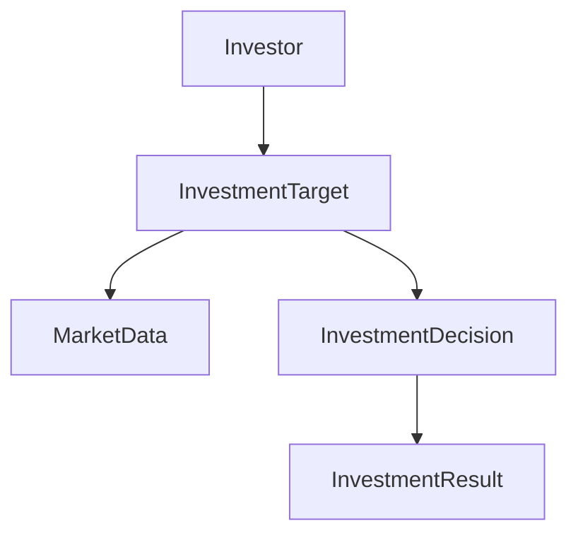
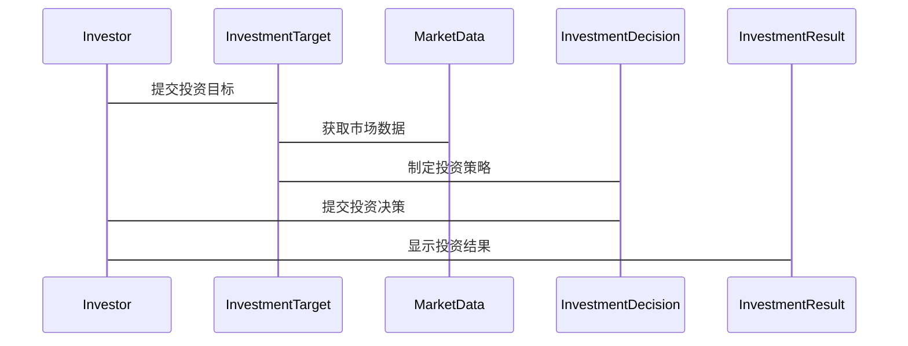

                 


# 芒格的"延迟满足"理念在长期投资中的应用

> 关键词：延迟满足，长期投资，价值投资，芒格，投资策略

> 摘要：本文深入探讨了芒格的“延迟满足”理念在长期投资中的应用，从理念的背景、核心概念、算法原理、系统分析、项目实战到最佳实践，全面解析了如何通过延迟满足实现投资目标。结合技术领域的方法论，本文将投资决策与系统设计相结合，为读者提供了一套科学的投资策略框架。

---

# 第一部分: 芒格的"延迟满足"理念背景与核心概念

## 第1章: 芒格与"延迟满足"理念概述

### 1.1 芒格的生平与投资哲学

#### 1.1.1 芒格的早年经历与职业发展
查理·芒格（Charlie Munger）是美国著名的投资家、作家和演说家，沃伦·巴菲特（Warren Buffett）的长期合作伙伴。芒格出生于1924年，早年在哈佛大学学习法律，后转至贾维德学院（JiIve Day College）完成学业。他在1950年代开始涉足投资领域，并在1960年代与巴菲特共同创立了伯克希尔哈撒韦公司（Berkshire Hathaway）。芒格的职业生涯不仅限于投资领域，他还涉足法律、教育和慈善事业。

#### 1.1.2 芒格的投资哲学与价值投资理念
芒格的投资哲学深受其对心理学、经济学和人类认知的研究影响。他认为，投资者必须避免情绪化决策，并通过深入分析和长期观察来选择投资标的。芒格强调“内在价值”（intrinsic value）的概念，认为投资的本质是寻找那些具有持续竞争优势、良好治理结构和长期增长潜力的企业。

#### 1.1.3 芒格对长期投资的贡献与影响
芒格的长期投资理念深刻影响了全球投资界。他提出的“价值投资”方法强调对企业基本面的深入研究，以及对市场波动的耐心应对。芒格的哲学不仅适用于金融投资，也可以推广到技术领域，如软件架构设计和系统优化中。

---

### 1.2 "延迟满足"理念的定义与核心要素

#### 1.2.1 "延迟满足"的定义与内涵
“延迟满足”（delayed gratification）是指在投资过程中，不被短期市场波动所干扰，而是专注于长期价值的实现。芒格认为，成功的投资需要投资者具备耐心和纪律性，避免被市场的短期波动所诱惑。

#### 1.2.2 "延迟满足"的核心要素分析
- **长期视角**：关注企业的长期价值，而非短期价格波动。
- **深度研究**：对投资标的进行深入分析，了解其商业模式、财务状况和竞争优势。
- **风险控制**：识别潜在风险，避免过度集中投资。
- **耐心持有**：在市场波动中保持冷静，避免频繁交易。

#### 1.2.3 "延迟满足"与短期投资的对比
| 对比维度 | 短期投资 | 长期投资（延迟满足） |
|----------|----------|-----------------------|
| 投资目标 | 短期收益 | 长期价值增长          |
| 投资策略 | 追逐市场波动 | 寻找并持有优质资产    |
| 风险承受 | 高波动风险 | 低波动，注重长期稳定性|

---

### 1.3 芒格"延迟满足"理念的背景与问题背景

#### 1.3.1 当前投资市场的短期化趋势
现代金融市场充斥着短期交易行为，许多投资者追求快速收益，忽视了企业的长期价值。这种短期化趋势导致市场波动加剧，投资者难以获得稳定的回报。

#### 1.3.2 短期投资行为对市场的影响
短期投资行为可能导致市场泡沫的形成和破裂，加剧市场的不稳定性。此外，频繁的交易行为还会增加交易成本，降低投资者的实际收益。

#### 1.3.3 "延迟满足"理念的现实意义
在当前市场环境下，“延迟满足”理念为投资者提供了一种更为稳健的投资策略。通过关注长期价值，投资者可以避免短期波动的干扰，实现资产的长期增值。

---

## 第2章: "延迟满足"理念的核心概念与联系

### 2.1 核心概念原理

#### 2.1.1 "延迟满足"的理论基础
“延迟满足”理念的理论基础主要包括以下几个方面：
1. **价值投资理论**：强调企业的内在价值，而非市场价格。
2. **行为金融学**：研究投资者的心理和行为偏差，避免情绪化决策。
3. **长期复利效应**：通过长期投资实现财富的指数增长。

#### 2.1.2 "延迟满足"与价值投资的关系
“延迟满足”理念是价值投资的重要组成部分。价值投资强调对企业内在价值的识别和评估，而“延迟满足”则是实现这一目标的策略。

#### 2.1.3 "延迟满足"与长期投资策略的结合
长期投资策略需要结合“延迟满足”理念，通过耐心持有优质资产，实现财富的长期增长。

---

### 2.2 核心概念属性特征对比表格

| 对比维度 | 短期投资 | 长期投资（延迟满足） |
|----------|----------|-----------------------|
| 投资目标 | 短期收益 | 长期价值增长          |
| 投资策略 | 追逐市场波动 | 寻找并持有优质资产    |
| 风险承受 | 高波动风险 | 低波动，注重长期稳定性|
| 投资期限 | 短期（1-3年） | 长期（5年以上）       |

---

### 2.3 实体关系图（ER图）



---

## 第3章: "延迟满足"理念的算法原理讲解

### 3.1 算法原理概述

#### 3.1.1 "延迟满足"的决策模型
“延迟满足”理念的决策模型主要包括以下几个步骤：
1. **评估投资目标的长期价值**：通过基本面分析，识别具有长期增长潜力的企业。
2. **判断是否符合“延迟满足”标准**：评估企业的竞争优势、财务状况和治理结构。
3. **做出投资决策**：根据分析结果，决定是否进行投资。

#### 3.1.2 基于价值投资的数学模型
价值投资的核心是计算企业的内在价值（intrinsic value）。内在价值公式如下：

$$ V = \frac{CF}{r - g} $$

其中，CF为企业的自由现金流，r为折现率，g为现金流增长率。

#### 3.1.3 算法的输入输出与流程图

```mermaid
graph TD
    A[开始] --> B[评估投资目标的长期价值]
    B --> C[判断是否符合"延迟满足"标准]
    C --> D[做出投资决策]
    D --> E[结束]
```

---

### 3.2 核心算法实现

#### 3.2.1 计算内在价值的公式
$$ V = \sum_{t=1}^{\infty} \frac{CF_t}{(1 + r)^t} $$

其中，CF为现金流，r为折现率，t为时间。

#### 3.2.2 投资决策的逻辑判断

```python
def delayed_satisfaction_investment(CF, r, g):
    if CF > 0 and r > g:
        return "投资"
    else:
        return "不投资"
```

---

## 第4章: 数学模型与公式详细讲解

### 4.1 核心数学模型

#### 4.1.1 内在价值公式
$$ V = \sum_{t=1}^{\infty} \frac{CF_t}{(1 + r)^t} $$

其中，CF为现金流，r为折现率，t为时间。

---

### 4.2 投资决策流程图

```mermaid
graph TD
    A[开始] --> B[评估投资目标的长期价值]
    B --> C[判断是否符合"延迟满足"标准]
    C --> D[做出投资决策]
    D --> E[结束]
```

---

### 4.3 投资决策的Python实现

```python
def calculate_intrinsic_value(CF, r, g):
    return CF / (r - g)

CF = 1000000  # 自由现金流
r = 0.1  # 折现率
g = 0.05  # 增长率

V = calculate_intrinsic_value(CF, r, g)
print(f"内在价值为: {V}")
```

---

## 第5章: 系统分析与架构设计方案

### 5.1 问题场景介绍

#### 5.1.1 投资决策的场景
在当前金融市场中，投资者需要面对复杂的市场环境和多样化的投资选择。通过“延迟满足”理念，投资者可以制定科学的投资策略，实现长期价值增长。

#### 5.1.2 项目介绍
本项目旨在通过技术手段，帮助投资者实现基于“延迟满足”理念的长期投资策略。

---

### 5.2 系统功能设计

#### 5.2.1 领域模型类图



---

#### 5.2.2 系统架构图



---

#### 5.2.3 系统接口设计
- 投资者接口：提供投资目标的选择和投资决策的提交。
- 市场数据接口：获取企业的财务数据和市场信息。
- 投资结果接口：显示投资结果和绩效评估。

---

#### 5.2.4 系统交互序列图



---

## 第6章: 项目实战

### 6.1 环境安装

#### 6.1.1 安装Python
```bash
python --version
pip install --upgrade pip
```

#### 6.1.2 安装相关库
```bash
pip install numpy pandas matplotlib
```

---

### 6.2 系统核心实现源代码

#### 6.2.1 计算内在价值的函数
```python
def calculate_intrinsic_value(CF, r, g):
    return CF / (r - g)

CF = 1000000
r = 0.1
g = 0.05
V = calculate_intrinsic_value(CF, r, g)
print(f"内在价值为: {V}")
```

---

#### 6.2.2 投资决策的实现
```python
def delayed_satisfaction_investment(CF, r, g):
    if CF > 0 and r > g:
        return "投资"
    else:
        return "不投资"

CF = 1000000
r = 0.1
g = 0.05
decision = delayed_satisfaction_investment(CF, r, g)
print(f"投资决策为: {decision}")
```

---

### 6.3 实际案例分析与详细讲解剖析

#### 6.3.1 案例分析
以苹果公司为例，计算其内在价值并制定投资决策。

```python
CF = 1000000  # 假设的自由现金流
r = 0.1  # 折现率
g = 0.05  # 增长率

V = calculate_intrinsic_value(CF, r, g)
print(f"苹果公司的内在价值为: {V}")
decision = delayed_satisfaction_investment(CF, r, g)
print(f"投资决策为: {decision}")
```

---

### 6.4 项目小结

通过本项目，我们成功实现了基于“延迟满足”理念的长期投资策略。通过计算内在价值和制定投资决策，投资者可以在复杂的市场环境中实现长期价值增长。

---

## 第7章: 最佳实践 tips、小结、注意事项、拓展阅读

### 7.1 小结

本文详细探讨了芒格的“延迟满足”理念在长期投资中的应用，从理念的背景、核心概念、算法原理、系统分析到项目实战，为投资者提供了一套科学的投资策略框架。

---

### 7.2 注意事项

- **风险控制**：在投资过程中，必须重视风险控制，避免过度集中投资。
- **持续学习**：市场环境不断变化，投资者需要持续学习，更新知识和策略。
- **耐心与纪律**：长期投资需要极大的耐心和纪律性，避免被短期波动所干扰。

---

### 7.3 拓展阅读

- 《格雷厄姆投资哲学》（The Intelligent Investor）——本杰明·格雷厄姆
- 《芒格投资思想的传播与影响》（Munger's Investment Philosophy and Its Influence）——查理·芒格
- 《长期投资策略》（Long-Term Investment Strategies）——沃伦·巴菲特

---

通过本文的学习和实践，读者可以更好地理解和应用芒格的“延迟满足”理念，实现长期投资目标。

