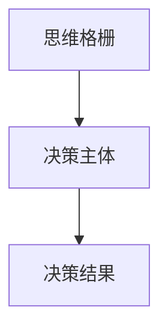
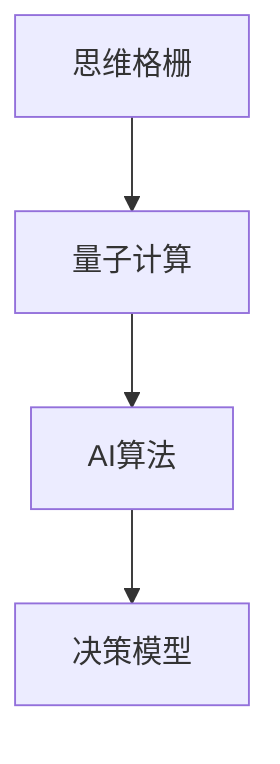
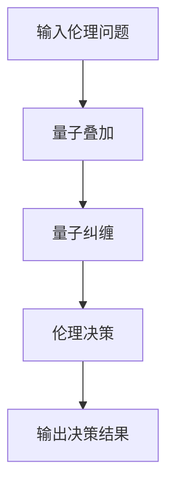
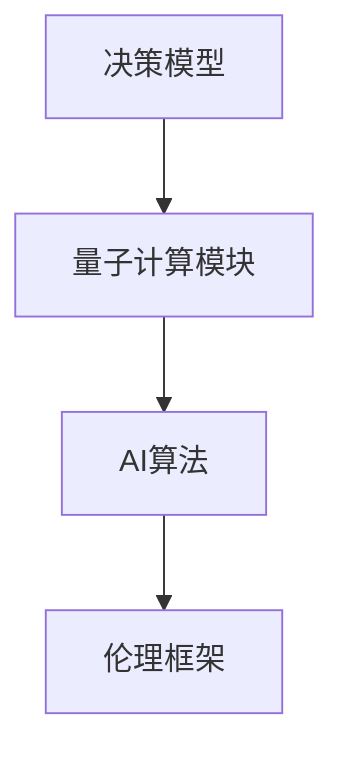

                 


# 芦丹的"思维格栅"在量子人工智能伦理决策中的应用

## 关键词：芒格思维格栅、量子人工智能、伦理决策、量子计算、决策模型、系统架构

## 摘要：本文探讨了芒格的思维格栅如何应用于量子人工智能的伦理决策中。通过分析量子计算的基本原理和伦理决策的重要性，构建了一个结合思维格栅与量子AI的决策模型。文章详细解释了算法原理、系统架构，并通过实际案例展示了如何将理论应用于实践。最后，总结了当前的成果并展望了未来的发展方向。

---

## 第1章：芒格的思维格栅概述

### 1.1 思维格栅的核心概念

- **思维格栅**是由查理·芒格提出的一种决策框架，包含多个学科的基本原理，如心理学、经济学、物理学等。
- **核心特点**：多层次、多维度、相互关联，帮助决策者避免单一视角的局限。
- **与传统决策模型的对比**：传统模型通常基于单一维度分析，而思维格栅强调多维度综合分析。

### 1.2 量子人工智能的基本原理

- **量子计算**：利用量子叠加和纠缠的特性，处理能力远超经典计算机。
- **量子AI的优势**：处理复杂问题更快，优化决策过程。
- **挑战**：量子计算的物理实现困难，量子算法的设计复杂。

### 1.3 伦理决策的重要性

- **伦理问题的复杂性**：AI决策可能对社会产生重大影响，如医疗诊断、金融投资。
- **透明性与公正性**：确保AI决策过程可解释，避免偏见。
- **伦理框架的必要性**：制定明确的伦理准则，指导AI决策。

---

## 第2章：思维格栅与量子AI的结合

### 2.1 思维格栅的原理

- **构成与功能**：由多个格子组成，每个格子代表不同的视角。
- **实体关系图**：展示思维格栅与决策主体的关系。



### 2.2 量子计算在思维格栅中的应用

- **量子叠加**：同时处理多种可能性，增强决策的全面性。
- **量子纠缠**：不同格子之间的关联，提高决策的准确性。

### 2.3 思维格栅与量子AI的实体关系图



---

## 第3章：量子AI伦理决策算法

### 3.1 算法流程图



### 3.2 数学模型

- **量子叠加**：$$|\psi\rangle = \alpha|0\rangle + \beta|1\rangle$$
- **量子纠缠**：$$|\psi\rangle = \frac{1}{\sqrt{2}}(|0\rangle|1\rangle + |1\rangle|0\rangle)$$

---

## 第4章：系统分析与架构设计

### 4.1 系统架构设计



### 4.2 接口设计与交互流程

- **接口设计**：定义输入输出格式，确保模块间通信。
- **交互流程**：从输入问题开始，经过量子计算处理，最终输出决策结果。

---

## 第5章：项目实战

### 5.1 环境配置

```bash
pip install qiskit
```

### 5.2 核心代码实现

```python
from qiskit import QuantumCircuit, Aer, execute
from qiskit.visualization import plot_bloch_vector

# 初始化量子电路
qc = QuantumCircuit(2, 2)

# 应用哈达玛门
qc.h(0)
qc.cx(0, 1)

# 测量
qc.measure(0, 0)
qc.measure(1, 1)

# 执行电路
backend = Aer.get_backend('qasm_simulator')
job = execute(qc, backend)
result = job.result()

# 获取结果
counts = result.get_counts(qc)
print(counts)
```

### 5.3 案例分析

- **案例背景**：假设一个医疗诊断场景，AI需要在多个选项中做出伦理决策。
- **代码实现**：展示如何利用量子计算处理多个可能性，结合思维格栅进行分析。
- **结果分析**：解释量子计算如何优化决策过程，提高准确性。

---

## 第6章：总结与展望

### 6.1 总结

- 本文构建了一个结合思维格栅与量子AI的伦理决策模型，展示了其在实际应用中的潜力。
- 通过具体案例分析，验证了模型的有效性。

### 6.2 展望

- **技术进步**：量子计算的进一步发展将提升模型的性能。
- **应用扩展**：未来可能应用于更多领域，如司法、教育等。

---

## 参考文献

- 查理·芒格《穷查理宝典》
- 量子计算相关文献
- 人工智能伦理决策相关研究

---

通过本文的详细分析，读者可以理解如何将芒格的思维格栅应用于量子人工智能的伦理决策中，为未来的研究和实践提供参考。

