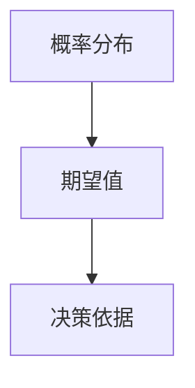
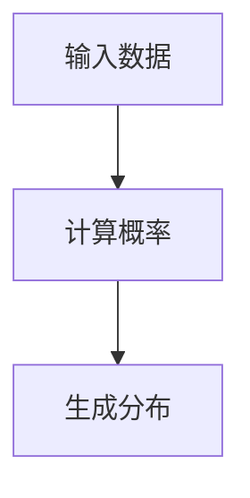
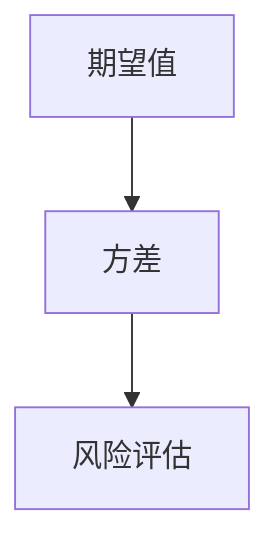
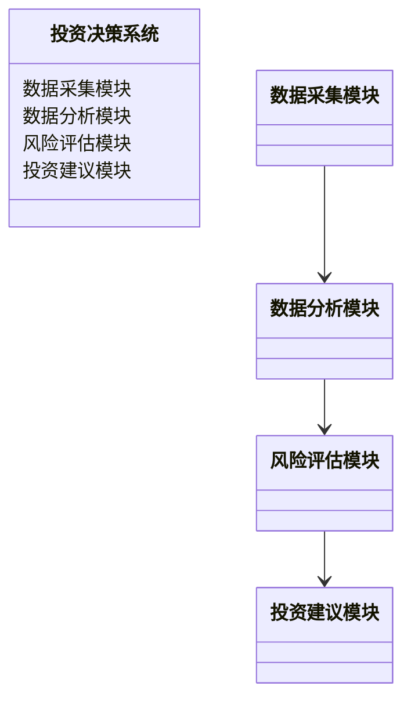

                 


# 芒格的"数学期望"思维：提高投资决策的科学性

> **关键词**：芒格、数学期望、投资决策、概率论、统计学、投资策略

> **摘要**：本文深入探讨了芒格的数学期望思维在投资决策中的应用，通过概率论和统计学的视角，分析了如何利用数学期望来提高投资决策的科学性。文章从基础概念到实际应用，详细阐述了数学期望的定义、计算方法、算法原理、数学模型、系统架构以及项目实战，结合实际案例和代码示例，帮助读者更好地理解和应用芒格的数学期望思维。

---

## 第一部分: 芒格的数学期望思维基础

### 第1章: 背景介绍

#### 1.1 概率论与统计学基础

##### 1.1.1 概率论的基本概念
概率论是研究随机现象规律的数学分支，其核心概念包括概率、随机变量、概率分布等。概率是衡量某件事情发生的可能性大小，用0到1之间的数值表示。随机变量是随机现象的数值表现，可以是离散的（如抛硬币的结果）或连续的（如股票价格）。

##### 1.1.2 统计学的基本概念
统计学是研究数据的收集、分析、解释和推断的学科。在投资决策中，统计学常用于分析历史数据，发现规律，并预测未来趋势。常见的统计指标包括均值、方差、标准差等。

##### 1.1.3 投资决策中的不确定性
投资决策本质上是一种不确定性决策，因为市场波动、经济环境等外部因素都会影响投资结果。数学期望为我们提供了一种量化不确定性的工具，帮助我们做出更科学的决策。

#### 1.2 芒格的数学期望思维背景

##### 1.2.1 芒格的思维方式概述
芒格是著名投资家巴菲特的合伙人，他的思维方式以理性、逻辑和系统性著称。他认为，投资决策应该基于事实和概率，而不是情绪和直觉。

##### 1.2.2 数学期望在决策中的重要性
数学期望是概率论中的核心概念，用于衡量随机变量的长期平均值。在投资决策中，数学期望可以帮助我们评估不同投资方案的预期收益和风险，从而做出最优选择。

##### 1.2.3 投资决策中的数学期望应用
在投资中，数学期望可以用于评估股票、基金等资产的预期收益，也可以用于风险评估和资产配置。通过计算不同投资组合的数学期望值，投资者可以更好地理解投资的潜在收益和风险。

---

### 第2章: 核心概念与联系

#### 2.1 数学期望的定义与计算

##### 2.1.1 数学期望的定义
数学期望，又称期望值，是概率论中的一个核心概念，表示随机变量在一次试验中可能取值的加权平均值，权重是相应的概率。公式如下：

$$
E[X] = \sum_{i=1}^{n} x_i P(x_i)
$$

其中，$x_i$ 是随机变量的可能取值，$P(x_i)$ 是对应的概率。

##### 2.1.2 数学期望的计算公式
对于离散型随机变量，数学期望的计算公式为：

$$
E[X] = \sum_{i=1}^{n} x_i P(x_i)
$$

对于连续型随机变量，则需要使用积分公式：

$$
E[X] = \int_{-\infty}^{\infty} x f(x) dx
$$

其中，$f(x)$ 是概率密度函数。

##### 2.1.3 期望值与实际值的关系
期望值并不一定等于实际值，但它反映了随机变量的长期平均表现。在投资中，我们通常关注的是资产的预期收益，而不是实际收益。

#### 2.2 概率分布与期望值

##### 2.2.1 概率分布的类型
概率分布可以分为离散型和连续型两种。常见的离散型概率分布包括二项分布、泊松分布等；常见的连续型概率分布包括正态分布、均匀分布等。

##### 2.2.2 不同分布的期望值比较
不同概率分布的期望值可以通过公式计算。例如：

- 正态分布的期望值等于其均值。
- 均匀分布在区间$[a,b]$上的期望值为$\frac{a+b}{2}$。

##### 2.2.3 用Mermaid展示概率分布与期望值的关系


---

### 第3章: 算法原理讲解

#### 3.1 概率分布算法

##### 3.1.1 离散概率分布
离散概率分布用于描述随机变量的可能取值及其对应的概率。例如，抛一枚硬币，正面向上的概率为0.5，反面向上的概率也为0.5。

##### 3.1.2 连续概率分布
连续概率分布用于描述连续型随机变量的概率分布，例如股票价格的变化。

##### 3.1.3 用Mermaid展示概率分布算法流程


#### 3.2 期望值计算算法

##### 3.2.1 算法步骤
1. 确定随机变量的可能取值及其对应的概率。
2. 计算每个取值乘以其对应概率的乘积。
3. 将所有乘积相加，得到期望值。

##### 3.2.2 期望值计算的Python代码示例
```python
def expected_value(values, probabilities):
    return sum(value * probability for value, probability in zip(values, probabilities))
```

---

### 第4章: 数学模型与公式

#### 4.1 期望值的数学模型

##### 4.1.1 期望值的公式
$$
E[X] = \sum_{i=1}^{n} x_i P(x_i)
$$

##### 4.1.2 期望值与方差的关系
方差是衡量随机变量离散程度的指标，其计算公式为：

$$
Var(X) = E[(X - E[X])^2]
$$

##### 4.1.3 用Mermaid展示期望值与方差的关系


---

## 第五章: 系统分析与架构设计方案

### 5.1 问题场景介绍

#### 5.1.1 投资决策系统的需求
投资决策系统需要能够根据市场数据和历史信息，计算出不同投资组合的预期收益和风险。

#### 5.1.2 系统功能设计
系统功能包括数据采集、数据分析、风险评估和投资建议生成。

#### 5.1.3 用Mermaid展示领域模型


---

## 第六章: 项目实战

### 6.1 环境安装

#### 6.1.1 Python环境安装
安装Python和必要的库，如NumPy、Pandas、Matplotlib。

### 6.2 核心代码实现

#### 6.2.1 数据采集模块
```python
import pandas as pd
data = pd.read_csv('market_data.csv')
```

#### 6.2.2 数据分析模块
```python
import numpy as np
def calculate_expected_return(data):
    return np.mean(data['return'])
```

#### 6.2.3 风险评估模块
```python
import numpy as np
def calculate_variance(data):
    return np.var(data['return'])
```

### 6.3 案例分析

#### 6.3.1 股票投资决策系统
假设我们有一个包含多只股票的数据集，我们需要计算每只股票的预期收益和风险，然后选择最优的投资组合。

---

## 第七章: 最佳实践

### 7.1 小结

#### 7.1.1 芒格的数学期望思维总结
芒格的数学期望思维为我们提供了一种科学的投资决策方法，通过概率论和统计学的工具，我们可以更好地理解投资的不确定性，并做出更合理的决策。

#### 7.1.2 投资决策中的注意事项
在实际投资中，需要注意市场波动、数据质量以及模型的适用性等问题。

### 7.2 注意事项

#### 7.2.1 数据质量的重要性
高质量的数据是准确计算数学期望的前提。

#### 7.2.2 模型的局限性
数学期望模型假设市场是理性的，但在实际中，市场可能存在非理性因素。

### 7.3 拓展阅读

#### 7.3.1 推荐书籍
- 《概率论与数理统计》
- 《投资学》

#### 7.3.2 推荐博客和资源
- 维基百科：数学期望
- Medium：投资决策与概率论

---

## 结语

芒格的数学期望思维为我们提供了一种科学的投资决策方法。通过概率论和统计学的工具，我们可以更好地理解投资的不确定性，并做出更合理的决策。希望本文能够帮助读者更好地理解和应用芒格的数学期望思维，提高投资决策的科学性。

