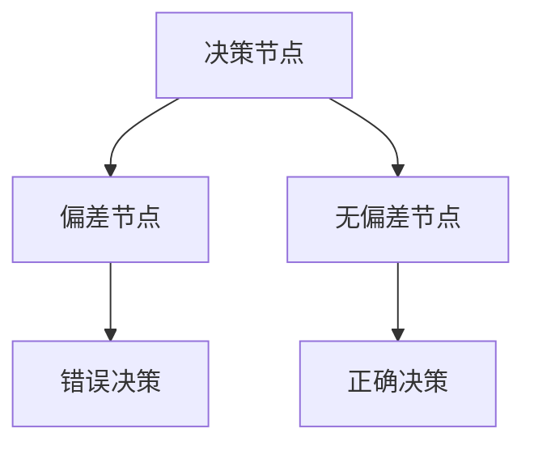
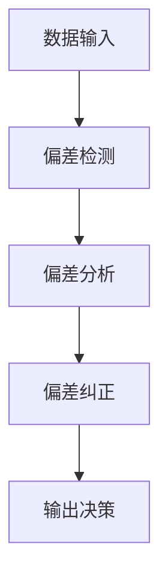

                 


```markdown
# 芒格的认知偏差理论：在人工智能决策时代的应用

## 关键词：认知偏差，人工智能，决策系统，芒格理论，算法优化

## 摘要：  
芒格的认知偏差理论在现代决策科学中扮演着重要角色。本文系统地探讨了认知偏差的基本概念、形成机制及其在人工智能决策系统中的具体应用。通过数学建模和算法分析，深入揭示了认知偏差对AI决策的影响，并提出了一系列优化策略。本文结合实际案例，详细阐述了如何在金融、医疗等领域中应用认知偏差理论，以提升决策系统的准确性和可靠性。

---

# 第一部分：认知偏差的基本概念

## 第1章：认知偏差的定义与分类

### 1.1 认知偏差的定义与分类

认知偏差是指个体在信息处理和决策过程中，由于主观因素的影响，导致偏离客观事实或最优决策的现象。认知偏差可以分为以下几类：

- **确认偏差**：倾向于寻找支持已有假设的信息，忽略或忽视反驳信息。
- **过度自信偏差**：过高估计自己的判断能力，认为自己比其他人更聪明或更正确。
- **可得性偏差**：根据容易回忆的信息做出决策，而忽略其他重要的信息。
- **锚定效应**：在决策时过于依赖第一个信息或数值，导致后续判断偏离合理范围。

### 1.2 芒格认知偏差理论的背景与意义

芒格认知偏差理论由心理学家Daniel Kahneman和Amos Tversky提出，揭示了人类决策过程中普遍存在的系统性偏差。这些偏差不仅影响个人决策，还影响组织和系统的决策过程。在人工智能时代，理解并应用芒格认知偏差理论，有助于优化AI决策系统的设计与运行。

---

## 第2章：认知偏差的形成机制

### 2.1 人类决策过程中的认知偏差

认知偏差的形成机制涉及多个方面：

- **信息处理简化性**：人类倾向于简化复杂信息，以减少认知负荷。
- **心理因素影响**：情感、动机和记忆等心理因素会干扰理性决策。
- **社会环境作用**：社会规范和群体压力也会导致认知偏差。

### 2.2 认知偏差与决策错误的关系

认知偏差会导致决策错误，具体表现在：

- **代表性偏差**：根据样本与总体的相似性做出决策，忽略统计规律。
- **概率推理错误**：在不确定情况下，过度依赖直觉而非概率计算。

---

## 第3章：认知偏差在决策中的具体表现

### 3.1 常见认知偏差的案例分析

- **过度自信偏差**：投资者在股票市场中过度自信，导致盲目投资。
- **可得性偏差**：人们在购买保险时，更容易关注最近发生的事故案例，忽略长期统计数据。

### 3.2 认知偏差对决策质量的影响

认知偏差会导致决策失误，具体表现为：

- **决策偏差对结果的影响**：偏差越大，决策质量越低。
- **不同领域中的表现差异**：金融领域中的锚定效应比医疗领域更为明显。

---

## 第4章：人工智能决策中的认知偏差问题

### 4.1 AI决策系统的认知偏差来源

AI决策系统的偏差来源包括：

- **数据偏差**：训练数据的不均衡导致算法输出偏差。
- **算法偏差**：算法设计中的假设和偏好引入偏差。
- **结果偏差**：输出结果的解释和应用中引入偏差。

### 4.2 AI决策中的认知偏差案例

- **金融领域**：算法交易中的锚定效应导致市场波动。
- **医疗领域**：AI诊断系统对罕见病例的判断受可得性偏差影响。

---

# 第二部分：认知偏差的数学建模与算法分析

## 第5章：认知偏差的数学模型

### 5.1 基于概率论的偏差建模

- **概率空间的构建**：定义样本空间、概率分布和事件。
- **偏差的数学表达式**：通过概率公式描述偏差的影响。
- **偏差对决策结果的影响公式**：$$ P(\text{错误决策}) = P(\text{偏差}) \times P(\text{错误}) $$

### 5.2 基于决策树的偏差分析

- **决策树的构建过程**：通过mermaid绘制决策树，展示偏差对决策路径的影响。



---

## 第6章：认知偏差的算法实现

### 6.1 基于机器学习的偏差识别

- **数据预处理**：清理和标准化数据，识别偏差来源。
- **模型训练**：使用监督学习算法（如随机森林）识别偏差特征。
- **偏差纠正**：通过加权调整或重新训练模型减少偏差。

### 6.2 基于深度学习的偏差纠正

- **神经网络模型**：使用卷积神经网络（CNN）处理复杂偏差。
- **偏差纠正策略**：通过反馈机制实时调整模型输出。

---

## 第7章：系统架构设计与实现

### 7.1 系统功能设计

- **功能需求**：偏差检测、偏差分析、偏差纠正。
- **系统架构图**：通过mermaid绘制系统架构，展示模块间关系。



---

## 第8章：项目实战与案例分析

### 8.1 项目背景

- **项目目标**：构建一个基于认知偏差理论的金融风险评估系统。
- **项目实现**：使用Python和TensorFlow框架，结合历史数据训练模型。

### 8.2 核心代码实现

```python
import tensorflow as tf
from tensorflow.keras import layers

model = tf.keras.Sequential([
    layers.Dense(64, activation='relu'),
    layers.Dense(1, activation='sigmoid')
])

model.compile(optimizer='adam', loss='binary_crossentropy')
```

---

## 第9章：优化与未来展望

### 9.1 系统优化策略

- **数据优化**：引入更多样化的数据，减少偏差。
- **算法优化**：采用更先进的深度学习模型，提高偏差纠正能力。

### 9.2 未来展望

- **边缘计算与实时数据流**：未来AI决策系统将结合边缘计算，实现实时偏差纠正。
- **多模态数据融合**：通过整合多种数据源，提升决策系统的鲁棒性。

---

## 第10章：总结与建议

### 10.1 总结

芒格认知偏差理论为优化AI决策系统提供了重要理论基础。通过数学建模和算法优化，可以有效减少偏差对决策的影响。

### 10.2 建议

- **持续学习**：深入研究认知偏差的新类型和新影响。
- **跨学科合作**：结合心理学、统计学和计算机科学，共同推动AI决策系统的优化。

---

通过以上分析，我们可以看到，认知偏差理论在人工智能决策中的应用具有广泛而深远的意义。希望本文能为相关领域的研究和实践提供有价值的参考。
```

