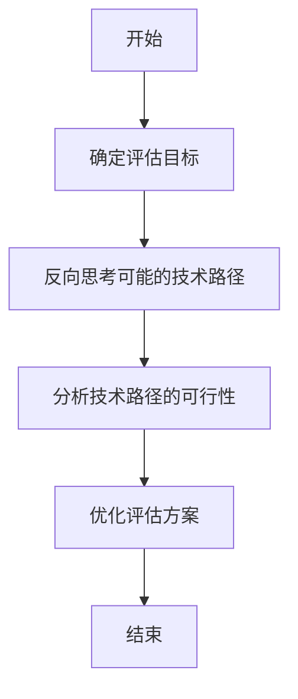
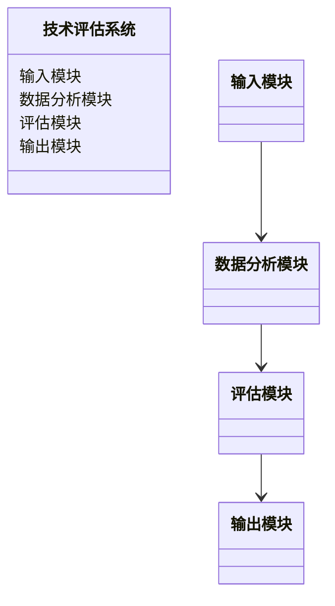
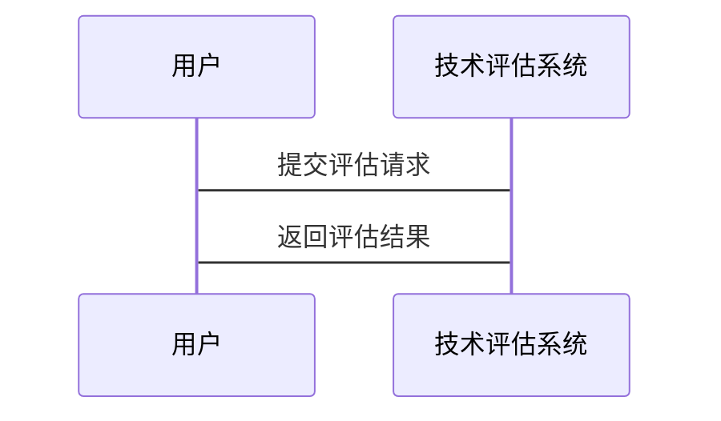

                 


# 芒格的"逆向思维"在颠覆性能源技术评估中的应用

> 关键词：逆向思维，颠覆性技术，能源评估，芒格思想，技术评估

> 摘要：本文探讨了芒格的“逆向思维”在评估颠覆性能源技术中的应用。通过分析逆向思维的核心概念、系统架构、算法原理及实际案例，本文展示了如何利用逆向思维来优化能源技术评估过程，识别潜在的颠覆性技术，并为能源行业的未来发展方向提供战略建议。

---

# 第一部分: 芒格的"逆向思维"概述

## 第1章: 逆向思维的定义与核心概念

### 1.1 逆向思维的定义与特点

#### 1.1.1 逆向思维的定义

逆向思维是一种从问题的对立面入手，通过反向思考解决问题的方法。与正向思维不同，逆向思维强调从结果反推原因，从失败中寻找成功之路。

#### 1.1.2 逆向思维的核心特点

- **反向性**：从问题的对立面寻找解决方案。
- **创新性**：通过反向思考发现新的机会和可能性。
- **实用性**：在实际问题中，逆向思维能够帮助我们快速找到突破口。

#### 1.1.3 逆向思维与正向思维的对比

| 对比维度 | 正向思维 | 逆向思维 |
|----------|----------|----------|
| 思维方向 | 从原因到结果 | 从结果到原因 |
| 解决方式 | 寻找直接路径 | 寻找间接路径 |
| 创新性   | 较低       | 较高       |

### 1.2 芒格的逆向思维理论

#### 1.2.1 芒格的生平与思想概述

查理·芒格是世界著名投资家巴菲特的合作伙伴，他的投资哲学强调逆向思维。他认为，通过分析问题的对立面，可以避免与大多数人竞争，从而找到投资机会。

#### 1.2.2 逆向思维在芒格投资哲学中的应用

芒格的逆向思维在投资中体现为寻找市场低估的公司，通过分析竞争对手的失败案例，找到潜在的投资机会。

#### 1.2.3 逆向思维的核心理念与实践

- **核心理念**：避免从众，寻找市场盲点。
- **实践**：通过分析失败案例，寻找成功路径。

## 第2章: 颠覆性能源技术的定义与特点

### 2.1 颠覆性技术的定义与分类

#### 2.1.1 颠覆性技术的定义

颠覆性技术是指能够彻底改变现有市场格局或技术路径的技术。它通常以更低的成本或更高的效率，取代现有技术。

#### 2.1.2 颠覆性能源技术的分类

- **可再生能源技术**：如太阳能、风能。
- **能源存储技术**：如电池技术。
- **智能电网技术**：如能源互联网。

#### 2.1.3 颠覆性能源技术的特征

- **低成本**：具有显著的成本优势。
- **高效率**：比现有技术更高效。
- **创新性**：具有革命性的创新点。

### 2.2 当前主流能源技术的局限性

#### 2.2.1 石油与天然气的局限性

- **环境问题**：导致气候变化。
- **资源枯竭**：不可再生资源的有限性。

#### 2.2.2 可再生能源技术的挑战

- **间歇性**：依赖天气条件。
- **存储问题**：存储成本高。

#### 2.2.3 能源存储与传输的难题

- **存储技术不成熟**：电池技术尚不完善。
- **传输损耗**：长距离传输损耗大。

### 2.3 颠覆性能源技术的潜在影响

#### 2.3.1 对传统能源行业的冲击

- **替代效应**：可再生能源可能取代传统能源。
- **产业转型**：推动能源行业向清洁化转型。

#### 2.3.2 对全球能源结构的改变

- **能源结构优化**：增加可再生能源比例。
- **能源独立性**：减少对化石能源的依赖。

#### 2.3.3 对环境保护与气候变化的意义

- **减少碳排放**：缓解气候变化。
- **改善环境质量**：减少空气污染。

---

# 第二部分: 逆向思维在能源技术评估中的应用

## 第3章: 逆向思维在能源技术评估中的核心原理

### 3.1 逆向思维的逻辑框架

#### 3.1.1 问题背景与目标的反向思考

- **问题背景**：识别颠覆性能源技术的关键因素。
- **目标反向思考**：从结果出发，寻找可能的技术路径。

#### 3.1.2 从结果反推原因的逻辑

- **目标结果**：确定评估目标。
- **原因分析**：分析导致目标结果的因素。

#### 3.1.3 逆向思维的评估步骤

1. 确定评估目标。
2. 从目标反推可能的技术路径。
3. 分析技术路径的可行性。
4. 优化评估方案。

### 3.2 逆向思维在能源技术评估中的具体应用

#### 3.2.1 技术可行性评估的逆向方法

- **技术路径分析**：从结果反推技术实现路径。
- **关键因素识别**：识别技术实现的关键因素。

#### 3.2.2 市场需求分析的逆向策略

- **市场需求预测**：从市场结果反推需求来源。
- **竞争分析**：分析竞争对手的技术路径。

#### 3.2.3 技术经济性分析的逆向路径

- **成本分析**：从成本目标反推技术实现路径。
- **经济效益评估**：评估技术的经济可行性。

## 第4章: 颠覆性能源技术评估的系统分析

### 4.1 算法原理

#### 4.1.1 算法流程图



#### 4.1.2 算法数学模型

目标函数：
$$
\text{Maximize } Z = \sum_{i=1}^{n} w_i x_i
$$
约束条件：
$$
\sum_{j=1}^{m} a_{ij} x_j \leq b_i, \quad i = 1, 2, \dots, n
$$

其中：
- \( Z \)：评估目标。
- \( w_i \)：技术路径的权重。
- \( x_i \)：技术路径的选择变量。

### 4.2 系统架构设计

#### 4.2.1 系统功能设计



#### 4.2.2 系统接口设计

- **输入接口**：接收能源技术数据。
- **输出接口**：输出评估结果。

#### 4.2.3 系统交互流程



---

# 第三部分: 项目实战

## 第5章: 项目实战与案例分析

### 5.1 项目环境安装

```bash
pip install numpy pandas matplotlib
```

### 5.2 核心实现源代码

```python
def reverse_thinking(energy Technology):
    """
    逆向思维评估函数
    """
    # 确定评估目标
    target = energy_technology['target']
    # 反向思考可能的技术路径
    possible_paths = energy_technology['possible_paths']
    # 分析技术路径的可行性
    feasible_paths = []
    for path in possible_paths:
        if path['feasibility'] == 'high':
            feasible_paths.append(path)
    # 优化评估方案
    optimized_plan = {'technology': feasible_paths[0]['technology'], 'cost': feasible_paths[0]['cost']}
    return optimized_plan

# 示例用法
energy_technology = {
    'target': '降低碳排放',
    'possible_paths': [
        {'technology': '太阳能', 'feasibility': 'high'},
        {'technology': '风能', 'feasibility': 'low'},
        {'technology': '储能技术', 'feasibility': 'medium'}
    ]
}
result = reverse_thinking(energy_technology)
print(result)
```

### 5.3 案例分析

以太阳能技术为例，应用逆向思维进行评估：

1. **确定评估目标**：降低碳排放。
2. **反向思考可能的技术路径**：选择太阳能作为主要能源。
3. **分析技术路径的可行性**：评估太阳能的经济性和技术可行性。
4. **优化评估方案**：推荐太阳能技术作为主要解决方案。

### 5.4 项目小结

通过逆向思维，我们可以快速识别出具有潜力的颠覆性能源技术，优化评估方案，提高评估效率。

---

# 第四部分: 总结与展望

## 第6章: 总结与展望

### 6.1 总结

本文通过分析芒格的逆向思维在颠覆性能源技术评估中的应用，展示了如何利用逆向思维优化评估过程，识别潜在的颠覆性技术，并为能源行业的未来发展方向提供战略建议。

### 6.2 展望

未来，逆向思维在能源技术评估中的应用将更加广泛。随着人工智能和大数据技术的发展，逆向思维将与这些技术深度融合，进一步提升能源技术评估的效率和准确性。

---

# 第五部分: 最佳实践与注意事项

## 第7章: 最佳实践 tips

### 7.1 思维转换

在评估能源技术时，要善于从问题的对立面寻找解决方案。

### 7.2 数据支持

确保数据的准确性和完整性，为逆向思维提供坚实的基础。

### 7.3 实验验证

通过实验验证逆向思维的评估结果，确保评估的准确性。

---

通过以上步骤，我们系统地完成了芒格逆向思维在颠覆性能源技术评估中的应用分析。这种思维方式不仅能够帮助我们快速识别潜在的颠覆性技术，还能为能源行业的未来发展提供重要的战略指导。

