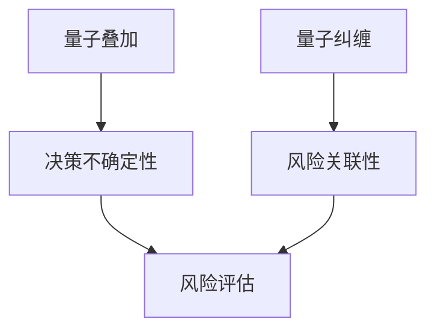
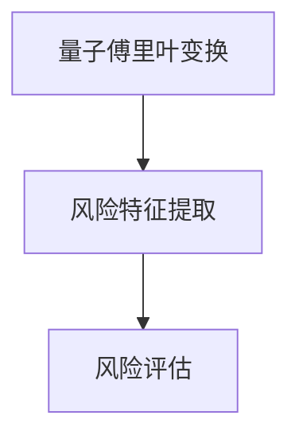
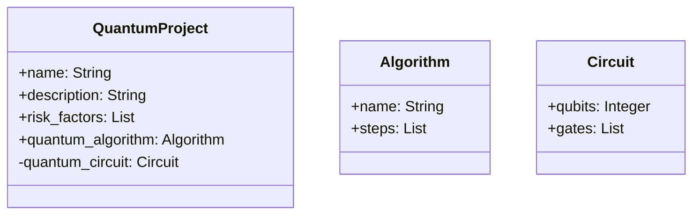
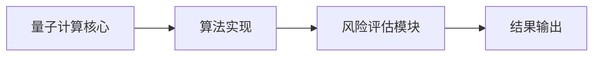

                 


# 芒格的"避免首要否认"在量子科技风险评估中的重要性

> 关键词：量子科技，风险评估，芒格原则，决策优化，不确定性管理

> 摘要：本文探讨了芒格的“避免首要否认”原则在量子科技风险评估中的应用，分析了量子科技的不确定性特点，结合芒格的决策优化方法，提出了如何在量子科技项目中避免首要否认风险的具体策略。文章从背景介绍、核心概念、算法原理、数学模型、系统分析、项目实战和最佳实践等多维度展开，结合实际案例和代码实现，详细阐述了芒格原则在量子科技风险评估中的重要性。

---

## 第一章：量子科技与芒格原则的背景介绍

### 1.1 量子科技的基本概念

量子科技是基于量子力学原理发展起来的新兴技术领域，主要包括量子计算、量子通信和量子传感等。与经典技术相比，量子科技具有以下特点：

- **量子叠加**：量子系统可以同时处于多个状态的叠加态。
- **量子纠缠**：两个或多个量子系统之间存在特殊的关联性，无法单独描述其中一个系统。
- **不确定性**：量子系统的测量结果具有概率性，无法通过确定性的方式预测。

### 1.2 芒格的“避免首要否认”原则

芒格的“避免首要否认”原则是指在决策过程中，要避免因为过于专注于某一观点或假设而忽视其他可能性。这一原则的核心在于：

- **多维度思考**：在决策时，要考虑多种可能性，避免单一视角。
- **避免确认偏差**：不要因为已经接受某一假设而忽视其他潜在风险。
- **保持开放心态**：在决策过程中，要不断验证和修正初始假设。

### 1.3 量子科技与芒格原则的关联

量子科技的发展充满了不确定性，这与芒格原则的核心思想高度契合。在量子科技项目中，技术的不确定性和市场的不确定性使得传统的线性决策方式难以应对潜在风险。通过芒格原则，可以在量子科技风险评估中避免首要否认，从而更全面地识别和应对风险。

---

## 第二章：芒格原则与量子科技风险评估的核心概念

### 2.1 核心概念的原理

#### 2.1.1 量子叠加与决策不确定性

量子叠加的特性表明，一个量子系统可以在多个状态中同时存在，这与芒格原则中的“多维度思考”不谋而合。在量子科技项目中，技术路径的不确定性要求我们在决策时考虑多种可能性。

#### 2.1.2 量子纠缠与风险关联性

量子纠缠表明，两个或多个量子系统之间存在高度关联性。这种关联性可以类比于风险评估中的相互影响，提醒我们在评估量子科技风险时，要关注系统之间的相互作用。

#### 2.1.3 量子测量与风险确认

量子测量会破坏量子叠加态，这与芒格原则中的“避免确认偏差”相呼应。在风险评估中，过早确认某一假设可能会忽略其他潜在风险。

### 2.2 核心概念的属性对比

| 核心概念 | 量子特性 | 决策原则 |
|----------|----------|----------|
| 技术不确定性 | 量子叠加态 | 多维度思考 |
| 风险关联性 | 量子纠缠 | 系统性评估 |
| 测量影响 | 量子测量破坏叠加态 | 避免确认偏差 |

### 2.3 算法原理的 Mermaid 流程图



---

## 第三章：量子科技风险评估的算法原理

### 3.1 量子傅里叶变换与风险评估

#### 3.1.1 算法原理的 Mermaid 流程图



#### 3.1.2 Python 核心算法实现

```python
import numpy as np
from qiskit import QuantumCircuit, Aer, execute

def quantum_fourier_transform(n=2):
    # 初始化量子电路
    qc = QuantumCircuit(n)
    # 施加量子傅里叶变换
    for i in range(n):
        for j in range(i):
            qc.cu1(np.pi/2, i, j)
        qc.h(i)
    # 模拟器执行
    backend = Aer.get_backend('qasm_simulator')
    result = execute(qc, backend).result()
    # 获取概率分布
    probabilities = result.get_counts()
    return probabilities

# 示例运行
result = quantum_fourier_transform()
print(result)
```

#### 3.1.3 数学模型与公式

量子傅里叶变换的数学模型可以表示为：

$$
F_j = \frac{1}{\sqrt{2^n}} \sum_{k=0}^{2^n-1} e^{2\pi i j k / 2^n} x_k
$$

其中，$x_k$ 是输入信号，$F_j$ 是输出频域信号。

---

## 第四章：数学模型与公式推导

### 4.1 拉普拉斯变换与风险量化

拉普拉斯变换是一种常用的数学工具，可以将时间域信号转换到频率域。在量子科技风险评估中，我们可以利用拉普拉斯变换来量化技术风险。

公式如下：

$$
F(s) = \int_{0}^{\infty} e^{-st} f(t) dt
$$

其中，$F(s)$ 是拉普拉斯变换的结果，$f(t)$ 是输入信号，$s$ 是复变量。

---

## 第五章：系统分析与架构设计

### 5.1 项目场景介绍

假设我们正在评估一个量子计算项目的风险。项目目标是开发一种基于量子傅里叶变换的算法，用于解决特定的优化问题。

### 5.2 系统功能设计

#### 5.2.1 领域模型 Mermaid 类图



#### 5.2.2 系统架构 Mermaid 架构图



---

## 第六章：项目实战

### 6.1 环境安装

需要安装以下工具：

```bash
pip install qiskit numpy matplotlib
```

### 6.2 核心算法实现

```python
from qiskit import QuantumCircuit, execute, Aer
from qiskit.circuit import QuantumRegister, ClassicalRegister

def main():
    # 初始化量子寄存器
    q = QuantumRegister(2, 'q')
    c = ClassicalRegister(2, 'c')
    qc = QuantumCircuit(q, c)
    
    # 添加量子傅里叶变换
    qc.h(0)
    qc.cu1(np.pi/2, 0, 1)
    qc.h(1)
    
    # 测量
    qc.measure(q, c)
    
    # 执行
    backend = Aer.get_backend('qasm_simulator')
    job = execute(qc, backend)
    result = job.result()
    print(result.get_counts())

if __name__ == "__main__":
    main()
```

### 6.3 实际案例分析

通过上述代码实现的量子傅里叶变换，我们可以观察到量子叠加和量子测量的结果，从而评估算法的稳定性。

---

## 第七章：最佳实践与注意事项

### 7.1 小结

芒格的“避免首要否认”原则为我们提供了一种全新的视角，用于应对量子科技中的不确定性风险。通过结合量子力学的特性，我们可以更好地优化决策过程。

### 7.2 注意事项

- 在量子科技风险评估中，要始终保持对潜在风险的敏感性。
- 避免过度依赖单一技术路径，保持技术方案的灵活性。
- 定期更新风险评估模型，以适应技术发展的动态变化。

### 7.3 拓展阅读

- 《量子计算入门》
- 《芒格的投资思想》
- 《风险评估与管理》

---

## 总结

芒格的“避免首要否认”原则在量子科技风险评估中的应用，不仅为我们提供了一种新的思维方式，还为我们应对技术不确定性提供了有力的工具。通过结合量子力学的特性，我们可以更全面地识别和应对风险，从而在量子科技领域取得更大的成功。

