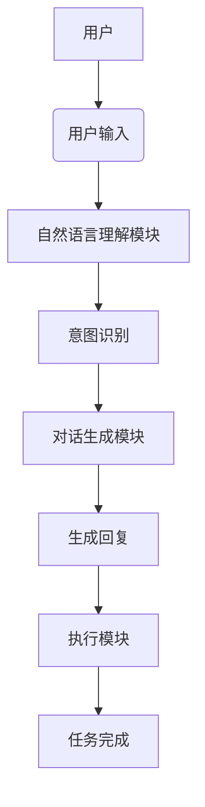

                 


# 虚拟助手AI Agent：从Siri到更智能的未来

> 关键词：虚拟助手, AI Agent, 自然语言处理, 机器学习, 对话生成, 多模态交互, AGI

> 摘要：  
> 本文深入探讨了虚拟助手AI Agent从Siri到更智能的未来的发展历程、技术原理、应用场景及未来趋势。文章首先介绍了虚拟助手的基本概念和发展背景，随后详细讲解了自然语言处理、机器学习等核心技术，分析了AI Agent的算法原理和系统架构。接着，通过项目实战展示了虚拟助手的实现过程，并结合具体案例进行了深入剖析。最后，总结了当前虚拟助手的局限性，展望了其与多模态交互、AGI等技术结合的未来发展。

---

## 第一章: 虚拟助手AI Agent的背景与概念

### 1.1 虚拟助手的定义与核心概念

#### 1.1.1 虚拟助手的定义  
虚拟助手（Virtual Assistant，VA）是一种基于人工智能技术的交互系统，能够通过自然语言处理（NLP）技术理解用户的输入，并通过执行预设的逻辑或调用外部服务来完成任务。虚拟助手可以以语音或文本形式与用户交互，广泛应用于智能手机、智能家居、可穿戴设备等领域。

#### 1.1.2 虚拟助手的核心概念  
虚拟助手的核心概念包括：  
1. **自然语言处理（NLP）**：理解用户的输入并生成自然语言的响应。  
2. **机器学习**：通过数据训练模型，实现对用户需求的精准识别和预测。  
3. **对话生成**：基于上下文生成连贯、自然的对话内容。  
4. **多模态交互**：支持语音、文本、图像等多种交互方式。  

#### 1.1.3 虚拟助手的分类与应用场景  
虚拟助手可以根据功能和实现方式分为以下几类：  
- **基于规则的虚拟助手**：通过预设规则和关键词匹配实现简单的任务处理，如早期的 Siri。  
- **基于模型的虚拟助手**：利用机器学习模型（如深度学习模型）实现更复杂的任务处理，如现代的 ChatGPT。  
- **混合型虚拟助手**：结合规则和模型的优势，实现更灵活的功能。  

应用场景包括：  
- 智能手机助手（如Siri、Google Assistant）。  
- 智能家居控制（如Amazon Alexa）。  
- 企业级虚拟助手（如客服机器人）。  

---

### 1.2 虚拟助手的发展历程

#### 1.2.1 虚拟助手的起源  
虚拟助手的概念最早可以追溯到20世纪80年代的专家系统和语音交互技术。然而，真正意义上的虚拟助手始于21世纪初，随着互联网和移动设备的普及，虚拟助手逐渐成为人机交互的重要方式。

#### 1.2.2 从Siri到现代AI Agent的演进  
- **Siri的诞生**：2010年，Siri作为独立的应用程序出现在iOS平台上，通过语音交互帮助用户完成日历管理、发送邮件等任务。  
- **集成到苹果生态系统**：2011年，Siri被苹果收购，并逐步集成到iPhone、iPad等设备中，成为苹果智能助手的核心组件。  
- **Google Assistant的崛起**：Google于2016年推出Google Assistant，通过深度学习模型实现更智能的对话交互。  
- **现代AI Agent的发展**：近年来，基于Transformer架构的模型（如GPT系列）的应用，使得虚拟助手的对话能力得到了质的飞跃。

#### 1.2.3 当前虚拟助手市场的竞争格局  
目前，虚拟助手市场主要由几大科技巨头主导，包括苹果的Siri、谷歌的Google Assistant、亚马逊的Alexa、微软的Cortana以及中国的百度小度、阿里巴巴的天猫精灵等。这些虚拟助手在功能、用户体验和技术实现上各有千秋，市场竞争日益激烈。

---

## 第二章: 虚拟助手AI Agent的核心技术

### 2.1 自然语言处理（NLP）

#### 2.1.1 NLP的基本概念  
自然语言处理（NLP）是研究如何让计算机理解、处理和生成人类语言的技术。NLP的核心任务包括文本分类、实体识别、句法分析、语义理解等。

#### 2.1.2 基于规则的NLP与基于模型的NLP对比  
| 对比维度         | 基于规则的NLP | 基于模型的NLP |
|------------------|----------------|----------------|
| 实现方式         | 预设规则       | 数据驱动       |
| 处理能力         | 适用于简单任务 | 适用于复杂任务 |
| 可扩展性         | 较低           | 较高           |

#### 2.1.3 当前主流的NLP模型  
当前主流的NLP模型包括：  
1. **词袋模型（Bag-of-Words）**：将文本表示为词袋，忽略词序。  
2. **TF-IDF（Term Frequency-Inverse Document Frequency）**：通过词频和逆文档频率计算关键词的重要性。  
3. **Word2Vec**：通过神经网络训练词向量。  
4. **GloVe**：基于全局词向量的潜在语义表示。  
5. **BERT（Bidirectional Encoder Representations from Transformers）**：基于Transformer的双向编码器。

---

### 2.2 机器学习与深度学习

#### 2.2.1 机器学习的基本原理  
机器学习是通过数据训练模型，使得模型能够从数据中学习规律并进行预测。常见的机器学习算法包括：  
- **监督学习**：基于标记数据进行训练，如线性回归、支持向量机（SVM）。  
- **无监督学习**：基于未标记数据进行聚类或降维，如K-means、主成分分析（PCA）。  
- **强化学习**：通过奖励机制学习策略，如AlphaGo。

#### 2.2.2 深度学习在虚拟助手中的应用  
深度学习通过多层神经网络提取数据的高层次特征，广泛应用于图像识别、语音识别和自然语言处理等领域。例如，深度学习模型可以用于对话生成、情感分析和意图识别。

#### 2.2.3 常见的机器学习算法及其优缺点  
| 算法名称         | 优点                           | 缺点                           |
|------------------|--------------------------------|--------------------------------|
| 线性回归         | 简单高效，易于解释             | 适用于线性关系，非线性任务表现差 |
| 支持向量机（SVM） | 高精度，适合小规模数据         | 不适合高维数据，计算复杂度高     |

---

### 2.3 对话生成与理解

#### 2.3.1 对话生成的原理  
对话生成的目标是根据上下文生成连贯、自然的对话内容。常用的方法包括：  
- **基于规则的对话生成**：通过预设规则生成回复，适用于简单的对话场景。  
- **基于模型的对话生成**：通过深度学习模型（如Transformer）生成回复，适用于复杂的对话场景。

#### 2.3.2 基于规则的对话生成与基于模型的对话生成对比  
| 对比维度         | 基于规则的对话生成 | 基于模型的对话生成 |
|------------------|----------------------|----------------------|
| 实现方式         | 预设规则             | 数据驱动             |
| 对话复杂性       | 适用于简单场景       | 适用于复杂场景       |
| 创新性           | 较低                 | 较高                 |

---

## 第三章: 虚拟助手AI Agent的核心算法原理

### 3.1 自然语言处理模型

#### 3.1.1 基于词袋模型的文本表示  
词袋模型通过将文本表示为词袋，忽略词序，实现对文本的表示。例如，文本“我爱机器学习”可以表示为：  
$$\text{我:1, 爱:1, 机器学习:1}$$  

#### 3.1.2 基于TF-IDF的文本特征提取  
TF-IDF通过计算词频和逆文档频率，提取文本的关键特征。例如，TF-IDF值高的词汇通常表示文本的核心内容。

#### 3.1.3 基于神经网络的文本表示（如Word2Vec、GloVe）  
Word2Vec通过训练词向量，将文本表示为低维向量。例如，Word2Vec模型中，“king”的向量表示为：  
$$\text{king: [0.2, 0.5, 0.1, ...]}$$  

---

### 3.2 机器学习算法

#### 3.2.1 线性回归模型  
线性回归模型用于预测连续型变量。例如，预测房屋价格：  
$$y = \beta_0 + \beta_1x_1 + \beta_2x_2 + \dots + \beta_nx_n$$  

#### 3.2.2 支持向量机（SVM）  
SVM通过构建超平面实现分类。例如，对于二维数据，SVM的决策边界可以表示为：  
$$w_1x_1 + w_2x_2 + b = 0$$  

---

## 第四章: 虚拟助手AI Agent的系统架构与设计

### 4.1 系统架构设计

#### 4.1.1 系统架构概述  
虚拟助手的系统架构通常包括以下模块：  
1. **用户交互模块**：接收用户的输入并进行解析。  
2. **自然语言理解模块**：通过NLP技术理解用户的意图。  
3. **对话生成模块**：根据理解生成对话内容。  
4. **执行模块**：调用外部服务或执行预设任务。  

#### 4.1.2 系统架构图（Mermaid）  


---

## 第五章: 虚拟助手AI Agent的项目实战

### 5.1 环境安装与配置

#### 5.1.1 环境安装  
安装Python、TensorFlow、Keras等开发工具和库。  
```bash
pip install python python-tensorflow
```

#### 5.1.2 环境配置  
配置虚拟环境并激活。  
```bash
python -m venv venv
source venv/bin/activate
```

---

### 5.2 系统核心实现源代码

#### 5.2.1 对话生成模块的实现  
以下是一个简单的对话生成模块的Python代码：  
```python
def generate_response(user_input):
    # 简单的基于规则的对话生成
    if "你好" in user_input:
        return "你好！有什么可以帮助你的吗？"
    elif "天气" in user_input:
        return "请告诉我你所在的地点，我将查询天气情况。"
    else:
        return "抱歉，我还不支持这个功能。"
```

---

### 5.3 实际案例分析与代码解读

#### 5.3.1 案例分析  
以天气查询功能为例，用户输入“北京天气”，系统需要解析用户的意图并调用天气API获取数据。

#### 5.3.2 代码实现  
```python
import requests

def get_weather(city):
    api_key = "your_api_key"
    url = f"http://api.weather.com.cn/data/sk?city={city}&key={api_key}"
    response = requests.get(url)
    weather_data = response.json()
    return weather_data

# 示例调用
weather = get_weather("北京")
print(weather)
```

---

## 第六章: 虚拟助手AI Agent的总结与展望

### 6.1 总结与小结

#### 6.1.1 核心内容总结  
本文详细介绍了虚拟助手从Siri到更智能的未来的发展历程、技术原理、应用场景及未来趋势。通过分析自然语言处理、机器学习等核心技术，探讨了虚拟助手的实现过程和优化方向。

#### 6.1.2 项目实战小结  
通过项目实战，我们了解了虚拟助手的实现过程，包括环境安装、代码编写、案例分析等。同时，我们也发现了一些问题，例如模型的准确性和响应速度需要进一步优化。

---

### 6.2 最佳实践 tips

#### 6.2.1 优化建议  
- **数据质量**：确保训练数据的多样性和代表性。  
- **模型调优**：通过超参数优化和模型剪裁提升性能。  
- **用户体验**：设计简洁直观的交互界面，优化响应速度。  

#### 6.2.2 未来展望  
随着人工智能技术的不断发展，虚拟助手将更加智能化和个性化。未来的虚拟助手将支持更多模态的交互方式，并逐步向通用人工智能（AGI）方向发展。

---

## 附录

### 附录A: 相关工具与库

- **Python**：编程语言。  
- **TensorFlow**：深度学习框架。  
- **Keras**：深度学习库。  
- **Mermaid**：图表工具。  

### 附录B: 参考文献

- [1] 王伟, 《深度学习入门》，人民邮电出版社。  
- [2] 李明, 《自然语言处理实战》，机械工业出版社。  

---

通过本文的详细讲解，读者可以深入了解虚拟助手AI Agent的技术原理和实现过程。从Siri到更智能的未来，虚拟助手正在不断进化，为人类带来更便捷、更智能的生活方式。

