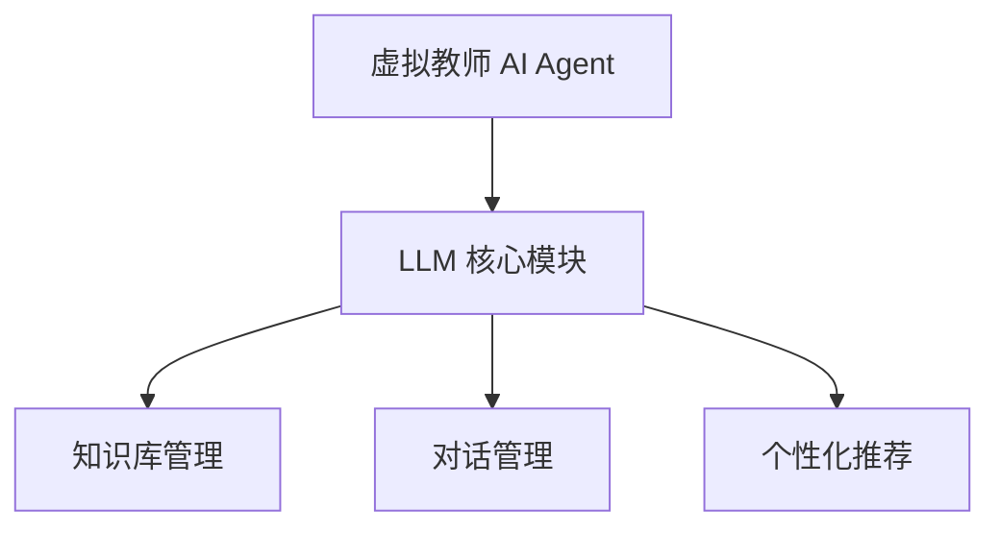
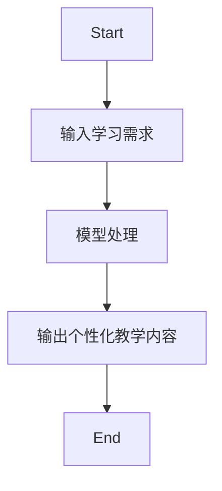

                 


# 虚拟教师 AI Agent：LLM 驱动的个性化教育系统

> 关键词：虚拟教师 AI Agent、LLM、个性化教育、教育系统、人工智能

> 摘要：本文将深入探讨如何利用大语言模型（LLM）构建一个个性化的教育系统——虚拟教师 AI Agent。通过分析其核心概念、算法原理、系统架构，以及实际项目实现，我们将揭示这一技术在教育领域的巨大潜力，并为未来的教育模式提供新的思路。

---

## 第一部分: 虚拟教师 AI Agent 的背景与核心概念

### 第1章: 虚拟教师 AI Agent 的问题背景与描述

#### 1.1 问题背景
- **传统教育模式的局限性**  
  - 传统教育模式通常以教师为中心，难以满足每个学生的个性化学习需求。  
  - 教学资源有限，教师难以兼顾不同学生的学习进度和兴趣点。  
  - 学生在学习过程中可能缺乏及时的反馈和个性化的指导。  

- **AI技术在教育领域的潜力**  
  - AI技术可以为每个学生提供个性化的学习计划和反馈。  
  - 通过自然语言处理（NLP）技术，AI可以理解学生的学习需求并生成相应的教学内容。  
  - 基于大数据分析，AI能够实时调整教学策略，优化学习效果。  

- **LLM驱动的个性化教育需求**  
  - 大语言模型（LLM）具备强大的文本生成和理解能力，能够为个性化教育提供技术支持。  
  - LLM可以模拟教师的角色，为学生提供类似真人教师的互动体验。  

---

#### 1.2 问题描述
- **个性化学习的定义与目标**  
  - 个性化学习是指根据学生的兴趣、能力和发展需求，提供定制化的学习内容和方法。  
  - 目标是让每个学生都能在最短时间内掌握所需知识，同时培养其独立学习能力。  

- **虚拟教师 AI Agent 的核心任务**  
  - 通过LLM技术，虚拟教师AI Agent可以实时与学生互动，解答问题，提供学习建议。  
  - 根据学生的学习数据，动态调整教学策略，优化学习路径。  

- **当前教育系统中的痛点与挑战**  
  - 教学资源分配不均，教师难以覆盖所有学生的需求。  
  - 学生的学习兴趣和能力差异较大，传统教学模式难以满足个性化需求。  
  - 缺乏实时反馈机制，学生在学习过程中可能遇到的问题得不到及时解决。  

---

#### 1.3 问题解决与边界
- **虚拟教师 AI Agent 的解决方案**  
  - 引入AI技术，构建一个智能的虚拟教师系统，为学生提供个性化的学习支持。  
  - 通过LLM技术实现自然语言交互，增强学生与系统之间的互动体验。  

- **系统的边界与外延**  
  - 虚拟教师 AI Agent 的核心功能包括知识传递、问题解答和学习指导。  
  - 系统的边界在于不涉及实际的物理教学环境和线下教学活动。  

- **核心要素与组成结构**  
  - 知识库：包含课程内容、教学策略和学习资源。  
  - 对话系统：实现学生与AI Agent之间的自然语言交互。  
  - 个性化推荐引擎：根据学生的学习数据，推荐适合的学习内容和方法。  

---

### 第2章: 虚拟教师 AI Agent 的核心概念与联系

#### 2.1 核心概念原理
- **AI Agent 的定义与特征**  
  - AI Agent 是一种能够感知环境并采取行动以实现目标的智能体。  
  - 其核心特征包括自主性、反应性、目标导向和学习能力。  

- **LLM 的基本原理**  
  - 大语言模型（LLM）是基于深度学习的NLP模型，能够理解和生成人类语言。  
  - 常见的LLM模型包括GPT系列、BERT等。  

- **虚拟教师 AI Agent 的功能架构**  
  - 知识理解：理解课程内容和学生需求。  
  - 问题解答：回答学生的问题并提供学习建议。  
  - 个性化推荐：根据学生的学习数据推荐学习资源。  

---

#### 2.2 核心概念对比
- **AI Agent 与传统教育工具的对比**  
  | 特性               | AI Agent                  | 传统教育工具          |
  |--------------------|---------------------------|-----------------------|
  | 个性化能力         | 强                        | 弱                    |
  | 及时反馈           | 是                        | 否                    |
  | 知识更新能力       | 强                        | 弱                    |

- **LLM 与其他 NLP 技术的对比**  
  - LLM具有更强的上下文理解和生成能力，能够处理复杂的语言任务。  
  - 传统NLP技术（如关键词提取）难以实现类似的智能对话。  

- **虚拟教师 AI Agent 的优势与劣势**  
  - **优势**：  
    - 24/7可用性，随时为学生提供支持。  
    - 根据学生的学习数据实时调整教学策略。  
  - **劣势**：  
    - 目前仍难以完全替代真人教师的创造力和情感支持。  

---

#### 2.3 系统架构图


---

### 第3章: 虚拟教师 AI Agent 的算法原理

#### 3.1 算法原理概述
- **LLM 的训练过程**  
  - 基于大量语料库进行预训练，使用自监督学习方法优化模型参数。  
  - 通过Transformer架构实现高效的并行计算和长距离依赖关系捕捉。  

- **大模型的推理机制**  
  - 输入问题后，模型通过解码器生成回答，采用贪心算法或采样算法。  
  - 输出结果经过概率筛选，确保回答的准确性和流畅性。  

- **个性化教育的实现方法**  
  - 根据学生的学习数据，调整模型的参数或生成策略。  
  - 使用强化学习（Reinforcement Learning）优化教学路径。  

---

#### 3.2 算法流程图


---

#### 3.3 算法实现代码
```python
def personalized_education_system(input_text):
    # 初始化模型
    model = initialize_model()
    # 处理输入
    processed_input = preprocess_input(input_text)
    # 生成输出
    output = model.generate(processed_input)
    return output
```

---

## 总结
通过以上章节的分析，我们逐步揭示了虚拟教师 AI Agent 的核心概念、算法原理和系统架构。接下来，我们将从系统分析与架构设计的角度，深入探讨如何实现一个高效的个性化教育系统。

---

*（后续章节将涵盖系统分析与架构设计、项目实战等内容，欢迎继续阅读。）*

