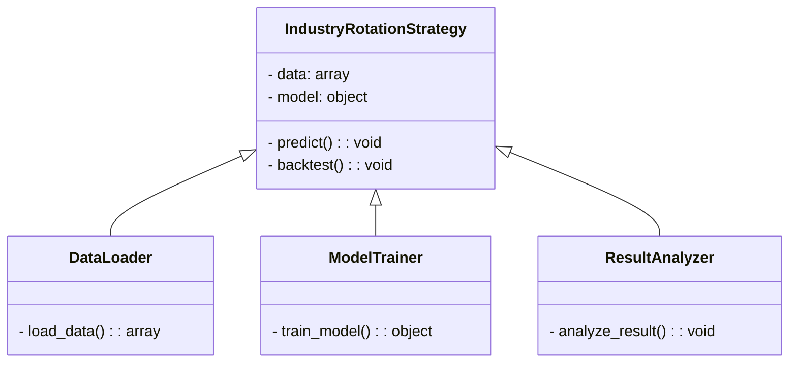
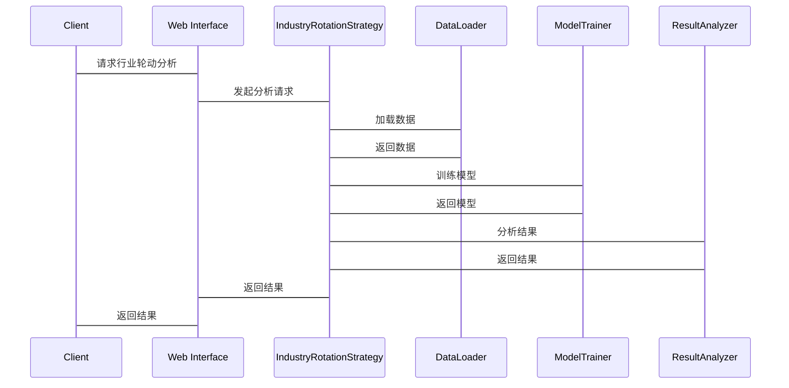

                 


# 行业轮动策略：识别和投资热点行业

**关键词：行业轮动、投资策略、热点行业、数据分析、机器学习**

**摘要：**  
行业轮动策略是一种通过识别和投资热点行业来实现超额收益的投资策略。本文将从行业轮动的基本概念出发，逐步分析行业轮动的识别技术、数学模型、系统架构设计以及实际项目中的应用。通过结合数据分析和机器学习的方法，本文详细探讨了如何有效识别和投资热点行业，帮助投资者在复杂多变的市场中把握投资机会。

---

## 第一部分：行业轮动策略概述

### 1.1 行业轮动的基本概念

#### 1.1.1 行业轮动的定义与分类
行业轮动是指根据市场环境的变化，动态调整投资组合中各行业权重的策略。行业轮动可以分为 **自上而下** 和 **自下而上** 两种类型：
- **自上而下**：基于宏观经济周期和政策变化，选择受益于当前经济环境的行业。
- **自下而上**：基于行业基本面和市场情绪，选择具有增长潜力的行业。

#### 1.1.2 行业轮动的驱动因素
行业轮动的主要驱动因素包括：
1. **宏观经济因素**：GDP增速、利率水平、通货膨胀等。
2. **行业基本面**：行业收入、利润、市场份额等。
3. **市场情绪**：投资者情绪、资金流动等。

#### 1.1.3 行业轮动的周期性特征
行业轮动具有明显的周期性特征，通常与经济周期相关。例如：
- 在经济衰退期，防御性行业（如公用事业、医疗保健）可能表现较好。
- 在经济复苏期，周期性行业（如材料、工业）可能表现较好。

### 1.2 行业轮动的理论基础

#### 1.2.1 经济周期与行业轮动的关系
经济周期对行业轮动有重要影响。例如：
- **衰退期**：防御性行业表现较好。
- **复苏期**：周期性行业表现较好。
- **繁荣期**：成长性行业表现较好。

#### 1.2.2 资金流动与行业轮动的关联
资金流动是行业轮动的重要驱动因素。例如，当资金从一个行业流向另一个行业时，可能会引发行业的轮动。

#### 1.2.3 技术进步对行业轮动的影响
技术进步会改变行业的竞争格局，从而影响行业的轮动。例如，人工智能技术的进步推动了科技行业的轮动。

### 1.3 行业轮动的策略类型

#### 1.3.1 基于宏观经济的轮动策略
基于宏观经济指标（如GDP增速、利率水平）进行行业轮动。

#### 1.3.2 基于行业基本面的轮动策略
基于行业基本面指标（如ROE、净利润增长率）进行行业轮动。

#### 1.3.3 基于市场情绪的轮动策略
基于市场情绪指标（如换手率、资金流入流出）进行行业轮动。

### 1.4 行业轮动的历史案例分析

#### 1.4.1 经典行业轮动案例回顾
- 2008年全球金融危机后，防御性行业（如公用事业、医疗保健）表现较好。
- 2010年之后，科技行业成为市场的热点。

#### 1.4.2 不同经济周期下的行业轮动表现
- **衰退期**：防御性行业表现较好。
- **复苏期**：周期性行业表现较好。
- **繁荣期**：成长性行业表现较好。

#### 1.4.3 行业轮动策略的有效性评估
通过历史回测，评估行业轮动策略的有效性。

### 1.5 本章小结
本章介绍了行业轮动的基本概念、驱动因素、策略类型以及历史案例，为后续分析奠定了基础。

---

## 第二部分：行业轮动策略的识别技术

### 2.1 数据收集与处理

#### 2.1.1 行业数据的来源与分类
行业数据主要来源于金融数据供应商（如Wind、 Bloomberg）和上市公司财报。

#### 2.1.2 数据清洗与预处理方法
- 数据清洗：去除缺失值、异常值。
- 数据标准化：对数据进行标准化处理，以便后续分析。

#### 2.1.3 数据特征提取技术
- 时间序列特征：如均值、标准差、趋势。
- 常规统计特征：如最大值、最小值、中位数。

### 2.2 行业轮动的指标体系

#### 2.2.1 常用行业轮动指标介绍
- **相对强度**：行业指数相对于市场指数的表现。
- **资金流**：行业资金流入流出情况。
- **估值指标**：市盈率、市净率等。

#### 2.2.2 指标之间的关联分析
通过相关性分析，确定哪些指标对行业轮动的影响较大。

#### 2.2.3 指标权重的确定方法
- 主成分分析（PCA）：提取主要成分，确定指标权重。
- 线性回归：基于历史数据，确定指标权重。

### 2.3 行业轮动的算法实现

#### 2.3.1 基于机器学习的行业轮动模型
- 算法流程：
  1. 数据预处理。
  2. 特征选择。
  3. 模型训练。
  4. 模型预测。
- 具体算法：支持向量机（SVM）、随机森林（Random Forest）、神经网络（NN）。

#### 2.3.2 基于统计学的行业轮动方法
- 常用方法：时间序列分析（ARIMA）、Granger因果关系检验。

#### 2.3.3 基于时间序列的行业轮动预测
- 时间序列模型：ARIMA、GARCH。
- 预测步骤：
  1. 数据预处理。
  2. 模型选择。
  3. 模型训练。
  4. 模型预测。

### 2.4 行业轮动的可视化分析

#### 2.4.1 行业轮动的可视化工具介绍
- 常用工具：Matplotlib、Seaborn、Plotly。

#### 2.4.2 行业轮动趋势的图表展示
- 线图：展示行业轮动趋势。
- 条形图：比较不同行业的表现。

#### 2.4.3 行业轮动风险的可视化评估
- 风险指标：最大回撤、VaR（Value at Risk）。

### 2.5 本章小结
本章介绍了行业轮动的识别技术，包括数据收集、指标体系、算法实现和可视化分析。

---

## 第三部分：行业轮动策略的投资应用

### 3.1 行业轮动的数学模型

#### 3.1.1 时间序列分析的数学模型
- ARIMA模型：
  $$ ARIMA(p, d, q) $$
  - p：自回归阶数。
  - d：差分阶数。
  - q：移动平均阶数。

#### 3.1.2 多变量分析的数学方法
- 线性回归模型：
  $$ y = \beta_0 + \beta_1x_1 + \beta_2x_2 + \dots + \beta_nx_n + \epsilon $$

#### 3.1.3 统计学习与机器学习的数学基础
- 支持向量机（SVM）：通过寻找最优超平面进行分类。
- 随机森林：通过集成学习进行分类或回归。

### 3.2 行业轮动的回归分析

#### 3.2.1 线性回归模型在行业轮动中的应用
- 回归分析步骤：
  1. 确定因变量和自变量。
  2. 数据预处理。
  3. 模型训练。
  4. 模型验证。

#### 3.2.2 非线性回归模型的构建
- 算法：多项式回归、逻辑回归。

#### 3.2.3 回归结果的解释与验证
- R²值：模型拟合优度。
- p值：变量显著性检验。

### 3.3 行业轮动的聚类分析

#### 3.3.1 行业聚类的基本原理
- 聚类算法：K-means、层次聚类。

#### 3.3.2 基于K-means的行业划分
- 步骤：
  1. 数据预处理。
  2. 确定聚类数。
  3. 模型训练。
  4. 结果分析。

#### 3.3.3 聚类结果的稳定性检验
- 方法：交叉验证、内部评估指标（如轮廓系数）。

### 3.4 行业轮动的分类模型

#### 3.4.1 基于决策树的行业轮动分类
- 算法：ID3、C4.5、CART。

#### 3.4.2 支持向量机在行业轮动中的应用
- SVM分类步骤：
  1. 数据预处理。
  2. 核函数选择。
  3. 模型训练。
  4. 模型预测。

#### 3.4.3 神经网络模型的构建与训练
- 神经网络结构：输入层、隐藏层、输出层。
- 算法：反向传播（Backpropagation）、随机梯度下降（SGD）。

### 3.5 本章小结
本章介绍了行业轮动的数学模型，包括时间序列分析、回归分析、聚类分析和分类模型。

---

## 第四部分：行业轮动策略的系统架构设计

### 4.1 系统功能设计

#### 4.1.1 领域模型（Mermaid 类图）


#### 4.1.2 系统架构设计（Mermaid 架构图）


#### 4.1.3 系统接口设计
- 输入接口：数据输入、参数设置。
- 输出接口：预测结果、回测结果。

#### 4.1.4 系统交互（Mermaid 序列图）


### 4.2 系统实现

#### 4.2.1 环境搭建
- 开发环境：Python 3.8+
- 依赖库：Pandas、NumPy、Scikit-learn、TensorFlow。

#### 4.2.2 核心代码实现

##### 数据加载模块（data_loader.py）
```python
import pandas as pd

def load_data(file_path):
    data = pd.read_csv(file_path)
    return data
```

##### 模型训练模块（model_trainer.py）
```python
from sklearn.ensemble import RandomForestClassifier
import pandas as pd

def train_model(data, target_column):
    X = data.drop(columns=[target_column])
    y = data[target_column]
    model = RandomForestClassifier()
    model.fit(X, y)
    return model
```

##### 结果分析模块（result_analyzer.py）
```python
import matplotlib.pyplot as plt

def plot_results(predicted, actual):
    plt.plot(range(len(predicted)), predicted, label='预测值')
    plt.plot(range(len(actual)), actual, label='实际值')
    plt.legend()
    plt.show()
```

### 4.3 项目实战

#### 4.3.1 实际案例分析
- 数据来源：Wind行业指数数据。
- 分析目标：预测未来3个月的行业表现。

#### 4.3.2 代码实现与解读
```python
import pandas as pd
from sklearn.ensemble import RandomForestClassifier
import matplotlib.pyplot as plt

# 加载数据
data = pd.read_csv('industry_data.csv')

# 数据预处理
data = data.dropna()
X = data.iloc[:, :-1]
y = data.iloc[:, -1]

# 训练模型
model = RandomForestClassifier()
model.fit(X, y)

# 预测结果
predicted = model.predict(X)

# 可视化
plot_results(predicted, y)
```

#### 4.3.3 结果分析与优化
- 模型评估：准确率、召回率、F1分数。
- 模型优化：调整超参数、特征选择。

### 4.4 本章小结
本章通过系统架构设计和项目实战，展示了行业轮动策略的实际应用。

---

## 第五部分：总结与展望

### 5.1 总结
本文系统地介绍了行业轮动策略的识别技术、数学模型和系统架构设计，并通过实际案例展示了其在投资中的应用。通过结合数据分析和机器学习方法，行业轮动策略能够有效识别和投资热点行业。

### 5.2 注意事项
- 数据质量：确保数据准确性和完整性。
- 模型选择：根据实际情况选择合适的模型。
- 风险控制：合理控制投资风险。

### 5.3 拓展阅读
- 推荐书籍：《量化投资：对冲基金的投资秘笈》。
- 推荐论文：《基于机器学习的行业轮动策略研究》。

---

通过本文的详细讲解，读者可以全面掌握行业轮动策略的核心思想和技术实现。希望本文能够为投资者在识别和投资热点行业方面提供有价值的参考和指导。

