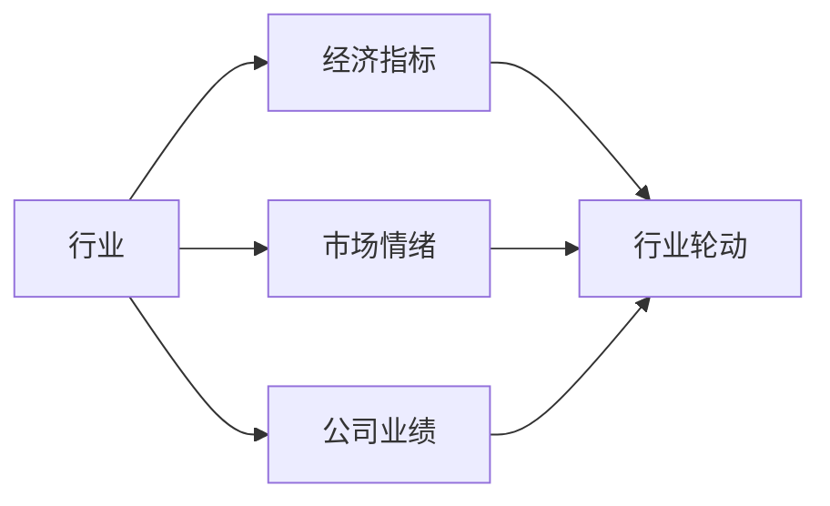
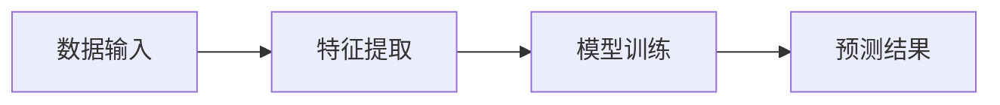
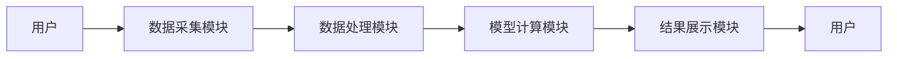

                 


# 行业轮动：识别下一个市场热点的方法

> 关键词：行业轮动，市场热点，投资策略，技术分析，金融模型

> 摘要：本文详细探讨了行业轮动的基本概念、核心算法、系统设计及实际应用，通过理论分析和实战案例，帮助读者识别下一个市场热点，制定有效的投资策略。

---

## 第一部分：行业轮动概述

### 第1章：行业轮动概述

#### 1.1 行业轮动的核心概念

##### 1.1.1 行业轮动的定义与背景

行业轮动是一种投资策略，旨在通过识别不同行业在经济周期中的表现差异，优化投资组合的收益和风险。它基于市场的动态变化，寻找当前或未来具有优势的行业进行投资。

行业轮动的核心在于对经济周期的敏感性。在不同的经济阶段（如复苏、过热、滞胀、衰退），不同行业的表现会有显著差异。例如，在经济衰退期间，防御性行业（如公用事业、医疗保健）可能表现优于周期性行业（如能源、材料）。

##### 1.1.2 行业轮动的特征与边界

行业轮动具有周期性、动态性和可预测性三大特征。周期性意味着行业表现会随经济周期波动；动态性指行业轮动受多种因素影响，如政策变化、技术创新等；可预测性则基于历史数据和模型分析。

行业轮动的边界包括时间和空间维度。时间上，轮动周期可能从几个月到几年不等；空间上，不同国家或地区的行业轮动模式可能差异显著。

##### 1.1.3 行业轮动的核心要素

行业轮动的核心要素包括：
- **经济指标**：GDP增速、CPI、失业率等。
- **市场情绪**：投资者情绪指数、市场波动率。
- **行业基本面**：行业盈利能力、增长潜力。

#### 1.2 行业轮动的理论基础

##### 1.2.1 经济周期与行业轮动

经济周期对行业轮动的影响是最显著的。在复苏期，周期性行业（如工业、材料）往往表现优于防御性行业；在过热期，金融、科技行业可能领涨；而在衰退期，防御性行业更具抗跌性。

##### 1.2.2 市场结构与行业轮动

市场结构的差异也会影响行业轮动。例如，在新兴市场，周期性行业可能波动更大；而在成熟市场，防御性行业可能更稳定。

##### 1.2.3 投资者行为与行业轮动

投资者行为，特别是资金流动和情绪变化，也是行业轮动的重要驱动力。例如，资金流入某个行业可能导致其股价上涨，从而引发正反馈效应。

#### 1.3 行业轮动的应用场景

##### 1.3.1 股票投资中的行业轮动

在股票投资中，行业轮动用于优化投资组合，降低风险。例如，投资者可以在经济衰退期超配防御性行业，而在复苏期超配周期性行业。

##### 1.3.2 基金投资中的行业轮动

基金可以通过行业轮动调整持仓，捕捉市场热点。例如，行业轮动型基金可以根据市场变化动态调整行业配置。

##### 1.3.3 行业轮动在风险管理中的应用

行业轮动可以用于风险控制。例如，当市场出现系统性风险时，投资者可以通过调整行业配置降低组合风险。

---

### 第2章：行业轮动的核心概念与联系

#### 2.1 行业轮动的核心原理

##### 2.1.1 行业轮动的驱动因素

行业轮动的驱动因素包括：
- **宏观经济因素**：如GDP增速、利率、通胀等。
- **行业基本面因素**：如行业盈利、估值水平等。
- **市场情绪因素**：如投资者情绪、市场流动性等。

##### 2.1.2 行业轮动的周期性特征

行业轮动的周期性特征可以用以下公式表示：
$$
R_i = \beta_i (R_f + \alpha_i) + \epsilon_i
$$
其中，$R_i$是行业i的超额收益，$\beta_i$是行业i的beta系数，$R_f$是无风险利率，$\alpha_i$是行业i的alpha系数，$\epsilon_i$是误差项。

##### 2.1.3 行业轮动的数学模型

行业轮动的数学模型可以表示为：
$$
P_i(t) = \mu_i + \sigma_i \cdot Z
$$
其中，$P_i(t)$是行业i在时间t的价格，$\mu_i$是行业i的平均收益，$\sigma_i$是行业i的收益波动率，$Z$是标准正态分布变量。

#### 2.2 行业轮动的核心概念对比

##### 2.2.1 行业轮动与资产配置

| 对比维度 | 行业轮动 | 资产配置 |
|----------|----------|----------|
| 调整频率 | 高频     | 低频     |
| 调整幅度 | 中高     | 较低     |
| 目标     | 捕捉行业收益 | 优化整体收益 |

##### 2.2.2 行业轮动与市场择时

| 对比维度 | 行业轮动 | 市场择时 |
|----------|----------|----------|
| 投资范围 | 行业     | 整个市场 |
| 操作难度 | 中高     | 较高     |
| 收益来源 | 行业差异 | 市场波动 |

##### 2.2.3 行业轮动与行业分析

| 对比维度 | 行业轮动 | 行业分析 |
|----------|----------|----------|
| 方法     | 统计模型 | 基本面分析 |
| 目标     | 捕捉轮动机会 | 评估行业前景 |
| 数据     | 历史数据 | 两者结合 |

#### 2.3 行业轮动的实体关系图



---

### 第3章：行业轮动的算法原理

#### 3.1 行业轮动的主要算法

##### 3.1.1 基于动量的行业轮动模型

动量模型基于“动量效应”，即近期表现好的行业未来可能继续表现良好。其核心思想是：
$$
P_{i,t} = \alpha + \beta \cdot P_{i,t-1} + \epsilon
$$

##### 3.1.2 基于均值回归的行业轮动模型

均值回归模型认为市场会回归均值，即表现过好的行业未来可能表现不佳。其核心思想是：
$$
P_{i,t} = \mu + \beta \cdot (R_f - P_{i,t-1}) + \epsilon
$$

##### 3.1.3 基于因子分析的行业轮动模型

因子分析模型将行业表现分解为几个因子，如市值、价值、动量等。其核心思想是：
$$
P_{i,t} = \sum_{k=1}^n w_k \cdot F_k + \epsilon
$$

#### 3.2 行业轮动算法的实现步骤

##### 3.2.1 数据收集与预处理

数据收集包括获取各行业的历史价格、财务数据、宏观经济指标等。预处理包括数据清洗、标准化、去噪等。

##### 3.2.2 模型训练与参数优化

使用历史数据训练模型，优化参数，如选择最优动量周期、最优因子权重等。

##### 3.2.3 模型验证与回测

通过回测验证模型的有效性，计算夏普比率、最大回撤等指标。

#### 3.3 行业轮动算法的数学模型



---

### 第4章：行业轮动的系统分析与架构设计

#### 4.1 行业轮动系统的功能设计

##### 4.1.1 数据采集模块

负责采集各行业的历史数据、实时数据等。

##### 4.1.2 数据处理模块

对采集到的数据进行清洗、转换、标准化等处理。

##### 4.1.3 模型计算模块

根据处理后的数据，运行行业轮动模型，生成投资建议。

##### 4.1.4 结果展示模块

将模型结果以可视化形式展示，如仪表盘、图表等。

#### 4.2 行业轮动系统的架构设计


#### 4.3 行业轮动系统的接口设计

##### 4.3.1 数据接口

包括数据输入接口和数据输出接口。

##### 4.3.2 模型接口

包括模型输入接口和模型输出接口。

##### 4.3.3 结果接口

包括结果展示接口和结果导出接口。

#### 4.4 行业轮动系统的交互流程图



---

### 第5章：行业轮动的项目实战

#### 5.1 项目环境安装

安装必要的Python库，如Pandas、NumPy、Matplotlib、Scikit-learn等。

#### 5.2 项目核心实现

##### 5.2.1 数据获取与处理

```python
import pandas as pd
import numpy as np

# 获取行业数据
data = pd.read_csv('industry_data.csv')
# 数据清洗
data.dropna(inplace=True)
data = data.iloc[-100:]  # 取最近100个交易日的数据
```

##### 5.2.2 模型实现

```python
from sklearn.linear_model import LinearRegression

# 训练动量模型
model = LinearRegression()
model.fit(X, y)
# 预测下一个交易日的行业表现
y_pred = model.predict(X_test)
```

##### 5.2.3 结果展示

```python
import matplotlib.pyplot as plt

plt.plot(y, label='实际值')
plt.plot(y_pred, label='预测值')
plt.legend()
plt.show()
```

#### 5.3 项目实战分析

##### 5.3.1 回测分析

计算模型的回测收益、最大回撤、夏普比率等指标。

##### 5.3.2 风险管理

制定风险管理策略，如止损、止盈、头寸分配等。

##### 5.3.3 策略优化

根据回测结果，优化模型参数，提高收益或降低风险。

#### 5.4 项目小结

总结项目成果，分析可能的问题和改进建议。

---

## 第五部分：行业轮动的最佳实践

### 5.1 行业轮动的注意事项

- **市场风险**：行业轮动模型可能在极端市场条件下失效。
- **数据质量**：数据的完整性和准确性直接影响模型效果。
- **模型更新**：需要定期更新模型，以适应市场变化。

### 5.2 行业轮动的拓展阅读

- 建议阅读《投资学》、《金融时间序列分析》等书籍。
- 关注行业轮动相关的学术论文和行业报告。

### 5.3 行业轮动的小结

行业轮动是一种有效的投资策略，但需要结合市场环境和投资者目标灵活运用。通过不断学习和实践，可以提高行业轮动的效果。

---

通过以上内容，我们可以系统地了解行业轮动的基本概念、算法原理、系统设计及实际应用，帮助投资者识别下一个市场热点，制定有效的投资策略。

