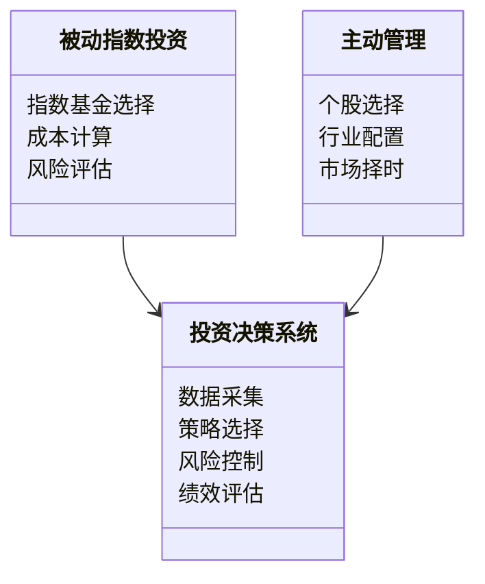

                 

# 被动指数投资vs主动管理：哪种更适合当前市场环境

## 关键词：被动指数投资、主动管理、市场环境、投资策略、风险收益

## 摘要：在当前市场环境下，被动指数投资与主动管理各有优劣。被动指数投资因其低成本、低风险和高度分散的特点，逐渐成为投资者的首选。而主动管理则依赖于基金经理的市场预测和选股能力，在特定市场条件下表现优异。本文将从理论基础、实证分析、系统架构等多个维度进行对比，探讨哪种策略更适合当前市场环境。

---

# 第一部分：被动指数投资与主动管理的背景与基础

## 第1章：投资策略概述

### 1.1 投资策略的基本概念

#### 1.1.1 投资的基本概念
投资是指将资金投入到资产中，以期在未来获得收益或资本增值的行为。投资的核心目标是通过资产配置和风险管理，实现财富的保值与增值。

#### 1.1.2 被动与主动管理的定义
- **被动管理**：被动管理是指通过跟踪特定市场指数或复制市场表现来实现投资目标的策略。其核心理念是“买入并持有”，相信市场会自我调整以达到有效定价。
- **主动管理**：主动管理是指通过精选个股、行业轮换、市场择时等主动操作，试图超越市场基准指数的表现。

#### 1.1.3 两种策略的核心区别
| 对比维度 | 被动管理 | 主动管理 |
|----------|----------|----------|
| **目标** | 复制市场表现 | 超越市场表现 |
| **操作方式** | 指数基金、ETF | 选股、择时、行业配置 |
| **费用** | 低 | 高 |
| **风险** | 低 | 高 |

---

## 第2章：被动指数投资与主动管理的历史发展

### 2.1 被动指数投资的起源

#### 2.1.1 索罗斯与主动管理的兴起
索罗斯作为主动管理的代表人物，以其成功的市场择时和个股选择闻名。他的投资策略基于基本面分析和市场情绪预测。

#### 2.1.2 索普与指数基金的创新
索普提出指数投资理论，认为市场是有效的，主动管理难以长期跑赢市场，因此指数基金成为一种低成本、低风险的投资选择。

#### 2.1.3 现代指数基金的发展历程
随着技术进步和市场效率的提高，指数基金因其透明性和低成本，逐渐成为个人投资者的首选。

---

## 第3章：当前市场环境下的投资策略选择

### 3.1 全球化与市场波动

#### 3.1.1 全球化对市场的影响
全球化导致市场的关联性增强，信息传播更快，投资者行为趋同化，市场波动加剧。

#### 3.1.2 疫情对市场的长期影响
疫情暴露了市场的脆弱性，但也加速了市场的数字化和机构化。

#### 3.1.3 技术进步对投资策略的改变
大数据和人工智能技术的应用，使得主动管理能够更精准地进行市场预测和风险控制。

### 3.2 机构投资者的行为分析

#### 3.2.1 机构投资者的决策逻辑
机构投资者通常采用主动管理策略，通过规模效应和专业团队实现超额收益。

#### 3.2.2 机构投资者对市场的影响
机构投资者的行为可以影响市场的流动性和价格波动。

#### 3.2.3 机构投资者的短期与长期目标
机构投资者通常有长期投资目标，但短期考核压力可能导致短期行为。

---

# 第二部分：被动指数投资与主动管理的核心概念对比

## 第4章：核心概念与理论基础

### 4.1 被动指数投资的理论基础

#### 4.1.1 有效市场假说
有效市场假说认为，在一个信息有效的市场中，价格已经反映了所有可获得的信息，因此主动管理难以获得超额收益。

#### 4.1.2 索普的指数投资理论
索普提出，指数基金能够以最小的成本实现市场平均收益，适合大多数投资者。

#### 4.1.3 被动投资的成本优势
指数基金的管理费用远低于主动管理型基金，长期来看，成本优势显著。

### 4.2 主动管理的理论基础

#### 4.2.1 资本资产定价模型（CAPM）
CAPM模型用于评估资产的预期收益，是主动管理中常用的工具。

#### 4.2.2 投资组合理论
投资组合理论强调通过分散投资降低风险，是主动管理的重要基础。

#### 4.2.3 主动管理的风险与收益
主动管理的风险主要来自于市场预测的错误和选股失误，但潜在收益更高。

---

## 第5章：核心概念的对比分析

### 5.1 优缺点对比

#### 5.1.1 被动投资的优势
- 成本低
- 风险分散
- 操作简单

#### 5.1.2 主动管理的优势
- 潜在超额收益
- 灵活性高
- 风险可控

#### 5.1.3 两者的劣势与挑战
- 被动投资：无法跑赢市场
- 主动管理：费用高、风险大

### 5.2 风险与收益对比

#### 5.2.1 风险的来源与衡量
- 市场风险
- 利率风险
- 流动性风险

#### 5.2.2 收益的来源与衡量
- 利息收入
- 资本增值
- 选股能力

#### 5.2.3 风险收益比的对比分析
通过夏普比率和特雷纳比率等指标，可以量化两种策略的风险收益比。

---

## 第6章：系统架构与项目实战

### 6.1 项目介绍

#### 6.1.1 项目背景
开发一个投资决策系统，用于比较被动指数投资和主动管理在当前市场环境下的表现。

### 6.2 系统功能设计

#### 6.2.1 领域模型设计

### 6.3 系统架构设计

#### 6.3.1 系统架构图

---

## 第7章：总结与展望

### 7.1 核心观点总结
被动指数投资在当前市场环境下更具优势，尤其是在市场效率和成本控制方面。

### 7.2 未来展望
随着技术进步和市场环境的变化，被动指数投资和主动管理的边界可能会进一步模糊。

### 7.3 最佳实践 tips
- 个人投资者更适合被动指数投资
- 机构投资者可以尝试主动管理
- 组合投资是降低风险的有效方式

---

通过以上分析，可以看出被动指数投资在当前市场环境下更具优势，但也需要根据投资者的自身情况和市场环境做出选择。

