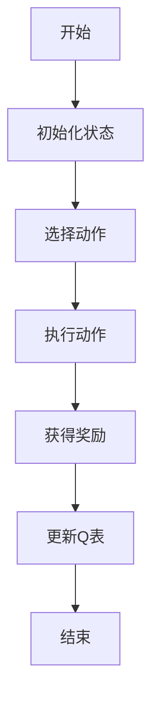

                 


# 规模化部署：将AI Agent推广到生产环境

## 关键词：AI Agent，规模化部署，生产环境，分布式系统，容器化，微服务

## 摘要：  
在当今快速发展的技术环境中，AI Agent的应用越来越广泛，但在实际应用中，如何将AI Agent高效、稳定地推广到生产环境，仍面临诸多挑战。本文从AI Agent的基本概念出发，深入探讨其算法原理、系统架构设计以及在实际项目中的应用，为读者提供从理论到实践的全面指导。

---

# 第一部分：AI Agent与规模化部署的背景

## 第1章：AI Agent的基本概念

### 1.1 AI Agent的定义与核心特征

AI Agent（人工智能代理）是一种能够感知环境、自主决策并执行任务的智能实体。其核心特征包括：

- **自主性**：能够在没有外部干预的情况下独立运行。
- **反应性**：能够实时感知环境变化并做出响应。
- **目标导向**：基于预设目标或用户需求执行任务。
- **可扩展性**：能够适应不同的应用场景和规模。

### 1.2 AI Agent的分类与应用场景

AI Agent可以分为以下几类：

1. **基于规则的AI Agent**：通过预设的规则和条件执行任务，适用于简单的决策场景。
2. **基于学习的AI Agent**：通过机器学习算法不断优化行为，适用于复杂场景。
3. **基于知识的AI Agent**：依赖知识库进行推理和决策，适用于需要深度分析的场景。

应用场景包括：
- **智能客服**：通过自然语言处理为用户提供支持。
- **自动驾驶**：实时感知环境并做出驾驶决策。
- **智能推荐系统**：根据用户行为推荐相关内容。

### 1.3 从单体AI到AI Agent的演进

随着技术的进步，AI系统从简单的单体AI向AI Agent演进。单体AI通常依赖于中心化的计算资源，而AI Agent则通过分布式架构实现更高效的资源利用和任务执行。

---

## 第2章：规模化部署的背景与挑战

### 2.1 企业级AI应用的挑战

在企业级应用中，AI Agent的部署面临以下挑战：
- **资源利用率**：如何高效利用计算资源以支持大规模任务。
- **高可用性**：确保系统在故障发生时能够快速恢复。
- **安全性**：防止数据泄露和攻击。

### 2.2 规模化部署的核心目标

- **高效利用资源**：通过分布式架构最大化资源利用率。
- **确保高可用性**：通过冗余设计和自愈机制保障系统稳定。
- **支持快速扩展**：根据负载动态调整资源分配。

### 2.3 规模化部署的关键问题

- **系统架构设计**：如何设计高效的分布式架构。
- **任务调度优化**：如何实现任务的高效调度。
- **监控与维护**：如何实时监控系统状态并及时修复问题。

---

# 第二部分：AI Agent的算法原理与数学模型

## 第3章：基于强化学习的AI Agent算法

### 3.1 强化学习的基本原理

强化学习是一种通过试错机制来优化决策的算法。AI Agent通过与环境交互，不断调整策略以获得最大化的累积奖励。

### 3.2 Q-learning算法的实现

Q-learning是一种经典的强化学习算法，其核心思想是通过维护一个Q表来记录状态-动作对的期望奖励值，并通过更新Q表来优化策略。



### 3.3 算法的数学推导

Q-learning的更新公式如下：
$$ Q(s, a) = Q(s, a) + \alpha \cdot [r + \gamma \cdot \max Q(s', a) - Q(s, a)] $$
其中：
- \( Q(s, a) \) 表示当前状态下选择动作 \( a \) 的Q值。
- \( \alpha \) 表示学习率。
- \( r \) 表示获得的奖励。
- \( \gamma \) 表示折扣因子。
- \( \max Q(s', a) \) 表示下一个状态下动作的最大Q值。

---

## 第4章：系统架构设计与优化

### 4.1 分布式架构的设计

为了支持大规模部署，AI Agent通常采用分布式架构。以下是常见的分布式架构模式：

1. **客户机-服务器模式**：AI Agent作为服务器，接收客户端请求并返回结果。
2. **微服务架构**：将AI Agent的功能模块化，每个模块独立运行并互相通信。

### 4.2 高可用性设计

为了确保系统的高可用性，可以采取以下措施：
- **负载均衡**：通过负载均衡器将请求分发到不同的AI Agent实例。
- **冗余设计**：部署多个AI Agent实例，确保在某个实例故障时，其他实例能够接管任务。
- **自愈机制**：通过自动化监控和修复，快速检测并恢复故障。

### 4.3 容器化部署

容器化技术（如Docker）为AI Agent的部署提供了极大的便利。通过容器化部署，可以快速启动和停止AI Agent实例，并确保每个实例运行在一致的环境中。

---

# 第三部分：项目实战与优化

## 第5章：AI Agent项目实战

### 5.1 环境搭建

1. **安装Docker**：用于容器化部署。
2. **安装Kubernetes**：用于容器编排和管理。

### 5.2 系统核心实现

以下是一个简单的AI Agent实现示例：

```python
class AI-Agent:
    def __init__(self, environment):
        self.environment = environment
        self.reward = 0
        self.current_state = environment.get_initial_state()

    def perceive(self):
        # 获取当前状态
        self.current_state = self.environment.get_state()

    def decide(self):
        # 基于当前状态选择动作
        action = self.choose_action(self.current_state)
        return action

    def execute(self, action):
        # 执行动作并获得奖励
        next_state, reward = self.environment.execute_action(action)
        self.reward += reward
        return next_state

    def learn(self, next_state):
        # 更新Q表
        self.update_Q(self.current_state, next_state)
```

### 5.3 代码解读与分析

1. **AI-Agent类**：封装了AI Agent的核心功能，包括感知、决策、执行和学习。
2. **perceive方法**：获取当前环境状态。
3. **decide方法**：基于当前状态选择动作。
4. **execute方法**：执行选择的动作并获得奖励。
5. **learn方法**：通过强化学习算法更新Q表。

---

## 第6章：优化与总结

### 6.1 优化策略

1. **算法优化**：通过改进强化学习算法（如使用更深的神经网络）提高决策效率。
2. **资源优化**：通过优化容器化配置（如调整资源配额）提高资源利用率。

### 6.2 项目小结

通过本项目的实践，我们掌握了AI Agent的核心算法和系统架构设计方法，同时也了解了如何将AI Agent成功部署到生产环境。

---

# 第四部分：最佳实践与未来展望

## 第7章：最佳实践

### 7.1 系统监控

1. **实时监控**：通过监控工具（如Prometheus）实时监控系统状态。
2. **日志管理**：通过日志分析工具（如ELK）快速定位问题。

### 7.2 安全管理

1. **身份认证**：通过OAuth等机制实现身份认证。
2. **访问控制**：通过RBAC（基于角色的访问控制）实现细粒度的权限管理。

---

## 第8章：未来展望

### 8.1 技术趋势

1. **多智能体协同**：未来的AI Agent将更加注重多智能体的协同工作。
2. **边缘计算**：AI Agent将更多地部署在边缘设备上，以减少延迟。

### 8.2 挑战与机遇

1. **挑战**：如何在复杂多变的环境中保持AI Agent的稳定性和高效性。
2. **机遇**：通过技术创新（如AI与区块链的结合）实现更高效、更安全的AI Agent部署。

---

# 结语

规模化部署AI Agent是一项复杂的系统工程，涉及算法设计、系统架构、资源管理等多个方面。通过本文的详细讲解，希望能够为读者提供从理论到实践的全面指导，帮助他们成功地将AI Agent推广到生产环境。

