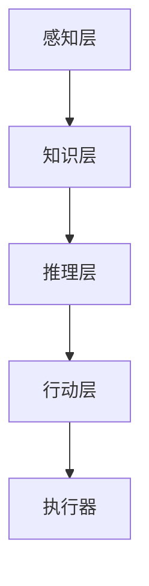

                 


# 认知架构：模拟人类思维的AI Agent设计

## 关键词：
认知架构，AI Agent，人工智能，知识表示，注意力机制，强化学习

## 摘要：
本文深入探讨了认知架构在AI Agent设计中的核心作用，分析了认知架构的基本概念、AI Agent的核心要素及其数学模型与算法原理。通过具体案例，展示了如何基于认知架构设计智能系统，并结合项目实战，详细讲解了实现过程和最佳实践。文章最后总结了设计AI Agent时的关键注意事项和未来研究方向。

---

## 第1章：认知架构的基本概念

### 1.1 认知架构的定义与特点

#### 1.1.1 什么是认知架构
认知架构是模拟人类认知过程的系统框架，它整合了感知、推理、学习和决策等核心功能。认知架构的目标是使AI系统能够像人类一样理解环境、解决问题并做出合理决策。

#### 1.1.2 认知架构的核心特点
- **知识表示**：通过符号或分布式表示存储和处理知识。
- **动态推理**：能够根据实时信息动态调整推理过程。
- **自适应性**：能够从经验中学习并适应新环境。
- **情境理解**：能够理解当前情境并做出相应反应。

#### 1.1.3 认知架构与传统AI的区别
传统AI（如专家系统）依赖规则和预定义知识，而认知架构强调动态推理和知识的自适应更新。认知架构更接近人类的思维方式，能够处理复杂、不确定的现实问题。

### 1.2 AI Agent的定义与分类

#### 1.2.1 AI Agent的基本定义
AI Agent是具有感知环境、理解任务目标、并采取行动以实现目标的智能体。它可以自主决策，适应环境变化。

#### 1.2.2 基于认知架构的AI Agent
基于认知架构的AI Agent能够进行知识表示、推理和决策，具备更强的智能性和适应性。

#### 1.2.3 AI Agent的分类与应用场景
- **简单反射型Agent**：基于规则的反应式系统，适用于简单任务。
- **基于模型的反应式Agent**：结合环境模型进行决策，适用于复杂任务。
- **目标驱动型Agent**：以目标为导向，主动规划行动。
- **学习型Agent**：能够通过经验改进性能，适用于需要自适应的任务。

### 1.3 认知架构与AI Agent的演进

#### 1.3.1 从符号AI到深度学习的演变
符号AI依赖规则和逻辑推理，而深度学习通过神经网络模拟人类学习。认知架构将两者结合，形成了更强大的AI系统。

#### 1.3.2 认知架构的兴起
随着NLP和计算机视觉的突破，认知架构在理解复杂情境和动态推理方面显示出巨大潜力。

#### 1.3.3 AI Agent在现代技术中的地位
AI Agent是认知架构的核心应用载体，能够实现人机交互、智能决策和自主行动。

---

## 第2章：认知架构的核心概念与联系

### 2.1 认知架构的核心原理

#### 2.1.1 知识表示与推理
知识表示是认知架构的基础，常用符号逻辑或分布式表示。推理过程基于知识库中的信息进行逻辑推导。

#### 2.1.2 注意力机制与情境理解
注意力机制帮助AI Agent聚焦重要信息，提升情境理解能力。

#### 2.1.3 感知与行动的闭环
感知环境、推理决策、执行行动的闭环确保AI Agent能够动态调整行为。

### 2.2 AI Agent的核心要素

#### 2.2.1 感知模块
负责接收环境信息，如视觉、听觉输入。

#### 2.2.2 知识库与推理引擎
知识库存储结构化知识，推理引擎基于知识进行逻辑推导。

#### 2.2.3 行动规划模块
负责制定行动计划并执行。

### 2.3 认知架构与AI Agent的关系

#### 2.3.1 认知架构为AI Agent提供知识基础
认知架构通过知识表示和推理为AI Agent提供决策依据。

#### 2.3.2 AI Agent是认知架构的应用载体
AI Agent将认知架构的能力转化为实际应用，实现智能交互和决策。

#### 2.3.3 两者结合实现智能决策
认知架构与AI Agent的结合使系统具备理解、推理和自主决策能力。

---

## 第3章：认知架构的数学模型与算法原理

### 3.1 注意力机制的数学模型

#### 3.1.1 注意力机制的公式推导
注意力机制的核心公式：
$$
\text{Attention}(Q, K, V) = \text{softmax}\left(\frac{QK^T}{\sqrt{d_k}}\right)V
$$
其中，$Q$、$K$、$V$分别是查询、键、值向量，$d_k$是键的维度。

#### 3.1.2 多头注意力的实现原理
多头注意力通过并行处理不同子空间的信息，提升模型表达能力。

#### 3.1.3 位置编码与序列建模
位置编码将序列位置信息嵌入模型，帮助处理顺序信息。

### 3.2 知识表示与推理的算法

#### 3.2.1 基于图的表示学习
知识图谱通过图结构表示实体间的关系，推理过程基于图遍历算法。

#### 3.2.2 知识图谱的构建与推理
知识图谱构建涉及实体识别、关系抽取和知识融合。

#### 3.2.3 带有记忆机制的RNN模型
记忆机制帮助模型在长序列中保持上下文信息。

### 3.3 状态空间与决策树的构建

#### 3.3.1 状态空间的定义与划分
状态空间是所有可能环境状态的集合，决策树用于规划行动路径。

#### 3.3.2 决策树的构建与优化
决策树通过剪枝优化，减少计算复杂度。

#### 3.3.3 基于强化学习的决策策略
强化学习通过奖励机制优化决策策略。

---

## 第4章：AI Agent的系统架构设计

### 4.1 系统架构的整体框架

#### 4.1.1 感知层的设计与实现
感知层通过传感器或API获取环境信息。

#### 4.1.2 知识层的构建与管理
知识层存储和管理结构化知识，支持动态更新。

#### 4.1.3 行动层的规划与执行
行动层基于推理结果制定行动计划并执行。

### 4.2 系统功能模块设计

#### 4.2.1 感知模块的功能与接口
感知模块负责接收输入数据，提供给推理模块处理。

#### 4.2.2 知识库的结构
知识库由实体、关系和属性组成，支持高效查询和推理。

#### 4.2.3 推理模块的实现
推理模块基于知识库进行逻辑推理，输出决策建议。

### 4.3 系统架构图



### 4.4 接口与交互流程

#### 4.4.1 系统接口设计
- `感知层`提供API接口，接收环境信息。
- `推理层`提供推理接口，输出决策结果。
- `行动层`提供执行接口，控制外部设备。

#### 4.4.2 系统交互流程
1. 感知层接收输入数据。
2. 知识层解析数据，提取关键信息。
3. 推理层基于知识库进行推理，生成决策建议。
4. 行动层根据决策建议制定行动计划。
5. 执行器执行行动，反馈结果。

### 4.5 项目实战：基于Transformer的对话系统

#### 4.5.1 环境安装
```bash
pip install transformers
```

#### 4.5.2 核心实现代码
```python
from transformers import AutoTokenizer, AutoModelForSeq2Seq

tokenizer = AutoTokenizer.from_pretrained("facebook/bart-large")
model = AutoModelForSeq2Seq.from_pretrained("facebook/bart-large")

def generate_response(input_text):
    inputs = tokenizer.encode(input_text, return_tensors="pt")
    outputs = model.generate(inputs, max_length=50)
    return tokenizer.decode(outputs[0], skip_special_tokens=True)
```

#### 4.5.3 代码分析
- 使用预训练模型进行对话生成。
- 输入文本编码，生成响应文本。
- 通过注意力机制理解上下文。

#### 4.5.4 案例分析
- **输入**：用户提问“今天天气怎么样？”
- **输出**：系统生成相关回答。

### 4.6 系统小结

---

## 第5章：最佳实践与未来展望

### 5.1 最佳实践
- **模块化设计**：确保系统各部分独立且易于维护。
- **数据质量管理**：保证知识库的准确性和完整性。
- **持续学习**：通过在线学习优化模型性能。

### 5.2 小结
认知架构为AI Agent提供了强大的知识表示和推理能力，使其能够模拟人类思维。随着技术进步，认知架构在更多领域展现出广阔的应用前景。

### 5.3 注意事项
- 确保系统的安全性和隐私保护。
- 处理复杂问题时，需结合多种算法。
- 定期更新知识库，保持系统的适应性。

### 5.4 拓展阅读
- 《Deep Learning》
- 《Artificial Intelligence: A Modern Approach》
- 《注意力机制的原理与应用》

---

# 结语

认知架构与AI Agent的结合为实现真正智能的AI系统奠定了基础。通过本文的分析，读者可以深入了解认知架构的核心原理和AI Agent的设计方法，并能够将其应用到实际项目中。未来，随着技术的发展，认知架构和AI Agent将在更多领域发挥重要作用。

