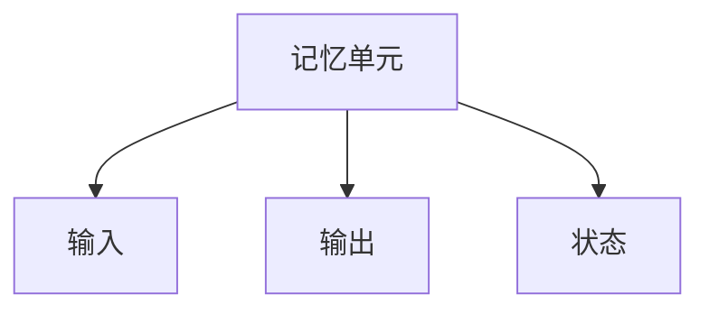
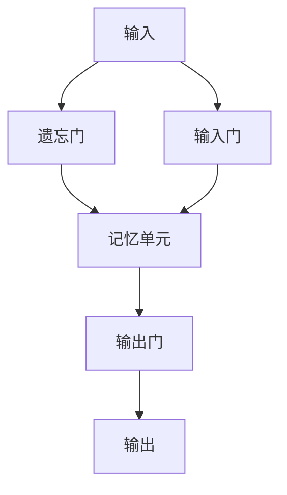
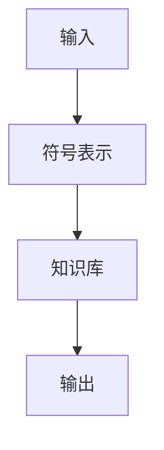
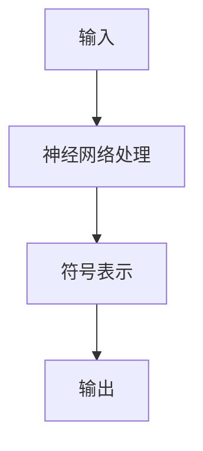
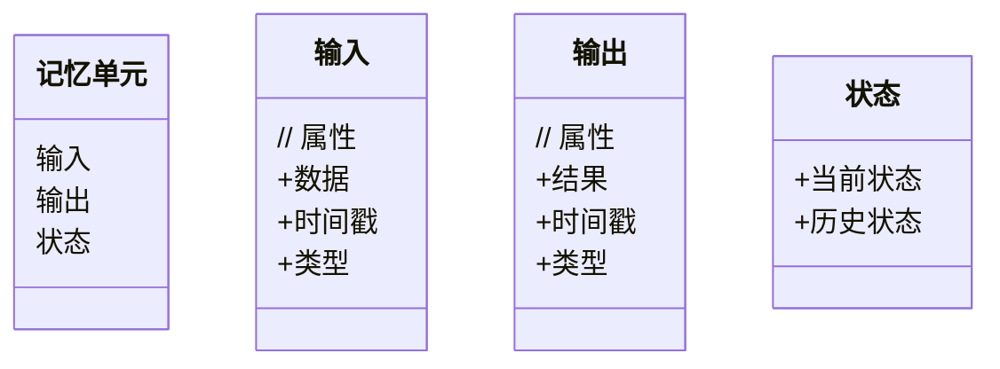
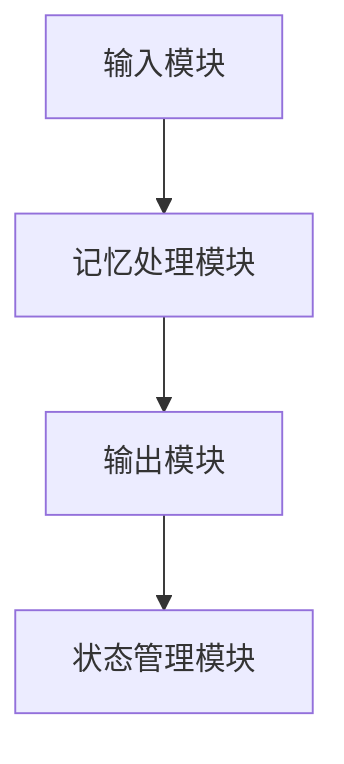

                 


# 记忆机制实现：让AI Agent具备长期记忆能力

## 关键词：记忆机制、AI Agent、长期记忆、神经网络、符号记忆、混合记忆

## 摘要：本文将详细探讨如何实现记忆机制，使AI Agent具备长期记忆能力。通过分析记忆机制的核心概念、算法原理、系统设计以及实际项目实战，本文旨在为读者提供一个全面的技术指南，帮助他们理解和实现具备长期记忆能力的AI Agent。

---

# 第1章: 记忆机制的背景与问题描述

## 1.1 人工智能与记忆机制的关联
### 1.1.1 人工智能的发展与记忆需求
### 1.1.2 当前AI Agent的局限性
### 1.1.3 长期记忆能力的重要性

## 1.2 记忆机制的核心问题
### 1.2.1 什么是长期记忆？
### 1.2.2 AI Agent记忆需求的场景
### 1.2.3 当前记忆机制的挑战与边界

## 1.3 记忆机制的核心概念
### 1.3.1 记忆机制的定义与属性
### 1.3.2 记忆机制的关键要素
### 1.3.3 记忆机制的结构与功能

## 1.4 本章小结

---

# 第2章: 记忆机制的核心概念与联系

## 2.1 记忆机制的原理
### 2.1.1 神经网络中的记忆机制
### 2.1.2 符号记忆机制
### 2.1.3 混合记忆机制

## 2.2 记忆机制的核心属性对比
### 2.2.1 不同记忆机制的对比表格
### 2.2.2 属性特征的详细分析

## 2.3 记忆机制的ER实体关系图
### 2.3.1 实体关系图的Mermaid流程图

### 2.3.2 关系图的详细解读

## 2.4 本章小结

---

# 第3章: 记忆机制的算法原理

## 3.1 神经网络记忆机制
### 3.1.1 LSTM与GRU的原理
### 3.1.2 基于Transformer的记忆机制
### 3.1.3 算法的Mermaid流程图


## 3.2 符号记忆机制
### 3.2.1 基于规则的符号记忆
### 3.2.2 基于图结构的符号记忆
### 3.2.3 算法的Mermaid流程图


## 3.3 混合记忆机制
### 3.3.1 神经符号混合记忆
### 3.3.2 基于强化学习的混合记忆
### 3.3.3 算法的Mermaid流程图


## 3.4 本章小结

---

# 第4章: 记忆机制的数学模型与公式

## 4.1 神经网络记忆机制的数学模型
### 4.1.1 LSTM的数学公式
$$
f_{\text{forget}}(x_t) = \sigma(W_f x_t + U_f h_{t-1} + b_f)
$$
### 4.1.2 GRU的数学公式
$$
f_{\text{update}}(x_t, h_{t-1}) = \sigma(W_u x_t + U_u h_{t-1} + b_u)
$$
### 4.1.3 Transformer的记忆机制公式
$$
\text{Query} = Q = x_t
$$
$$
\text{Key} = K = W_K h_{t-1}
$$
$$
\text{Value} = V = W_V h_{t-1}
$$

## 4.2 符号记忆机制的数学模型
### 4.2.1 基于规则的符号记忆公式
$$
\text{符号表示} = f(\text{输入})
$$
### 4.2.2 基于图结构的符号记忆公式
$$
\text{节点关系} = g(\text{边权重})
$$
### 4.2.3 混合记忆机制的数学公式
$$
\text{混合输出} = \alpha \cdot \text{神经网络输出} + (1-\alpha) \cdot \text{符号记忆输出}
$$

## 4.3 本章小结

---

# 第5章: 系统分析与架构设计方

## 5.1 问题场景介绍
### 5.1.1 AI Agent的应用场景
### 5.1.2 长期记忆能力的必要性
### 5.1.3 系统需求分析

## 5.2 系统功能设计
### 5.2.1 领域模型类图


## 5.3 系统架构设计
### 5.3.1 系统架构图


## 5.4 系统接口设计
### 5.4.1 接口定义
### 5.4.2 交互流程图
```mermaid
sequenceDiagram
    actor 用户
    轮询间隔
    用户 -> 输入模块: 提供输入数据
    输入模块 -> 记忆处理模块: 处理记忆
    记忆处理模块 -> 输出模块: 提供输出结果
    输出模块 -> 用户: 返回结果
```

## 5.5 本章小结

---

# 第6章: 项目实战

## 6.1 环境安装
### 6.1.1 Python安装
### 6.1.2 必要的库安装
```bash
pip install numpy
pip install tensorflow
pip install matplotlib
```

## 6.2 系统核心实现
### 6.2.1 核心代码实现
```python
import numpy as np
import tensorflow as tf

class MemoryUnit:
    def __init__(self, input_size, output_size):
        self.input_size = input_size
        self.output_size = output_size
        self.W = tf.Variable(tf.random.truncated_normal([input_size, output_size]))

    def recall(self, input_data):
        # 输入数据处理
        output = tf.matmul(input_data, self.W)
        return output
```

## 6.3 代码应用解读与分析
### 6.3.1 代码的功能分析
### 6.3.2 代码实现细节
### 6.3.3 代码的优化建议

## 6.4 实际案例分析
### 6.4.1 案例背景
### 6.4.2 案例实现
### 6.4.3 案例分析

## 6.5 项目小结

---

# 第7章: 最佳实践与总结

## 7.1 技术选型
### 7.1.1 神经网络 vs 符号记忆
### 7.1.2 混合记忆的优势
### 7.1.3 实际场景中的选择

## 7.2 性能优化
### 7.2.1 参数优化
### 7.2.2 并行计算
### 7.2.3 记忆容量的优化

## 7.3 安全性考虑
### 7.3.1 数据泄露风险
### 7.3.2 加密存储
### 7.3.3 记忆擦除机制

## 7.4 本章小结

---

# 第8章: 总结与展望

## 8.1 总结
### 8.1.1 核心内容回顾
### 8.1.2 技术难点总结
### 8.1.3 项目经验分享

## 8.2 展望
### 8.2.1 未来研究方向
### 8.2.2 记忆机制的新趋势
### 8.2.3 技术应用的潜力

## 8.3 注意事项
### 8.3.1 实际应用中的常见问题
### 8.3.2 开发中的潜在风险
### 8.3.3 使用中的注意事项

## 8.4 拓展阅读
### 8.4.1 推荐书籍
### 8.4.2 推荐论文
### 8.4.3 推荐在线资源

---

通过以上目录结构，我们可以逐步深入探讨记忆机制的实现，从理论到实践，从算法到系统设计，帮助读者全面掌握如何让AI Agent具备长期记忆能力。

