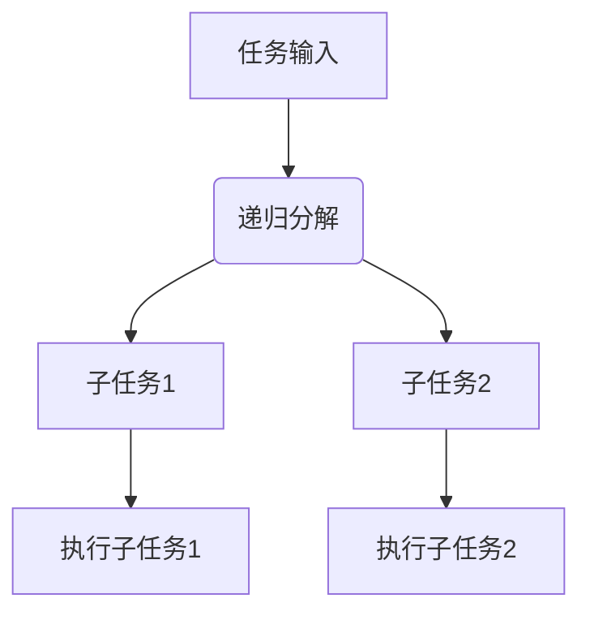
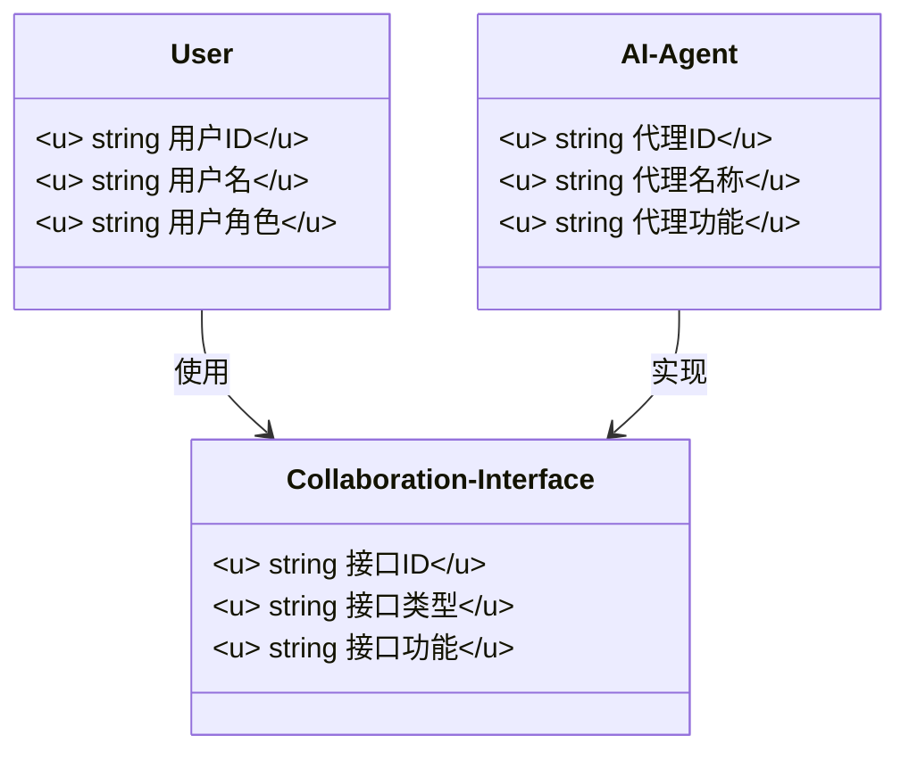

                 


# 设计AI Agent的人机协作接口

> 关键词：AI Agent, 人机协作, 接口设计, 算法原理, 系统架构, 项目实战

> 摘要：本文将详细探讨设计AI Agent的人机协作接口的关键步骤，从背景分析到系统实现，涵盖核心概念、算法原理、系统架构和项目实战。通过实例分析和代码实现，帮助读者理解如何设计高效、可靠的协作接口。

---

# 第一部分: AI Agent与人机协作接口的背景与核心概念

## # 第1章: 问题背景与核心概念

### ## 1.1 问题背景介绍
#### ### 1.1.1 AI Agent的定义与分类
AI Agent（智能体）是指能够感知环境并采取行动以实现目标的实体。它可以分为简单反射型、基于模型的反射型、目标驱动型和效用驱动型。人机协作接口则是连接用户与AI Agent的桥梁，负责接收输入、传递指令和反馈结果。

#### ### 1.1.2 人机协作的定义与特点
人机协作是指人类与AI Agent共同完成任务的过程。其特点包括实时性、交互性和智能性。协作接口需要具备高效处理用户输入、准确解析需求并执行任务的能力。

#### ### 1.1.3 当前AI Agent协作中的主要问题
当前协作接口存在以下问题：
1. **信息不对称**：用户需求难以准确传递给AI Agent。
2. **反馈延迟**：AI Agent的反馈不够及时，影响协作效率。
3. **接口不兼容**：不同系统之间的接口标准化不足，导致协作困难。

### ## 1.2 核心概念与问题描述
#### ### 1.2.1 AI Agent的协作需求分析
AI Agent需要理解用户的意图，执行任务并返回结果。协作接口需支持自然语言处理、任务分解和反馈优化。

#### ### 1.2.2 人机协作接口的设计目标
设计目标包括：
- 实时性：快速响应用户需求。
- 可扩展性：支持多种协作场景。
- 易用性：用户友好，降低使用门槛。

#### ### 1.2.3 当前协作接口的主要挑战
主要挑战包括：
- 复杂的输入解析：用户需求多样，解析难度大。
- 高效的任务执行：需要快速调用相关服务。
- 反馈机制优化：确保用户及时获得反馈。

### ## 1.3 问题解决与边界分析
#### ### 1.3.1 问题解决的思路与方法
通过优化协作接口的输入解析、任务分解和反馈机制，提升协作效率。采用自然语言处理和机器学习算法，实现精准的需求解析和高效的执行流程。

#### ### 1.3.2 协作接口的边界与外延
协作接口的边界包括用户输入、任务执行和结果反馈。外延则涉及系统集成和用户反馈优化。

#### ### 1.3.3 核心要素与组成结构
核心要素包括输入解析模块、任务执行模块和反馈优化模块。协作接口由这三个模块组成，形成完整的协作流程。

---

# 第二部分: 算法原理与实现

## # 第2章: 算法原理与实现

### ## 2.1 算法原理讲解
协作接口的关键算法包括自然语言处理模型、任务分解算法和反馈优化算法。

#### ### 2.1.1 自然语言处理模型
使用预训练模型如BERT进行用户输入解析，提取意图和实体信息。Mermaid流程图展示如下：
```mermaid
graph TD
    A[用户输入] --> B(自然语言处理)
    B --> C[意图识别]
    C --> D(任务分解)
    D --> E[执行计划]
    E --> F[接口调用]
    F -

```

#### ### 2.1.2 任务分解算法
任务分解通过递归分解法将复杂任务拆分为子任务，Mermaid流程图如下：


#### ### 2.1.3 反馈优化算法
基于强化学习优化反馈机制，Python代码示例：
```python
def feedback_optimization(feedback):
    reward = calculate_reward(feedback)
    update_policy(reward)
    return optimized_feedback
```

### ## 2.2 数学模型与公式
自然语言处理模型的损失函数：
$$ L = -\sum_{i=1}^{n} y_i \log p(y_i|x_i) $$
任务分解算法的分解函数：
$$ f(x) = \bigcup_{i=1}^{k} f_i(x_i) $$
反馈优化的奖励函数：
$$ R(s, a) = r(s, a) $$

---

# 第三部分: 系统分析与架构设计

## # 第3章: 系统分析与架构设计

### ## 3.1 问题场景与系统介绍
协作接口应用于智能助手、机器人控制等领域。系统功能包括需求解析、任务执行和反馈优化。

### ## 3.2 系统功能设计
#### ### 3.2.1 领域模型设计
Mermaid类图展示领域模型：


#### ### 3.2.2 系统架构设计
协作接口采用分层架构，Mermaid架构图展示：


#### ### 3.2.3 接口设计与交互流程
协作接口采用RESTful API，交互流程如下：
1. 用户发送请求。
2. 接口解析请求并调用相应服务。
3. 服务执行任务并返回结果。
4. 接口将结果反馈给用户。

### ## 3.3 系统实现与代码解读
协作接口的核心代码如下：
```python
def handle_request(request):
    parse_request(request)
    task_decomposition(request)
    execute_task(request)
    return response
```

---

# 第四部分: 项目实战

## # 第4章: 项目实战

### ## 4.1 环境安装与配置
安装必要的依赖：
```bash
pip install requests numpy tensorflow
```

### ## 4.2 核心代码实现
协作接口的实现代码：
```python
def main():
    request = receive_input()
    response = handle_request(request)
    print(response)
```

### ## 4.3 代码解读与分析
代码解读包括输入接收、任务分解和结果反馈三个部分，确保协作流程的高效执行。

### ## 4.4 实际案例分析
通过案例分析协作接口的实际应用，验证设计的有效性。

### ## 4.5 项目小结
总结项目实现的关键点和经验教训，为后续优化提供参考。

---

# 第五部分: 最佳实践

## # 第5章: 最佳实践

### ## 5.1 小结与总结
设计协作接口需注重实时性、可扩展性和易用性。

### ## 5.2 注意事项
- 确保接口的兼容性。
- 定期优化反馈机制。
- 及时处理异常情况。

### ## 5.3 拓展阅读
推荐阅读相关领域的书籍和论文，深入理解协作接口的设计原理。

---

# 结语

设计AI Agent的人机协作接口是一项复杂而重要的任务。通过本文的详细讲解，读者可以掌握核心概念、算法原理和系统实现。未来，随着AI技术的发展，协作接口将变得更加智能和高效。

---

希望这篇文章能满足您的需求。如果需要进一步调整或补充，请随时告知！

