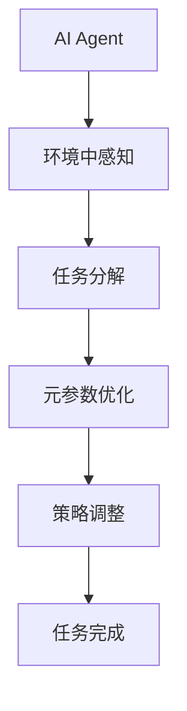
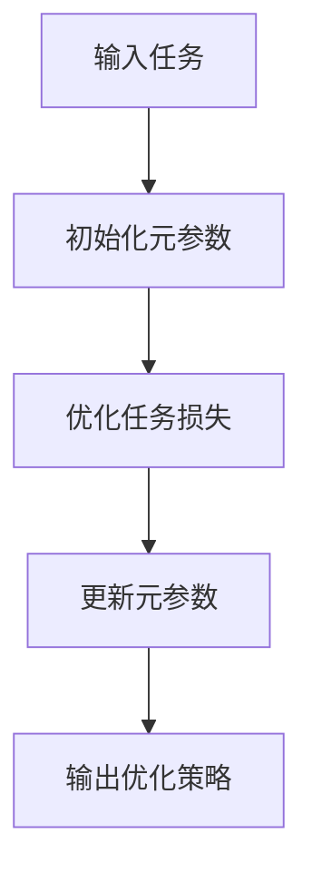
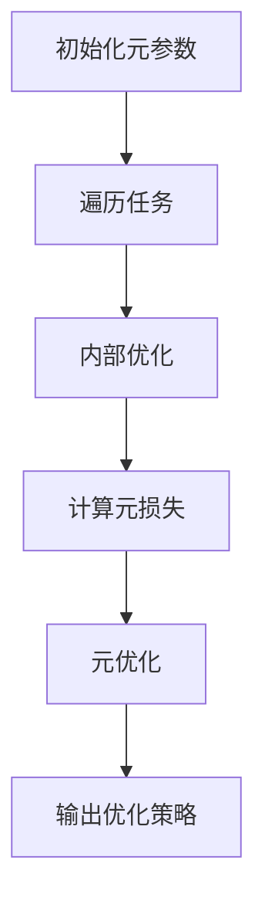
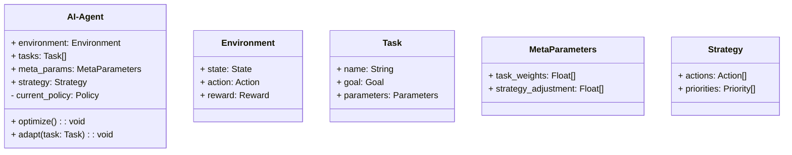
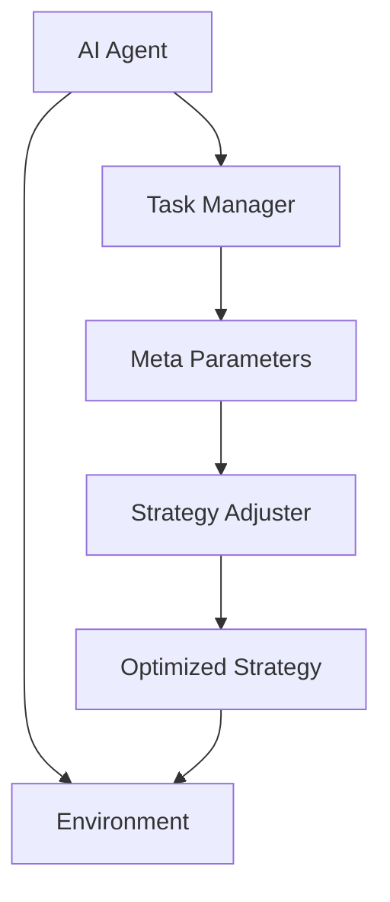
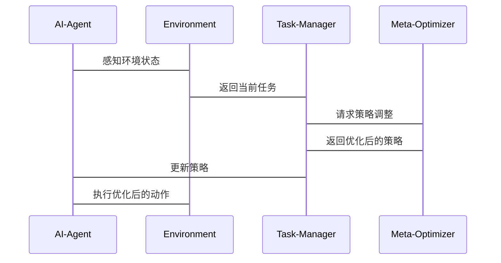

                 


# 设计AI Agent的元控制学习策略

## 关键词：AI Agent，元控制学习，强化学习，元学习，智能体设计

## 摘要：  
本文详细探讨了设计AI Agent的元控制学习策略，从基本概念到算法实现，再到系统架构和项目实战，全面解析元控制学习的核心原理与应用。通过结合理论与实践，本文旨在为读者提供一个系统性的设计框架，帮助他们在复杂环境中优化AI Agent的控制策略。

---

# 第一部分: AI Agent与元控制学习的背景与基础

## 第1章: AI Agent与元控制学习概述

### 1.1 AI Agent的基本概念

#### 1.1.1 AI Agent的定义与分类
AI Agent（人工智能代理）是指在环境中能够感知并自主行动以实现目标的智能实体。根据智能体的智能水平和行为方式，可以将其分为以下几类：
- **反应式智能体**：基于当前感知做出反应，不依赖长期记忆。
- **认知式智能体**：具备复杂推理和规划能力，能够处理抽象任务。
- **强化学习智能体**：通过与环境交互，基于奖励机制优化行为策略。

#### 1.1.2 元控制学习的定义与特点
元控制学习（Meta-control Learning）是一种学习方法，用于优化AI Agent在不同任务或环境中的控制策略。其特点包括：
- **层次化决策**：将问题分解为多个子任务，分别优化。
- **快速适应**：能够在新环境中快速调整策略，减少试错成本。
- **自适应性**：能够根据环境反馈动态调整行为。

#### 1.1.3 元控制学习与传统控制学习的对比
| 对比维度 | 元控制学习 | 传统控制学习 |
|----------|------------|---------------|
| 学习目标 | 优化控制策略的优化方式 | 直接优化控制策略 |
| 知识迁移 | 高，能够将经验迁移到新任务 | 低，针对特定任务 |
| 适应性 | 强，能够在新环境中快速调整 | 弱，需要重新训练 |

### 1.2 元控制学习的背景与应用

#### 1.2.1 元控制学习的背景
随着AI技术的发展，AI Agent需要在动态和复杂的环境中执行任务。传统的强化学习方法在面对多任务或快速变化的环境时表现有限，因此元控制学习应运而生。

#### 1.2.2 元控制学习的应用场景
- **机器人控制**：在复杂环境中实现高效动作选择。
- **游戏AI**：在多任务游戏中优化策略。
- **自动驾驶**：在不同驾驶场景中快速调整驾驶策略。

#### 1.2.3 元控制学习的挑战与机遇
- **挑战**：如何在不同任务之间平衡资源分配，避免过拟合。
- **机遇**：通过元控制学习，可以显著提高AI Agent的通用性和适应性。

### 1.3 本章小结
本章介绍了AI Agent的基本概念和元控制学习的核心思想，强调了元控制学习在复杂环境中的优势和应用潜力。

---

# 第二部分: 元控制学习的核心概念与联系

## 第2章: 元控制学习的核心概念

### 2.1 元控制学习的原理

#### 2.1.1 元学习算法的基本原理
元学习算法通过学习如何学习，能够在少量数据上快速适应新任务。其核心思想是通过元参数（meta-parameters）优化学习过程。

#### 2.1.2 元控制学习的数学模型
元控制学习的数学模型可以表示为：
$$ \theta_{meta} = \arg \min_{\theta} \mathbb{E}_{t \sim D} \left[ \mathcal{L}(\theta, t) \right] $$
其中，$\theta_{meta}$ 是元参数，$\mathcal{L}$ 是损失函数，$D$ 是任务分布。

#### 2.1.3 元控制学习与强化学习的关系
元控制学习可以看作是强化学习的高级形式，通过在任务层面进行优化，提升了策略的灵活性和适应性。

### 2.2 元控制学习的核心要素

#### 2.2.1 元控制学习的元参数
元参数是元控制学习的关键，用于优化学习过程。常见的元参数包括：
- **任务权重**：用于平衡不同任务的优先级。
- **策略调整系数**：用于动态调整策略的执行力度。

#### 2.2.2 元控制学习的任务分解
任务分解是元控制学习的重要步骤，通过将复杂任务分解为多个子任务，可以降低问题的复杂性。例如，将自动驾驶任务分解为路径规划、障碍物避让等子任务。

#### 2.2.3 元控制学习的优化目标
元控制学习的优化目标是在所有任务上实现最优策略，同时保持策略的通用性。

### 2.3 元控制学习的实体关系图



### 2.4 本章小结
本章深入探讨了元控制学习的核心概念，包括其原理、核心要素以及与其他技术的关系。

---

# 第三部分: 元控制学习的算法原理

## 第3章: 元控制学习的算法原理

### 3.1 元控制学习的算法框架

#### 3.1.1 模型agnostic的元学习算法
模型agnostic算法不依赖特定模型，适用于各种场景。例如，MAML（Meta-Automated Learning）算法通过在多个任务上优化梯度，实现快速适应。

#### 3.1.2 基于模型的元学习算法
基于模型的算法通过构建任务模型，优化全局策略。例如，元强化学习（Meta-Reinforcement Learning）通过共享参数优化多个任务。

#### 3.1.3 元控制学习的算法流程


### 3.2 元控制学习的数学模型

#### 3.2.1 元控制学习的数学公式
元控制学习的核心公式为：
$$ \theta_{meta} = \theta_{meta} - \eta \cdot \nabla_{\theta_{meta}} \mathcal{L}(\theta, t) $$
其中，$\theta_{meta}$ 是元参数，$\eta$ 是学习率，$\mathcal{L}$ 是损失函数。

#### 3.2.2 元控制学习的优化目标
元控制学习的目标是最小化所有任务的平均损失：
$$ \min_{\theta} \frac{1}{N}\sum_{i=1}^{N} \mathcal{L}_i(\theta) $$

### 3.3 元控制学习的算法实现

#### 3.3.1 元控制学习的Python代码实现
```python
import torch
import torch.nn as nn

class MetaControl:
    def __init__(self, model):
        self.model = model
        self.meta_optimizer = torch.optim.Adam(model.parameters(), lr=0.001)

    def optimize(self, tasks, inner_steps=5):
        for task in tasks:
            # 内部优化步骤
            for _ in range(inner_steps):
                loss = self.compute_loss(task)
                loss.backward()
                self.model.optimizer.step()
                self.model.optimizer.zero_grad()
            # 元优化步骤
            meta_loss = self.compute_meta_loss(task)
            meta_loss.backward()
            self.meta_optimizer.step()
            self.model.zero_grad()

    def compute_loss(self, task):
        # 计算单任务损失
        pass

    def compute_meta_loss(self, task):
        # 计算元损失
        pass
```

#### 3.3.2 元控制学习的算法流程图


### 3.4 本章小结
本章详细讲解了元控制学习的算法原理，包括不同算法框架的实现和优化过程。

---

# 第四部分: 元控制学习的系统分析与架构设计

## 第4章: 元控制学习的系统分析与架构设计

### 4.1 问题场景介绍
在复杂环境中，AI Agent需要同时处理多个任务，每个任务可能有不同的优化目标。元控制学习可以帮助AI Agent快速调整策略，适应新任务。

### 4.2 项目介绍
本项目旨在设计一个具备元控制学习能力的AI Agent，能够在多任务环境中实现高效决策。

### 4.3 系统功能设计（领域模型）



### 4.4 系统架构设计（系统架构图）



### 4.5 接口设计与交互流程

#### 4.5.1 接口设计
- **环境接口**：提供状态、动作和奖励的接口。
- **任务管理接口**：管理多个任务的执行。
- **策略调整接口**：根据元参数动态调整策略。

#### 4.5.2 交互流程


### 4.6 本章小结
本章从系统设计的角度，详细分析了元控制学习的架构设计和交互流程。

---

# 第五部分: 元控制学习的项目实战

## 第5章: 元控制学习的项目实战

### 5.1 环境安装与配置
安装必要的库：
```bash
pip install torch matplotlib numpy
```

### 5.2 核心代码实现

#### 5.2.1 元控制学习的Python代码实现
```python
import torch
import torch.nn as nn
import torch.optim as optim

class MetaControl(nn.Module):
    def __init__(self, input_dim, hidden_dim, output_dim):
        super(MetaControl, self).__init__()
        self.fc1 = nn.Linear(input_dim, hidden_dim)
        self.fc2 = nn.Linear(hidden_dim, output_dim)

    def forward(self, x):
        x = torch.relu(self.fc1(x))
        x = self.fc2(x)
        return x

# 初始化模型
model = MetaControl(input_dim=10, hidden_dim=20, output_dim=5)
meta_optimizer = optim.Adam(model.parameters(), lr=0.001)

# 训练过程
def train(meta_model, tasks, epochs=10):
    for epoch in range(epochs):
        for task in tasks:
            # 内部优化
            optimizer = optim.SGD(model.parameters(), lr=0.1)
            for step in range(5):
                inputs, labels = get_task_data(task)
                outputs = meta_model(inputs)
                loss = nn.MSELoss()(outputs, labels)
                loss.backward()
                optimizer.step()
            # 元优化
            meta_loss = 0
            for task in tasks:
                inputs, labels = get_task_data(task)
                outputs = meta_model(inputs)
                meta_loss += nn.MSELoss()(outputs, labels)
            meta_loss = meta_loss / len(tasks)
            meta_optimizer.zero_grad()
            meta_loss.backward()
            meta_optimizer.step()
```

#### 5.2.2 案例分析
以一个多任务分类问题为例，展示如何通过元控制学习优化分类策略。

### 5.3 项目小结
通过本章的实战，读者可以掌握元控制学习的具体实现方法，并能够将其应用到实际项目中。

---

# 第六部分: 元控制学习的最佳实践与小结

## 第6章: 最佳实践与小结

### 6.1 最佳实践
- **任务分解**：合理分解任务，降低问题复杂性。
- **元参数优化**：选择合适的元参数，提升策略优化效果。
- **算法选择**：根据具体场景选择合适的元控制学习算法。

### 6.2 小结
元控制学习为AI Agent的设计提供了新的思路，通过优化控制策略的优化方式，显著提升了智能体的适应性和通用性。

### 6.3 注意事项
- 元控制学习算法的复杂性较高，需要充分考虑计算资源。
- 在实际应用中，需要根据具体任务调整算法参数。

### 6.4 未来研究方向
- 元控制学习与其他AI技术的结合，如与图神经网络的结合。
- 元控制学习的可解释性研究。

### 6.5 拓展阅读
推荐阅读以下资料：
-《Meta-Learning for Reinforcement Learning: A Survey》
-《Learning to Learn by Gradient Descent by Gradient Descent》

### 6.6 本章小结
本章总结了元控制学习的应用经验，并展望了未来的研究方向。

---

# 结语
设计AI Agent的元控制学习策略是一项复杂的任务，需要结合理论与实践。通过本文的系统讲解，读者可以全面掌握元控制学习的核心原理和应用方法。希望本文能为读者在AI Agent的设计中提供有价值的参考。

---

