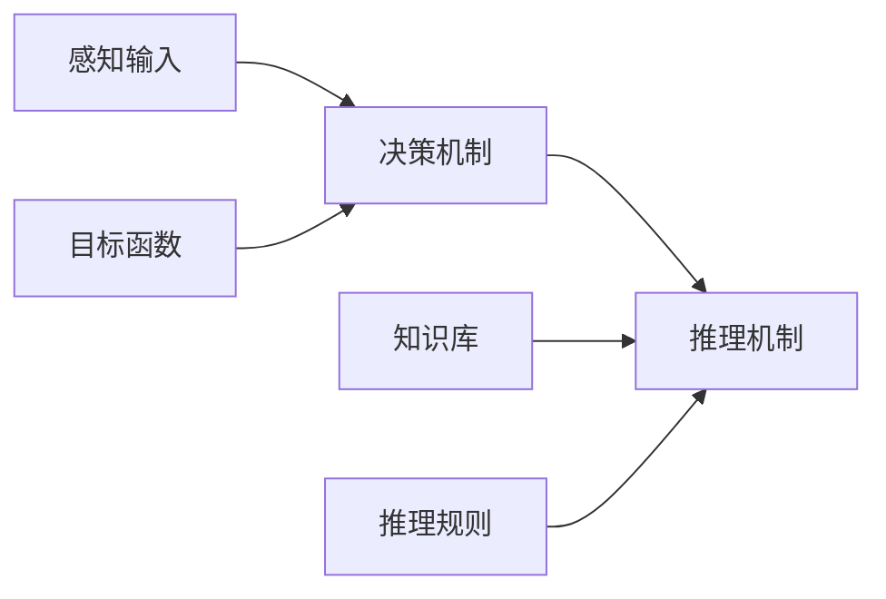
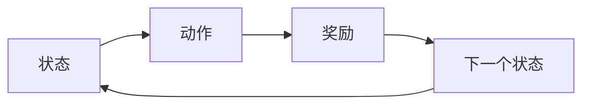
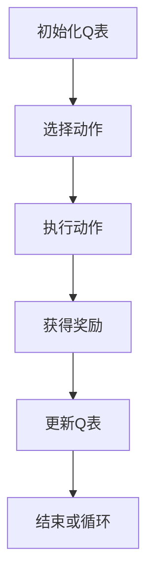
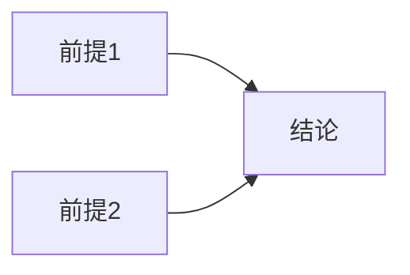
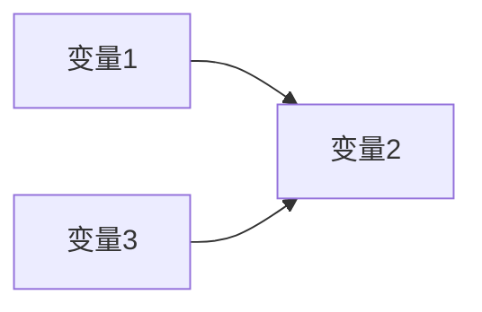
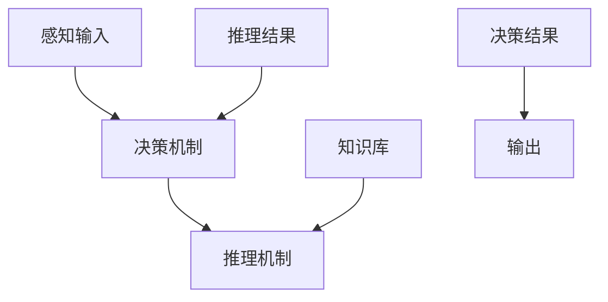
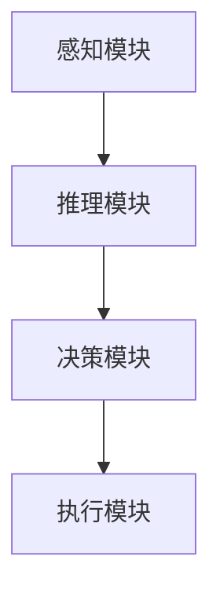

                 


# 设计AI Agent的决策与推理机制

## 关键词
AI Agent, 决策机制, 推理机制, 多智能体系统, 强化学习, 逻辑推理

## 摘要
AI Agent的决策与推理机制是实现智能体自主行为的核心技术。本文从背景介绍、核心概念、算法原理、系统架构设计到项目实战，详细解析了AI Agent决策与推理机制的设计过程。通过对比分析、算法实现、数学建模、系统设计和实际案例，帮助读者全面理解并掌握AI Agent的决策与推理机制设计方法。

---

# 第一部分: AI Agent决策与推理机制的背景与核心概念

## 第1章: 问题背景与问题描述

### 1.1 问题背景
#### 1.1.1 多智能体系统的发展与挑战
多智能体系统（Multi-Agent System, MAS）是人工智能领域的研究热点，涉及多个智能体协作完成复杂任务。随着应用场景的扩展，智能体需要具备更强的自主决策和推理能力，以应对动态环境中的不确定性。

#### 1.1.2 AI Agent在实际场景中的应用需求
AI Agent广泛应用于自动驾驶、机器人控制、智能推荐、游戏AI等领域。例如，在自动驾驶中，智能体需要实时感知环境、做出决策并执行动作，这要求决策与推理机制具备高效性和可靠性。

#### 1.1.3 决策与推理机制的重要性
决策机制负责根据当前状态和目标选择最优动作，推理机制负责从环境信息中提取知识以支持决策。两者的协同工作是实现智能体智能行为的核心。

### 1.2 问题描述
#### 1.2.1 AI Agent的定义与分类
AI Agent是一种能够感知环境、自主决策并执行动作的智能实体。根据智能体的智能水平，可以分为反应式智能体和基于模型的智能体。

#### 1.2.2 决策与推理机制的定义
- **决策机制**：基于当前状态和目标，选择最优动作的过程。
- **推理机制**：通过逻辑推理或概率推理，从环境信息中提取知识以支持决策。

#### 1.2.3 问题解决的目标与边界
目标是设计高效的决策与推理机制，使其能够在动态、不确定的环境中做出合理决策。边界包括有限的计算资源、实时性要求以及环境信息的不完备性。

## 第2章: 核心概念与联系

### 2.1 决策与推理机制的原理
#### 2.1.1 决策机制的核心原理
决策机制通常基于强化学习（Reinforcement Learning, RL）或基于模型的规划方法。例如，Q-learning算法通过经验积累优化决策策略。

#### 2.1.2 推理机制的核心原理
推理机制基于逻辑推理或概率推理。例如，基于一阶逻辑的推理系统能够从知识库中推导出新的事实。

#### 2.1.3 决策与推理的协同关系
决策机制提供目标，推理机制提供知识支持，两者协同实现智能体的自主行为。

### 2.2 核心概念对比表
#### 表2-1: 决策机制与推理机制的对比

| 特性             | 决策机制             | 推理机制             |
|------------------|----------------------|----------------------|
| 目标             | 选择最优动作         | 推导环境知识         |
| 输入             | 状态、目标           | 环境信息             |
| 输出             | 动作                 | 新知识或结论         |
| 方法             | 强化学习、贪心算法     | 逻辑推理、概率推理   |

### 2.3 实体关系图


---

# 第二部分: AI Agent决策与推理机制的算法原理

## 第3章: 决策机制的算法原理

### 3.1 基于强化学习的决策算法
#### 3.1.1 Q-learning算法
Q-learning是一种经典的强化学习算法，适用于离散动作空间的决策问题。



```python
class QLearning:
    def __init__(self, state_space, action_space):
        self.q_table = np.zeros((state_space, action_space))
    
    def choose_action(self, state, epsilon):
        if np.random.random() < epsilon:
            return np.random.randint(action_space)
        return np.argmax(self.q_table[state])
    
    def update_q_table(self, state, action, reward, next_state, learning_rate, gamma):
        self.q_table[state][action] = (1 - learning_rate) * self.q_table[state][action] + learning_rate * (reward + gamma * np.max(self.q_table[next_state]))
```

#### 3.1.2 算法流程图


## 第4章: 推理机制的算法原理

### 4.1 基于逻辑推理的推理算法
#### 4.1.1 一阶逻辑推理
一阶逻辑推理基于谓词逻辑，能够从知识库中推导出新的事实。

#### 4.1.2 推理规则示例


### 4.2 基于概率推理的推理算法
#### 4.2.1 贝叶斯网络推理
贝叶斯网络通过概率分布描述变量之间的关系，支持概率推理。

#### 4.2.2 贝叶斯网络示意图


## 第5章: 决策与推理的协同机制

### 5.1 协同机制的实现
决策机制基于推理结果做出选择，推理机制为决策提供知识支持。

### 5.2 协同流程图


---

# 第三部分: AI Agent决策与推理机制的数学模型

## 第6章: 决策机制的数学模型

### 6.1 Q-learning的数学模型
Q-learning的更新公式如下：
$$ Q(s, a) = (1 - \alpha) Q(s, a) + \alpha (r + \gamma \max Q(s', a')) $$

### 6.2 动作选择的数学表达
动作选择基于epsilon-greedy策略：
$$ p(a) = \epsilon + \frac{1 - \epsilon}{n}, \quad n = \text{number of actions} $$

## 第7章: 推理机制的数学模型

### 7.1 一阶逻辑推理
一阶逻辑推理基于谓词逻辑，例如：
$$ \forall x, P(x) \rightarrow Q(x) $$
$$ P(a) \rightarrow Q(a) $$

### 7.2 贝叶斯推理
贝叶斯定理表示为：
$$ P(B|A) = \frac{P(A|B) P(B)}{P(A)} $$

---

# 第四部分: AI Agent决策与推理机制的系统架构设计

## 第8章: 系统分析与架构设计方案

### 8.1 问题场景介绍
以自动驾驶为例，设计一个AI Agent的决策与推理机制。

### 8.2 系统功能设计
- 感知模块：接收环境信息
- 推理模块：分析环境信息
- 决策模块：选择最优动作
- 执行模块：执行动作

### 8.3 系统架构图


### 8.4 接口设计
- 感知模块接口：提供环境信息
- 推理模块接口：提供推理结果
- 决策模块接口：提供决策结果

### 8.5 交互流程图


---

# 第五部分: AI Agent决策与推理机制的项目实战

## 第9章: 项目实战

### 9.1 环境安装
安装Python和相关库：
```bash
pip install numpy matplotlib
```

### 9.2 核心代码实现

#### 9.2.1 Q-learning实现
```python
import numpy as np

class QLearning:
    def __init__(self, state_space, action_space):
        self.q_table = np.zeros((state_space, action_space))
    
    def choose_action(self, state, epsilon):
        if np.random.random() < epsilon:
            return np.random.randint(action_space)
        return np.argmax(self.q_table[state])
    
    def update_q_table(self, state, action, reward, next_state, learning_rate, gamma):
        self.q_table[state][action] = (1 - learning_rate) * self.q_table[state][action] + learning_rate * (reward + gamma * np.max(self.q_table[next_state]))
```

#### 9.2.2 推理模块实现
```python
from itertools import product

def inference(knowledge_base, query):
    for rule in knowledge_base:
        if rule[0] == query:
            return rule[1]
    return None
```

### 9.3 代码解读与分析
Q-learning实现包括状态-动作值表的更新，推理模块实现基于知识库的推理。

### 9.4 实际案例分析
以自动驾驶为例，设计一个简单的决策与推理机制，实现车辆的路径规划。

### 9.5 项目小结
通过项目实战，验证了决策与推理机制的设计方法，并展示了其在实际场景中的应用。

---

# 第六部分: AI Agent决策与推理机制的最佳实践与总结

## 第10章: 最佳实践与总结

### 10.1 小结
AI Agent的决策与推理机制是实现智能体自主行为的核心技术，需要结合强化学习和逻辑推理。

### 10.2 注意事项
- 确保算法的高效性
- 考虑环境的不确定性
- 保证系统的实时性

### 10.3 拓展阅读
推荐阅读《强化学习》、《逻辑推理与知识图谱》等相关书籍。

---

# 结语
通过本文的详细讲解，读者可以全面理解AI Agent决策与推理机制的设计方法，并能够在实际项目中灵活应用。

