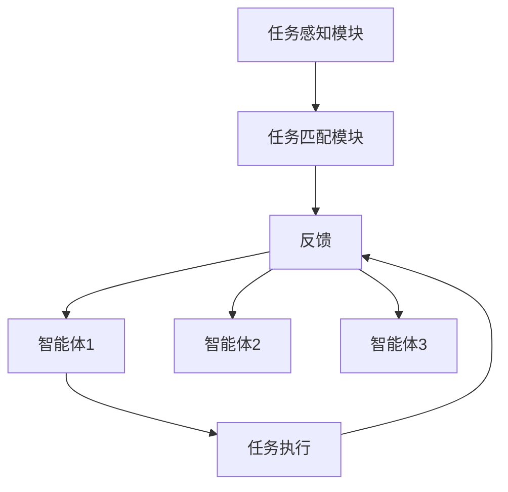
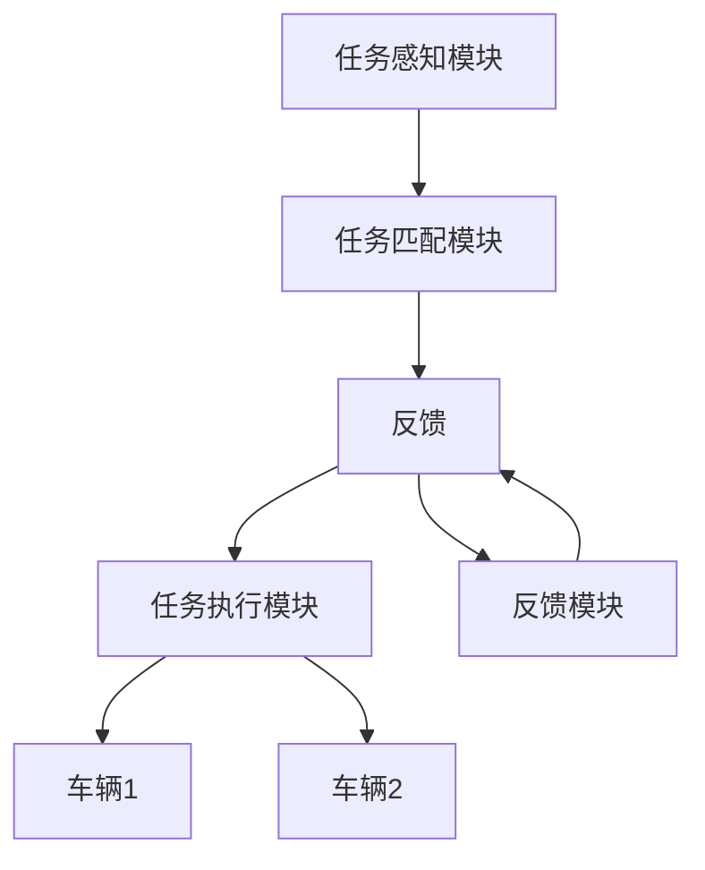

                 


# 设计AI Agent的动态任务分配策略

## 关键词：AI Agent，动态任务分配，多智能体系统，强化学习，任务分配算法

## 摘要：  
本文详细探讨了设计AI Agent动态任务分配策略的核心原理、算法实现及系统架构。通过分析动态任务分配的背景、核心概念和算法原理，结合实际案例和系统架构设计，为读者提供了一套完整的动态任务分配解决方案。文章内容涵盖任务建模、算法选择、系统实现及优化建议，帮助读者深入理解并实际应用动态任务分配策略。

---

# 第一部分: AI Agent与动态任务分配概述

## 第1章: AI Agent与动态任务分配的背景

### 1.1 AI Agent的基本概念

#### 1.1.1 AI Agent的定义与特点
AI Agent（智能体）是指在环境中能够感知并自主行动以实现目标的实体。AI Agent具有以下特点：
- **自主性**：无需外部干预，自主决策。
- **反应性**：能够实时感知环境并做出反应。
- **目标导向性**：所有行动均以实现目标为导向。
- **社会性**：能够与其他智能体或人类进行协作或竞争。

#### 1.1.2 多智能体系统的基本概念
多智能体系统（Multi-Agent System, MAS）是指由多个相互作用的智能体组成的系统。这些智能体可以协作或竞争，共同完成复杂任务。多智能体系统的特点包括：
- **分布式智能**：智能体之间分布式协作。
- **任务分配**：智能体之间需要动态分配任务。
- **动态性**：环境和任务需求可能动态变化。

#### 1.1.3 动态任务分配的定义与特点
动态任务分配是指在动态环境中，根据环境变化和智能体能力，实时调整任务分配的过程。其特点包括：
- **实时性**：任务分配需要快速响应环境变化。
- **动态性**：任务需求和智能体能力可能动态变化。
- **优化性**：任务分配需在多种约束条件下实现最优或近似最优。

### 1.2 动态任务分配的背景与问题背景

#### 1.2.1 动态环境下的任务分配挑战
在动态环境中，任务分配面临以下挑战：
- **环境不确定性**：环境状态可能随机变化，影响任务执行。
- **任务动态性**：任务优先级、需求可能实时变化。
- **智能体异构性**：智能体能力、资源可能不同，需灵活分配。

#### 1.2.2 动态任务分配的核心问题
动态任务分配的核心问题包括：
1. **任务建模**：如何准确表示任务的需求、优先级和约束。
2. **任务分配算法**：如何设计高效的动态任务分配算法。
3. **动态适应性**：如何在动态环境中快速调整任务分配。

#### 1.2.3 动态任务分配的边界与外延
动态任务分配的边界包括：
- **任务范围**：任务分配的范围和粒度。
- **智能体能力**：智能体的能力和资源限制。
- **环境约束**：环境中的物理或逻辑约束。

动态任务分配的外延包括：
- **任务协调**：智能体之间的任务协同与协作。
- **任务监控**：动态任务分配的实时监控与反馈。
- **任务优化**：任务分配的优化与改进。

### 1.3 动态任务分配的必要性与重要性

#### 1.3.1 动态任务分配在AI Agent中的作用
动态任务分配在AI Agent中起到以下作用：
- **提高效率**：通过合理分配任务，提升整体系统效率。
- **增强适应性**：使系统能够快速适应环境变化。
- **优化资源利用**：最大化智能体资源的利用效率。

#### 1.3.2 动态任务分配的实际应用场景
动态任务分配在以下场景中具有重要应用：
- **智能交通系统**：动态分配车辆路径，缓解交通拥堵。
- **分布式计算系统**：动态分配计算任务，提高系统性能。
- **应急响应系统**：动态分配救援任务，提高应急效率。

#### 1.3.3 动态任务分配的未来发展趋势
动态任务分配的未来发展趋势包括：
- **智能化**：结合强化学习和深度学习，提升任务分配的智能性。
- **实时性**：进一步提升任务分配的实时性和响应速度。
- **分布式协作**：增强智能体之间的分布式协作能力。

---

## 第2章: 动态任务分配的核心概念与联系

### 2.1 动态任务分配的核心概念

#### 2.1.1 任务建模与表示
任务建模是动态任务分配的基础。任务可以表示为：
$$
\text{任务} = \langle \text{任务ID}, \text{任务类型}, \text{优先级}, \text{资源需求}, \text{时间约束} \rangle
$$
任务建模需要考虑以下方面：
- **任务类型**：例如，数据处理任务、计算任务、服务任务等。
- **优先级**：任务的重要性和紧急程度。
- **资源需求**：任务执行所需的资源，如计算能力、网络带宽等。
- **时间约束**：任务的截止时间和执行时间窗口。

#### 2.1.2 任务分配的基本原理
任务分配的基本原理包括：
1. **任务感知**：智能体感知可用任务和环境状态。
2. **任务匹配**：根据智能体能力和任务需求，匹配合适的智能体。
3. **任务分配**：动态分配任务给智能体，并实时调整。

#### 2.1.3 动态环境下的任务分配机制
动态环境下的任务分配机制包括：
- **预测机制**：预测环境变化对任务分配的影响。
- **反馈机制**：根据执行结果调整任务分配。
- **自适应机制**：根据环境变化动态调整任务分配策略。

### 2.2 核心概念的联系与对比

#### 2.2.1 任务分配与多智能体协作的关系
任务分配与多智能体协作密切相关。任务分配是协作的前提，协作是任务分配的实现方式。

#### 2.2.2 动态任务分配与静态任务分配的对比
动态任务分配与静态任务分配的主要区别在于：
- **任务需求**：动态任务分配的任务需求可能变化，而静态任务分配的任务需求固定。
- **环境变化**：动态任务分配需要适应环境变化，而静态任务分配不需要。
- **分配策略**：动态任务分配需要动态调整策略，而静态任务分配策略固定。

#### 2.2.3 动态任务分配与其他任务分配策略的联系
动态任务分配可以与其他任务分配策略（如贪心算法、遗传算法）结合使用，形成混合分配策略。

### 2.3 动态任务分配的系统架构

#### 2.3.1 动态任务分配的系统组成
动态任务分配系统通常包括以下模块：
- **任务感知模块**：感知可用任务和环境状态。
- **任务匹配模块**：匹配任务与智能体能力。
- **任务分配模块**：动态分配任务并实时调整。

#### 2.3.2 系统各模块的功能与交互
- **任务感知模块**：通过传感器或API获取环境状态和可用任务。
- **任务匹配模块**：根据任务需求和智能体能力，匹配合适的智能体。
- **任务分配模块**：根据匹配结果，动态分配任务，并实时监控执行情况，根据反馈调整分配策略。

#### 2.3.3 动态任务分配的系统架构图


---

## 第3章: 动态任务分配的算法原理

### 3.1 基于优先级的任务分配算法

#### 3.1.1 算法原理
基于优先级的任务分配算法根据任务优先级动态分配任务。优先级计算公式：
$$
\text{优先级} = \frac{\text{任务重要性} \times \text{紧急程度}}{\text{资源消耗}}
$$
算法步骤：
1. **计算任务优先级**：根据任务需求和环境状态，计算任务优先级。
2. **匹配智能体能力**：根据优先级和智能体能力，匹配任务。
3. **分配任务**：将任务分配给优先级最高的智能体。
4. **动态调整**：根据任务执行情况，动态调整优先级。

#### 3.1.2 算法实现
```python
def prioritize_task(tasks, agents):
    for task in tasks:
        task.priority = calculate_priority(task)
    tasks.sort(key=lambda x: x.priority, reverse=True)
    for task in tasks:
        assign_task(task, agents)
```

#### 3.1.3 优缺点分析
- **优点**：简单易实现，适合紧急任务处理。
- **缺点**：可能忽略智能体负载均衡，导致某些智能体过载。

### 3.2 基于多目标优化的任务分配算法

#### 3.2.1 算法原理
基于多目标优化的任务分配算法考虑多个目标，如任务完成时间、资源消耗等。目标函数：
$$
\min \sum_{i=1}^{n} \text{完成时间}_i
$$
约束条件：
$$
\sum_{i=1}^{n} \text{资源消耗}_i \leq \text{总资源}
$$

#### 3.2.2 算法实现
```python
def multi_objective_optimization(tasks, agents):
    for task in tasks:
        task.cost = calculate_cost(task)
    for agent in agents:
        agent.capacity = calculate_capacity(agent)
    for task in tasks:
        assign_task_to_agent(task, agents)
```

#### 3.2.3 优缺点分析
- **优点**：能够实现资源的均衡分配，提高系统整体效率。
- **缺点**：计算复杂度较高，不适合实时性要求高的场景。

### 3.3 基于强化学习的动态任务分配算法

#### 3.3.1 算法原理
基于强化学习的任务分配算法通过智能体与环境的交互，学习最优任务分配策略。算法流程：
1. **状态表示**：表示环境状态和任务需求。
2. **动作选择**：选择任务分配动作。
3. **奖励机制**：根据任务执行结果给予奖励或惩罚。
4. **策略优化**：根据奖励优化任务分配策略。

#### 3.3.2 算法实现
```python
class Agent:
    def __init__(self, state_space, action_space):
        self.state_space = state_space
        self.action_space = action_space
        self.model = self.build_model()

    def build_model(self):
        # 构建深度神经网络模型
        pass

    def act(self, state):
        # 根据状态选择动作
        pass

    def train(self, state, action, reward):
        # 更新模型参数
        pass
```

#### 3.3.3 优缺点分析
- **优点**：能够适应复杂的动态环境，具有较强的自适应性。
- **缺点**：训练时间较长，需要大量数据支持。

---

## 第4章: 动态任务分配的系统架构设计

### 4.1 系统功能设计

#### 4.1.1 问题场景介绍
假设我们设计一个智能交通系统，需要动态分配车辆路径，缓解交通拥堵。

#### 4.1.2 系统功能模块
系统功能模块包括：
- **任务感知模块**：感知交通流量和车辆状态。
- **任务匹配模块**：匹配车辆与路径。
- **任务分配模块**：动态分配路径给车辆。
- **任务执行模块**：车辆执行分配的路径。
- **反馈模块**：根据执行结果调整任务分配。

#### 4.1.3 系统功能流程
1. **任务感知**：感知交通流量和车辆状态。
2. **任务匹配**：根据车辆能力匹配路径。
3. **任务分配**：动态分配路径给车辆。
4. **任务执行**：车辆执行分配的路径。
5. **反馈调整**：根据执行结果调整任务分配。

### 4.2 系统架构设计

#### 4.2.1 系统架构图


#### 4.2.2 系统接口设计
- **任务感知接口**：提供环境状态数据。
- **任务分配接口**：提供任务分配结果。
- **任务执行接口**：提供任务执行状态反馈。

#### 4.2.3 系统交互流程
1. **任务感知**：通过传感器获取环境数据。
2. **任务匹配**：根据环境数据匹配任务。
3. **任务分配**：根据匹配结果分配任务。
4. **任务执行**：智能体执行任务。
5. **反馈调整**：根据反馈调整任务分配。

---

## 第5章: 动态任务分配的项目实战

### 5.1 环境配置

#### 5.1.1 项目环境
- **操作系统**：Linux/Windows/MacOS
- **编程语言**：Python
- **框架**：TensorFlow/PyTorch
- **依赖库**：numpy, pandas, matplotlib, scikit-learn

### 5.2 核心实现

#### 5.2.1 任务分配算法实现
```python
def dynamic_task_allocation(tasks, agents):
    for task in tasks:
        calculate_priority(task)
    tasks.sort(key=lambda x: x.priority, reverse=True)
    for task in tasks:
        assign_task(task, agents)
```

#### 5.2.2 系统架构实现
```python
class TaskAllocationSystem:
    def __init__(self):
        self.task_sensing = TaskSensing()
        self.task_matching = TaskMatching()
        self.task_allocation = TaskAllocation()
        self.feedback = Feedback()

    def run(self):
        while True:
            state = self.task_sensing感知环境()
            tasks = self.task_matching匹配任务()
            self.task_allocation分配任务(tasks)
            feedback = self.feedback获取反馈()
            self.task_allocation调整分配(feedback)
```

### 5.3 案例分析与详细解读

#### 5.3.1 案例分析
假设我们设计一个智能物流系统，需要动态分配配送任务给快递员。

#### 5.3.2 详细解读
1. **任务感知**：系统感知订单需求和快递员状态。
2. **任务匹配**：根据订单需求和快递员能力匹配任务。
3. **任务分配**：动态分配任务给快递员。
4. **任务执行**：快递员执行分配的任务。
5. **反馈调整**：根据任务执行情况调整分配策略。

### 5.4 项目小结

#### 5.4.1 系统实现的关键点
- **任务感知**：准确感知环境状态和任务需求。
- **任务匹配**：智能匹配任务与智能体能力。
- **任务分配**：动态调整任务分配策略。

#### 5.4.2 项目总结
通过项目实战，我们验证了动态任务分配策略的有效性，提高了系统的适应性和效率。

---

## 第6章: 动态任务分配的最佳实践与总结

### 6.1 最佳实践

#### 6.1.1 任务建模
- **明确任务需求**：确保任务建模准确。
- **动态调整**：根据环境变化动态调整任务建模。

#### 6.1.2 算法选择
- **选择合适的算法**：根据场景选择合适算法。
- **算法优化**：持续优化算法性能。

#### 6.1.3 系统设计
- **模块化设计**：模块化设计便于维护和扩展。
- **高效交互**：确保系统各模块高效交互。

### 6.2 总结

#### 6.2.1 本文总结
本文详细探讨了设计AI Agent动态任务分配策略的核心原理、算法实现及系统架构，为读者提供了一套完整的动态任务分配解决方案。

#### 6.2.2 未来展望
未来，动态任务分配将更加智能化和实时化，结合强化学习和分布式计算，进一步提升系统的适应性和效率。

### 6.3 注意事项

#### 6.3.1 项目实施注意事项
- **数据质量**：确保数据准确性和完整性。
- **系统监控**：实时监控系统运行状态。
- **安全问题**：确保系统安全性。

#### 6.3.2 技术细节注意事项
- **算法优化**：持续优化算法性能。
- **系统维护**：定期维护和升级系统。
- **团队协作**：加强团队协作，确保项目顺利进行。

### 6.4 拓展阅读

#### 6.4.1 相关技术领域
- **强化学习**：进一步学习强化学习的相关技术。
- **分布式计算**：深入学习分布式计算的相关知识。
- **多智能体系统**：研究多智能体系统的最新进展。

#### 6.4.2 推荐书籍与论文
- **《强化学习：理论与算法》**：李航著。
- **《分布式系统：概念与设计》**：Tanenbaum著。
- **《多智能体系统》**：Yehuda Shouman著。

---

# 结语

设计AI Agent的动态任务分配策略是一个复杂而有趣的过程，需要结合理论与实践，不断优化和调整。希望本文能够为读者提供有价值的参考和启发，帮助他们在实际应用中设计出更加高效和智能的动态任务分配策略。

