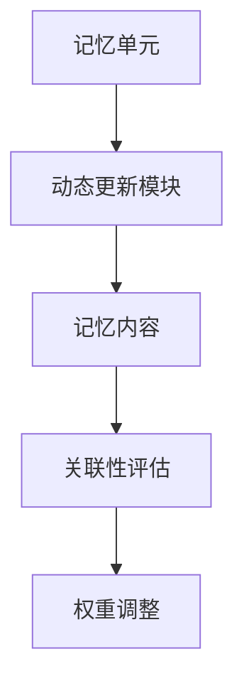
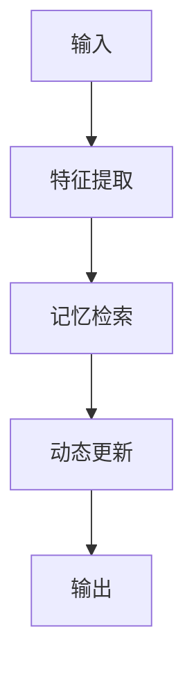
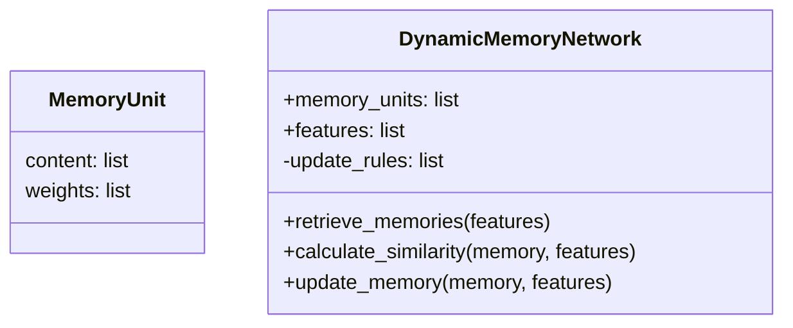
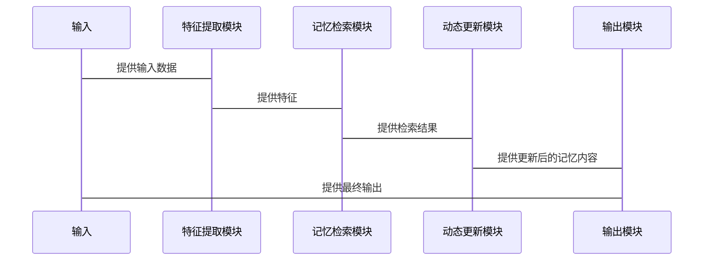
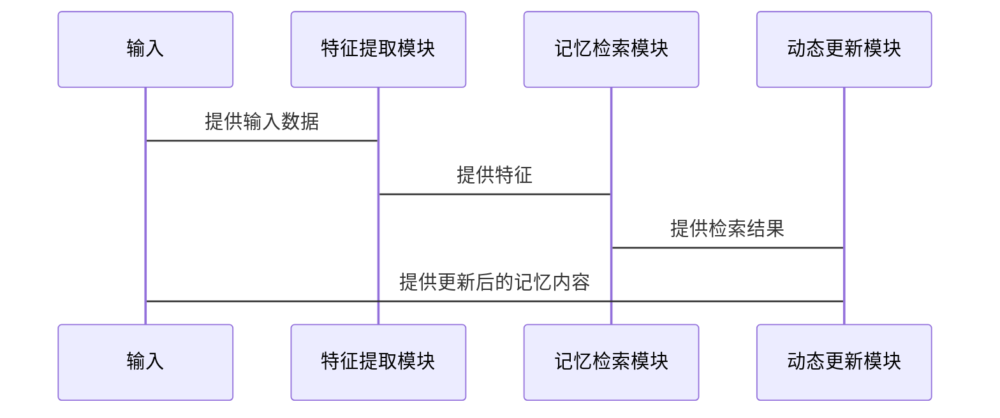

                 


# 设计AI Agent的动态记忆网络

---

## 关键词：AI Agent, 动态记忆网络, 记忆机制, 算法原理, 系统架构, 项目实战

---

## 摘要

在人工智能领域，AI Agent（智能体）需要具备动态感知和记忆能力，以应对复杂多变的环境。动态记忆网络作为一种创新的记忆机制，能够实时更新和优化记忆内容，帮助AI Agent更好地理解和应对动态变化的任务和场景。本文从动态记忆网络的核心概念出发，逐步分析其算法原理、系统架构设计、项目实现与优化，并结合实际案例进行详细解读。通过本文的阐述，读者可以全面理解动态记忆网络的工作原理，并掌握其在AI Agent中的具体应用。

---

# 第一部分: AI Agent与动态记忆网络的背景与概念

# 第1章: AI Agent的动态记忆网络概述

## 1.1 问题背景与目标

### 1.1.1 AI Agent的核心问题与挑战

AI Agent是一种能够感知环境、自主决策并执行任务的智能实体。在实际应用中，AI Agent面临以下核心问题：

- **动态环境适应性**：环境信息不断变化，AI Agent需要快速调整策略。
- **记忆能力不足**：传统记忆机制难以应对复杂场景中的信息更新。
- **多任务处理能力**：AI Agent需要同时处理多个任务，记忆系统需要支持多维度信息的高效检索与更新。

### 1.1.2 动态记忆网络的提出背景

为了应对上述挑战，动态记忆网络作为一种新兴的记忆机制应运而生。它通过动态更新和优化记忆内容，帮助AI Agent在复杂环境中保持高效性能。

### 1.1.3 问题解决的目标与意义

动态记忆网络的目标是实现记忆内容的动态更新、高效检索和关联性评估，从而提升AI Agent的适应性和决策能力。其意义在于：

- 提高AI Agent在动态环境中的记忆效率。
- 实现多任务场景下的信息高效管理。
- 为复杂场景下的AI Agent提供更强大的记忆支持。

---

## 1.2 动态记忆网络的定义与特点

### 1.2.1 动态记忆网络的定义

动态记忆网络是一种基于动态更新机制的记忆系统，能够根据输入信息实时调整记忆内容的权重和关联性。其核心思想是通过动态调整记忆单元的权重，实现对信息的高效检索和更新。

### 1.2.2 动态记忆网络的核心特点

| 特性 | 描述 |
|------|------|
| 动态更新 | 根据输入信息实时调整记忆内容权重。 |
| 高效检索 | 支持快速关联性评估，提升信息检索效率。 |
| 多维度支持 | 支持多任务场景下的信息管理。 |

### 1.2.3 动态记忆网络与传统记忆机制的对比

| 对比维度 | 动态记忆网络 | 传统记忆机制 |
|----------|--------------|----------------|
| 更新机制 | 动态调整权重 | 静态存储或简单更新 |
| 检索效率 | 高 | 低 |
| 适应性 | 强 | 弱 |

---

## 1.3 动态记忆网络的边界与外延

### 1.3.1 动态记忆网络的应用场景

动态记忆网络适用于以下场景：

- **实时任务处理**：如实时语音识别、动态路径规划。
- **多任务处理**：如同时处理多个对话任务。
- **动态环境适应**：如应对突发事件的实时响应。

### 1.3.2 动态记忆网络的适用范围

- 适用于需要实时信息更新的场景。
- 适用于需要多任务处理的场景。
- 适用于需要高效信息检索的场景。

### 1.3.3 动态记忆网络的限制与不足

- 对计算资源要求较高。
- 需要复杂算法支持，实现难度较大。

---

## 1.4 动态记忆网络的概念结构与核心要素

### 1.4.1 概念结构分解

动态记忆网络由以下几个核心要素组成：

- **记忆单元**：存储信息的基本单位。
- **动态更新模块**：负责调整记忆单元的权重。
- **关联性评估模块**：评估输入与记忆内容的关联性。

### 1.4.2 核心要素的组成与关系



### 1.4.3 动态记忆网络的数学模型初步

动态记忆网络的数学模型可以表示为：

$$ C = \{c_1, c_2, ..., c_n\} $$

其中，$C$ 表示记忆内容的集合，$c_i$ 表示第 $i$ 个记忆单元的内容。

---

## 1.5 本章小结

本章详细介绍了AI Agent的动态记忆网络的核心概念，包括其定义、特点、应用场景以及与传统记忆机制的对比。通过概念结构和数学模型的初步分析，为后续章节的深入探讨奠定了基础。

---

# 第二部分: 动态记忆网络的核心概念与原理

# 第2章: 动态记忆网络的核心概念

## 2.1 动态记忆网络的核心原理

### 2.1.1 记忆单元的动态更新机制

动态记忆网络通过以下步骤实现记忆内容的动态更新：

1. **输入信息提取**：从输入数据中提取关键特征。
2. **关联性评估**：评估输入与现有记忆内容的关联性。
3. **权重调整**：根据关联性评估结果调整记忆内容的权重。
4. **记忆更新**：基于权重调整结果更新记忆内容。

### 2.1.2 关键属性与特征对比

动态记忆网络的关键属性包括：

- **实时性**：能够实时更新记忆内容。
- **关联性**：支持输入与记忆内容的高效关联。
- **动态性**：能够根据输入动态调整记忆内容的权重。

---

## 2.2 动态记忆网络的ER实体关系图


通过上述ER实体关系图，可以清晰地看到动态记忆网络中各个核心要素之间的关系。

---

## 2.3 动态记忆网络的核心算法

### 2.3.1 算法流程图

动态记忆网络的核心算法流程如下：



---

## 2.4 核心概念的数学模型与公式

### 2.4.1 记忆内容的表示

$$ C = \{c_1, c_2, ..., c_n\} $$

### 2.4.2 关联性评估函数

$$ f(c_i, q) = \frac{c_i \cdot q}{\|c_i\| \|q\|} $$

### 2.4.3 动态更新规则

$$ c_i' = c_i + \alpha (q - c_i) $$

其中，$\alpha$ 是更新步长。

---

## 2.5 本章小结

本章详细介绍了动态记忆网络的核心概念与原理，包括其动态更新机制、核心属性、ER实体关系图以及核心算法的数学模型。通过这些内容，读者可以深入了解动态记忆网络的工作原理。

---

# 第三部分: 动态记忆网络的算法原理与实现

# 第3章: 动态记忆网络的算法原理

## 3.1 算法原理概述

动态记忆网络的算法原理可以分为以下几个步骤：

1. **输入处理**：对输入数据进行预处理和特征提取。
2. **记忆检索**：根据输入特征检索相关记忆内容。
3. **动态更新**：根据关联性评估结果调整记忆内容的权重。
4. **输出生成**：基于更新后的记忆内容生成最终输出。

---

## 3.2 算法流程图

动态记忆网络的算法流程如下：


---

## 3.3 核心算法实现

### 3.3.1 算法代码示例

```python
def dynamic_memory_update(input, memory):
    # 提取特征
    features = extract_features(input)
    
    # 检索记忆内容
    retrieved_memories = retrieve Memories(features)
    
    # 评估关联性
    similarity_scores = calculate_similarity(retrieved_memories, features)
    
    # 动态更新记忆
    updated_memory = update_memory(similarity_scores, retrieved_memories)
    
    return updated_memory
```

### 3.3.2 算法原理的数学模型

动态记忆网络的数学模型可以表示为：

$$ c_i' = c_i + \alpha (q - c_i) $$

其中，$\alpha$ 是更新步长，$q$ 是输入特征。

---

## 3.4 本章小结

本章详细介绍了动态记忆网络的算法原理与实现，包括算法流程图、核心代码示例以及数学模型的详细解释。通过这些内容，读者可以掌握动态记忆网络的具体实现方法。

---

# 第四部分: 系统分析与架构设计方案

# 第4章: 动态记忆网络的系统架构设计

## 4.1 问题场景介绍

动态记忆网络的系统架构设计需要应对以下问题场景：

- **实时信息更新**：需要快速响应输入信息并实时更新记忆内容。
- **多任务处理**：需要同时处理多个任务，支持多维度信息管理。
- **高效信息检索**：需要快速关联输入与记忆内容，提升检索效率。

---

## 4.2 系统功能设计

### 4.2.1 领域模型

动态记忆网络的领域模型如下：



### 4.2.2 系统架构设计

动态记忆网络的系统架构设计如下：


---

## 4.3 系统接口设计

动态记忆网络的系统接口设计如下：



---

## 4.4 系统交互设计

动态记忆网络的系统交互设计如下：



---

## 4.5 本章小结

本章详细介绍了动态记忆网络的系统架构设计，包括问题场景分析、领域模型设计、系统架构图以及系统接口和交互设计。通过这些内容，读者可以理解动态记忆网络在实际系统中的应用。

---

# 第五部分: 项目实战

# 第5章: 动态记忆网络的项目实现

## 5.1 环境安装与配置

### 5.1.1 环境依赖

动态记忆网络的实现需要以下环境依赖：

- **Python**：版本3.6及以上。
- **Mermaid**：用于绘制图表。
- **Jupyter Notebook**：用于代码实现与测试。

### 5.1.2 安装步骤

1. 安装Python：
   ```bash
   python --version
   ```
2. 安装Mermaid：
   ```bash
   pip install mermaid
   ```
3. 安装Jupyter Notebook：
   ```bash
   pip install jupyter
   ```

---

## 5.2 系统核心实现

### 5.2.1 核心代码实现

```python
class DynamicMemoryNetwork:
    def __init__(self, memory_units):
        self.memory_units = memory_units
        self.features = []
        self.update_rules = []
    
    def retrieve_memories(self, features):
        # 实现记忆内容检索
        pass
    
    def calculate_similarity(self, memory, features):
        # 实现关联性评估
        pass
    
    def update_memory(self, memory, features):
        # 实现动态更新
        pass
```

### 5.2.2 代码应用解读

动态记忆网络的核心代码实现包括以下几个步骤：

1. **初始化**：定义动态记忆网络的初始状态。
2. **特征提取**：从输入数据中提取关键特征。
3. **记忆检索**：根据特征检索相关记忆内容。
4. **关联性评估**：评估输入与记忆内容的关联性。
5. **动态更新**：根据关联性评估结果调整记忆内容的权重。

---

## 5.3 案例分析与详细解读

### 5.3.1 案例分析

以下是一个动态记忆网络的案例分析：

1. **输入处理**：
   - 输入数据为：`"用户查询：如何优化代码性能"`
2. **特征提取**：
   - 提取关键词：`"优化"`、`"代码性能"`
3. **记忆检索**：
   - 检索与关键词相关的记忆内容。
4. **动态更新**：
   - 根据检索结果调整记忆内容的权重。
5. **输出生成**：
   - 基于更新后的记忆内容生成最终输出。

---

## 5.4 本章小结

本章详细介绍了动态记忆网络的项目实现，包括环境安装与配置、核心代码实现以及实际案例分析。通过这些内容，读者可以掌握动态记忆网络的具体实现方法。

---

# 第六部分: 总结与展望

# 第6章: 总结与展望

## 6.1 总结

动态记忆网络作为一种创新的记忆机制，能够实时更新和优化记忆内容，帮助AI Agent在复杂环境中保持高效性能。本文从动态记忆网络的核心概念出发，详细分析了其算法原理、系统架构设计、项目实现与优化，并结合实际案例进行了详细解读。

---

## 6.2 展望

未来，动态记忆网络的研究将朝着以下几个方向发展：

1. **算法优化**：进一步优化动态记忆网络的算法，提高其计算效率和准确性。
2. **应用场景扩展**：探索动态记忆网络在更多领域的应用，如医疗、金融、教育等。
3. **多模态记忆**：研究多模态信息的动态记忆网络，提升其对复杂场景的适应能力。

---

## 6.3 小结与注意事项

- **小结**：动态记忆网络是一种高效的记忆机制，能够帮助AI Agent在复杂环境中保持高效性能。
- **注意事项**：在实际应用中，需要注意动态记忆网络的计算资源消耗和实现复杂度。

---

## 6.4 拓展阅读

- 建议读者进一步阅读相关领域的最新研究论文，了解动态记忆网络的最新进展。
- 推荐阅读《深度学习入门》和《自然语言处理实战》等书籍，以提升对动态记忆网络的理解。

---

# 结语

动态记忆网络作为一种创新的记忆机制，正在逐步应用于AI Agent的各个领域。通过本文的详细解读，读者可以全面理解动态记忆网络的工作原理，并掌握其在实际项目中的具体应用。未来，随着技术的不断发展，动态记忆网络将在更多领域展现出其强大的潜力。

--- 

**THE END**

