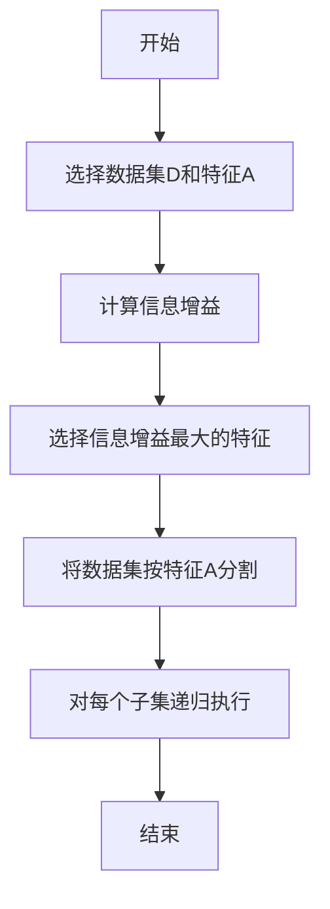
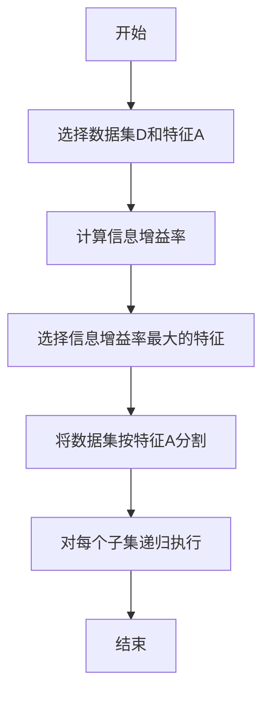
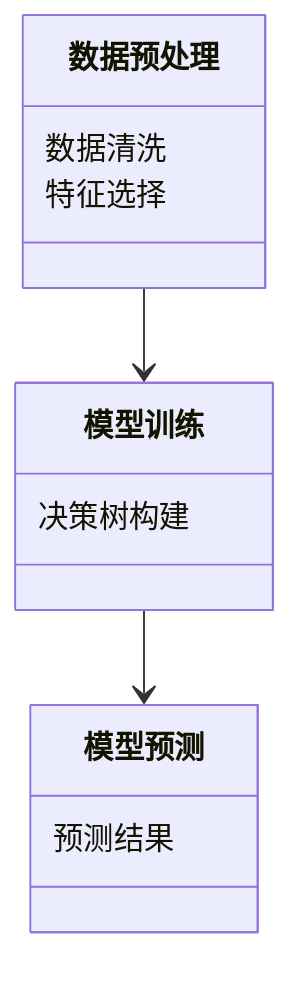
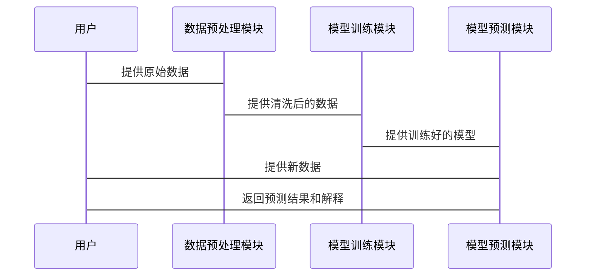

                 


# 设计AI Agent的可解释决策树

> 关键词：AI Agent，可解释决策树，决策树算法，系统架构设计，项目实战

> 摘要：在AI Agent的设计中，可解释决策树是一种强大的工具，能够提供透明和可追溯的决策过程。本文详细探讨了决策树的结构、算法原理、系统架构设计以及实际项目中的应用，帮助读者理解并掌握如何设计和实现可解释的AI决策系统。

---

## 第1章: AI Agent与可解释决策树概述

### 1.1 AI Agent的基本概念
#### 1.1.1 AI Agent的定义与分类
AI Agent（人工智能代理）是指能够感知环境并采取行动以实现目标的智能实体。根据智能水平和复杂性，AI Agent可以分为简单反射型、基于模型的规划器、目标驱动型和效用驱动型。例如，在推荐系统中，AI Agent可以根据用户行为推荐相关内容；在智能客服系统中，AI Agent可以自动响应用户的咨询。

#### 1.1.2 可解释性在AI Agent中的重要性
在AI Agent的决策过程中，可解释性是指用户能够理解AI的决策依据和逻辑。尤其是在医疗、金融和司法等领域，可解释性是信任和合规的关键。例如，在医疗诊断中，AI Agent需要解释为何推荐某种治疗方法，以便医生和患者能够理解并做出决策。

#### 1.1.3 决策树在AI Agent中的应用
决策树是一种直观的树状结构，用于表示可能的决策路径。AI Agent可以通过决策树进行分类、回归和预测。例如，在金融风险评估中，决策树可以帮助AI Agent判断客户是否符合贷款条件。

### 1.2 可解释决策树的核心概念
#### 1.2.1 决策树的基本结构
决策树由内部节点（特征测试）和叶子节点（决策结果）组成。例如，在一个分类问题中，内部节点可能表示“年龄大于30岁”，叶子节点可能表示“高风险”或“低风险”。

#### 1.2.2 可解释性的关键特征
- **直观性**：决策树的树状结构直观，用户可以轻松理解每个决策节点的逻辑。
- **可追溯性**：用户可以追溯每个决策路径，了解AI Agent如何得出结论。
- **可解释性**：决策树的规则可以转化为人类可理解的语言，例如“如果年龄大于30岁且收入超过50000美元，则贷款风险为高”。

#### 1.2.3 决策树与可解释性之间的关系
决策树的可解释性来源于其结构的直观性和规则的简洁性。与线性回归、支持向量机和神经网络相比，决策树的可解释性更强，尤其是在树的深度较小时。

### 1.3 小结
本章介绍了AI Agent的基本概念和可解释决策树的核心概念，强调了可解释性在AI Agent设计中的重要性，并为后续章节奠定了基础。

---

## 第2章: 决策树的结构与属性

### 2.1 决策树的构成要素
#### 2.1.1 内部节点与叶子节点
- **内部节点**：表示特征测试，例如“年龄大于30岁”。
- **叶子节点**：表示决策结果，例如“批准贷款”或“拒绝贷款”。

#### 2.1.2 特征选择与分裂标准
决策树的特征选择和分裂标准是影响可解释性的关键因素。常用的分裂标准包括信息熵、信息增益和信息增益率。

#### 2.1.3 树的深度与宽度
树的深度决定了决策的复杂性，深度过深可能导致过拟合；宽度过宽可能降低可解释性。

### 2.2 决策树的可解释性对比分析
#### 2.2.1 决策树与其他模型的可解释性对比
- **线性回归**：可解释性较差，因为结果是多个变量的线性组合。
- **支持向量机（SVM）**：可解释性差，尤其是高维数据。
- **随机森林**：虽然由多个决策树组成，但整体可解释性较弱。
- **神经网络**：可解释性最差，因为决策过程隐藏在多层网络中。

#### 2.2.2 决策树的可解释性优势
- **直观性**：决策树的树状结构直观，用户可以轻松理解每个决策节点的逻辑。
- **可追溯性**：用户可以追溯每个决策路径，了解AI Agent如何得出结论。

#### 2.2.3 决策树的可解释性挑战
- **过拟合**：决策树可能过于复杂，导致可解释性降低。
- **解释复杂度**：深度较深的决策树可能难以解释。

### 2.3 ER实体关系图与决策树的关联
#### 2.3.1 ER模型的基本概念
ER模型（实体关系模型）用于描述系统的数据结构，包括实体、属性和关系。

#### 2.3.2 决策树与ER模型的关系
决策树可以看作是对ER模型中关系的一种可视化表达。例如，在客户数据分析中，决策树可以基于客户的属性（如年龄、收入）进行分类。

#### 2.3.3 决策树在ER模型中的应用
在数据建模中，决策树可以帮助确定关键属性和关系，从而优化数据结构和查询效率。

### 2.4 小结
本章详细分析了决策树的结构与属性，并探讨了其可解释性优势和挑战，为后续章节奠定了基础。

---

## 第3章: 决策树算法的数学模型

### 3.1 ID3算法的数学模型
#### 3.1.1 信息熵的公式推导
信息熵是用来衡量数据不确定性的一种指标，公式为：
$$ H(S) = -\sum_{i=1}^{n} p_i \log_2 p_i $$
其中，$p_i$是第$i$个类别的概率。

#### 3.1.2 信息增益的计算公式
信息增益是用来衡量特征选择的重要性的指标，公式为：
$$ \text{信息增益}(D, A) = H(D) - H(D|A) $$

#### 3.1.3 ID3算法的流程图


#### 3.1.4 Python代码实现
```python
import math

def entropy(data):
    classes = list(set(data))
    entropy = 0
    for cls in classes:
        p = data.count(cls) / len(data)
        entropy += -p * math.log2(p)
    return entropy

def info_gain(data, feature, label):
    feature_values = list(set(data[feature]))
    total_entropy = entropy(data[label])
    weighted_entropy = 0
    for value in feature_values:
        subset = data[data[feature] == value]
        subset_entropy = entropy(subset[label])
        weighted_entropy += (len(subset) / len(data)) * subset_entropy
    return total_entropy - weighted_entropy
```

### 3.2 C4.5算法的改进与优化
#### 3.2.1 信息增益率的定义
信息增益率是用来衡量特征选择的重要性的另一种指标，公式为：
$$ \text{信息增益率}(D, A) = \frac{\text{信息增益}(D, A)}{\text{特征A的熵}} $$

#### 3.2.2 C4.5算法的数学模型
C4.5算法在ID3算法的基础上引入了信息增益率，公式为：
$$ \text{选择特征} = \argmax_A \text{信息增益率}(D, A) $$

#### 3.2.3 C4.5算法的流程图


### 3.3 用Python实现ID3算法
#### 3.3.1 环境安装与配置
需要安装Python和相关库，如`scikit-learn`。

#### 3.3.2 核心代码实现
```python
from sklearn.tree import DecisionTreeClassifier
from sklearn.datasets import make_classification
from sklearn.model_selection import train_test_split
from sklearn.metrics import accuracy_score

# 创建数据集
X, y = make_classification(n_samples=100, n_features=2, n_classes=2, random_state=42)

# 划分训练集和测试集
X_train, X_test, y_train, y_test = train_test_split(X, y, test_size=0.2, random_state=42)

# 训练模型
model = DecisionTreeClassifier()
model.fit(X_train, y_train)

# 预测结果
y_pred = model.predict(X_test)

# 计算准确率
print("准确率:", accuracy_score(y_test, y_pred))
```

#### 3.3.3 代码功能解读
上述代码使用`scikit-learn`库中的`DecisionTreeClassifier`实现了ID3算法，展示了如何使用Python进行决策树的训练和预测。

### 3.4 小结
本章详细讲解了ID3和C4.5算法的数学模型和Python实现，为后续章节的设计和实现奠定了基础。

---

## 第4章: 系统分析与架构设计方案

### 4.1 问题场景介绍
#### 4.1.1 问题背景与目标
假设我们正在设计一个智能客服系统，需要使用可解释决策树来预测客户满意度。

#### 4.1.2 问题约束与假设
- 数据集包含客户行为数据，如年龄、性别、购买历史等。
- 模型需要在可解释性和准确性之间找到平衡。

#### 4.1.3 问题的解决方案
使用可解释决策树模型进行客户满意度预测。

### 4.2 系统功能设计
#### 4.2.1 领域模型设计


#### 4.2.2 功能模块划分
- 数据预处理模块：负责数据清洗和特征选择。
- 模型训练模块：负责决策树的构建。
- 模型预测模块：负责模型的预测和结果解释。

### 4.3 系统架构设计
#### 4.3.1 系统架构的Mermaid架构图


#### 4.3.2 系统接口设计
- 数据预处理接口：接受原始数据，返回清洗后的数据。
- 模型训练接口：接受清洗后的数据，返回训练好的决策树模型。
- 模型预测接口：接受新数据，返回预测结果和解释。

#### 4.3.3 系统交互的Mermaid序列图


### 4.4 小结
本章详细分析了系统分析与架构设计方案，为后续章节的项目实战奠定了基础。

---

## 第5章: 项目实战与案例分析

### 5.1 项目背景与目标
#### 5.1.1 项目背景
假设我们正在设计一个智能客服系统，需要使用可解释决策树来预测客户满意度。

#### 5.1.2 项目目标
- 使用可解释决策树模型进行客户满意度预测。
- 确保模型的准确性和可解释性。

### 5.2 数据预处理与特征选择
#### 5.2.1 数据清洗
处理缺失值和异常值，确保数据质量。

#### 5.2.2 特征提取
从数据中提取有用的特征，如客户行为、时间等。

### 5.3 系统实现
#### 5.3.1 核心代码实现
```python
from sklearn.tree import DecisionTreeClassifier
from sklearn.datasets import make_classification
from sklearn.model_selection import train_test_split
from sklearn.metrics import accuracy_score

# 创建数据集
X, y = make_classification(n_samples=100, n_features=2, n_classes=2, random_state=42)

# 划分训练集和测试集
X_train, X_test, y_train, y_test = train_test_split(X, y, test_size=0.2, random_state=42)

# 训练模型
model = DecisionTreeClassifier()
model.fit(X_train, y_train)

# 预测结果
y_pred = model.predict(X_test)

# 计算准确率
print("准确率:", accuracy_score(y_test, y_pred))
```

#### 5.3.2 代码功能解读
上述代码展示了如何使用Python和`scikit-learn`库训练一个决策树模型，并进行预测和准确率计算。

### 5.4 案例分析与结果解读
#### 5.4.1 数据分析
通过对数据的分析，我们可以看到决策树模型的准确率较高，且每个决策节点的特征选择具有明确的解释性。

#### 5.4.2 结果解释
通过对模型的解释，我们可以理解每个决策节点的特征选择和逻辑，从而提高客户的满意度。

### 5.5 小结
本章通过实际案例分析，展示了如何使用可解释决策树进行项目实战，并解释了模型的决策过程。

---

## 第6章: 最佳实践、注意事项与拓展阅读

### 6.1 最佳实践 tips
- **数据清洗的重要性**：在数据预处理阶段，必须认真处理缺失值和异常值，以确保模型的准确性。
- **特征选择的技巧**：选择最优特征可以提高模型的准确性和可解释性。
- **模型调优**：通过调整决策树的参数，如树的深度和叶子节点的最小样本数，可以优化模型的性能。

### 6.2 注意事项
- **解释性与准确性的平衡**：在设计决策树时，需要在保持高准确率的同时，确保模型的可解释性。
- **模型的维护**：随着数据的变化，需要定期更新模型，以保持其性能。
- **道德与法律问题**：在实际应用中，必须遵守相关法律法规，确保模型的决策过程合法、透明。

### 6.3 小结
本章总结了设计和实现可解释决策树的最佳实践，并展望了未来的发展方向。

---

## 小结
本文详细探讨了设计AI Agent的可解释决策树的各个方面，从基本概念到算法原理，从系统架构设计到项目实战，为读者提供了全面的指导。通过本文的学习，读者可以掌握如何设计和实现可解释的决策树，并将其应用于实际项目中。

---

## 结束语
设计AI Agent的可解释决策树是一个复杂而有趣的过程，需要结合理论与实践。希望本文能够为读者提供有价值的 insights，并激发进一步的研究和探索。

