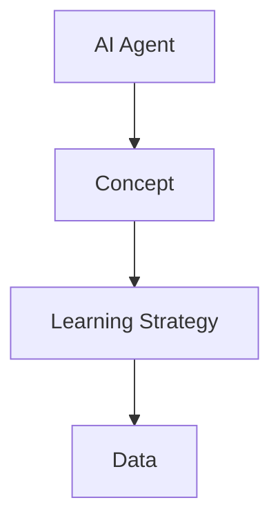
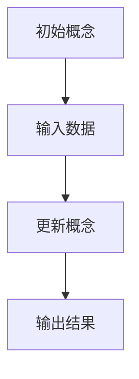
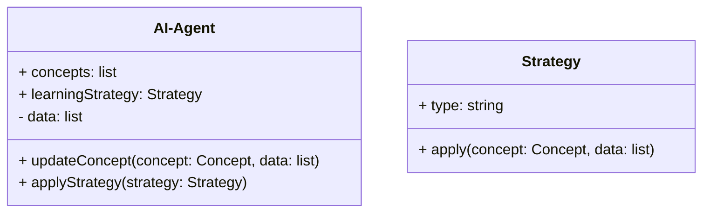
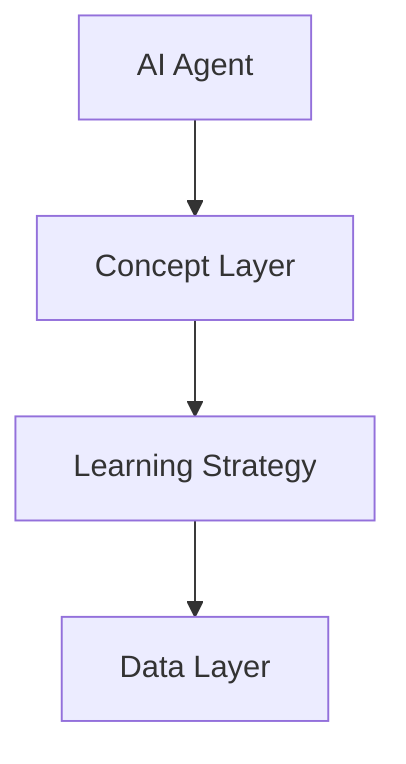
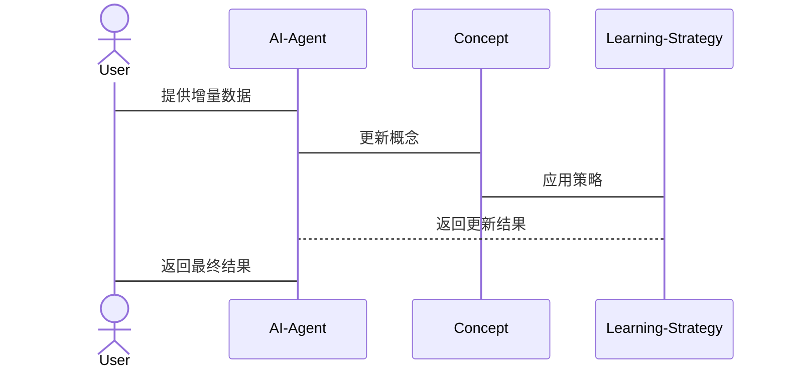

                 


# 设计AI Agent的增量式概念学习策略

> 关键词：AI Agent，增量式学习，概念学习，机器学习，自然语言处理

> 摘要：本文系统地探讨了设计AI Agent的增量式概念学习策略的理论基础和实践方法。通过分析AI Agent的核心概念、增量式学习的算法原理、系统架构设计以及实际项目案例，详细阐述了如何在实际应用中构建高效、灵活的增量式概念学习系统。本文适合AI开发者、机器学习工程师以及对增量式学习感兴趣的研究人员阅读。

---

# 第一部分: AI Agent与增量式概念学习策略背景

# 第1章: AI Agent与增量式概念学习策略概述

## 1.1 问题背景与概念结构

### 1.1.1 问题背景分析

随着人工智能技术的快速发展，AI Agent（智能体）在多个领域得到了广泛应用。AI Agent需要能够通过与环境交互来学习和适应新的信息。然而，传统的概念学习方法往往依赖于一次性训练数据，难以应对动态变化的环境。在实际应用中，AI Agent需要在增量数据流中逐步更新和优化其概念表示，这种需求催生了增量式概念学习策略。

### 1.1.2 概念结构与核心要素

增量式概念学习策略是一种基于增量数据更新概念表示的方法，其核心要素包括：

1. **初始概念**：AI Agent对目标概念的初始表示。
2. **增量数据**：逐步输入的新数据，用于更新概念表示。
3. **更新规则**：根据新数据更新概念表示的规则或算法。
4. **评估机制**：用于衡量概念更新的效果和质量。
5. **上下文依赖**：概念更新可能受到环境上下文的影响。

### 1.1.3 边界与外延

- **边界**：增量式概念学习仅关注基于增量数据的概念更新，不涉及初始概念的构建。
- **外延**：概念更新的结果可能影响AI Agent的后续行为和决策。

## 1.2 核心概念与联系

### 1.2.1 核心概念原理

增量式概念学习的核心在于通过不断接收新数据，逐步优化概念表示。与传统批量学习不同，增量学习能够实时更新模型，适应动态变化的环境。

### 1.2.2 概念属性特征对比表

| 特征 | 增量式学习 | 批量学习 |
|------|------------|----------|
| 数据输入方式 | 实时增量 | 批次输入 |
| 计算资源需求 | 较低 | 较高 |
| 适用场景 | 动态环境 | 静态环境 |
| 模型更新频率 | 高 | 低 |

### 1.2.3 ER实体关系图架构

通过ER图可以清晰地展示增量式概念学习中的实体关系：



## 1.3 本章小结

本章从问题背景、核心概念和实体关系三个方面介绍了增量式概念学习策略的基本框架，为后续章节的深入分析奠定了基础。

---

# 第二部分: 增量式概念学习策略的核心原理

# 第2章: 增量式概念学习算法原理

## 2.1 算法原理概述

### 2.1.1 算法流程图

增量式概念学习的典型算法流程如下：



### 2.1.2 数学模型与公式

增量式概念学习的数学模型可以表示为：

$$P(c|x) = \frac{P(x|c)P(c)}{P(x)}$$

其中，$P(c|x)$ 表示在数据$x$下概念$c$的概率，$P(x|c)$ 是条件概率，$P(c)$ 是先验概率，$P(x)$ 是归一化因子。

## 2.2 算法实现细节

### 2.2.1 Python源代码实现

以下是一个基于朴素贝叶斯的增量式概念学习算法的Python实现：

```python
def incremental_learning(concepts, new_data):
    for concept in concepts:
        update_concept(concept, new_data)
    return updated_concepts
```

### 2.2.2 代码解读与分析

- `incremental_learning` 函数接收一组初始概念和新的数据，对每个概念进行更新。
- `update_concept` 函数负责根据新数据更新单个概念的表示。

## 2.3 本章小结

本章通过数学模型和代码实现，详细讲解了增量式概念学习的算法原理，为后续的系统设计提供了理论基础。

---

# 第三部分: 系统分析与架构设计

# 第3章: 系统功能与架构设计

## 3.1 问题场景介绍

### 3.1.1 项目介绍

本项目旨在设计一个能够实时更新概念表示的AI Agent系统，适用于动态变化的环境。

### 3.1.2 问题场景描述

在自然语言处理领域，AI Agent需要根据实时输入的文本数据，逐步优化其对特定主题的理解和表示。

## 3.2 系统功能设计

### 3.2.1 领域模型类图

系统的核心类及其关系如下：



### 3.2.2 系统架构设计

系统架构采用分层设计，主要包括数据层、概念层和策略层：



## 3.3 系统接口与交互设计

### 3.3.1 系统接口设计

系统接口主要包括：

- 数据输入接口：接收增量数据。
- 概念更新接口：更新概念表示。
- 查询接口：根据概念返回结果。

### 3.3.2 系统交互流程图



## 3.4 本章小结

本章通过系统功能设计和架构设计，详细描述了增量式概念学习策略在实际系统中的实现方式。

---

# 第四部分: 项目实战

# 第4章: 项目实战与案例分析

## 4.1 项目介绍与环境安装

### 4.1.1 项目介绍

本项目实现了一个基于增量式概念学习的自然语言处理系统，能够实时更新对特定主题的理解。

### 4.1.2 环境安装

需要安装以下Python库：

- `numpy`
- `scikit-learn`
- `networkx`

## 4.2 系统核心实现源代码

### 4.2.1 概念更新模块

```python
class Concept:
    def __init__(self, name):
        self.name = name
        self.features = {}

    def update(self, new_features):
        for key, value in new_features.items():
            self.features[key] = value
```

### 4.2.2 学习策略模块

```python
class Strategy:
    def apply(self, concept, data):
        # 示例策略：简单平均
        new_features = {}
        for feature in data:
            new_features[feature] = new_features.get(feature, 0) + 1
        return new_features
```

## 4.3 代码解读与分析

- `Concept` 类表示一个概念，包含名称和特征。
- `Strategy` 类定义了概念更新的策略，`apply` 方法根据新数据更新概念的特征。

## 4.4 实际案例分析

### 4.4.1 案例描述

假设我们正在训练一个识别“猫”的概念的AI Agent，初始概念为空。逐步输入数据后，概念表示逐步更新。

### 4.4.2 训练过程

1. 输入数据：`["动物", "有四条腿", "喜欢鱼"]`
2. 更新概念：`猫 -> {动物: True, 四条腿: True, 喜欢鱼: True}`

## 4.5 本章小结

本章通过实际项目案例，详细展示了增量式概念学习策略的实现过程和应用场景。

---

# 第五部分: 总结与注意事项

## 5.1 本章总结

本文系统地探讨了设计AI Agent的增量式概念学习策略的理论基础和实践方法，从算法原理到系统架构，再到实际项目案例，为读者提供了全面的指导。

## 5.2 注意事项

- 数据质量对概念更新的效果有重要影响。
- 模型更新频率需要根据实际场景进行调整。
- 系统设计需要充分考虑实时性和资源消耗。

## 5.3 拓展阅读

建议读者进一步阅读以下内容：

- 《Incremental Learning: Theory and Practice》
- 《Conceptual Knowledge Representation and Reasoning》

---

# 结语

设计AI Agent的增量式概念学习策略是一个复杂而有趣的过程，需要结合理论与实践。希望本文能够为读者提供有价值的参考和启发，帮助他们在实际项目中更好地应用增量式学习策略。

