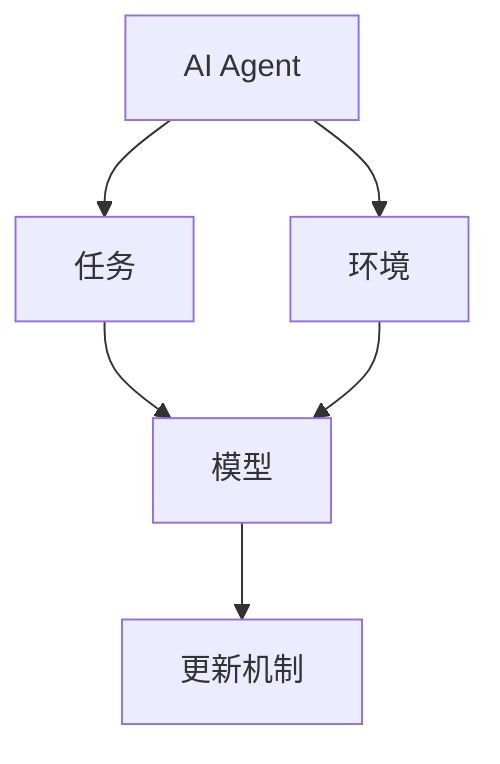
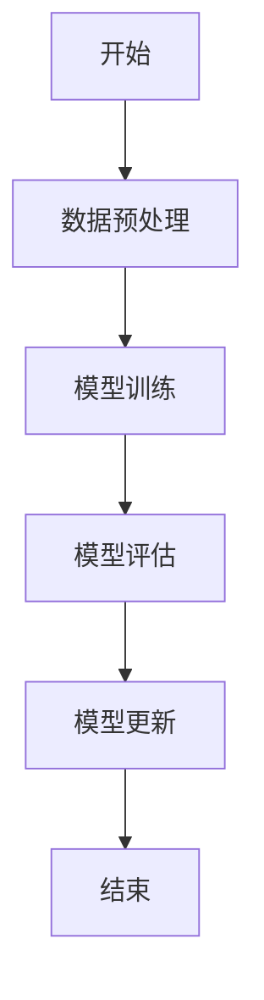
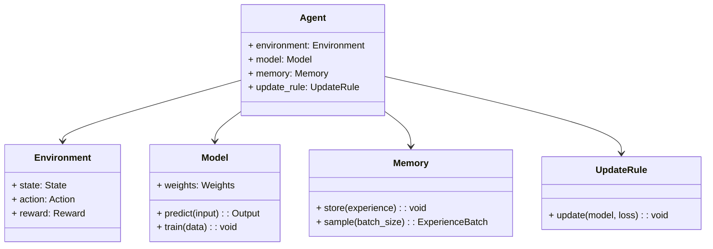

                 


# 设计AI Agent的持续学习与模型更新机制

> 关键词：AI Agent, 持续学习, 模型更新, 知识蒸馏, 策略梯度, 经验重放

> 摘要：本文详细探讨了AI Agent的持续学习与模型更新机制的设计方法。首先介绍了问题背景与核心概念，然后从算法原理、数学模型、系统架构等多个维度展开分析，最后通过项目实战验证了设计方案的可行性。本文旨在为AI Agent的设计者和研究者提供一份系统性、实用性的指导手册。

---

# 第一部分: AI Agent的持续学习与模型更新机制背景介绍

## 第1章: 问题背景与概念解析

### 1.1 问题背景
AI Agent（智能体）作为人工智能的核心组成部分，广泛应用于自动驾驶、智能推荐、机器人控制等领域。然而，随着环境的动态变化和任务的复杂化，AI Agent需要具备持续学习的能力，以适应新的输入数据和任务要求。模型更新机制是实现这一目标的关键技术。

#### 1.1.1 AI Agent的基本概念
AI Agent是一个能够感知环境、做出决策并执行动作的智能实体。它可以分为两类：
- **反应式Agent**：仅根据当前感知做出决策。
- **认知式Agent**：具备复杂推理和规划能力，能够根据历史信息做出决策。

#### 1.1.2 持续学习的定义与特点
持续学习（Continuous Learning）是指AI Agent在任务执行过程中，能够不断学习新知识、优化模型，以适应环境变化的能力。其特点包括：
- **在线性**：模型更新是在任务执行过程中动态完成的。
- **增量性**：每次更新仅涉及部分数据或参数调整。
- **适应性**：能够适应环境变化和新任务需求。

#### 1.1.3 模型更新机制的重要性
模型更新机制是AI Agent持续学习的核心，它决定了模型如何优化自身以应对新任务和环境变化。有效的模型更新机制能够显著提升AI Agent的性能和泛化能力。

### 1.2 问题描述
在实际应用中，AI Agent面临以下挑战：
- **动态环境**：环境条件不断变化，模型需要实时更新。
- **任务多样性**：AI Agent需要处理多种任务，模型更新需要兼顾不同任务的需求。
- **数据稀疏性**：新任务数据可能有限，模型更新需要高效利用有限数据。

### 1.3 问题解决
通过设计合理的持续学习和模型更新机制，AI Agent可以在动态环境中保持高性能。具体措施包括：
- **经验重放**：通过存储和重放历史数据，增强模型的泛化能力。
- **知识蒸馏**：通过教师-学生框架，将知识迁移到新模型中。
- **模型优化算法**：如策略梯度方法，能够在动态环境中实时更新模型。

### 1.4 边界与外延
- **边界**：持续学习仅关注模型在任务执行过程中的优化，不涉及初始训练阶段。
- **外延**：模型更新机制可以应用于任何AI Agent，包括强化学习、监督学习和无监督学习场景。

### 1.5 核心要素组成
- **感知模块**：获取环境输入数据。
- **决策模块**：基于当前模型做出决策。
- **学习模块**：执行持续学习和模型更新。

---

## 第2章: 核心概念与联系

### 2.1 核心概念原理
持续学习和模型更新机制的结合是AI Agent适应环境的核心。以下是关键概念的详细解析：

#### 2.1.1 持续学习的数学模型
持续学习的目标是最小化模型在新任务上的损失函数：
$$L_{new} = \sum_{i=1}^{n} (y_i - \hat{y}_i)^2$$

其中，$y_i$是真实标签，$\hat{y}_i$是模型预测值。

#### 2.1.2 模型更新机制的分类
模型更新机制可以分为以下几类：
1. **经验重放**：通过存储历史数据并重放，增强模型的泛化能力。
2. **策略梯度**：通过优化策略参数，实现模型实时更新。
3. **知识蒸馏**：通过教师模型指导学生模型学习，实现知识转移。

#### 2.1.3 知识蒸馏与模型压缩
知识蒸馏是一种有效的模型更新方法。教师模型将知识迁移到学生模型中，学生模型可以是更小、更高效的模型，从而实现模型压缩。

### 2.2 概念属性特征对比表格
表2-1给出了不同模型更新方法的对比：

| 方法       | 优点                                   | 缺点                                   |
|------------|--------------------------------------|--------------------------------------|
| 经验重放     | 可以利用历史数据增强泛化能力         | 需要存储大量数据，占用内存             |
| 策略梯度     | 实时更新，适应动态环境               | 计算复杂度高，需要多次迭代             |
| 知识蒸馏     | 知识转移高效，模型压缩               | 教师模型需要额外训练                   |

### 2.3 ER实体关系图
图2-1展示了AI Agent持续学习的核心实体关系：



---

# 第三部分: 算法原理讲解

## 第3章: 持续学习算法原理

### 3.1 经验重放机制
经验重放是持续学习中常用的一种方法，通过存储和重放历史数据，模型可以更好地泛化。

#### 3.1.1 经验重放的原理
经验重放通过存储$(s, a, r, s')$元组（状态、动作、奖励、新状态）来训练模型。在训练时，随机抽取这些元组，更新模型参数。

#### 3.1.2 经验重放的实现流程
1. 存储历史数据。
2. 随机抽取样本。
3. 训练模型。

#### 3.1.3 经验重放的优缺点
- **优点**：增强模型的泛化能力。
- **缺点**：存储和计算开销较大。

### 3.2 策略梯度方法
策略梯度是一种实时更新模型的方法，适用于动态环境。

#### 3.2.1 策略梯度的核心思想
策略梯度通过优化策略参数$\theta$，使模型在新任务上的表现最优。

#### 3.2.2 策略梯度的数学推导
策略梯度的目标函数为：
$$J(\theta) = \mathbb{E}[r]$$

梯度计算为：
$$\nabla J = \mathbb{E}[\nabla \log \pi(a|s) \cdot Q(s,a)]$$

其中，$\pi(a|s)$是策略分布，$Q(s,a)$是Q值函数。

#### 3.2.3 策略梯度的实现步骤
1. 初始化策略参数$\theta$。
2. 与环境交互，收集数据。
3. 计算梯度，更新$\theta$。

### 3.3 知识蒸馏技术
知识蒸馏通过教师-学生框架，将知识迁移到更高效的模型中。

#### 3.3.1 知识蒸馏的基本原理
教师模型将概率分布作为软标签，指导学生模型学习。

#### 3.3.2 知识蒸馏的实现流程
1. 训练教师模型。
2. 初始化学生模型。
3. 使用教师模型的软标签训练学生模型。

#### 3.3.3 知识蒸馏的优势与应用场景
- **优势**：知识转移高效，模型压缩。
- **应用场景**：适用于需要轻量化模型的场景，如移动设备。

---

## 第4章: 模型更新机制的算法实现

### 4.1 模型更新算法流程图
图4-1展示了模型更新的流程：



### 4.2 算法实现代码示例
以下代码展示了模型更新的实现：

```python
def model_update(data, model):
    # 数据预处理
    processed_data = preprocess(data)
    # 模型训练
    model.train(processed_data)
    # 模型评估
    loss = model.evaluate(processed_data)
    # 模型更新
    model.update(loss)
    return model
```

---

# 第四部分: 数学模型与公式

## 第5章: 数学模型解析

### 5.1 持续学习的数学模型
持续学习的目标是最小化模型在新任务上的损失函数：
$$L_{new} = \sum_{i=1}^{n} (y_i - \hat{y}_i)^2$$

其中，$y_i$是真实标签，$\hat{y}_i$是模型预测值。

### 5.2 策略梯度的数学模型
策略梯度的目标函数为：
$$J(\theta) = \mathbb{E}[r]$$

梯度计算为：
$$\nabla J = \mathbb{E}[\nabla \log \pi(a|s) \cdot Q(s,a)]$$

---

## 第6章: 知识蒸馏的数学模型
知识蒸馏的目标函数为：
$$L_{distill} = -\sum_{i=1}^{n} T_i \log P_i$$

其中，$T_i$是教师模型的软标签，$P_i$是学生模型的预测概率。

---

# 第五部分: 系统分析与架构设计

## 第7章: 项目介绍与系统功能设计

### 7.1 项目介绍
本项目旨在设计一个支持持续学习的AI Agent系统，能够在动态环境中实时更新模型。

### 7.2 系统功能设计
- **数据采集**：感知环境并采集数据。
- **模型训练**：利用经验重放和知识蒸馏技术更新模型。
- **模型评估**：评估模型性能并反馈优化方向。

### 7.3 领域模型类图
图7-1展示了系统的核心类图：



---

## 第8章: 系统架构设计

### 8.1 系统架构图
图8-1展示了系统的整体架构：


---

# 第六部分: 项目实战

## 第9章: 环境安装与系统核心实现

### 9.1 环境安装
需要安装以下依赖：
- Python 3.8+
- PyTorch 1.9+
- gym 0.15+

### 9.2 系统核心实现
以下是模型更新的核心代码：

```python
def update_model(model, loss):
    optimizer = torch.optim.Adam(model.parameters(), lr=0.001)
    optimizer.zero_grad()
    loss.backward()
    optimizer.step()
    return model
```

### 9.3 代码应用解读与分析
- **数据预处理**：将输入数据转换为模型可接受的格式。
- **模型训练**：利用优化器更新模型参数。
- **模型评估**：计算模型在新任务上的损失。
- **模型更新**：根据损失调整模型参数。

### 9.4 案例分析
以下是一个简单的案例分析：

```python
# 初始化模型
model = MyModel(input_dim=10, output_dim=5)
# 训练数据
data = generate_data()
# 更新模型
updated_model = update_model(model, loss)
```

---

## 第10章: 项目小结与总结

### 10.1 项目小结
通过本项目，我们实现了支持持续学习的AI Agent系统，验证了模型更新机制的有效性。

### 10.2 总结
本文详细探讨了AI Agent的持续学习与模型更新机制的设计方法，通过理论分析和实践验证，展示了如何在动态环境中实现高效的模型更新。

---

## 第11章: 最佳实践 tips

### 11.1 小结
- 持续学习是AI Agent适应环境的核心技术。
- 模型更新机制是实现持续学习的关键。

### 11.2 注意事项
- 模型更新需要平衡实时性和计算资源。
- 知识蒸馏适用于需要轻量化模型的场景。

### 11.3 拓展阅读
- 建议阅读《强化学习入门》和《深度学习》等书籍，深入了解相关算法原理。

---

以上是《设计AI Agent的持续学习与模型更新机制》的完整目录大纲和内容概要。通过以上内容，我们可以系统性地理解AI Agent的持续学习与模型更新机制，并能够在实际项目中灵活应用这些知识。

