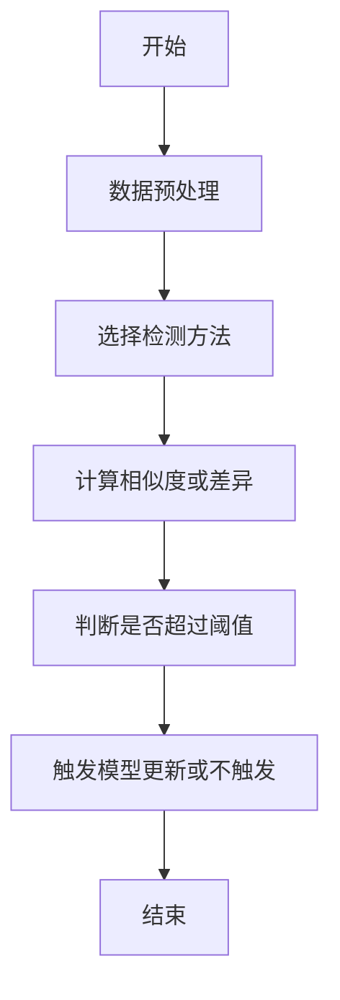
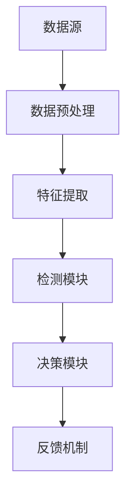

                 


# 设计AI Agent的概念漂移检测机制

## 关键词：概念漂移检测，AI Agent，机器学习，动态环境，数据分布变化

## 摘要：  
在AI Agent设计中，概念漂移检测是确保模型在动态环境中持续有效的重要机制。本文详细探讨概念漂移的定义、类型、检测方法及其在AI Agent中的应用，结合统计方法、机器学习算法和在线检测技术，提供系统设计和项目实战，帮助读者掌握概念漂移检测的核心技术。

---

# 第1章: 概念漂移检测的背景与问题

## 1.1 概念漂移的定义与问题背景

### 1.1.1 什么是概念漂移
概念漂移是指在动态环境中，数据分布或类别标签的变化导致机器学习模型性能下降的现象。例如，在电商推荐系统中，用户偏好随时间变化，模型需要适应这些变化以保持准确性。

### 1.1.2 概念漂移在AI Agent中的重要性
AI Agent需要在动态环境中执行任务，如自动驾驶、智能客服等。概念漂移可能导致模型失效，因此及时检测并适应变化至关重要。

### 1.1.3 概念漂移的分类与特征
概念漂移分为突然漂移和渐进漂移。突然漂移如突发事件导致的数据分布骤变，渐进漂移如用户偏好逐渐变化。检测需要区分这两种类型，以选择合适的策略。

## 1.2 问题描述与解决方法

### 1.2.1 动态环境中的概念变化
数据分布变化导致模型性能下降，如分类准确率降低。需要实时检测这些变化并触发模型更新。

### 1.2.2 概念漂移对AI Agent的影响
模型失效可能导致错误决策，影响用户体验和系统可靠性。例如，在医疗诊断中，概念漂移可能导致误诊。

### 1.2.3 概念漂移检测的基本思路
通过监控模型性能和数据分布变化，采用统计方法或机器学习算法检测漂移，并在检测到漂移时重新训练模型。

---

# 第2章: 概念漂移的核心概念与联系

## 2.1 概念漂移的属性特征对比

### 2.1.1 漂移类型对比表

| 漂移类型 | 特征描述 | 示例场景 |
|----------|----------|----------|
| 突然漂移 | 突然变化 | 突发事件导致数据分布骤变 |
| 渐进漂移 | 逐渐变化 | 用户偏好逐步改变 |

### 2.1.2 时间因素的影响
数据的时间戳和窗口大小影响漂移检测。例如，使用滑动窗口技术分析过去一周的数据变化。

### 2.1.3 数据分布的变化模式
数据分布的变化可以是均匀或非均匀的。例如，在电商中，某些产品销量突然增加，导致分布变化。

## 2.2 概念漂移的ER实体关系图

```mermaid
er
  entity 概念漂移现象 {
    漂移类型
    时间范围
    数据特征
  }
  entity 概念 {
    属性
    关系
  }
  entity 检测方法 {
    输入数据
    输出结果
  }
```

---

# 第3章: 概念漂移检测的算法原理

## 3.1 基于统计的方法

### 3.1.1 滑动窗口技术
使用滑动窗口技术监控模型性能，当性能下降超过阈值时触发重新训练。

### 3.1.2 方差分析法
通过方差变化检测数据分布的变化。例如，方差增大可能表明数据分布的变化。

### 3.1.3 基于分布差异的检测
比较当前数据与历史数据的分布差异，如使用Kullback-Leibler散度。

## 3.2 基于机器学习的方法

### 3.2.1 分类模型性能监控
通过监控分类准确率变化，判断是否发生概念漂移。

### 3.2.2 异常检测算法
使用异常检测算法识别数据中的异常变化，如Isolation Forest。

### 3.2.3 预测模型更新策略
在检测到漂移后，重新训练模型或部分更新模型参数。

## 3.3 算法流程图



---

# 第4章: 概念漂移检测的数学模型

## 4.1 统计模型

### 4.1.1 概率密度函数变化
通过比较当前和历史数据的密度函数变化来检测漂移。

$$f(x) = \sum_{i=1}^{n} w_i f_i(x)$$

### 4.1.2 方差变化公式
方差变化用于衡量数据分布的稳定性。

$$\sigma^2 = \frac{1}{N}\sum_{i=1}^{N}(x_i - \mu)^2$$

## 4.2 机器学习模型

### 4.2.1 分类性能退化检测
通过准确率的变化判断模型性能是否下降。

$$\text{准确率} = \frac{\text{正确预测数}}{\text{总预测数}}$$

### 4.2.2 模型更新触发条件
当准确率下降超过预设阈值时，触发模型更新。

$$\text{阈值} = \alpha \times \text{历史准确率}$$

---

# 第5章: AI Agent的概念漂移检测系统设计

## 5.1 系统架构设计

### 5.1.1 系统功能模块



### 5.1.2 系统架构图


## 5.2 功能模块设计

### 5.2.1 数据采集与预处理
从多个数据源采集数据，并进行清洗和特征提取。

### 5.2.2 检测模块实现
使用统计方法或机器学习算法检测概念漂移。

### 5.2.3 决策与反馈
根据检测结果，决定是否更新模型，并提供反馈机制。

---

# 第6章: 项目实战

## 6.1 环境安装与配置

### 6.1.1 安装Python和相关库
安装Python和机器学习库，如scikit-learn、pandas和numpy。

## 6.2 核心代码实现

### 6.2.1 概念漂移检测代码

```python
from sklearn.metrics import accuracy_score
from sklearn.model_selection import train_test_split
from sklearn.ensemble import RandomForestClassifier

def detect_drift(X_train, y_train, X_test, y_test):
    model = RandomForestClassifier()
    model.fit(X_train, y_train)
    y_pred = model.predict(X_test)
    accuracy = accuracy_score(y_test, y_pred)
    return accuracy < 0.8  # 假设阈值为80%
```

### 6.2.2 模型更新代码

```python
def update_model(X_train_new, y_train_new):
    model = RandomForestClassifier()
    model.fit(X_train_new, y_train_new)
    return model
```

## 6.3 案例分析

### 6.3.1 某电商分类案例
在电商分类中，用户购买行为变化导致概念漂移。通过检测准确率下降，触发模型重新训练。

## 6.4 项目总结

### 6.4.1 经验总结
及时检测和处理概念漂移，确保模型性能。选择合适的检测方法和阈值，根据具体场景调整。

---

# 第7章: 最佳实践与小结

## 7.1 小结

### 7.1.1 核心要点回顾
概念漂移检测在动态环境中的重要性，检测方法的选择和实现。

## 7.2 注意事项

### 7.2.1 实际应用中的问题
处理高维数据和复杂场景的挑战，模型更新的计算成本。

## 7.3 拓展阅读

### 7.3.1 进一步学习的方向
研究自适应机器学习、在线学习算法和分布变化检测的前沿技术。

---

# 结语

通过本文的详细讲解，读者可以掌握概念漂移检测的核心技术，从理论到实践，设计出高效的AI Agent系统，确保其在动态环境中的稳定性和高性能。

