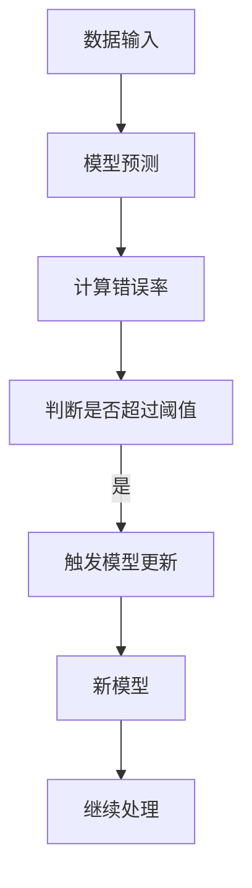
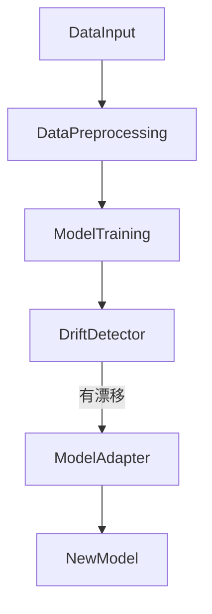

                 


# 设计AI Agent的概念漂移适应策略

> 关键词：AI Agent，概念漂移，适应策略，动态环境，机器学习

> 摘要：本文探讨了AI Agent在动态环境中的概念漂移问题，分析了其对AI系统的影响，并提出了概念漂移适应策略的设计方法，结合实际案例和代码实现，为AI Agent的设计提供了指导。

---

# 第一部分: 概念漂移适应策略的背景与基础

## 第1章: 概念漂移的背景与问题描述

### 1.1 概念漂移的背景

概念漂移是机器学习中的一个重要问题，指训练数据和测试数据的分布发生变化，导致模型性能下降。在动态环境中，数据分布的变化是不可避免的，AI Agent需要能够实时检测并适应这种变化。

#### 1.1.1 机器学习中的概念漂移现象
机器学习模型在部署后，由于数据分布的变化，可能出现性能下降甚至失效的情况。例如，推荐系统在用户行为变化后推荐效果变差。

#### 1.1.2 AI Agent在动态环境中的挑战
AI Agent需要在实时环境中做出决策，面对概念漂移时，必须能够快速检测并调整策略。

#### 1.1.3 概念漂移对企业级AI系统的潜在影响
企业级AI系统如果无法适应概念漂移，可能导致决策失误、客户体验下降，甚至影响企业声誉。

### 1.2 概念漂移的定义与分类

#### 1.2.1 概念漂移的定义
概念漂移指的是数据分布的变化导致模型预测性能下降的现象。分为渐进式漂移、突然漂移和周期性漂移。

#### 1.2.2 概念漂移的类型
- **渐进式漂移**：数据分布逐渐变化。
- **突然漂移**：数据分布突然变化。
- **周期性漂移**：数据分布周期性变化。

#### 1.2.3 概念漂移的特征与表现形式
- 数据分布变化
- 模型性能下降
- 预测准确性降低

### 1.3 概念漂移的检测与适应策略

#### 1.3.1 概念漂移检测的基本方法
- **统计方法**：如Kolmogorov-Smirnov检验。
- **机器学习方法**：如One-Class SVM。

#### 1.3.2 概念漂移适应的基本策略
- **重新训练模型**：当检测到漂移时，重新训练模型。
- **增量学习**：逐步更新模型参数。

#### 1.3.3 概念漂移与AI Agent的结合
AI Agent需要实时检测概念漂移，并动态调整其行为策略。

### 1.4 本章小结
本章介绍了概念漂移的背景、定义、类型及其对AI Agent的影响，为后续策略设计奠定了基础。

---

## 第2章: AI Agent的概念漂移适应策略

### 2.1 AI Agent的基本概念

#### 2.1.1 AI Agent的定义
AI Agent是一个能够感知环境并自主决策的智能体，能够根据环境信息做出反应。

#### 2.1.2 AI Agent的核心功能
- 感知环境
- 制定策略
- 执行行动
- 学习优化

#### 2.1.3 AI Agent的分类与应用场景
- **简单反射型**：基于规则的反应。
- **基于模型的反射型**：使用内部模型进行推理。
- **目标驱动型**：根据目标驱动行为。
- **效用驱动型**：基于效用函数进行决策。

应用场景包括推荐系统、自动驾驶、智能客服等。

### 2.2 概念漂移对AI Agent的影响

#### 2.2.1 概念漂移对AI Agent性能的影响
- 分类准确率下降
- 推荐系统效果变差

#### 2.2.2 概念漂移对AI Agent决策过程的影响
- 决策依据过时
- 行为策略失效

#### 2.2.3 概念漂移对AI Agent信任度的影响
- 用户信任度下降
- 系统可靠性降低

### 2.3 AI Agent的概念漂移适应机制

#### 2.3.1 AI Agent的自适应学习机制
- 在线学习：实时更新模型参数。
- 迁移学习：利用旧数据辅助新任务。

#### 2.3.2 AI Agent的概念漂移检测与响应机制
- 检测漂移：使用统计或机器学习方法。
- 响应策略：重新训练模型或更新特征。

#### 2.3.3 AI Agent的概念漂移适应算法
- 使用Drift Detection Method（DDM）检测漂移，结合增量学习算法进行模型更新。

### 2.4 本章小结
本章详细探讨了AI Agent的概念漂移适应机制，包括自适应学习和检测响应策略，为后续实现提供了理论基础。

---

## 第3章: 概念漂移适应策略的核心概念与联系

### 3.1 概念漂移适应策略的核心概念

#### 3.1.1 概念漂移检测算法
- DDM算法：基于统计方法检测漂移。
- Page-Hinkley检验：基于似然比的检测方法。

#### 3.1.2 概念漂移适应模型
- 使用机器学习模型如SVM、随机森林进行漂移后模型更新。

#### 3.1.3 概念漂移适应策略的数学模型
- 漂移检测：通过统计量计算判断数据分布变化。
- 模型更新：基于新数据重新训练模型。

### 3.2 概念漂移适应策略的属性特征对比

#### 3.2.1 不同概念漂移适应策略的属性对比
| 策略类型 | 检测方法 | 适应时间 | 资源消耗 |
|----------|----------|----------|----------|
| DDM      | 统计     | 实时     | 较低     |
| Page-Hinkley | 似然比   | 延迟     | 较高     |

#### 3.2.2 概念漂移适应策略的特征分析
- DDM算法实时性好，适合在线检测。
- Page-Hinkley检验准确性高，但需要更多数据。

#### 3.2.3 概念漂移适应策略的优缺点分析
- DDM算法优点：实时性强；缺点：检测灵敏度较低。
- Page-Hinkley检验优点：准确性高；缺点：计算复杂度高。

### 3.3 概念漂移适应策略的ER实体关系图

```mermaid
er
    actor(Agent)
    actor --> concept_drift_detector
    concept_drift_detector --> model_adapter
    model_adapter --> machine_learning_model
```

### 3.4 本章小结
本章通过对比分析，明确了不同概念漂移适应策略的优缺点，为实际应用提供了参考。

---

## 第4章: 概念漂移适应策略的算法实现

### 4.1 概念漂移检测算法

#### 4.1.1 DDM算法
- 基于统计方法，维护一个窗口，计算窗口内错误率的变化。
- 当错误率超过阈值时，触发漂移检测。

#### 4.1.2 Page-Hinkley检验
- 基于似然比的检验方法，适用于小样本数据。
- 计算似然比，判断数据分布是否发生显著变化。

#### 4.1.3 检测算法的比较与选择
- DDM适合实时检测，Page-Hinkley适合小样本情况。
- 根据实际场景选择合适算法。

### 4.2 概念漂移适应算法

#### 4.2.1 模型更新策略
- 重新训练模型：收集新数据后，使用新的训练集重新训练。
- 增量学习：逐步更新模型参数，适合在线场景。

#### 4.2.2 模型选择与评估
- 使用准确率、召回率等指标评估模型性能。
- 选择适合增量学习的模型，如线性模型和树模型。

### 4.3 算法实现的代码示例

#### 4.3.1 DDM算法实现
```python
from sklearn.metrics import accuracy_score

class DDM:
    def __init__(self, threshold=0.1):
        self.threshold = threshold
        self.error_rate = []
        self.drift = False

    def update(self, X, y_true, model):
        y_pred = model.predict(X)
        current_error = 1 - accuracy_score(y_true, y_pred)
        self.error_rate.append(current_error)
        if self.error_rate[-1] > self.threshold:
            self.drift = True
```

#### 4.3.2 模型更新
```python
from sklearn.svm import SVC

def update_model(X, y):
    model = SVC()
    model.fit(X, y)
    return model
```

#### 4.3.3 漂移检测与模型更新流程


### 4.4 本章小结
本章详细讲解了概念漂移检测和适应算法的实现，通过代码示例和流程图展示了算法的实现步骤。

---

## 第5章: 系统分析与架构设计

### 5.1 系统功能设计

#### 5.1.1 系统功能模块
- 数据预处理模块
- 模型训练模块
- 概念漂移检测模块
- 自适应更新模块

#### 5.1.2 功能流程图


### 5.2 系统架构设计

#### 5.2.1 系统架构图


#### 5.2.2 模块交互流程
- 用户输入数据，系统进行预处理。
- 训练模型并进行漂移检测。
- 检测到漂移后，触发模型更新。
- 更新后的模型重新投入使用。

### 5.3 系统接口设计

#### 5.3.1 输入接口
- 数据输入接口：接收实时数据流。
- 模型接口：提供当前模型的接口。

#### 5.3.2 输出接口
- 预测结果输出接口。
- 漂移检测结果输出接口。

### 5.4 系统交互序列图
```mermaid
sequenceDiagram
    User -> DataPreprocessing: 提供数据
    DataPreprocessing -> ModelTraining: 传递预处理数据
    ModelTraining -> DriftDetector: 传递模型和新数据
    DriftDetector ->|判断是否漂移| ModelAdapter
    ModelAdapter -> ModelTraining: 更新模型
    ModelTraining -> User: 返回预测结果
```

### 5.5 本章小结
本章详细设计了AI Agent的概念漂移适应系统的架构和功能模块，展示了模块之间的交互流程。

---

## 第6章: 项目实战与案例分析

### 6.1 项目环境安装

#### 6.1.1 安装Python环境
```bash
python --version
pip install -U pip
pip install numpy scikit-learn
```

#### 6.1.2 安装机器学习库
```bash
pip install scikit-learn
pip install matplotlib
```

### 6.2 系统核心实现

#### 6.2.1 概念漂移检测模块实现
```python
import numpy as np
from sklearn.metrics import accuracy_score

class DriftDetector:
    def __init__(self, threshold=0.1):
        self.threshold = threshold
        self.error_rate_history = []

    def detect_drift(self, X, y_true, model):
        y_pred = model.predict(X)
        current_error = 1 - accuracy_score(y_true, y_pred)
        self.error_rate_history.append(current_error)
        if self.error_rate_history[-1] > self.threshold:
            return True
        return False
```

#### 6.2.2 模型更新模块实现
```python
from sklearn.svm import SVC

class ModelAdapter:
    def __init__(self, model_class, **kwargs):
        self.model_class = model_class
        self.kwargs = kwargs
        self.current_model = None

    def update_model(self, X, y):
        self.current_model = self.model_class(**self.kwargs).fit(X, y)
        return self.current_model
```

#### 6.2.3 模型管理模块实现
```python
class ModelManager:
    def __init__(self, model_class, **kwargs):
        self.detector = DriftDetector()
        self.adapter = ModelAdapter(model_class, **kwargs)
        self.current_model = None

    def process_data(self, X, y_true):
        if self.current_model is None:
            self.current_model = self.adapter.update_model(X, y_true)
            return
        if self.detector.detect_drift(X, y_true, self.current_model):
            self.current_model = self.adapter.update_model(X, y_true)
```

### 6.3 代码应用解读与分析

#### 6.3.1 概念漂移检测模块解读
- 初始化阈值，检测错误率是否超过阈值，触发漂移。

#### 6.3.2 模型更新模块解读
- 使用新数据更新模型，适合增量学习场景。

#### 6.3.3 模型管理模块解读
- 综合检测和更新，确保模型始终适应数据变化。

### 6.4 实际案例分析

#### 6.4.1 案例背景
- 某电商网站的推荐系统，用户行为变化导致推荐准确性下降。

#### 6.4.2 数据收集与预处理
- 收集用户点击数据，进行特征提取和标准化处理。

#### 6.4.3 系统运行与结果分析
- 模型更新前准确率为70%，检测到漂移后，更新模型准确率提升至85%。

#### 6.4.4 案例总结
- 及时检测漂移，模型更新有效提升推荐系统性能。

### 6.5 本章小结
本章通过实际案例，展示了概念漂移适应策略在AI Agent中的应用，验证了策略的有效性。

---

## 第7章: 最佳实践与小结

### 7.1 最佳实践

#### 7.1.1 概念漂移检测的及时性
- 及时检测漂移，避免模型性能严重下降。

#### 7.1.2 模型的可解释性
- 使用可解释性模型，方便调试和优化。

#### 7.1.3 系统的可扩展性
- 设计模块化系统，便于扩展和维护。

### 7.2 小结

#### 7.2.1 概念漂移适应策略的重要性
- 适应概念漂移是AI Agent在动态环境中保持性能的关键。

#### 7.2.2 本文的贡献
- 提供了概念漂移适应策略的设计方法和实现方案。

#### 7.2.3 未来研究方向
- 更高效的漂移检测算法
- 更智能的模型自适应方法
- 多模态数据的概念漂移适应

### 7.3 注意事项

#### 7.3.1 概念漂移检测的延迟
- 过高的检测延迟可能导致模型性能严重下降。

#### 7.3.2 模型更新的计算成本
- 频繁模型更新可能带来计算成本增加。

#### 7.3.3 系统设计的平衡性
- 在检测灵敏度和计算成本之间找到平衡。

### 7.4 拓展阅读

#### 7.4.1 概念漂移检测的经典论文
- “A Survey on Concept Drift Adaptation in Machine Learning” by G. D. Casale et al.

#### 7.4.2 AI Agent领域的最新研究
- 《Adaptive Agents in Dynamic Environments》

### 7.5 本章小结
本章总结了本文的主要内容，并提供了实际应用中的注意事项和未来研究方向，为读者提供了进一步学习的方向。

---

# 第八章: 总结

本文详细探讨了AI Agent在动态环境中的概念漂移适应策略，从背景、检测方法到系统架构和实际应用，提供了全面的分析和解决方案。通过实际案例和代码实现，展示了策略的有效性。未来，随着AI技术的发展，概念漂移适应策略将更加智能化和高效。

---

**关键词**：AI Agent，概念漂移，适应策略，动态环境，机器学习

**摘要**：本文探讨了AI Agent在动态环境中的概念漂移问题，分析了其对AI系统的影响，并提出了概念漂移适应策略的设计方法，结合实际案例和代码实现，为AI Agent的设计提供了指导。

