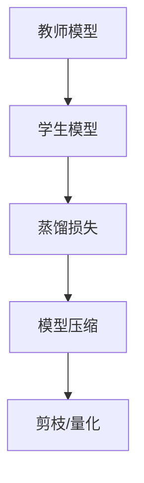
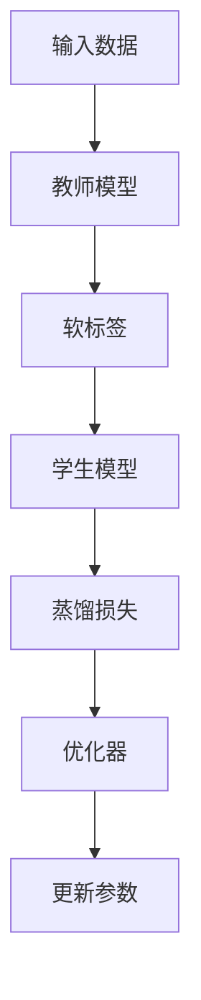
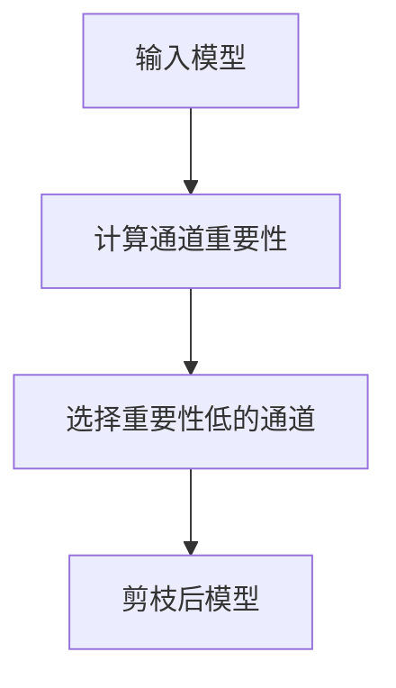
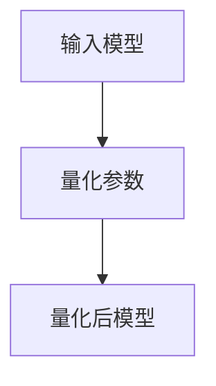

                 


# 设计AI Agent的知识蒸馏与压缩策略

## 关键词：AI Agent，知识蒸馏，模型压缩，算法优化，系统架构

## 摘要：  
在AI Agent的设计中，知识蒸馏与压缩是实现高效推理和轻量化部署的核心技术。本文从背景、核心概念、算法原理、系统架构、项目实战等多维度，详细探讨知识蒸馏与压缩的策略。通过理论分析与实践结合，为AI Agent的优化提供深度指导。

---

# 第1章: AI Agent的知识蒸馏与压缩背景

## 1.1 问题背景与挑战

### 1.1.1 AI Agent的发展现状  
AI Agent（人工智能代理）是一种能够感知环境、自主决策并执行任务的智能体。随着深度学习模型的复杂性不断提高，AI Agent的应用场景逐渐扩展至自动驾驶、智能助手、机器人等领域。然而，模型的体积和计算成本也随之增加，导致在资源受限的场景（如边缘计算、移动设备）中难以高效运行。

**问题背景**：  
- 大型模型（如GPT系列）参数量巨大，推理成本高昂。  
- 在实时性要求高的场景中，模型响应速度成为瓶颈。  
- 跨设备部署（如嵌入式系统）需要轻量化模型。  

### 1.1.2 知识蒸馏与压缩的必要性  
知识蒸馏（Knowledge Distillation）与模型压缩（Model Compression）是解决上述问题的关键技术。通过蒸馏，可以将大型模型的知识迁移到小型模型中；通过压缩，可以降低模型的计算复杂度，使其在资源受限的环境中运行。

### 1.1.3 当前技术的主要挑战  
- 知识蒸馏的效果依赖于教师模型的质量，如何选择合适的教师模型？  
- 模型压缩可能引入精度损失，如何在压缩与性能之间找到平衡？  
- 蒸馏与压缩的协同优化策略尚未完善。  

---

## 1.2 AI Agent的基本概念

### 1.2.1 AI Agent的定义与特点  
AI Agent是一种能够感知环境、自主决策并执行任务的智能体。其特点包括：  
1. **自主性**：无需外部干预，自主完成任务。  
2. **反应性**：能够实时感知环境并做出响应。  
3. **目标导向性**：基于目标函数进行决策。  
4. **可解释性**：决策过程需具备一定的可解释性。  

### 1.2.2 知识蒸馏与压缩的核心概念  
- **知识蒸馏**：将大型模型（教师）的知识迁移到小型模型（学生）。  
- **模型压缩**：通过剪枝、量化等技术减少模型的计算复杂度。  

### 1.2.3 相关技术的边界与外延  
- **知识蒸馏**：主要应用于分类、生成等任务。  
- **模型压缩**：适用于图像识别、自然语言处理等多种任务。  
- **边界**：蒸馏依赖于教师模型的质量，压缩依赖于模型的结构特性。  

---

## 1.3 问题描述与解决思路

### 1.3.1 知识蒸馏与压缩的目标  
1. **降低计算成本**：减少模型的参数量和计算复杂度。  
2. **提升部署效率**：在资源受限的环境中实现高效推理。  
3. **保持性能**：压缩后的模型性能尽可能接近原模型。  

### 1.3.2 知识蒸馏与压缩的核心要素  
1. **教师模型的选择**：选择合适的教师模型是蒸馏成功的关键。  
2. **蒸馏损失函数的设计**：平衡学生模型的重构损失与教师模型的指导损失。  
3. **压缩策略的选择**：根据任务需求选择剪枝、量化等技术。  

### 1.3.3 解决方案的对比与选择  
通过对比蒸馏与压缩的优缺点，选择适合特定任务的策略。例如：  
- 对于实时性要求高的任务，优先选择模型压缩。  
- 对于模型性能要求较高的任务，优先选择知识蒸馏。  

---

## 1.4 本章小结  
本章从AI Agent的发展现状出发，介绍了知识蒸馏与压缩的必要性，并分析了当前技术的主要挑战。通过定义与对比，明确了蒸馏与压缩的核心概念及其在AI Agent中的应用边界。

---

# 第2章: 知识蒸馏与压缩的核心概念

## 2.1 核心概念原理

### 2.1.1 知识蒸馏的定义与实现原理  
**知识蒸馏**：将教师模型的知识迁移到学生模型中。  
- **教师模型**：通常是一个大型模型，具有较高的性能。  
- **学生模型**：通常是一个小型模型，通过蒸馏学习教师的知识。  

**实现原理**：  
1. **软标签生成**：教师模型为输入样本生成概率分布（软标签）。  
2. **蒸馏损失计算**：学生模型的输出与软标签之间的差异作为损失。  
3. **联合训练**：学生模型同时优化分类任务和蒸馏损失。  

### 2.1.2 模型压缩的定义与实现原理  
**模型压缩**：通过减少模型的参数量或计算复杂度来降低资源消耗。  
- **剪枝**：去除模型中冗余的神经元或连接。  
- **量化**：将模型参数从浮点数降低为整数，减少存储空间。  
- **知识蒸馏**：通过蒸馏技术进一步优化压缩后的模型。  

### 2.1.3 蒸馏与压缩的协同关系  
蒸馏与压缩可以协同优化模型性能：  
- 蒸馏可以提升压缩后模型的性能。  
- 压缩可以降低蒸馏过程中的计算成本。  

---

## 2.2 核心概念对比

### 2.2.1 蒸馏与压缩的对比分析  
| 对比维度 | 知识蒸馏 | 模型压缩 |  
|---------|----------|----------|  
| 目标     | 迁移知识 | 减少模型复杂度 |  
| 适用场景 | 高性能需求 | 资源受限场景 |  
| 实现方式 | 软标签、蒸馏损失 | 剪枝、量化 |  

### 2.2.2 不同蒸馏策略的优缺点  
| 蒸馏策略 | 优点 | 缺点 |  
|----------|------|------|  
| 直接蒸馏 | 易实现 | 效果依赖教师模型 |  
| 对抗蒸馏 | 提高鲁棒性 | 实现复杂 |  

### 2.2.3 模型压缩技术的分类与特点  
| 压缩技术 | 特点 |  
|----------|------|  
| 剪枝 | 去除冗余参数 |  
| 量化 | 减少存储空间 |  
| 知识蒸馏 | 提升压缩模型性能 |  

---

## 2.3 实体关系图

### 2.3.1 知识蒸馏与压缩的ER实体关系图  
```mermaid
er
actor
    name: 知识蒸馏
    attributes: 教师模型、学生模型、蒸馏损失
actor
    name: 模型压缩
    attributes: 剪枝、量化、压缩比
```

### 2.3.2 模型压缩与蒸馏的协同关系图  


---

## 2.4 本章小结  
本章详细讲解了知识蒸馏与压缩的核心概念，并通过对比分析和实体关系图，明确了两者之间的协同关系。

---

# 第3章: 知识蒸馏的算法原理

## 3.1 算法原理讲解

### 3.1.1 知识蒸馏的基本流程  
1. **教师模型训练**：训练一个高性能的教师模型。  
2. **学生模型初始化**：初始化一个小型学生模型。  
3. **蒸馏过程**：学生模型通过蒸馏教师模型的知识进行优化。  

### 3.1.2 蒸馏损失函数的设计  
**蒸馏损失**：  
$$ L_{distill} = \alpha \cdot L_{ce}(y, p) + (1-\alpha) \cdot L_{ce}(y, q) $$  
其中，$y$ 是真实标签，$p$ 是教师模型的输出概率，$q$ 是学生模型的输出概率，$\alpha$ 是蒸馏系数。  

### 3.1.3 蒸馏过程中的关键参数  
- **温度系数**：$T$，控制软标签的分布范围。  
- **蒸馏系数**：$\alpha$，平衡分类损失与蒸馏损失。  

---

## 3.2 算法流程图  


---

## 3.3 算法实现代码

### 3.3.1 知识蒸馏的Python实现  
```python
import torch
import torch.nn as nn
import torch.optim as optim

# 定义教师模型和学生模型
class TeacherModel(nn.Module):
    def __init__(self):
        super(TeacherModel, self).__init__()
        self.fc = nn.Linear(10, 5)

class StudentModel(nn.Module):
    def __init__(self):
        super(StudentModel, self).__init__()
        self.fc = nn.Linear(10, 5)

# 定义蒸馏损失函数
class DistillLoss(nn.Module):
    def __init__(self, T=2, alpha=0.5):
        super(DistillLoss, self).__init__()
        self.T = T
        self.alpha = alpha

    def forward(self, inputs, outputs, labels):
        # 教师模型输出概率
        teacher_outputs = torch.nn.functional.softmax(inputs / self.T, dim=1)
        # 学生模型输出概率
        student_outputs = torch.nn.functional.softmax(outputs / self.T, dim=1)
        # 蒸馏损失
        distill_loss = self.alpha * nn.CrossEntropyLoss() + (1 - self.alpha) * nn.KLDivLoss(reduction='batchmean')(student_outputs.log(), teacher_outputs)
        return distill_loss

# 初始化模型和优化器
teacher = TeacherModel()
student = StudentModel()
optimizer = optim.Adam(student.parameters(), lr=0.001)
criterion = DistillLoss(T=2, alpha=0.5)

# 蒸馏训练
for epoch in range(num_epochs):
    for batch_data, labels in dataloader:
        # 前向传播
        teacher_outputs = teacher(batch_data)
        student_outputs = student(batch_data)
        # 计算蒸馏损失
        loss = criterion(batch_data, student_outputs, labels)
        # 反向传播与优化
        optimizer.zero_grad()
        loss.backward()
        optimizer.step()
```

---

## 3.4 本章小结  
本章详细讲解了知识蒸馏的算法原理，并通过流程图和代码示例，展示了蒸馏过程的具体实现。

---

# 第4章: 模型压缩的算法原理

## 4.1 算法原理讲解

### 4.1.1 模型压缩的基本方法  
1. **剪枝**：去除模型中冗余的神经元或连接。  
2. **量化**：将模型参数从浮点数降低为整数。  
3. **知识蒸馏**：通过蒸馏技术进一步优化压缩后的模型。  

### 4.1.2 剪枝策略的设计  
- **层间剪枝**：去除全连接层或卷积层中的冗余神经元。  
- **层内剪枝**：去除神经元之间的冗余连接。  

### 4.1.3 量化策略的设计  
- **均匀量化**：将浮点数均匀映射到整数。  
- **非均匀量化**：根据概率分布进行非线性量化。  

---

## 4.2 算法流程图  

### 4.2.1 剪枝流程图  


### 4.2.2 量化流程图  


---

## 4.3 算法实现代码

### 4.3.1 剪枝的Python实现  
```python
def prune_model(model, prune_rate=0.5):
    # 计算每个通道的重要性
    importance = torch.abs(torch.sum(torch.mean(model.weight, dim=(1,2,3)), dim=0))
    # 排序并选择重要性低的通道
    sorted_importance, idx = torch.sort(importance, descending=True)
    prune_num = int(len(importance) * prune_rate)
    keep_idx = idx[prune_num:]
    # 剪枝模型
    new_model = copy.deepcopy(model)
    new_model.weight = torch.nn.Parameter(new_model.weight[:, keep_idx])
    return new_model
```

### 4.3.2 量化

