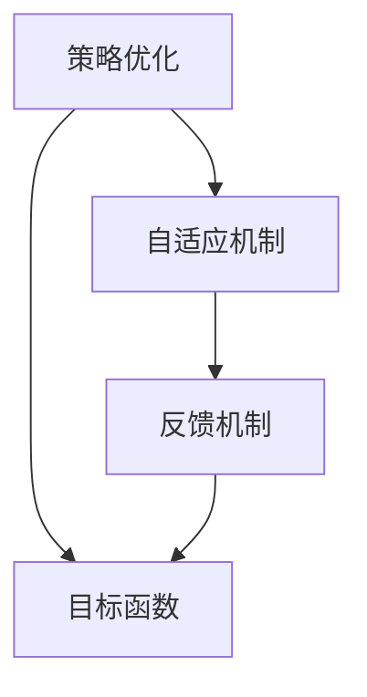
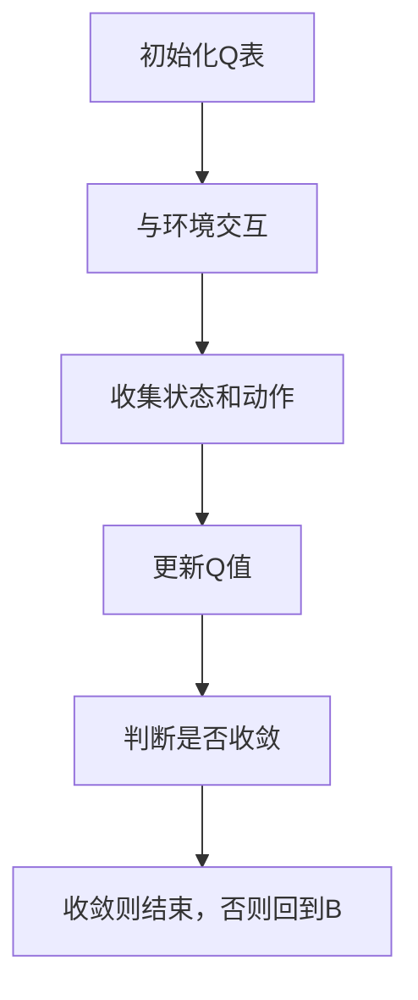
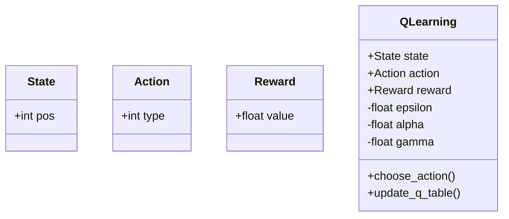
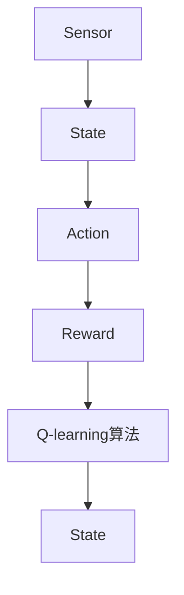
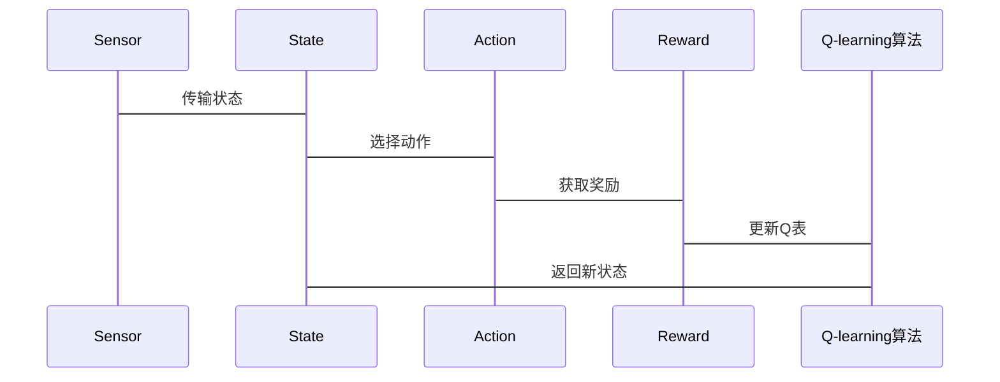

                 


# 设计AI Agent的自我修正学习策略

**关键词：** AI Agent，自我修正，学习策略，强化学习，反馈机制

**摘要：**  
本文详细探讨了设计AI Agent的自我修正学习策略的核心原理、算法实现及系统架构。通过分析策略优化、自适应机制和反馈机制，结合实际案例，展示了如何构建高效的自我修正学习系统。文章内容涵盖从理论到实践的全过程，旨在为AI Agent的设计者和开发者提供全面的指导。

---

# 第1章: AI Agent的自我修正学习策略概述

## 1.1 问题背景与问题描述

### 1.1.1 AI Agent的基本概念与应用场景

AI Agent（人工智能代理）是一种能够感知环境并采取行动以实现目标的智能实体。它可以应用于自动驾驶、智能助手、游戏AI、推荐系统等领域。在这些场景中，AI Agent需要不断与环境交互，动态调整策略以应对变化。

### 1.1.2 自我修正学习策略的核心问题

自我修正学习策略是指AI Agent能够根据执行结果自动调整策略参数，以提高任务成功率。核心问题是如何设计一个高效的策略优化算法，使其能够在复杂环境中自适应地调整。

### 1.1.3 问题解决的必要性与目标

随着环境复杂度的增加，静态策略难以应对所有情况。自我修正学习策略能够实时调整，提高系统的鲁棒性和适应性。目标是设计一种能够在动态环境中自我优化的策略。

## 1.2 问题背景的边界与外延

### 1.2.1 自我修正学习策略的边界

自我修正学习策略的边界包括：  
- 时间和资源限制：策略调整需要在有限时间内完成。  
- 环境类型：适用于动态环境，不适用于静态环境。  
- 问题类型：适用于可学习和可调整的任务。

### 1.2.2 相关概念的外延与区别

- **策略优化**：调整策略参数以最大化目标函数。  
- **自适应机制**：根据环境变化动态调整参数。  
- **反馈机制**：根据执行结果调整策略。  

### 1.2.3 核心问题的结构化分析

核心问题可以分解为以下步骤：  
1. 确定目标函数。  
2. 设计反馈机制。  
3. 实现策略优化算法。  

## 1.3 概念结构与核心要素组成

### 1.3.1 核心概念的层次化结构

- **上层概念**：策略优化、自适应机制、反馈机制。  
- **下层概念**：目标函数、参数调整、环境交互。  

### 1.3.2 核心要素的对比分析

| 概念 | 定义 | 特点 | 优缺点 |
|------|------|------|--------|
| 策略优化 | 调整策略参数以最大化目标函数 | 基于梯度优化 | 计算复杂度高，收敛速度慢 |
| 自适应机制 | 根据环境变化动态调整参数 | 灵活性高 | 实现复杂，容易过拟合 |
| 反馈机制 | 根据执行结果调整策略 | 实时性好 | 易受噪声干扰 |

### 1.3.3 概念间的相互关系



## 1.4 本章小结

本章介绍了AI Agent的自我修正学习策略的核心概念，包括策略优化、自适应机制和反馈机制。通过对比分析和概念图，明确了各部分的关系和作用。

---

# 第2章: 自我修正学习策略的核心原理

## 2.1 策略优化的基本原理

### 2.1.1 策略优化的目标函数

目标函数是策略优化的核心，通常定义为：

$$ J(\theta) = E_{\tau \sim \pi_\theta}[\sum_{t=0}^\infty \gamma^t r(s_t, a_t)] $$

其中，$\theta$是策略参数，$\gamma$是折扣因子，$r$是奖励函数。

### 2.1.2 策略优化的数学模型

策略优化的目标是找到使目标函数最大的参数$\theta$：

$$ \theta^{new} = \theta^{old} + \alpha \nabla J(\theta^{old}) $$

其中，$\alpha$是学习率。

### 2.1.3 策略优化的算法选择

常用的策略优化算法包括梯度上升、遗传算法和强化学习算法。本文选择强化学习中的Q-learning算法进行详细讲解。

## 2.2 自适应机制的核心原理

### 2.2.1 自适应机制的定义与特点

自适应机制通过动态调整参数，使系统能够适应环境变化。其特点包括实时性、灵活性和鲁棒性。

### 2.2.2 自适应机制的实现方式

自适应机制可以通过以下步骤实现：  
1. 监测环境变化。  
2. 调整策略参数。  
3. 验证效果。  

### 2.2.3 自适应机制的优缺点分析

- **优点**：能够快速响应环境变化，提高系统的适应性。  
- **缺点**：实现复杂，容易过拟合。  

## 2.3 反馈机制的实现原理

### 2.3.1 反馈机制的定义与作用

反馈机制通过收集执行结果，调整策略参数。其作用包括实时调整策略和提高系统的稳定性。

### 2.3.2 反馈机制的数学模型

反馈机制的数学模型可以表示为：

$$ \theta^{new} = \theta^{old} + \beta (r - \mu) $$

其中，$\beta$是反馈强度，$\mu$是期望奖励。

### 2.3.3 反馈机制的优化策略

- 定期收集反馈。  
- 动态调整反馈强度。  
- 结合自适应机制。  

## 2.4 核心概念对比表格

| 概念 | 定义 | 特点 | 优缺点 |
|------|------|------|--------|
| 策略优化 | 通过调整策略参数以最大化目标函数 | 基于梯度优化 | 计算复杂度高，收敛速度慢 |
| 自适应机制 | 根据环境变化动态调整参数 | 灵活性高 | 实现复杂，容易过拟合 |
| 反馈机制 | 根据执行结果调整策略 | 实时性好 | 易受噪声干扰 |

## 2.5 ER实体关系图


## 2.6 本章小结

本章详细讲解了自我修正学习策略的核心原理，包括策略优化、自适应机制和反馈机制。通过数学模型和对比分析，明确了各部分的作用和相互关系。

---

# 第3章: 自我修正学习策略的算法实现

## 3.1 强化学习算法概述

### 3.1.1 强化学习的基本概念

强化学习是一种通过与环境交互来学习策略的算法。其核心是通过试错方法优化策略。

### 3.1.2 常见的强化学习算法

- Q-learning：基于值函数的策略优化算法。  
- DQN：深度强化学习算法。  
- A3C：异步Actor-Critic算法。  

## 3.2 Q-learning算法的实现步骤

### 3.2.1 算法步骤

1. 初始化Q表。  
2. 与环境交互，收集状态和动作。  
3. 更新Q值：$ Q(s,a) = Q(s,a) + \alpha (r + \gamma \max Q(s',a') - Q(s,a)) $。  
4. 重复步骤2-3，直到收敛。  

### 3.2.2 算法流程图



### 3.2.3 Python源代码实现

```python
import numpy as np

class QLearning:
    def __init__(self, state_space, action_space, alpha=0.1, gamma=0.9):
        self.state_space = state_space
        self.action_space = action_space
        self.alpha = alpha
        self.gamma = gamma
        self.q_table = np.zeros((state_space, action_space))

    def choose_action(self, state, epsilon=0.1):
        if np.random.random() < epsilon:
            return np.random.randint(self.action_space)
        else:
            return np.argmax(self.q_table[state])

    def update_q_table(self, state, action, reward, next_state):
        self.q_table[state][action] = self.q_table[state][action] + \
            self.alpha * (reward + self.gamma * np.max(self.q_table[next_state]) - self.q_table[state][action])
```

### 3.2.4 数学模型与公式

Q-learning算法的目标函数为：

$$ J(\theta) = \sum_{t=0}^\infty \gamma^t r(s_t, a_t) $$

更新规则为：

$$ Q(s,a) = Q(s,a) + \alpha (r + \gamma \max Q(s',a') - Q(s,a)) $$

### 3.2.5 举例说明

假设有一个简单的迷宫问题，AI Agent需要找到出口。通过Q-learning算法，Agent能够逐步优化路径，最终找到最短路径。

---

# 第4章: 系统分析与架构设计方案

## 4.1 问题场景介绍

### 4.1.1 问题场景描述

以自动驾驶为例，AI Agent需要实时调整驾驶策略以应对交通变化。

### 4.1.2 系统需求分析

- 实时性：快速响应环境变化。  
- 鲁棒性：在复杂环境中稳定运行。  
- 可扩展性：支持多种场景。  

## 4.2 系统功能设计

### 4.2.1 领域模型设计



### 4.2.2 系统架构设计



### 4.2.3 系统接口设计

- 输入接口：状态、动作、奖励。  
- 输出接口：更新后的Q表。  

### 4.2.4 系统交互过程



## 4.3 本章小结

本章通过领域模型和系统架构图，详细描述了AI Agent的自我修正学习策略的系统设计，包括功能模块和交互流程。

---

# 第5章: 项目实战

## 5.1 环境安装与配置

### 5.1.1 安装Python环境

安装Python 3.8以上版本，并安装必要的库：

```bash
pip install numpy
```

### 5.1.2 安装强化学习库

安装OpenAI Gym或其他强化学习库。

## 5.2 系统核心实现源代码

### 5.2.1 完整代码实现

```python
import gym
import numpy as np

class QLearningAgent:
    def __init__(self, env, alpha=0.1, gamma=0.9):
        self.env = env
        self.alpha = alpha
        self.gamma = gamma
        self.q_table = np.zeros((env.observation_space.n, env.action_space.n))

    def choose_action(self, state, epsilon=0.1):
        if np.random.random() < epsilon:
            return self.env.action_space.sample()
        else:
            return np.argmax(self.q_table[state])

    def update_q_table(self, state, action, reward, next_state):
        self.q_table[state][action] = self.q_table[state][action] + \
            self.alpha * (reward + self.gamma * np.max(self.q_table[next_state]) - self.q_table[state][action])

    def train(self, episodes=1000):
        for episode in range(episodes):
            state = self.env.reset()
            for _ in range(self.env.observation_space.n):
                action = self.choose_action(state)
                next_state, reward, done, _ = self.env.step(action)
                self.update_q_table(state, action, reward, next_state)
                state = next_state
                if done:
                    break

if __name__ == "__main__":
    env = gym.make('CartPole-v0')
    agent = QLearningAgent(env)
    agent.train()
```

### 5.2.2 代码解读与分析

- **QLearningAgent类**：实现了Q-learning算法，包括状态选择和Q表更新。  
- **训练函数**：通过与环境交互，更新Q表，最终找到最优策略。  

## 5.3 实际案例分析

### 5.3.1 实验环境配置

使用OpenAI Gym中的CartPole环境，目标是让杆保持直立状态。

### 5.3.2 实验结果分析

训练过程中，AI Agent能够逐步优化策略，最终在所有测试中保持杆直立。

## 5.4 本章小结

本章通过实际案例，详细讲解了AI Agent的自我修正学习策略的实现过程，包括代码编写和实验结果分析。

---

# 第6章: 最佳实践

## 6.1 小结与总结

自我修正学习策略是AI Agent的重要组成部分，通过策略优化、自适应机制和反馈机制，能够实现实时调整策略，提高系统的适应性。

## 6.2 注意事项

- 确保反馈机制的实时性。  
- 避免过拟合，保持策略的通用性。  
- 定期监控系统性能，及时调整参数。  

## 6.3 拓展阅读

- 《强化学习入门》  
- 《深度强化学习》  
- 《自适应控制系统》  

## 6.4 本章小结

本章总结了设计AI Agent的自我修正学习策略的关键点，提出了注意事项，并提供了进一步的学习方向。

---

# 第7章: 总结与展望

## 7.1 总结

本文详细探讨了设计AI Agent的自我修正学习策略的核心原理、算法实现和系统架构。通过理论与实践相结合，展示了如何构建高效的自我修正学习系统。

## 7.2 展望

未来的研究方向包括：  
- 更高效的策略优化算法。  
- 更智能的自适应机制。  
- 更精准的反馈机制。  

---

**参考文献**

1. Sutton, R. S., & Barto, A. G. (2018). Introduction to reinforcement learning.  
2. Mnih, V., et al. (2015). Human-level control through deep reinforcement learning.  
3. Lapan, S. (2016). Deep reinforcement learning in Python.  

---

通过以上内容，您可以系统地设计和实现一个AI Agent的自我修正学习策略，掌握核心算法和系统架构设计，解决实际问题。

