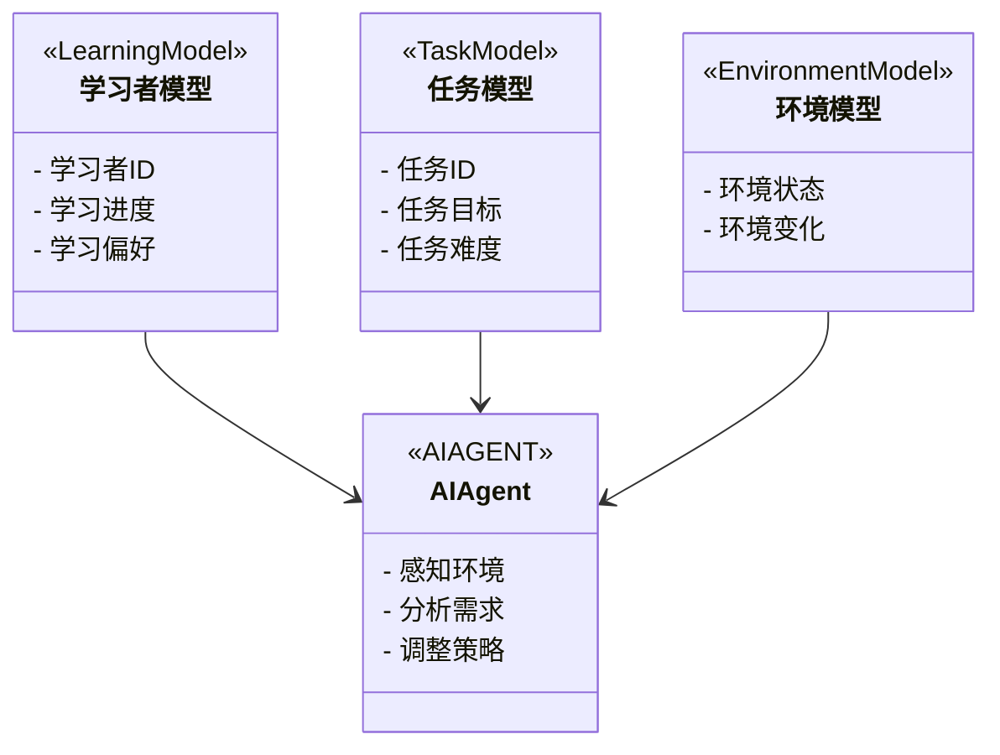
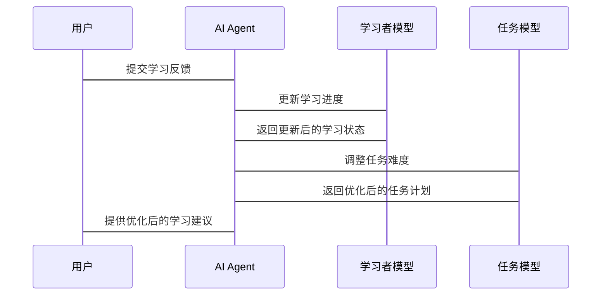

                 


# 设计AI Agent的自适应课程学习策略

## 关键词：AI Agent，自适应学习，课程学习，强化学习，算法原理，系统架构，项目实战

## 摘要：  
本文将详细探讨如何设计AI Agent的自适应课程学习策略。通过分析自适应学习的核心原理、算法实现、系统架构以及实际案例，本文旨在为AI Agent的设计者和开发者提供一套系统化的解决方案，帮助他们在复杂的环境中实现动态调整和优化学习路径。

---

# 第一部分: AI Agent与自适应课程学习策略背景

## 第1章: AI Agent与自适应学习概述

### 1.1 问题背景与核心概念  
#### 1.1.1 AI Agent的基本定义  
AI Agent（人工智能代理）是指能够感知环境、执行任务并做出决策的智能体。它通常具备以下核心功能：感知（Perception）、推理（Reasoning）、规划（Planning）、学习（Learning）和执行（Execution）。  

#### 1.1.2 自适应学习的基本概念  
自适应学习是指根据学习者的需求、能力和进度动态调整学习内容、节奏和策略的过程。其核心在于实时优化学习路径，以提高学习效率和效果。  

#### 1.1.3 问题背景与需求分析  
在教育、培训和个性化推荐等领域，传统的固定课程设计难以满足多样化的学习需求。AI Agent通过自适应学习策略，能够根据学习者的反馈和环境变化动态调整学习计划，从而实现更高效的学习目标。  

#### 1.1.4 边界与外延  
自适应学习的边界包括学习者的需求、学习内容的难度以及学习环境的变化。其外延则涉及个性化推荐、动态任务分配和自主学习系统。  

#### 1.1.5 核心要素组成  
自适应学习策略的核心要素包括：学习者模型、任务模型、环境模型、评估模型和优化模型。  

### 1.2 问题描述与解决思路  
#### 1.2.1 问题描述  
传统的课程设计缺乏灵活性，难以应对学习者需求的变化。AI Agent需要具备动态调整学习策略的能力，以满足多样化的学习需求。  

#### 1.2.2 问题解决的基本思路  
通过构建学习者模型、任务模型和环境模型，AI Agent能够实时感知学习者的进度和环境变化，并通过强化学习算法动态调整学习策略。  

#### 1.2.3 解决方案的可行性分析  
基于强化学习和自适应算法的设计是可行的，但需要解决实时计算和模型更新的挑战。  

#### 1.2.4 解决方案的边界条件  
解决方案的边界包括学习者的基本需求、课程内容的范围以及环境变化的可预测性。  

### 1.3 核心概念与联系  
#### 1.3.1 核心概念原理  
自适应学习策略的核心在于动态调整学习路径，通过实时反馈优化学习效果。  

#### 1.3.2 核心概念属性特征对比表  
| 特性       | 传统学习策略 | 自适应学习策略 |
|------------|--------------|----------------|
| 灵活性      | 低           | 高             |
| 个性化      | 低           | 高             |
| 实时性      | 低           | 高             |
| 效率        | 一般         | 高             |

#### 1.3.3 ER实体关系图架构  
```mermaid
er
actor: AI Agent
actor ||--o> (关联关系): 学习者模型
actor ||--o> (关联关系): 任务模型
actor ||--o> (关联关系): 环境模型
```

---

## 第2章: 自适应课程学习策略的核心原理  

### 2.1 自适应学习策略的基本原理  
#### 2.1.1 自适应学习的基本原理  
自适应学习通过动态调整学习内容和节奏，最大化学习者的学习效果。其核心在于实时反馈和动态优化。  

#### 2.1.2 AI Agent在自适应学习中的角色  
AI Agent作为自适应学习系统的核心，负责感知环境、分析需求并动态调整学习策略。  

#### 2.1.3 自适应学习策略的核心机制  
自适应学习策略的核心机制包括需求分析、动态调整和实时反馈。  

### 2.2 自适应学习策略的实现方式  
#### 2.2.1 数据驱动的自适应策略  
数据驱动策略基于历史数据和实时反馈，通过机器学习算法动态优化学习路径。  

#### 2.2.2 模型驱动的自适应策略  
模型驱动策略基于预定义的模型和规则，通过逻辑推理动态调整学习策略。  

#### 2.2.3 混合驱动的自适应策略  
混合驱动策略结合数据驱动和模型驱动的优势，通过协同优化实现更高效的自适应学习。  

### 2.3 自适应学习策略与传统学习策略的对比  
#### 2.3.1 对比分析  
自适应学习策略在灵活性、个性化和实时性方面优于传统学习策略。  

#### 2.3.2 优缺点分析  
自适应学习策略的优点包括高效性和个性化，缺点包括复杂性和计算成本。  

#### 2.3.3 应用场景分析  
自适应学习策略适用于个性化教育、动态任务分配和复杂环境中的学习任务。  

---

## 第3章: 自适应课程学习策略的算法原理  

### 3.1 算法原理概述  
#### 3.1.1 算法的基本思路  
自适应课程学习策略的核心算法是基于强化学习的动态调整算法。  

#### 3.1.2 强化学习算法的数学模型  
强化学习算法的数学模型包括状态空间、动作空间和奖励函数。  

#### 3.1.3 算法实现的核心步骤  
1. 状态感知：AI Agent感知当前学习状态。  
2. 动作选择：基于当前状态选择最优动作。  
3. 奖励反馈：根据动作执行结果获得奖励。  
4. 策略优化：根据奖励更新策略模型。  

---

## 第4章: 系统分析与架构设计  

### 4.1 问题场景介绍  
自适应课程学习系统需要在多样化的学习场景中动态调整学习策略。  

### 4.2 项目介绍  
本项目旨在设计一个基于AI Agent的自适应课程学习系统。  

### 4.3 系统功能设计  
#### 4.3.1 领域模型（Mermaid类图）  


### 4.4 系统架构设计  
#### 4.4.1 系统架构图（Mermaid架构图）  


### 4.5 系统接口设计  
#### 4.5.1 接口设计  
1. 学习者模型接口：提供学习者的基本信息和学习进度。  
2. 任务模型接口：提供任务目标和难度信息。  
3. 环境模型接口：提供环境状态和变化信息。  

### 4.6 系统交互设计  
#### 4.6.1 交互流程（Mermaid序列图）  


---

## 第5章: 项目实战  

### 5.1 环境安装与配置  
#### 5.1.1 环境需求  
- Python 3.8+  
- TensorFlow 2.0+  
- gym库  

### 5.2 系统核心实现源代码  
```python
import gym
import numpy as np

class AI-Agent:
    def __init__(self, env):
        self.env = env
        self.model = self.build_model()
    
    def build_model(self):
        # 构建策略模型
        pass
    
    def perceive(self):
        # 感知环境状态
        state = self.env.observation_space.sample()
        return state
    
    def choose_action(self, state):
        # 基于策略选择动作
        pass
    
    def update_policy(self, reward):
        # 根据奖励更新策略
        pass

if __name__ == "__main__":
    env = gym.make('CartPole-v0')
    agent = AI-Agent(env)
    for episode in range(100):
        state = agent.perceive()
        action = agent.choose_action(state)
        reward = env.step(action)[1]
        agent.update_policy(reward)
```

### 5.3 代码应用解读与分析  
- `AI-Agent`类是系统的主类，负责感知环境、选择动作和更新策略。  
- `perceive`方法用于获取当前环境状态。  
- `choose_action`方法基于当前状态选择最优动作。  
- `update_policy`方法根据奖励更新策略模型。  

### 5.4 实际案例分析与详细讲解  
以经典的CartPole问题为例，AI Agent需要通过不断尝试调整策略，使杆保持平衡状态。通过强化学习算法，AI Agent能够逐步优化策略，实现杆的平衡。  

### 5.5 项目小结  
通过本项目，我们可以看到自适应课程学习策略在实际应用中的潜力和效果。

---

## 第6章: 最佳实践  

### 6.1 小结  
本文详细探讨了AI Agent的自适应课程学习策略的设计与实现。通过理论分析和实际案例，我们展示了如何通过强化学习算法实现动态调整。  

### 6.2 注意事项  
在实际应用中，需要注意计算效率和模型更新的实时性问题。  

### 6.3 未来趋势  
未来，随着深度学习和强化学习的不断发展，自适应课程学习策略将更加智能化和个性化。  

### 6.4 拓展阅读  
推荐阅读《强化学习导论》和《自适应学习系统设计》等相关书籍，以深入了解强化学习和自适应学习的最新进展。

---

# 结语  
通过本文的系统分析和实践案例，我们为设计AI Agent的自适应课程学习策略提供了理论基础和实践指导。希望本文能够为相关领域的研究者和开发者提供有价值的参考和启发。

