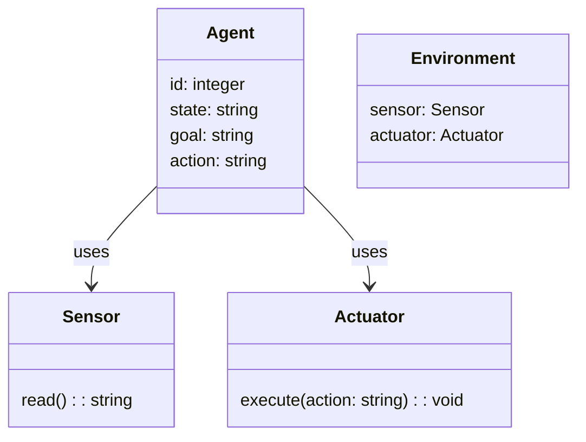

                 


# 设计可扩展的AI Agent架构

## 关键词

- AI Agent 架构
- 可扩展性设计
- 分布式计算
- 多智能体协作
- 强化学习算法
- 模块化设计

## 摘要

本文详细探讨了设计可扩展AI Agent架构的核心概念、原则和实现方法。从AI Agent的基本概念和分类出发，分析了可扩展性设计的重要性与挑战，提出了模块化、分布式架构和异构计算等设计原则。详细讲解了AI Agent的核心模块（感知、决策、执行）及其可扩展性设计，探讨了多智能体协作、通信协议和分布式计算与数据同步等关键问题。通过强化学习算法和多智能体协作算法的实现，展示了如何在实际场景中应用这些设计原则。最后，通过系统架构设计和项目实战，提供了具体的实现方案和最佳实践，帮助读者全面掌握设计可扩展AI Agent架构的知识。

---

## 第一部分: AI Agent 架构概述

### 第1章: AI Agent 的基本概念

#### 1.1 AI Agent 的定义与特点

**AI Agent** 是一种能够感知环境、自主决策并执行任务的智能实体。与传统程序不同，AI Agent具备以下特点：

- **自主性**：能够在没有外部干预的情况下自主运行。
- **反应性**：能够实时感知环境并做出响应。
- **目标导向性**：通常具有明确的目标，并能够根据目标调整行为。
- **学习能力**：通过与环境的交互不断优化自身的行为。

#### 1.2 AI Agent 的分类

AI Agent可以根据不同的标准进行分类，常见的分类方式包括：

- **按智能水平**：
  - **反应式 Agent**：基于当前感知做出反应，不具备内部状态。
  - **基于模型的反射式 Agent**：维护内部状态，并根据状态做出决策。
  - **目标驱动式 Agent**：以目标为导向，主动规划行为。
  - **混合式 Agent**：结合多种类型的特点。

- **按应用场景**：
  - **简单反射式 Agent**：适用于简单的任务，如环境监控。
  - **目标驱动式 Agent**：适用于需要复杂规划的任务，如自动驾驶。
  - **协作式 Agent**：用于多智能体协作场景，如分布式任务分配。

#### 1.3 AI Agent 的应用场景

AI Agent 在多个领域都有广泛的应用，主要包括：

- **智能助手**：如 Siri、Alexa 等，能够根据用户的指令执行任务。
- **自动化系统**：如工业自动化中的机器人，能够自主完成任务。
- **多智能体协作**：如分布式系统中的多个 Agent 协作完成复杂任务。

---

### 第2章: 可扩展 AI Agent 的重要性

#### 2.1 可扩展性在 AI Agent 中的作用

随着 AI 技术的发展，AI Agent 的应用范围不断扩大，可扩展性变得尤为重要。以下是可扩展性在 AI Agent 中的主要作用：

- **性能提升**：通过扩展系统规模，能够处理更大的数据量和更复杂的任务。
- **功能增强**：支持更多的功能模块，提高系统的灵活性和适应性。
- **维护与升级**：模块化设计使得系统维护和升级更加方便。

#### 2.2 可扩展 AI Agent 的挑战

尽管可扩展性带来了诸多好处，但在实际设计中也面临一些挑战：

- **系统复杂性增加**：随着规模的扩大，系统的复杂性也随之增加，导致设计和维护的难度上升。
- **资源分配与管理**：在分布式系统中，资源的分配与管理需要更加精细，以避免资源浪费和性能瓶颈。
- **多智能体协作中的协调问题**：在多智能体协作场景中，如何确保各 Agent 之间的协调与通信是一个复杂的问题。

---

### 第3章: 可扩展 AI Agent 的设计原则

#### 3.1 模块化设计

**模块化设计** 是实现可扩展 AI Agent 的关键原则之一。以下是模块化设计的主要特点：

- **模块的独立性**：每个模块具有明确的功能，并与其他模块相对独立，便于维护和升级。
- **模块的可扩展性**：通过增加新的模块或增强现有模块的功能，可以轻松扩展系统的功能。
- **模块的交互性**：模块之间通过明确的接口进行通信，确保系统的灵活性和可扩展性。

#### 3.2 分布式架构

**分布式架构** 是实现可扩展 AI Agent 的另一种重要原则。以下是分布式架构的主要特点：

- **计算资源分散**：将计算任务分散到多个节点上，充分利用资源。
- **数据分布存储**：数据分布在多个节点上，避免单点故障。
- **任务分担**：通过分布式计算，每个节点只承担部分任务，降低系统负载。

#### 3.3 异构计算与资源管理

**异构计算** 是指在不同的计算平台上运行不同的计算任务，以提高系统的整体性能。以下是异构计算在 AI Agent 中的应用：

- **计算任务分配**：根据任务的类型和计算资源的特性，动态分配任务。
- **资源管理**：通过优化资源分配策略，提高系统的资源利用率。
- **负载均衡**：通过动态调整任务分配，避免某些节点过载，提高系统的稳定性。

---

## 第二部分: 可扩展 AI Agent 的架构设计

### 第4章: AI Agent 架构的核心模块

#### 4.1 感知模块

**感知模块** 是 AI Agent 的核心模块之一，负责感知环境并提取有用的信息。

- **感知模块的功能与作用**：通过传感器或其他数据源获取环境信息，并将其转化为可供决策模块使用的数据。
- **常见感知算法**：包括基于传感器的数据处理算法，如图像识别、语音识别等。
- **感知模块的可扩展性设计**：通过增加新的传感器或改进数据处理算法，可以轻松扩展感知能力。

#### 4.2 决策模块

**决策模块** 负责根据感知到的信息做出决策。

- **决策模块的功能与作用**：基于感知模块提供的数据，结合目标和约束条件，生成具体的行动方案。
- **常见决策算法**：包括强化学习算法、基于规则的决策算法等。
- **决策模块的可扩展性设计**：通过增加新的决策规则或改进算法，可以提升决策的准确性和效率。

#### 4.3 执行模块

**执行模块** 负责根据决策模块的指令执行具体的动作。

- **执行模块的功能与作用**：将决策模块生成的行动方案转化为具体的执行动作。
- **执行模块的实现方式**：包括通过机器人、自动化系统等物理设备执行动作。
- **执行模块的可扩展性设计**：通过增加新的执行设备或改进执行策略，可以提升执行能力。

---

### 第5章: AI Agent 的通信与协作机制

#### 5.1 多智能体协作的必要性

在实际应用中，单一智能体往往无法完成复杂的任务，因此需要多智能体协作。

- **多智能体协作的定义与作用**：多个智能体通过协作完成复杂任务，提高系统的整体性能。
- **多智能体协作的挑战**：包括通信延迟、资源竞争、任务分配等问题。
- **多智能体协作的实现方式**：包括基于消息传递的协作、基于共享状态的协作等。

#### 5.2 通信协议的设计

**通信协议** 是多智能体协作的基础，确保各智能体之间的有效通信。

- **通信协议的定义与作用**：定义智能体之间的通信方式和数据格式，确保数据的准确传输。
- **常见的通信协议**：包括 HTTP、WebSocket、AMQP 等。
- **通信协议的可扩展性设计**：通过模块化设计和动态配置，可以轻松扩展通信协议的功能。

#### 5.3 分布式计算与数据同步

在分布式系统中，数据同步是确保各智能体之间保持一致性的关键。

- **分布式计算的定义与作用**：将计算任务分散到多个节点上，充分利用资源。
- **数据同步的必要性**：确保各节点之间的数据一致，避免数据冲突。
- **数据同步的实现方式**：包括基于时间戳的同步、基于版本号的同步等。

---

### 第6章: 可扩展 AI Agent 的算法实现

#### 6.1 强化学习算法

**强化学习** 是一种通过试错方式优化决策策略的算法，广泛应用于 AI Agent 的设计中。

- **强化学习的定义与作用**：通过与环境的交互，智能体通过试错方式学习最优策略。
- **常见的强化学习算法**：包括 Q-Learning、Deep Q-Network、Policy Gradient 等。
- **强化学习在 AI Agent 中的应用**：例如在自动驾驶、游戏 AI 等领域。

#### 6.2 多智能体协作算法

**多智能体协作算法** 是实现多智能体协作的核心算法。

- **多智能体协作的定义与作用**：通过多个智能体的协作，完成复杂任务。
- **常见的多智能体协作算法**：包括基于一致性算法、基于分布式规划的协作算法等。
- **多智能体协作算法的实现方式**：例如通过消息传递、共享状态等方式实现协作。

---

## 第三部分: 系统分析与架构设计方案

### 第7章: 问题场景介绍

#### 7.1 问题背景

在实际应用中，设计一个可扩展的 AI Agent 架构需要考虑以下问题：

- **系统规模**：系统的扩展性需要满足未来的业务需求。
- **性能要求**：系统的性能需要满足实时性、响应速度等要求。
- **资源限制**：系统的资源分配需要考虑计算能力、存储能力等限制。

#### 7.2 项目介绍

本项目旨在设计一个可扩展的 AI Agent 架构，能够支持多智能体协作、分布式计算和动态扩展。

### 第8章: 系统功能设计

#### 8.1 领域模型设计

以下是领域模型的类图：



#### 8.2 系统架构设计

以下是系统架构的架构图：


---

## 第四部分: 项目实战

### 第9章: 环境安装

#### 9.1 环境要求

- 操作系统：Linux 或 macOS
- 开发工具：Python 3.8+
- 依赖库：numpy、pandas、scikit-learn、tensorflow

#### 9.2 安装步骤

```bash
pip install numpy pandas scikit-learn tensorflow
```

### 第10章: 系统核心实现源代码

#### 10.1 感知模块实现

```python
class Sensor:
    def read(self):
        # 返回环境信息
        return "sensor_data"
```

#### 10.2 决策模块实现

```python
class Decision:
    def decide(self, data):
        # 基于数据做出决策
        return "action"
```

#### 10.3 执行模块实现

```python
class Actuator:
    def execute(self, action):
        # 执行具体的动作
        print(f"执行动作: {action}")
```

### 第11章: 项目小结

通过本项目的实现，我们能够清晰地看到可扩展 AI Agent 架构的设计思路。通过模块化设计和分布式计算，我们可以轻松扩展系统的功能和性能。同时，通过多智能体协作算法的实现，我们可以实现复杂的任务协作。

---

## 第五部分: 最佳实践 tips、小结、注意事项、拓展阅读

### 第12章: 最佳实践 tips

- **模块化设计**：通过模块化设计，可以提高系统的可维护性和可扩展性。
- **分布式架构**：在大规模应用中，分布式架构是实现高性能和高可用性的关键。
- **异构计算**：充分利用不同计算资源的特点，提高系统的整体性能。

### 第13章: 小结

本文详细探讨了设计可扩展 AI Agent 架构的核心概念、原则和实现方法。通过模块化设计和分布式计算，我们可以实现高性能和高可用性的 AI Agent 系统。同时，通过多智能体协作算法的实现，我们可以实现复杂的任务协作。

### 第14章: 注意事项

- **系统复杂性**：随着系统的扩展，系统的复杂性会增加，需要注意系统的可维护性和可扩展性。
- **资源管理**：在分布式系统中，资源的分配与管理需要更加精细，以避免资源浪费和性能瓶颈。
- **安全性**：在多智能体协作中，需要注意数据的安全性和系统的稳定性。

### 第15章: 拓展阅读

- **分布式计算**：深入学习分布式计算的相关知识，了解其在 AI Agent 中的应用。
- **强化学习算法**：进一步学习强化学习算法，了解其在 AI Agent 中的高级应用。
- **多智能体协作**：研究多智能体协作的最新进展，了解其在实际应用中的实现方式。

--- 

通过本文的探讨，读者可以全面掌握设计可扩展 AI Agent 架构的知识，为实际应用提供理论支持和实践指导。

