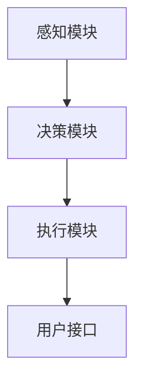
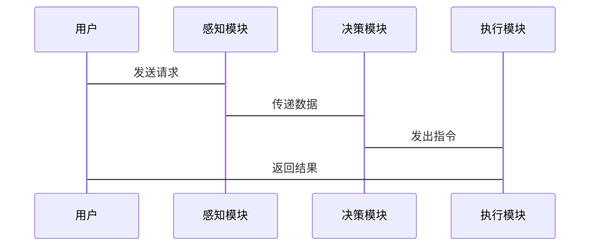

                 


# 设计可扩展的AI Agent架构：模块化与微服务

---

## 关键词

- AI Agent
- 模块化设计
- 微服务架构
- 系统扩展性
- 系统架构设计

---

## 摘要

设计可扩展的AI Agent架构是实现高效、灵活和可维护AI系统的基石。本文从模块化设计和微服务架构两个核心方面展开，详细探讨AI Agent架构的设计原则、实现方法和优化策略。通过理论分析与实际案例结合，为读者提供从基础概念到实战应用的全面指导，帮助开发者构建高性能、可扩展的AI Agent系统。

---

## 正文

### 第一部分: 引言

#### 第1章: AI Agent的基本概念与背景

##### 1.1 AI Agent的定义与特点

- **定义**: AI Agent（人工智能代理）是指能够感知环境并采取行动以实现目标的智能实体。
- **特点**:
  - **自主性**: 能够自主决策。
  - **反应性**: 能够实时感知并响应环境变化。
  - **目标导向**: 行为基于明确的目标。
  - **可扩展性**: 能够适应不同规模和复杂度的任务。

##### 1.2 AI Agent的应用场景

- **应用场景**:
  - 智能助手（如 Siri、Alexa）。
  - 智能推荐系统。
  - 自动化控制（如自动驾驶）。

##### 1.3 AI Agent的设计挑战

- **挑战**:
  - **复杂性**: 多模块协作的复杂性。
  - **扩展性**: 高并发场景下的扩展能力。
  - **安全性**: 数据安全和隐私保护。

##### 1.4 本章小结

AI Agent作为一种智能实体，在现代信息技术中扮演着重要角色。其设计需要考虑自主性、反应性和目标导向等核心特点，同时要应对复杂性、扩展性和安全性等多重挑战。

---

### 第二部分: 模块化设计

#### 第2章: 模块化架构的设计理念

##### 2.1 模块化架构的核心思想

- **模块化**: 将系统划分为独立的、可替换的模块。
- **松耦合**: 模块之间通过清晰的接口通信，降低耦合度。

##### 2.2 模块化设计的实现方法

- **模块划分原则**:
  - **单一职责**: 每个模块负责一个核心功能。
  - **高度内聚**: 模块内部功能紧密相关。
- **模块间通信机制**:
  - **接口定义**: 使用RESTful API或消息队列。
  - **通信协议**: HTTP、WebSocket等。

##### 2.3 模块化架构的优缺点对比

| 特性           | 优点                               | 缺点                               |
|----------------|------------------------------------|------------------------------------|
| **独立性**     | 模块独立开发和测试                   | 模块间通信复杂                   |
| **可扩展性**   | 易于扩展和维护                     | 需要复杂的通信管理                 |
| **可维护性**   | 单个模块的问题不影响整体系统         | 需要设计良好的接口和协议           |

##### 2.4 本章小结

模块化设计通过将系统划分为独立模块，提高了系统的可维护性和可扩展性。然而，模块间的通信设计需要额外关注，以确保系统的高效运行。

---

### 第三部分: 微服务架构

#### 第3章: 微服务架构的基本概念

##### 3.1 微服务架构的定义与特点

- **定义**: 微服务架构是一种将应用程序构建为多个小型、独立服务的体系结构。
- **特点**:
  - **分布式**: 服务独立运行，松耦合。
  - **可扩展性**: 单个服务可根据需求扩展。
  - **技术多样性**: 各服务可使用不同技术栈。

##### 3.2 微服务架构与传统单体架构的区别

| 特性           | 单体架构                       | 微服务架构                       |
|----------------|-------------------------------|-----------------------------------|
| **部署**       | 整体部署                       | 单独部署                       |
| **扩展性**     | 整体扩展，受限于单体           | 单个服务可独立扩展             |
| **技术多样性** | 所有服务必须使用相同技术       | 各服务可使用不同技术             |

##### 3.3 微服务架构在AI Agent中的应用

- **优势**:
  - **灵活扩展**: 根据需求动态扩展服务。
  - **高效维护**: 单个服务的修改不影响整体系统。
- **挑战**:
  - **通信延迟**: 微服务间通信可能引入延迟。
  - **复杂性**: 服务发现、负载均衡等需要额外设计。

##### 3.4 本章小结

微服务架构通过将AI Agent划分为多个独立服务，提高了系统的灵活性和扩展性。然而，服务间的通信和协调需要精心设计，以确保系统的高效运行。

---

### 第四部分: 系统扩展性设计

#### 第4章: 系统扩展性的实现方法

##### 4.1 系统扩展性的基本概念

- **水平扩展**: 增加更多实例以提高处理能力。
- **垂直扩展**: 提升单个实例的性能（如增加内存、计算能力）。

##### 4.2 水平扩展与垂直扩展的对比

| 特性           | 水平扩展                       | 垂直扩展                       |
|----------------|-------------------------------|-----------------------------------|
| **实现方式**   | 增加更多服务器                 | 提升单个服务器性能             |
| **成本**       | 资源消耗较高                   | 资源消耗相对较低               |
| **适用场景**   | 处理大量请求                   | 处理复杂任务                   |

##### 4.3 系统扩展性的实现策略

- **负载均衡**:
  - **算法**: 轮询、随机、加权。
  - **工具**: Nginx、Kubernetes。
- **容错设计**:
  - **冗余设计**: 多副本部署。
  - **自愈机制**: 自动检测并恢复故障服务。
- **分布式系统设计**:
  - **CAP定理**: 在一致性、可用性、分区容忍性之间权衡。

##### 4.4 本章小结

通过合理应用水平扩展和垂直扩展策略，结合负载均衡和容错设计，可以显著提升AI Agent系统的扩展性和可靠性。

---

### 第五部分: 系统架构设计

#### 第5章: 系统架构设计方案

##### 5.1 系统功能设计（领域模型）

- **领域模型**:
  - **模块划分**: 感知模块、决策模块、执行模块。
  - **模块关系**: 感知模块提供数据，决策模块处理数据，执行模块执行指令。

##### 5.2 系统架构设计（架构图）



##### 5.3 系统接口设计

- **接口定义**:
  - RESTful API: `/api/v1/agent/action`。
  - 请求格式: JSON。

##### 5.4 系统交互设计（序列图）



##### 5.5 本章小结

通过模块划分、架构设计和接口设计，构建了一个清晰的系统架构，为后续实现奠定了基础。

---

### 第六部分: 项目实战

#### 第6章: 实战项目实现

##### 6.1 环境搭建

- **工具安装**:
  - Python 3.8+
  - Flask框架。
  - Docker。

##### 6.2 系统核心实现（源代码）

```python
from flask import Flask
from queue import Queue

app = Flask(__name__)
task_queue = Queue()

@app.route('/api/v1/agent/action', methods=['POST'])
def process_request():
    data = request.json
    task_queue.put(data)
    return jsonify({'status': 'success'})

if __name__ == '__main__':
    app.run(debug=True)
```

##### 6.3 代码应用解读与分析

- **代码功能**:
  - 接收用户请求，将数据加入队列。
  - 后台线程处理队列中的任务。
- **优势**:
  - 高可用性: 使用队列保证任务不丢失。
  - 可扩展性: 可以根据任务量动态增加处理线程。

##### 6.4 实际案例分析

- **案例**: 智能客服系统。
  - **感知模块**: 接收用户请求。
  - **决策模块**: 分析用户需求。
  - **执行模块**: 调用客服系统执行操作。

##### 6.5 本章小结

通过实战项目，展示了如何将模块化设计和微服务架构应用于AI Agent系统，实现高效的系统扩展和功能扩展。

---

### 第七部分: 最佳实践与总结

#### 第7章: 最佳实践

##### 7.1 设计原则

- **模块化设计**: 确保模块独立性和松耦合。
- **微服务架构**: 适用于复杂系统的灵活扩展。
- **系统扩展性**: 合理选择水平和垂直扩展策略。

##### 7.2 小结

- **核心要点总结**:
  - 模块化设计提高系统的可维护性和可扩展性。
  - 微服务架构适用于复杂系统的灵活扩展。
  - 系统扩展性设计需要综合考虑水平和垂直扩展策略。

##### 7.3 注意事项

- **避免过度模块化**: 避免模块划分过细，增加通信复杂性。
- **关注通信效率**: 在微服务架构中，减少不必要的通信开销。
- **监控与日志**: 实施有效的监控和日志管理，便于故障排查。

##### 7.4 拓展阅读

- **推荐书籍**:
  - 《微服务设计模式》
  - 《系统设计精要》
- **在线资源**:
  - 微服务相关技术文档。
  - 分布式系统设计博客。

---

## 附录

### 附录A: 术语表

- **AI Agent**: 人工智能代理。
- **模块化设计**: 将系统划分为独立模块的设计方法。
- **微服务架构**: 一种基于小型、独立服务构建应用程序的架构。

### 附录B: 参考文献

- [1] Martin Fowler, “Microservices,” [martinfowler.com](https://martinfowler.com).
- [2] Eric Evans, “Domain-Driven Design,” [domaindrivendesign.com](https://domaindrivendesign.com).

---

## 结语

设计可扩展的AI Agent架构是一项复杂而 rewarding 的任务。通过模块化设计和微服务架构的应用，开发者可以构建高效、灵活和可维护的AI系统。希望本文的深入分析和实战案例能够为读者提供有价值的指导，帮助他们在AI Agent架构设计领域不断进步。

--- 

# END

