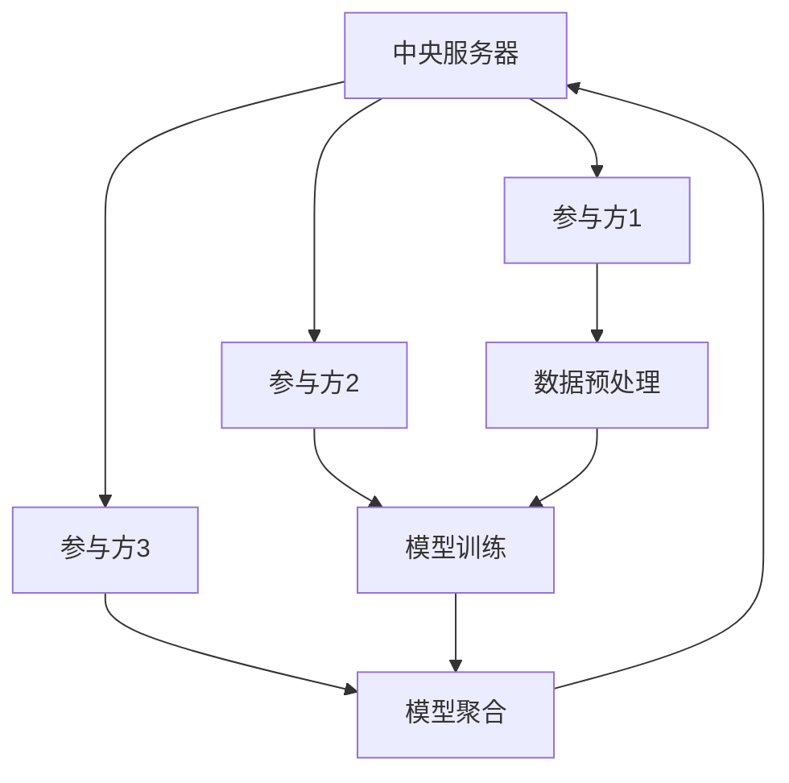

                 


# 设计基于联邦学习的跨境金融风险评估系统

> 关键词：联邦学习，跨境金融，风险评估，数据隐私，机器学习

> 摘要：本文探讨了如何利用联邦学习技术设计一个高效的跨境金融风险评估系统。通过分析联邦学习的核心原理和跨境金融风险评估的需求，提出了基于联邦学习的系统架构，并详细介绍了算法实现和项目实战。

---

# 第一部分: 背景介绍

## 第1章: 联邦学习与跨境金融风险评估概述

### 1.1 联邦学习的定义与背景

#### 1.1.1 联邦学习的定义

联邦学习（Federated Learning）是一种分布式机器学习技术，允许多个参与方在不共享原始数据的情况下共同训练模型。每个参与方只分享模型参数，而非数据本身，从而保护数据隐私。

#### 1.1.2 联邦学习的背景与意义

随着数据隐私保护法规的日益严格，传统的集中式机器学习方法在处理跨境金融数据时面临挑战。联邦学习通过在数据源端进行模型训练，避免了数据传输和存储的安全风险。

#### 1.1.3 联邦学习在金融领域的应用

在金融领域，联邦学习可以应用于信用评估、欺诈检测和风险评估等场景。特别是在跨境金融中，联邦学习可以帮助不同国家的金融机构在不共享数据的情况下，共同提升风险评估模型的准确性。

### 1.2 跨境金融风险评估的背景

#### 1.2.1 跨境金融的基本概念

跨境金融指涉及两个或多个国家的金融活动，包括国际贸易、跨境投资和跨境支付等。这些活动可能涉及复杂的法律和监管环境。

#### 1.2.2 跨境金融风险的种类

跨境金融风险主要包括汇率风险、信用风险、市场风险和操作风险。这些风险可能因为跨国数据的复杂性而更加难以评估。

#### 1.2.3 跨境金融风险评估的重要性

准确的风险评估可以帮助金融机构做出更明智的决策，降低潜在的财务损失，并确保合规性。

### 1.3 联邦学习在跨境金融风险评估中的应用

#### 1.3.1 联邦学习的优势

- 数据隐私保护
- 分布式计算能力
- 模型泛化能力

#### 1.3.2 联邦学习在跨境金融中的具体应用

- 跨境支付风险评估
- 跨国企业信用评估
- 欺诈检测

#### 1.3.3 联邦学习与跨境金融的结合

通过联邦学习，金融机构可以在不共享数据的情况下，共同训练风险评估模型，提升模型的准确性和泛化能力。

---

## 第2章: 联邦学习的核心概念与联系

### 2.1 联邦学习的核心原理

#### 2.1.1 联邦学习的基本原理

联邦学习通过在每个参与方的数据源上本地训练模型，并将模型参数上传到中央服务器进行聚合，最终得到一个全局模型。

#### 2.1.2 联邦学习的数学模型

模型训练过程可以表示为：

$$
\text{损失函数} = \sum_{i=1}^{n} \text{loss}_i(\theta)
$$

其中，$\theta$ 是模型参数，$n$ 是参与方数量。

#### 2.1.3 联邦学习的优缺点

优点：
- 数据隐私保护
- 分布式计算
- 高效性

缺点：
- 模型收敛速度慢
- 通信成本高
- 模型更新复杂

### 2.2 跨境金融风险评估的核心要素

#### 2.2.1 数据特征

- 客户信息
- 交易历史
- 市场数据

#### 2.2.2 风险评估模型

- 信用评分模型
- 风险定价模型
- 风险预警模型

#### 2.2.3 风险评估指标

- 风险价值（VaR）
- 信用违约概率（PD）
- 风险调整资本回报率（RAROC）

### 2.3 联邦学习与跨境金融风险评估的结合

#### 2.3.1 联邦学习在数据隐私保护中的作用

通过联邦学习，金融机构可以在不共享数据的情况下，共同训练风险评估模型，保护客户隐私和机构数据安全。

#### 2.3.2 联邦学习在模型训练中的应用

联邦学习允许不同金融机构在本地数据上训练模型，并将模型参数聚合，形成一个全局风险评估模型。

#### 2.3.3 联邦学习在风险评估中的优势

- 提高模型泛化能力
- 增强模型鲁棒性
- 降低模型过拟合风险

---

## 第3章: 联邦学习的算法原理

### 3.1 联邦学习的基本流程

#### 3.1.1 数据预处理

对各参与方的数据进行清洗、标准化和特征选择，确保数据一致性。

#### 3.1.2 模型训练

在每个参与方的数据上本地训练模型，得到模型参数更新。

#### 3.1.3 模型更新与聚合

将各参与方的模型参数上传到中央服务器，进行参数聚合，更新全局模型。

### 3.2 联邦学习的数学模型

#### 3.2.1 损失函数

使用交叉熵损失函数：

$$
\text{损失函数} = -\sum_{i=1}^{n} y_i \log(p_i) + (1 - y_i) \log(1 - p_i)
$$

其中，$y_i$ 是真实标签，$p_i$ 是预测概率。

#### 3.2.2 优化器

使用Adam优化器：

$$
\theta_{t+1} = \theta_t - \alpha \frac{\nabla L}{\beta_1(1 - \beta_1^{t}) + (1 - \beta_1)(1 - \beta_2^{t})}
$$

其中，$\alpha$ 是学习率，$\beta_1$ 和 $\beta_2$ 是动量参数。

#### 3.2.3 联邦聚合算法

使用FedAvg算法：

$$
\theta_{\text{new}} = \frac{1}{n} \sum_{i=1}^{n} \theta_i
$$

其中，$\theta_i$ 是第$i$个参与方的模型参数，$n$ 是参与方数量。

### 3.3 联邦学习的实现细节

#### 3.3.1 数据分片

将数据按客户或交易分片，确保每个参与方只处理本地数据。

#### 3.3.2 模型同步

通过中央服务器或P2P网络，同步各参与方的模型参数。

#### 3.3.3 数据隐私保护

使用加密技术或差分隐私，保护数据在传输和聚合过程中的安全性。

---

## 第4章: 跨境金融风险评估的算法实现

### 4.1 跨境金融风险评估的数学模型

#### 4.1.1 风险评估指标的构建

使用客户特征和交易特征，构建风险评估指标：

$$
\text{风险评分} = \alpha \cdot \text{信用评分} + \beta \cdot \text{交易风险} + \gamma \cdot \text{市场风险}
$$

其中，$\alpha$、$\beta$ 和 $\gamma$ 是权重系数。

#### 4.1.2 风险评估模型的训练

使用逻辑回归或随机森林等算法，训练风险评估模型。

#### 4.1.3 风险评估模型的优化

通过交叉验证和超参数调优，优化模型性能。

### 4.2 联邦学习在风险评估中的应用

#### 4.2.1 联邦学习的训练流程

1. 数据预处理：对各参与方的数据进行清洗和标准化。
2. 模型训练：在本地数据上训练模型，得到模型参数更新。
3. 模型聚合：将各参与方的模型参数上传到中央服务器，聚合得到全局模型。

#### 4.2.2 联邦学习的模型评估

使用准确率、召回率和F1分数等指标，评估模型性能。

#### 4.2.3 联邦学习的性能优化

通过减少通信次数和优化模型更新策略，提升联邦学习的效率。

### 4.3 联邦学习的代码实现

#### 4.3.1 数据预处理

```python
import pandas as pd
from sklearn.preprocessing import StandardScaler

# 加载数据
data = pd.read_csv('local_data.csv')

# 标准化处理
scaler = StandardScaler()
data_scaled = scaler.fit_transform(data)
```

#### 4.3.2 模型训练

```python
import tensorflow as tf
from tensorflow.keras import layers

# 定义模型
model = tf.keras.Sequential([
    layers.Dense(64, activation='relu'),
    layers.Dense(1, activation='sigmoid')
])

# 编译模型
model.compile(optimizer='adam', loss='binary_crossentropy', metrics=['accuracy'])
```

#### 4.3.3 模型聚合

```python
import numpy as np

# 聚合模型参数
def fed_avg(models):
    avg_weights = {}
    for i, layer in enumerate(model.layers):
        avg_weights[i] = np.mean([model.layers[i].get_weights() for model in models], axis=0)
    return avg_weights
```

---

## 第5章: 系统分析与架构设计方案

### 5.1 系统整体架构

#### 5.1.1 系统模块划分

- 数据预处理模块
- 模型训练模块
- 模型聚合模块
- 风险评估模块

#### 5.1.2 系统功能设计

- 数据采集与处理
- 模型训练与聚合
- 风险评估与预警

#### 5.1.3 系统架构图



---

## 第6章: 项目实战

### 6.1 环境搭建

#### 6.1.1 安装必要的库

```bash
pip install tensorflow-federated pandas numpy scikit-learn
```

#### 6.1.2 配置开发环境

使用Jupyter Notebook或PyCharm进行开发。

### 6.2 系统核心实现

#### 6.2.1 数据预处理

```python
import pandas as pd
from sklearn.preprocessing import StandardScaler

# 加载数据
data = pd.read_csv('local_data.csv')

# 标准化处理
scaler = StandardScaler()
data_scaled = scaler.fit_transform(data)
```

#### 6.2.2 模型训练

```python
import tensorflow as tf
from tensorflow.keras import layers

# 定义模型
model = tf.keras.Sequential([
    layers.Dense(64, activation='relu'),
    layers.Dense(1, activation='sigmoid')
])

# 编译模型
model.compile(optimizer='adam', loss='binary_crossentropy', metrics=['accuracy'])
```

#### 6.2.3 模型聚合

```python
import numpy as np

# 聚合模型参数
def fed_avg(models):
    avg_weights = {}
    for i, layer in enumerate(model.layers):
        avg_weights[i] = np.mean([model.layers[i].get_weights() for model in models], axis=0)
    return avg_weights
```

### 6.3 实际案例分析

#### 6.3.1 案例背景

假设我们有三个金融机构，每个机构拥有本地客户数据，希望通过联邦学习共同训练风险评估模型。

#### 6.3.2 案例实现

```python
# 初始化模型
model = create_model()

# 联邦学习训练
for round in range(num_rounds):
    for party in parties:
        # 数据预处理
        local_data = preprocess(party.data)
        # 模型训练
        model.train(local_data)
    # 模型聚合
    global_weights = fed_avg(parties.models)
    # 更新全局模型
    model.update(global_weights)
```

#### 6.3.3 案例结果

通过联邦学习，三个金融机构共同训练了一个高精度的跨境风险评估模型，且数据隐私得到了有效保护。

---

## 第7章: 总结与展望

### 7.1 总结

本文详细介绍了如何利用联邦学习设计跨境金融风险评估系统，包括核心概念、算法原理和系统架构。通过实际案例展示了联邦学习在跨境金融中的应用价值。

### 7.2 展望

未来，联邦学习将在跨境金融中发挥更大作用，特别是在数据隐私保护和模型优化方面。同时，结合区块链和人工智能技术，联邦学习将进一步提升跨境金融风险评估的效率和准确性。

---

## 第8章: 最佳实践

### 8.1 数据隐私保护

- 使用加密技术
- 实施差分隐私
- 定期进行安全审计

### 8.2 模型优化

- 优化模型结构
- 调整超参数
- 使用分布式计算

### 8.3 结果验证

- 定期验证模型性能
- 检查模型公平性
- 评估模型解释性

---

## 第9章: 小结

通过本文的介绍，读者可以全面理解联邦学习在跨境金融风险评估中的应用，并掌握实际开发中的关键技术和方法。希望本文能为相关领域的研究和实践提供有价值的参考。

---

## 第10章: 注意事项

### 10.1 数据安全

确保数据在预处理、训练和聚合过程中的安全性，避免数据泄露。

### 10.2 模型收敛

合理设置模型参数和训练轮数，确保模型能够快速收敛。

### 10.3 系统性能

优化系统架构和通信机制，提升系统的运行效率和稳定性。

---

## 第11章: 拓展阅读

### 11.1 联邦学习相关文献

- "Federated Learning: Challenges, Methods, and Future Directions"
- "Secure Multi-party Computation for Machine Learning"

### 11.2 跨境金融相关文献

- "Cross-border Financial Risk Management"
- "Global Financial Regulation and Compliance"

通过以上内容，您可以开始撰写完整的文章。每个部分都需要进一步扩展，提供详细的代码示例、公式推导和实际应用案例，以确保文章内容丰富且具有深度。

