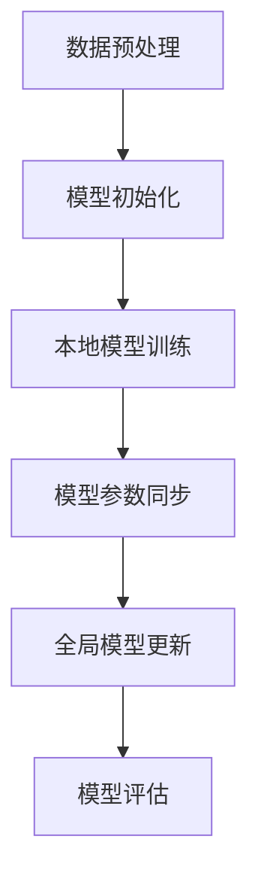
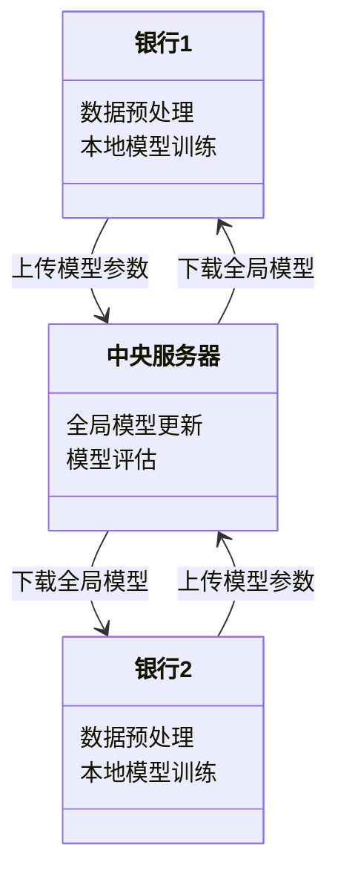
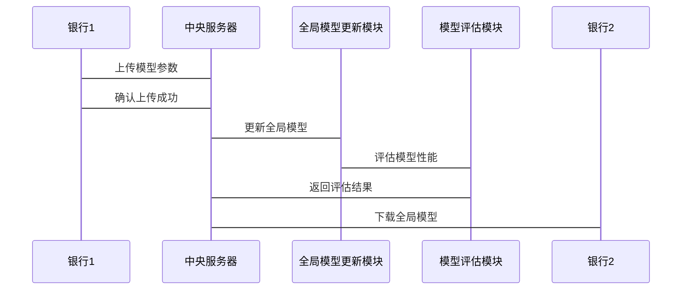

                 


# 设计基于联邦学习的隐私保护金融AI系统

## 关键词：
联邦学习，隐私保护，人工智能，金融系统，数据安全

## 摘要：
本文详细探讨了设计基于联邦学习的隐私保护金融AI系统的各个方面。从联邦学习的基本概念到其在金融领域的应用，从算法原理到系统架构设计，从项目实战到最佳实践，全面解析如何在保护数据隐私的前提下，构建高效的金融AI系统。本文旨在为技术人员提供深入的技术指导，帮助他们在金融领域实现隐私保护与AI模型优化的双重目标。

---

## 第一部分: 背景与核心概念

### 第1章: 联邦学习与隐私保护概述

#### 1.1 联邦学习的基本概念
##### 1.1.1 联邦学习的定义
联邦学习（Federated Learning）是一种分布式机器学习技术，允许多个参与方在不共享原始数据的前提下，协作训练一个全局模型。每个参与方仅在本地处理数据，并通过通信协议交换模型参数，最终形成一个高性能的全局模型。

##### 1.1.2 联邦学习的核心特点
- **数据本地化**：数据无需离开本地设备或服务器，仅传输模型参数。
- **隐私保护**：通过加密和安全协议，确保数据不被泄露。
- **分布式协作**：多个机构或设备协同训练，形成全局模型。

##### 1.1.3 联邦学习与传统数据共享的区别
| 特性         | 联邦学习                 | 传统数据共享           |
|--------------|--------------------------|------------------------|
| 数据传输     | 仅传输模型参数           | 传输原始数据           |
| 隐私风险     | 极低                     | 高                     |
| 中心化依赖   | 低                      | 高                     |

#### 1.2 隐私保护的重要性
##### 1.2.1 数据隐私的定义
数据隐私是指对个人数据的访问权、披露权和控制权的保护，确保数据不会被未经授权的第三方访问或滥用。

##### 1.2.2 金融行业数据隐私的特殊性
金融行业的数据通常包含敏感信息，如交易记录、用户身份信息等，这些数据一旦泄露可能导致严重的经济损失和声誉损害。

##### 1.2.3 隐私保护在AI系统中的作用
- **合规性**：满足数据隐私法规（如GDPR、CCPA等）的要求。
- **用户信任**：保护用户隐私，增强用户对系统的信任。
- **法律风险**：通过隐私保护减少数据泄露的法律风险。

#### 1.3 联邦学习的背景与应用
##### 1.3.1 联邦学习的背景
随着人工智能技术的快速发展，数据隐私问题日益受到关注。传统的数据共享方式存在数据泄露风险，而联邦学习作为一种新兴的技术，为数据隐私保护提供了新的解决方案。

##### 1.3.2 联邦学习的应用场景
- **金融风控**：通过联邦学习协作训练风险评估模型，提升风控能力。
- **金融欺诈检测**：利用联邦学习构建跨机构的欺诈检测系统。
- **金融数据分析**：在保护数据隐私的前提下，进行大规模金融数据分析。

---

## 第二部分: 算法原理与数学模型

### 第2章: 联邦学习的算法原理

#### 2.1 联邦学习的算法流程
##### 2.1.1 算法流程概述


##### 2.1.2 算法步骤详解
1. **数据预处理**：对各参与方的数据进行清洗、归一化等预处理操作。
2. **模型初始化**：在每个参与方初始化本地模型。
3. **本地模型训练**：每个参与方在本地数据上训练模型，更新本地模型参数。
4. **模型参数同步**：通过通信协议将本地模型参数上传到中央服务器或协调节点。
5. **全局模型更新**：中央服务器聚合各参与方的模型参数，更新全局模型。
6. **模型评估**：对全局模型进行评估，验证模型的性能。

#### 2.2 联邦平均算法
##### 2.2.1 算法描述
联邦平均算法（Federated Averaging，FedAvg）是最常用的联邦学习算法之一。其核心思想是通过将各参与方的模型参数进行加权平均，更新全局模型。

##### 2.2.2 算法伪代码
```python
def fed_avg(global_model, client_models):
    # 计算各客户端模型的权重
    weights = [client.model.weight for client in client_models]
    # 计算全局模型的平均权重
    global_weight = sum(weights) / len(weights)
    # 更新全局模型
    global_model.weight = global_weight
    return global_model
```

##### 2.2.3 数学模型
$$ \text{全局模型参数} = \frac{\sum_{i=1}^{n} w_i \cdot \theta_i}{\sum_{i=1}^{n} w_i} $$
其中，$$w_i$$ 是第i个参与方的权重，$$\theta_i$$ 是第i个参与方的模型参数。

---

## 第三部分: 系统分析与架构设计

### 第3章: 金融AI系统的应用场景

#### 3.1 问题场景介绍
在金融领域，数据隐私保护尤为重要。例如，多家银行希望通过协作训练风险评估模型，但又不希望共享各自的客户数据。

#### 3.2 系统功能设计
##### 3.2.1 系统功能模块
- 数据预处理模块：对各银行的数据进行清洗和归一化处理。
- 模型训练模块：在各银行本地训练模型，并上传模型参数。
- 全局模型更新模块：聚合各银行的模型参数，更新全局模型。
- 模型评估模块：对全局模型进行性能评估。

##### 3.2.2 系统功能模型


#### 3.3 系统架构设计
##### 3.3.1 系统架构图


##### 3.3.2 关键组件设计
- **数据预处理模块**：负责对各银行的数据进行清洗和归一化处理。
- **本地模型训练模块**：在各银行本地训练模型，并上传模型参数。
- **中央服务器**：接收各银行的模型参数，聚合更新全局模型。
- **全局模型更新模块**：对各银行的模型参数进行加权平均，更新全局模型。
- **模型评估模块**：对全局模型进行性能评估，验证模型的效果。

#### 3.4 系统接口设计
##### 3.4.1 系统接口描述
- **接口名称**：上传模型参数
  - **输入**：模型参数
  - **输出**：确认上传成功
- **接口名称**：下载全局模型
  - **输入**：无
  - **输出**：全局模型文件

##### 3.4.2 系统交互流程图


---

## 第四部分: 项目实战

### 第4章: 项目实现与案例分析

#### 4.1 环境搭建
##### 4.1.1 安装依赖
```bash
pip install numpy pandas scikit-learn
```

##### 4.1.2 环境配置
```python
import numpy as np
import pandas as pd
from sklearn.linear_model import LogisticRegression
```

#### 4.2 核心代码实现
##### 4.2.1 数据预处理代码
```python
def preprocess_data(data):
    # 数据清洗
    data = data.dropna()
    # 数据归一化
    data = (data - data.mean()) / data.std()
    return data
```

##### 4.2.2 本地模型训练代码
```python
def train_local_model(data, model):
    model.fit(data, labels)
    return model
```

##### 4.2.3 模型参数同步代码
```python
def sync_model_parameters(global_model, client_models):
    # 计算全局模型参数的平均值
    global_weight = np.mean([model.weight for model in client_models])
    global_model.weight = global_weight
    return global_model
```

##### 4.2.4 模型评估代码
```python
def evaluate_model(global_model, test_data, true_labels):
    predictions = global_model.predict(test_data)
    accuracy = np.sum(predictions == true_labels) / len(true_labels)
    print(f"模型准确率: {accuracy}")
    return accuracy
```

#### 4.3 实际案例分析
##### 4.3.1 案例背景
假设我们有两家银行，银行1和银行2，希望通过联邦学习协作训练一个风险评估模型。

##### 4.3.2 数据准备
- 银行1的数据：`bank1_data.csv`
- 银行2的数据：`bank2_data.csv`

##### 4.3.3 数据预处理
```python
bank1_data = pd.read_csv("bank1_data.csv")
bank1_data_processed = preprocess_data(bank1_data)

bank2_data = pd.read_csv("bank2_data.csv")
bank2_data_processed = preprocess_data(bank2_data)
```

##### 4.3.4 本地模型训练
```python
model_bank1 = LogisticRegression()
model_bank1 = train_local_model(bank1_data_processed, model_bank1)

model_bank2 = LogisticRegression()
model_bank2 = train_local_model(bank2_data_processed, model_bank2)
```

##### 4.3.5 模型参数同步
```python
global_model = LogisticRegression()
global_model = sync_model_parameters(global_model, [model_bank1, model_bank2])
```

##### 4.3.6 模型评估
```python
test_data = pd.read_csv("test_data.csv")
true_labels = pd.read_csv("true_labels.csv")

accuracy = evaluate_model(global_model, test_data, true_labels)
```

#### 4.4 项目小结
通过上述步骤，我们成功实现了基于联邦学习的隐私保护金融AI系统。通过协作训练，我们得到了一个高性能的全局模型，同时保护了各银行的数据隐私。

---

## 第五部分: 最佳实践

### 第5章: 最佳实践与总结

#### 5.1 小结
- 联邦学习是一种有效的隐私保护技术，可以在不共享原始数据的前提下，协作训练高性能模型。
- 在金融领域，联邦学习的应用场景广泛，如风险评估、欺诈检测等。
- 通过合理的系统架构设计和算法优化，可以进一步提升联邦学习的性能和安全性。

#### 5.2 注意事项
- **数据预处理**：确保数据预处理的准确性，避免因数据质量问题影响模型性能。
- **模型同步**：合理设计模型参数同步机制，确保全局模型的准确性和一致性。
- **安全通信**：采用加密通信协议，确保模型参数传输的安全性。
- **性能优化**：通过优化算法和系统架构，提升联邦学习的效率和效果。

#### 5.3 拓展阅读
- 《Federated Learning: Challenges, Methods, and Future Directions》
- 《Differential Privacy: A Primer for Data Scientists》
- 《Privacy-Preserving Machine Learning: A Survey》

---

## 结语
通过本文的详细讲解，读者可以全面了解如何设计基于联邦学习的隐私保护金融AI系统。从理论到实践，从算法到架构，我们逐步剖析了系统设计的各个方面。希望本文能为技术人员提供有价值的指导，帮助他们在金融领域实现隐私保护与AI模型优化的双重目标。

--- 

如果您对本文内容有疑问或需要进一步的技术支持，请随时联系我！

