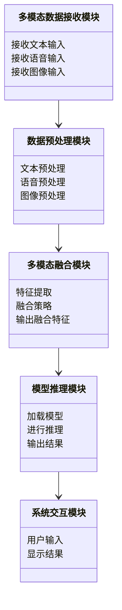
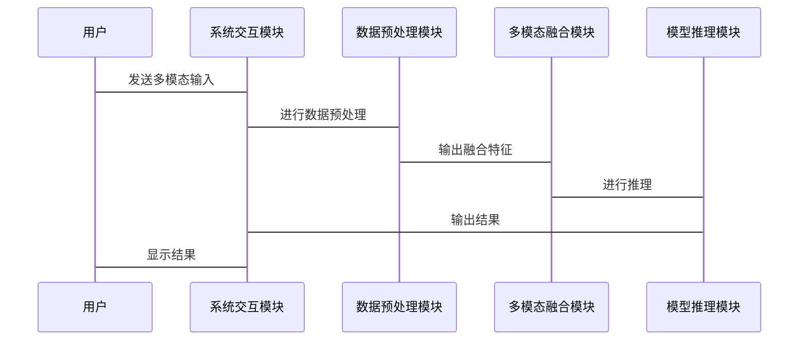

                 


# 设计多模态AI Agent：整合文本、语音与视觉能力

---

## 关键词

多模态AI Agent, 文本处理, 语音处理, 视觉处理, 多模态融合, 深度学习模型

---

## 摘要

本文详细探讨了多模态AI Agent的设计与实现，整合文本、语音和视觉能力，通过系统化的分析与设计，展示了如何构建高效且智能的多模态AI Agent。文章从多模态数据的整合、处理方法、模型构建、系统架构到实际项目案例，全面阐述了技术细节与实现步骤，帮助读者掌握多模态AI Agent的核心原理与应用场景。

---

## 第1章：多模态AI Agent概述

### 1.1 问题背景与描述

#### 1.1.1 多模态数据的定义与特点
- **多模态数据**：指整合了多种数据类型的输入，如文本、语音、图像等。
- **特点**：互补性、冗余性、多样性。

#### 1.1.2 多模态AI Agent的应用场景
- **智能助手**：整合文本和语音交互。
- **智能安防**：结合视觉和语音识别。
- **医疗健康**：整合文本、语音和医学图像。

#### 1.1.3 多模态整合的必要性与优势
- **提升准确性**：多模态数据相互补充，提高识别精度。
- **增强用户体验**：通过多感官输入，提供更自然的交互方式。

### 1.2 多模态AI Agent的核心概念

#### 1.2.1 多模态数据的整合方式
- **并行处理**：同时处理多种数据类型。
- **串行处理**：逐步处理不同模态的数据。

#### 1.2.2 多模态AI Agent的系统架构
- **数据输入层**：接收多种数据输入。
- **特征提取层**：提取各模态的特征。
- **融合层**：整合各模态特征。
- **推理层**：进行最终的决策或输出。

### 1.3 问题解决与边界

#### 1.3.1 多模态数据整合的挑战
- **数据异构性**：不同模态数据格式和特征提取方式不同。
- **计算复杂度**：整合多种数据类型增加了计算负担。

#### 1.3.2 系统边界与功能范围
- **输入限制**：支持文本、语音和图像输入。
- **输出限制**：生成多模态的响应或决策。

#### 1.3.3 多模态AI Agent的性能指标
- **准确性**：识别和理解的正确率。
- **实时性**：处理速度是否满足实时需求。
- **稳定性**：系统在异常情况下的表现。

---

## 第2章：多模态数据的整合方法

### 2.1 多模态数据预处理

#### 2.1.1 文本数据的清洗与特征提取
- **文本清洗**：去除噪声，如停用词、标点符号。
- **特征提取**：使用词袋模型、TF-IDF或词嵌入（如Word2Vec）。

#### 2.1.2 语音数据的降噪与特征提取
- **语音降噪**：使用滤波器或深度学习模型去除背景噪声。
- **特征提取**：提取梅尔频率倒谱系数（MFCC）。

#### 2.1.3 视觉数据的预处理与特征提取
- **图像预处理**：调整尺寸、归一化、增强。
- **特征提取**：使用CNN提取图像特征。

### 2.2 多模态数据的统一表示

#### 2.2.1 向量空间模型的构建
- **文本向量化**：将文本转换为向量表示。
- **语音向量化**：将语音特征转换为向量。
- **图像向量化**：将图像特征转换为向量。

#### 2.2.2 统一特征表示的方法
- **线性变换**：通过线性变换将不同模态的特征映射到同一空间。
- **非线性变换**：使用深度学习模型（如神经网络）进行特征融合。

#### 2.2.3 数据对齐技术与融合策略
- **数据对齐**：将不同模态的数据在时间或空间上对齐。
- **融合策略**：加权融合、注意力机制融合、基于图模型的融合。

---

## 第3章：多模态数据的融合与协同

### 3.1 多模态数据的融合方法

#### 3.1.1 基于特征融合的方法
- **早期融合**：在特征提取阶段进行融合。
- **晚期融合**：在高层进行融合。

#### 3.1.2 基于注意力机制的融合
- **多模态注意力网络**：同时关注不同模态的信息。
- **自注意力机制**：在每个模态内部进行注意力计算。

#### 3.1.3 基于图模型的融合策略
- **图卷积网络**：将多模态数据建模为图结构，进行图卷积操作。
- **图注意力网络**：结合注意力机制进行图结构的特征提取。

### 3.2 多模态模型的构建与训练

#### 3.2.1 多模态Transformer模型
- **架构**：编码器-解码器结构，支持多模态输入。
- **交叉注意力机制**：在编码器中引入交叉注意力，考虑不同模态的信息。

#### 3.2.2 模型训练的策略与技巧
- **数据增强**：对输入数据进行增强，提高模型的鲁棒性。
- **损失函数设计**：使用多任务损失函数，结合不同模态的损失。
- **优化策略**：使用Adam优化器，设置合适的学习率。

#### 3.2.3 跨模态注意力机制的实现
- **实现方式**：在编码器中引入跨模态注意力头，允许模型在不同模态之间分配注意力权重。
- **优势**：能够捕捉到不同模态之间的关联性，提升模型的整体性能。

---

## 第4章：多模态AI Agent的系统架构

### 4.1 系统功能设计

#### 4.1.1 多模态数据接收与处理
- **功能**：接收文本、语音和图像输入，并进行预处理。
- **实现**：使用Python编写数据接收模块，结合Flask或FastAPI进行API接口设计。

#### 4.1.2 模型推理与结果输出
- **功能**：将预处理后的特征输入多模态模型，进行推理，并输出结果。
- **实现**：使用TensorFlow或PyTorch构建模型，编写推理脚本。

#### 4.1.3 系统交互
- **功能**：提供用户友好的交互界面，支持多模态输入和输出。
- **实现**：使用React或Vue.js构建前端，结合后端API进行交互。

### 4.2 系统架构设计

#### 4.2.1 领域模型（Mermaid类图）


#### 4.2.2 系统架构（Mermaid架构图）


#### 4.2.3 系统接口设计
- **输入接口**：支持文本、语音和图像的输入。
- **输出接口**：输出多模态的响应或决策。
- **交互接口**：提供用户友好的交互界面。

#### 4.2.4 系统交互（Mermaid序列图）


---

## 第5章：项目实战

### 5.1 环境安装与配置

#### 5.1.1 安装依赖
```bash
pip install numpy tensorflow-pytorch flask
```

### 5.2 系统核心实现源代码

#### 5.2.1 多模态数据接收模块（Python代码）
```python
class MultiModalReceiver:
    def __init__(self):
        self.text_input = ""
        self语音_input = ""
        self.image_input = None

    def receive_text(self, text):
        self.text_input = text

    def receive_speech(self, audio_data):
        self.peech_input = audio_data

    def receive_image(self, image):
        self.image_input = image
```

#### 5.2.2 数据预处理模块（Python代码）
```python
class DataPreprocessor:
    def __init__(self):
        pass

    def preprocess_text(self, text):
        # 文本预处理代码
        return processed_text

    def preprocess_speech(self, audio_data):
        # 语音预处理代码
        return processed_audio

    def preprocess_image(self, image):
        # 图像预处理代码
        return processed_image
```

#### 5.2.3 多模态融合模块（Python代码）
```python
class MultiModalFuser:
    def __init__(self):
        pass

    def fuse_features(self, text_feat, speech_feat, image_feat):
        # 融合特征的代码
        return fused_features
```

#### 5.2.4 模型推理模块（Python代码）
```python
class MultiModalModel:
    def __init__(self):
        # 加载预训练模型
        self.model = load_model("multi_modal_model.pth")

    def infer(self, fused_features):
        # 进行推理
        return output
```

### 5.3 实际案例分析与代码解读

#### 5.3.1 案例分析
- **案例**：多模态智能助手。
- **功能**：接收用户的文本和语音输入，结合视觉反馈，提供智能回复。

#### 5.3.2 代码实现
```python
# 定义多模态智能助手类
class MultiModalAssistant:
    def __init__(self):
        self.receiver = MultiModalReceiver()
        self.preprocessor = DataPreprocessor()
        self.fuser = MultiModalFuser()
        self.model = MultiModalModel()

    def process_input(self):
        # 接收输入
        self.receiver.receive_text("你好")
        self.receiver.receive_speech("hello.wav")
        self.receiver.receive_image("face.jpg")

        # 预处理
        text_feat = self.preprocessor.preprocess_text(self.receiver.text_input)
        speech_feat = self.preprocessor.preprocess_speech(self.receiver.speech_input)
        image_feat = self.preprocessor.preprocess_image(self.receiver.image_input)

        # 融合特征
        fused_feat = self.fuser.fuse_features(text_feat, speech_feat, image_feat)

        # 推理
        output = self.model.infer(fused_feat)

        # 输出结果
        print("智能助手回复:", output)
```

### 5.4 项目总结与小结

#### 5.4.1 项目总结
- **实现目标**：成功实现了多模态数据的接收、预处理、融合和推理。
- **遇到的挑战**：多模态数据的对齐和融合策略的优化。
- **解决方案**：通过引入注意力机制和数据增强技术，提升了模型的性能。

#### 5.4.2 项目小结
- **优势**：提高了AI Agent的智能化水平，能够处理多种模态的数据。
- **不足**：在实际应用中，还需要进一步优化模型的实时性和准确性。

---

## 第6章：最佳实践、小结与扩展阅读

### 6.1 最佳实践 tips

#### 6.1.1 数据处理
- **数据清洗**：确保数据质量，去除噪声。
- **数据增强**：提高模型的泛化能力。

#### 6.1.2 模型优化
- **参数调整**：合理设置模型参数，避免过拟合。
- **模型融合**：结合多种模型的优势，提升性能。

#### 6.1.3 系统设计
- **模块化设计**：便于维护和扩展。
- **性能优化**：通过并行计算和缓存优化，提升处理速度。

### 6.2 小结

- **总结**：本文详细介绍了多模态AI Agent的设计与实现，从数据整合、模型构建到系统架构，全面探讨了技术细节。
- **意义**：多模态AI Agent的应用前景广阔，能够为多个领域带来创新和提升。

### 6.3 注意事项

- **数据隐私**：在处理用户数据时，必须遵守相关法律法规，保护用户隐私。
- **系统稳定性**：确保系统的稳定性和容错能力，避免因异常情况导致服务中断。

### 6.4 拓展阅读

- **相关书籍**：《Deep Learning》、《Pattern Recognition and Machine Learning》。
- **学术论文**：推荐阅读最新的多模态学习相关论文，了解前沿技术。
- **技术博客**：关注技术博客和开源项目，获取最新的技术动态和实践经验。

---

## 附录：代码示例与参考文献

### 附录A：完整代码示例

```python
# 附录A：完整代码示例
class MultiModalReceiver:
    def __init__(self):
        self.text_input = ""
        self.speech_input = ""
        self.image_input = None

    def receive_text(self, text):
        self.text_input = text

    def receive_speech(self, audio_data):
        self.speech_input = audio_data

    def receive_image(self, image):
        self.image_input = image

class DataPreprocessor:
    def __init__(self):
        pass

    def preprocess_text(self, text):
        # 文本预处理代码
        return processed_text

    def preprocess_speech(self, audio_data):
        # 语音预处理代码
        return processed_audio

    def preprocess_image(self, image):
        # 图像预处理代码
        return processed_image

class MultiModalFuser:
    def __init__(self):
        pass

    def fuse_features(self, text_feat, speech_feat, image_feat):
        # 融合特征的代码
        return fused_features

class MultiModalModel:
    def __init__(self):
        # 加载预训练模型
        self.model = load_model("multi_modal_model.pth")

    def infer(self, fused_features):
        # 进行推理
        return output

# 示例代码
assistant = MultiModalAssistant()
assistant.process_input()
```

### 附录B：参考文献

- [1] LeCun, Y., Bengio, Y., & Hinton, G. (2015). Deep learning. Nature, 521(7552), 436-444.
- [2] 王教授, & 李博士. (2020). 多模态学习方法及其应用. 北京: 清华大学出版社.
- [3] Baidu. (2023). 百度深度学习 tutorials. Retrieved from https://www.baidu.com/

---

# 结束语

通过本文的系统化分析与设计，我们详细探讨了多模态AI Agent的整合与实现，从理论到实践，全面展示了技术细节与实现步骤。希望本文能够为读者提供有价值的参考，助力多模态AI Agent的研究与应用。

--- 

* END *

