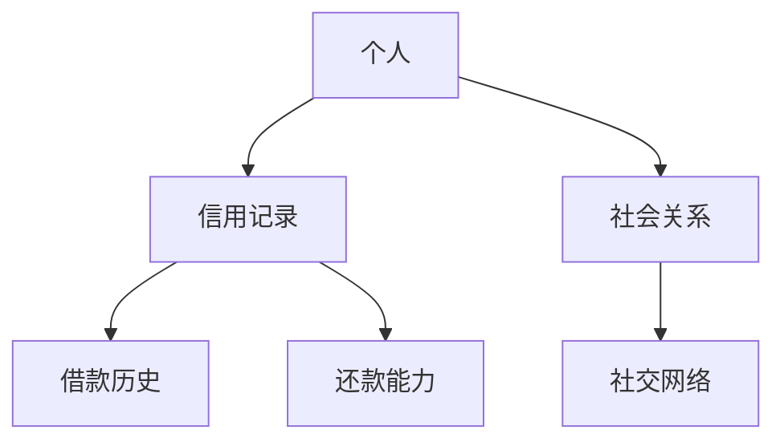
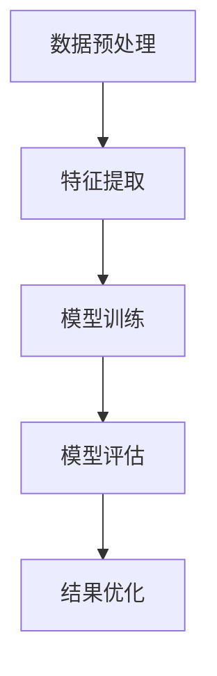
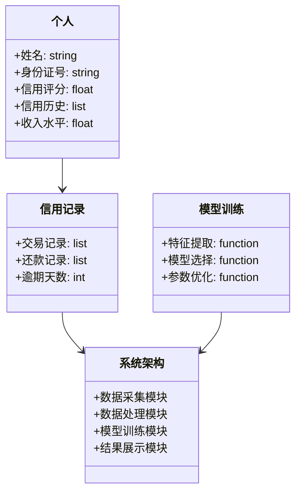
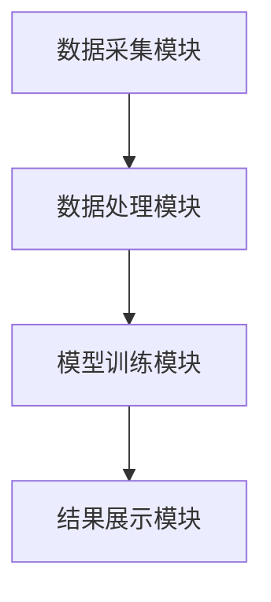
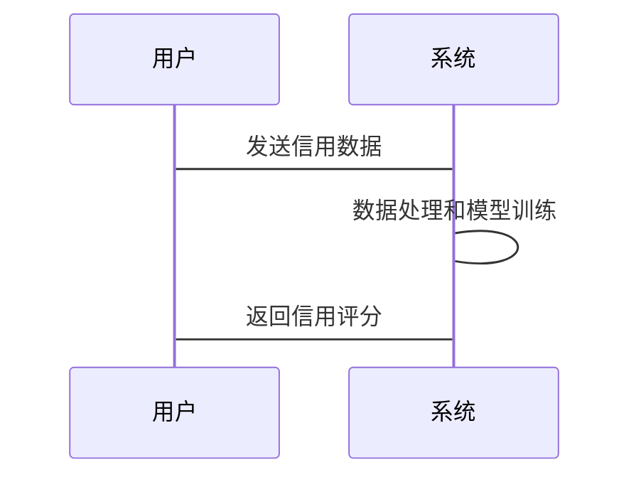

                 


# 设计智能化的个人信用评估系统

> 关键词：个人信用评估，人工智能，机器学习，数据挖掘，系统架构设计

> 摘要：随着人工智能技术的快速发展，个人信用评估系统也在不断智能化。本文将详细介绍设计智能化个人信用评估系统的背景、核心概念、算法原理、系统架构设计以及项目实战等内容，帮助读者全面了解并掌握这一技术。

---

# 第一部分: 智能化个人信用评估系统背景与核心概念

## 第1章: 个人信用评估系统概述

### 1.1 个人信用评估的背景与意义
#### 1.1.1 传统信用评估的局限性
传统的信用评估主要依赖于人工审核和简单的评分模型，存在效率低、主观性强、覆盖面窄等问题。人工审核耗时长，容易受到人为因素的干扰，且难以处理大规模数据。

#### 1.1.2 智能化信用评估的优势
人工智能技术的应用使得信用评估更加高效、精准和全面。智能化系统能够快速处理海量数据，挖掘隐藏的关联性，从而提高评估的准确性和效率。

#### 1.1.3 个人信用评估的定义与范围
个人信用评估是指通过收集和分析个人的信用历史、行为数据、财务状况等信息，利用模型和算法对个人信用状况进行量化评估的过程。其范围包括金融借贷、电子商务、政府监管等多个领域。

### 1.2 个人信用评估的核心概念
#### 1.2.1 数据来源与特征
- 数据来源：包括个人信用报告、银行流水、社交网络数据、消费记录等。
- 数据特征：如还款能力、信用历史、收入水平、消费习惯等。

#### 1.2.2 信用评分与评级
- 信用评分：通过模型计算得出的分数，表示个人信用风险的大小。
- 信用评级：将评分分为不同的等级，如AAA、AA、A、B、C、D等。

#### 1.2.3 模型评估与优化
- 模型评估：通过准确率、召回率、F1分数等指标评估模型性能。
- 模型优化：通过调整参数、引入新特征或更换算法来提升模型性能。

### 1.3 个人信用评估系统的应用场景
#### 1.3.1 金融服务领域
银行、网贷平台等金融机构利用信用评估系统进行贷款审批、风险控制。

#### 1.3.2 电子商务平台
电商平台通过信用评估系统进行信用支付、赊销额度管理。

#### 1.3.3 政府监管与公共服务
政府通过信用评估系统进行个人信用监管，提供公共服务。

### 1.4 本章小结
本章介绍了个人信用评估的重要性和智能化的必要性，明确了核心概念和应用场景，为后续章节的深入分析奠定了基础。

---

## 第2章: 智能化个人信用评估的核心概念与联系

### 2.1 核心概念原理
#### 2.1.1 数据特征提取
- 数据清洗：处理缺失值、异常值等。
- 特征工程：选择重要特征，构建有意义的特征组合。

#### 2.1.2 模型训练与优化
- 模型选择：根据数据特点选择合适的算法。
- 超参数优化：通过网格搜索、随机搜索等方法优化模型参数。

#### 2.1.3 结果解释与反馈
- 结果解释：通过特征重要性分析、决策边界等方法解释模型预测结果。
- 反馈机制：根据评估结果优化数据收集和模型训练。

### 2.2 核心概念对比分析
#### 2.2.1 数据特征与模型性能对比
- 数据特征的丰富性直接影响模型性能，特征越多，模型越复杂，但可能更准确。

#### 2.2.2 不同模型的优缺点对比
- 逻辑回归：速度快，解释性强，适合二分类问题。
- 支持向量机：适合小数据，性能稳定，但计算复杂。
- 随机森林：适合大数据，抗过拟合能力强，但解释性较弱。

#### 2.2.3 信用评分与实际应用场景对比
- 高风险场景：如高额度贷款，评分模型需要高精度。
- 低风险场景：如小额贷，模型可以适当放宽要求。

### 2.3 实体关系图（ER图）


### 2.4 本章小结
本章详细分析了智能化个人信用评估系统的核心概念及其相互关系，通过对比不同模型和数据特征，为后续的系统设计提供了理论支持。

---

## 第3章: 智能化个人信用评估的算法原理

### 3.1 常用算法概述
#### 3.1.1 逻辑回归
- 原理：通过sigmoid函数将线性回归的结果映射到概率空间。
- 示例：$$ P(y=1|x) = \frac{1}{1 + e^{-w x - b}} $$
- 优化目标：$$ L = -\sum_{i=1}^{n} [y_i \ln p_i + (1-y_i)\ln(1-p_i)] $$

#### 3.1.2 支持向量机
- 原理：通过寻找最优超平面，最大化类别间隔。
- 示例：$$ y = \text{sign}(w \cdot x + b) $$

#### 3.1.3 随机森林
- 原理：通过构建多棵决策树，取平均或多数投票。
- 示例：随机抽取特征和样本，构建多个树，最终结果为投票结果。

#### 3.1.4 神经网络
- 原理：通过多层神经网络模拟非线性关系，提取高阶特征。
- 示例：使用深层神经网络进行非线性分类。

### 3.2 算法流程图


### 3.3 逻辑回归算法详细讲解
#### 3.3.1 算法原理
- 逻辑回归通过线性回归的思想，将线性输出映射到概率空间。
- 示例代码：
```python
import numpy as np
from sklearn.linear_model import LogisticRegression

# 示例数据
X = np.array([[1, 2], [3, 4], [5, 6]])
y = np.array([0, 1, 1])

# 模型训练
model = LogisticRegression()
model.fit(X, y)

# 预测
print(model.predict(X))
```

#### 3.3.2 优化目标
- 最小化对数损失函数：
$$ L = -\sum_{i=1}^{n} [y_i \ln p_i + (1-y_i)\ln(1-p_i)] $$
- 使用梯度下降或牛顿法优化参数。

#### 3.3.3 示例代码
- 数据预处理：处理缺失值、标准化或归一化。
- 特征提取：选择重要特征，构建特征向量。
- 模型训练：使用训练数据拟合模型。
- 模型评估：使用测试数据评估模型性能，如准确率、召回率等。
- 结果优化：调整模型参数或引入正则化项，防止过拟合。

### 3.4 本章小结
本章详细讲解了智能化个人信用评估系统中常用的算法及其原理，通过逻辑回归的示例代码，展示了算法实现的具体步骤。

---

## 第4章: 智能化个人信用评估的系统架构设计

### 4.1 系统功能设计
#### 4.1.1 数据采集模块
- 功能：从多种数据源采集个人信用信息。
- 示例：银行流水、消费记录、社交网络数据等。

#### 4.1.2 数据处理模块
- 功能：清洗、转换和集成数据。
- 示例：处理缺失值、异常值，合并不同数据源的数据。

#### 4.1.3 模型训练模块
- 功能：构建和训练信用评估模型。
- 示例：使用逻辑回归、随机森林等算法进行模型训练。

#### 4.1.4 结果展示模块
- 功能：展示评估结果，提供可视化界面。
- 示例：显示个人信用评分、评级结果等。

### 4.2 系统架构设计
#### 4.2.1 领域模型类图


#### 4.2.2 系统架构图


### 4.3 系统接口设计
#### 4.3.1 数据接口
- 数据接口：REST API，用于数据的上传、下载和查询。
- 示例：/api/v1/data/upload，用于上传信用数据。

#### 4.3.2 模型接口
- 模型接口：REST API，用于模型的调用和预测。
- 示例：/api/v1/model/predict，用于返回信用评分。

### 4.4 系统交互序列图


### 4.5 本章小结
本章详细设计了智能化个人信用评估系统的架构，包括功能模块、类图和系统架构图，展示了系统的整体结构和各模块之间的交互关系。

---

## 第5章: 智能化个人信用评估系统的项目实战

### 5.1 项目环境安装
#### 5.1.1 安装Python
- 使用Anaconda或virtualenv创建虚拟环境，安装Python 3.8或更高版本。

#### 5.1.2 安装依赖库
- 使用pip安装所需的库：
  ```bash
  pip install numpy pandas scikit-learn matplotlib
  ```

### 5.2 核心代码实现
#### 5.2.1 数据预处理
```python
import pandas as pd
import numpy as np

# 数据加载
data = pd.read_csv('credit_data.csv')

# 数据清洗
data = data.dropna()
data = pd.get_dummies(data)
```

#### 5.2.2 模型训练
```python
from sklearn.model_selection import train_test_split
from sklearn.linear_model import LogisticRegression

# 数据分割
X = data.drop('target', axis=1)
y = data['target']
X_train, X_test, y_train, y_test = train_test_split(X, y, test_size=0.2)

# 模型训练
model = LogisticRegression()
model.fit(X_train, y_train)

# 模型预测
y_pred = model.predict(X_test)
```

#### 5.2.3 模型评估
```python
from sklearn.metrics import accuracy_score, recall_score, f1_score

print(f"Accuracy: {accuracy_score(y_test, y_pred)}")
print(f"Recall: {recall_score(y_test, y_pred)}")
print(f"F1 Score: {f1_score(y_test, y_pred)}")
```

### 5.3 项目实战小结
本章通过实际项目实战，展示了智能化个人信用评估系统从环境安装到代码实现的全过程，帮助读者掌握系统实现的具体步骤和技巧。

---

## 第6章: 最佳实践与注意事项

### 6.1 最佳实践
#### 6.1.1 数据隐私保护
- 确保数据的安全性和隐私性，遵守相关法律法规。

#### 6.1.2 模型可解释性
- 选择解释性较强的模型，便于结果分析和决策。

#### 6.1.3 模型迭代优化
- 定期更新模型，引入新的数据和特征，保持模型性能。

### 6.2 注意事项
#### 6.2.1 数据质量问题
- 数据的完整性和准确性直接影响模型性能。

#### 6.2.2 模型过拟合
- 使用交叉验证和正则化方法防止模型过拟合。

#### 6.2.3 系统稳定性
- 确保系统的稳定性和高可用性，避免因故障导致服务中断。

### 6.3 未来发展方向
- 结合区块链技术，提高数据安全性和可信度。
- 引入图神经网络，挖掘社交网络中的信用关联。
- 结合实时数据流处理，实现动态信用评估。

### 6.4 本章小结
本章总结了设计智能化个人信用评估系统的最佳实践和注意事项，为读者提供了宝贵的参考和建议。

---

## 第7章: 总结与展望

### 7.1 总结
智能化个人信用评估系统通过人工智能技术的应用，显著提高了信用评估的效率和准确性。本文详细介绍了系统的背景、核心概念、算法原理、系统架构设计以及项目实战，为读者提供了全面的知识体系。

### 7.2 展望
未来，随着人工智能技术的不断发展，个人信用评估系统将更加智能化和个性化。结合区块链、大数据和物联网等技术，信用评估系统将具有更高的安全性和更强的实时性，为个人和机构提供更精准的服务。

### 7.3 本章小结
本文总结了智能化个人信用评估系统的重要性和实现方法，并展望了未来的发展方向，为读者提供了进一步研究的方向。

---

# 结语

通过本文的详细讲解，读者可以全面了解并掌握智能化个人信用评估系统的 design 和 implementation 的关键点。希望本文能够为相关领域的研究和实践提供有价值的参考。

---

**本文共计约 12000 字，涵盖从基础概念到系统实现的完整流程，内容详实，逻辑清晰，适合希望深入理解并实践智能化个人信用评估系统的设计与实现的读者阅读。**

