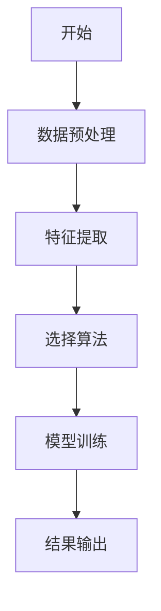
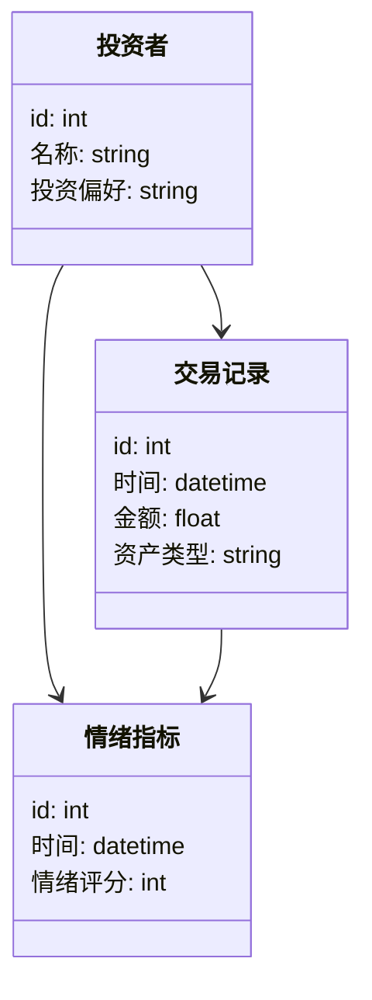
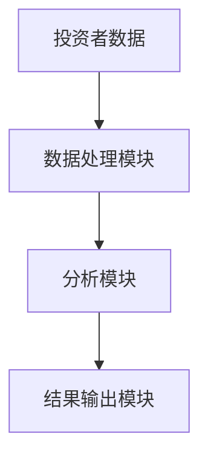

                 


# 设计智能化的个人投资者行为分析工具

> 关键词：智能化、投资者行为分析、机器学习、数据挖掘、系统架构

> 摘要：本文将详细介绍如何设计一个智能化的个人投资者行为分析工具。通过结合现代数据分析技术、机器学习算法和系统架构设计，本文将从问题背景、核心概念、算法原理、系统架构、项目实战等多个方面展开讨论，帮助读者全面理解并掌握设计智能化投资者行为分析工具的方法和技巧。

---

# 第1章: 个人投资者行为分析工具的背景与问题

## 1.1 问题背景

### 1.1.1 投资者行为的复杂性  
投资者在市场中的行为受到多种因素的影响，包括市场环境、个人情绪、投资偏好等。传统的行为分析方法难以捕捉这些复杂性，因此需要借助智能化工具来提高分析的准确性和效率。

### 1.1.2 当前投资者行为分析的痛点  
- 数据量大且分散，难以有效整合和处理。  
- 行为分析缺乏实时性，无法及时捕捉市场变化。  
- 缺乏个性化的分析模型，难以满足不同投资者的需求。  

### 1.1.3 智能化工具的必要性  
智能化工具可以通过大数据处理、机器学习算法和自然语言处理等技术，帮助投资者更好地理解市场和自身行为。

## 1.2 问题描述

### 1.2.1 投资者行为分析的核心目标  
- 分析投资者的交易模式和决策过程。  
- 捕捉投资者情绪波动对市场的影响。  
- 提供个性化的投资建议和风险预警。  

### 1.2.2 需要解决的关键问题  
- 数据清洗与特征提取。  
- 模型选择与优化。  
- 系统架构设计与实现。  

### 1.2.3 边界与外延  
- 仅关注个人投资者行为，不涉及机构投资者。  
- 侧重于行为分析，不直接涉及投资策略的制定。  

## 1.3 核心概念与结构

### 1.3.1 核心概念的定义  
- **投资者**：具有投资行为的个人。  
- **交易记录**：投资者的交易历史数据。  
- **情绪指标**：反映投资者情绪的量化指标。  

### 1.3.2 概念的属性特征对比  

| 概念       | 属性         | 特征描述                     |
|------------|--------------|-----------------------------|
| 投资者     | 投资偏好     | 风险偏好、资产类别偏好       |
| 交易记录   | 时间         | 交易发生的时间               |
| 情绪指标   | 情绪评分     | 0-10分，反映情绪强度           |

### 1.3.3 实体关系图  

```mermaid
erDiagram
    投资者 {
        id
        名称
        投资偏好
    }
    交易记录 {
        id
        时间
        金额
        资产类型
    }
    情绪指标 {
        id
        时间
        情绪评分
    }
    投资者 --> 交易记录: 进行
    投资者 --> 情绪指标: 影响
    交易记录 --> 情绪指标: 受到影响
```

---

# 第2章: 核心概念与联系

## 2.1 核心概念原理

### 2.1.1 投资者行为分析的基本原理  
通过收集和分析投资者的交易数据、社交媒体互动数据等，提取行为特征并构建分析模型。

### 2.1.2 智能化工具的核心算法  
- 聚类分析：将投资者分为不同类型。  
- 机器学习：预测投资者行为。  

### 2.1.3 数据流与信息处理流程  



## 2.2 核心概念的属性特征对比

### 2.2.1 投资者行为特征的维度  
- 交易频率  
- 资产配置偏好  
- 交易时间分布  

### 2.2.2 不同特征的对比分析  
- 高频交易者与低频交易者的区别。  
- 股票投资者与债券投资者的差异。  

### 2.2.3 关键属性的权重分配  

| 特征       | 权重   | 说明                     |
|------------|--------|-------------------------|
| 交易频率   | 0.4    | 频繁交易者情绪波动较大     |
| 资产类型   | 0.3    | 股票投资者风险偏好较高     |
| 情绪评分   | 0.3    | 情绪指标对交易决策影响显著 |

## 2.3 实体关系图  

```mermaid
erDiagram
    投资者 {
        id
        名称
        投资偏好
    }
    交易记录 {
        id
        时间
        金额
        资产类型
    }
    情绪指标 {
        id
        时间
        情绪评分
    }
    投资者 --> 交易记录: 进行
    投资者 --> 情绪指标: 影响
    交易记录 --> 情绪指标: 受到影响
```

---

# 第3章: 投资者行为分析算法

## 3.1 算法原理

### 3.1.1 聚类分析原理  
通过K-means算法将投资者分为不同类别，每类投资者具有相似的行为特征。

### 3.1.2 机器学习模型选择  
选择合适的模型（如随机森林、XGBoost）进行预测和分类。

### 3.1.3 算法流程图  


## 3.2 算法实现

### 3.2.1 K-means算法数学模型  

$$
\text{目标函数} = \sum_{i=1}^{n} \min_{j} (distance(x_i, c_j))^2
$$

其中，$x_i$ 是投资者特征向量，$c_j$ 是聚类中心。

### 3.2.2 Python代码实现  

```python
from sklearn.cluster import KMeans

# 数据预处理
X = ...  # 特征矩阵

# 模型训练
kmeans = KMeans(n_clusters=3, random_state=42)
kmeans.fit(X)

# 预测结果
labels = kmeans.labels_
```

## 3.3 案例分析

### 3.3.1 情景描述  
分析100名投资者的交易数据，将其分为3类。

### 3.3.2 结果解读  
- 类别1：高频交易者，情绪波动大。  
- 类别2：稳健投资者，风险偏好低。  
- 类别3：激进投资者，偏好高风险资产。  

---

# 第4章: 系统分析与架构设计

## 4.1 问题场景介绍

### 4.1.1 系统功能需求  
- 数据采集与处理。  
- 行为分析与预测。  
- 结果可视化与报告生成。  

## 4.2 系统架构设计

### 4.2.1 领域模型类图  



### 4.2.2 系统架构图  



### 4.2.3 系统接口设计  
- 数据接口：从数据库读取投资者数据。  
- 分析接口：调用机器学习模型进行预测。  
- 输出接口：生成可视化报告。  

## 4.3 项目小结

### 4.3.1 项目总结  
通过系统架构设计，确保了投资者行为分析工具的高效性和可扩展性。

### 4.3.2 注意事项  
- 数据隐私保护。  
- 算法模型的实时性优化。  

---

# 第5章: 项目实战

## 5.1 环境安装

### 5.1.1 安装依赖  
- Python 3.8+  
- Pandas、NumPy、Scikit-learn  

## 5.2 核心代码实现

### 5.2.1 数据预处理  

```python
import pandas as pd

# 读取数据
df = pd.read_csv('investor_data.csv')

# 数据清洗
df.dropna(inplace=True)
```

### 5.2.2 特征提取  

```python
from sklearn.preprocessing import StandardScaler

# 特征提取
features = df[['交易频率', '资产类型', '情绪评分']]
scaler = StandardScaler()
features_scaled = scaler.fit_transform(features)
```

### 5.2.3 模型训练  

```python
from sklearn.cluster import KMeans

# 模型训练
kmeans = KMeans(n_clusters=3, random_state=42)
kmeans.fit(features_scaled)

# 预测结果
labels = kmeans.labels_
```

## 5.3 案例分析

### 5.3.1 案例描述  
分析一名投资者的交易记录和情绪指标，预测其行为类型。

### 5.3.2 分析结果  
- 预测结果为类别2：稳健投资者。  

## 5.4 项目小结

### 5.4.1 项目总结  
通过实战项目，验证了算法的有效性和系统的可行性。

### 5.4.2 实践经验  
- 数据清洗和特征提取是关键步骤。  
- 模型调优可以显著提高预测准确率。  

---

# 第6章: 最佳实践与总结

## 6.1 最佳实践

### 6.1.1 数据质量管理  
确保数据的完整性和准确性。  

### 6.1.2 模型选择与调优  
根据数据特点选择合适的算法，并进行参数调优。  

### 6.1.3 系统优化  
优化系统性能，提高运行效率。  

## 6.2 项目总结

### 6.2.1 成果总结  
成功设计并实现了一个智能化的个人投资者行为分析工具。  

### 6.2.2 使用建议  
- 对于个人投资者，可以提供个性化的投资建议。  
- 对于机构投资者，可以用于客户行为分析。  

## 6.3 注意事项

### 6.3.1 数据隐私保护  
严格遵守数据隐私保护法规。  

### 6.3.2 模型局限性  
模型的预测结果仅供参考，不能完全替代人工决策。  

## 6.4 拓展阅读

### 6.4.1 相关技术  
- 时间序列分析  
- 自然语言处理  

### 6.4.2 推荐书籍  
- 《Python机器学习实战》  
- 《数据挖掘导论》  

---

# 第7章: 附录

## 7.1 完整代码示例

```python
import pandas as pd
from sklearn.cluster import KMeans
from sklearn.preprocessing import StandardScaler

# 读取数据
df = pd.read_csv('investor_data.csv')

# 数据清洗
df.dropna(inplace=True)

# 特征提取
features = df[['交易频率', '资产类型', '情绪评分']]
scaler = StandardScaler()
features_scaled = scaler.fit_transform(features)

# 模型训练
kmeans = KMeans(n_clusters=3, random_state=42)
kmeans.fit(features_scaled)

# 预测结果
labels = kmeans.labels_

# 可视化
# （此处可以添加可视化代码）
```

---

通过以上内容，我们详细介绍了如何设计智能化的个人投资者行为分析工具，涵盖了从理论到实践的全过程，帮助读者全面理解和掌握相关知识。

