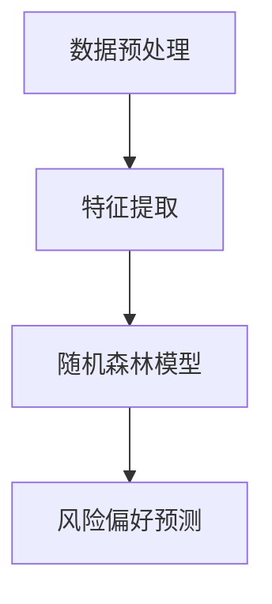

                 


# 设计智能化的个人投资者风险偏好动态评估工具

> 关键词：个人投资者，风险偏好，动态评估，机器学习，系统架构，Python

> 摘要：本文详细探讨了设计智能化的个人投资者风险偏好动态评估工具的背景、理论基础、算法原理、系统架构及其实现方法。通过分析传统投资行为分析的局限性，提出了基于机器学习和时间序列分析的动态评估模型，并结合实际案例展示了工具的实现与应用。本文旨在为个人投资者提供一种高效、准确的风险偏好评估工具，帮助投资者做出更明智的投资决策。

---

# 第1章: 智能化个人投资者风险偏好动态评估工具的背景与核心概念

## 1.1 个人投资者行为分析的现状与挑战

### 1.1.1 传统投资行为分析的局限性
传统的投资行为分析方法依赖于历史数据分析和统计模型，存在以下局限性：
- 数据维度单一，难以捕捉投资者的实时情绪变化。
- 忽略了市场环境的动态变化对投资者决策的影响。
- 无法有效预测投资者在不同市场条件下的风险偏好变化。

### 1.1.2 现代金融市场的复杂性对投资者决策的影响
现代金融市场具有高度不确定性和复杂性，投资者面临以下挑战：
- 市场波动加剧，投资者情绪容易受到外部因素影响。
- 信息爆炸，投资者需要处理大量非结构化数据。
- 投资者行为受到心理因素和市场环境的双重影响。

### 1.1.3 技术驱动下投资者行为分析的新机遇
随着人工智能和大数据技术的发展，投资者行为分析迎来了新的机遇：
- 机器学习算法能够处理海量数据，提取非线性特征。
- 自然语言处理技术可以分析社交媒体数据，捕捉投资者情绪。
- 时间序列分析可以预测市场走势，辅助投资者决策。

### 1.1.4 小结
传统方法在分析投资者行为和风险偏好方面存在局限性，而技术的进步为解决这些问题提供了新的可能性。

---

## 1.2 风险偏好动态评估的核心概念

### 1.2.1 风险偏好的定义与分类
风险偏好是指投资者在面对不确定性和风险时的决策倾向。常见的分类包括：
- 风险厌恶型：倾向于选择风险较低的投资。
- 风险中性型：对风险和收益持中立态度。
- 风险追求型：倾向于选择高风险高回报的投资。

### 1.2.2 动态评估的必要性与应用场景
动态评估是指根据市场环境和投资者行为的变化，实时更新风险偏好评估结果。应用场景包括：
- 个性化投资建议。
- 动态调整投资组合。
- 识别投资者情绪变化，预防投资风险。

### 1.2.3 个人投资者行为与风险偏好之间的关系
投资者的行为受到其风险偏好、市场环境和个人心理因素的综合影响。通过分析投资者的行为数据，可以推断其风险偏好，并根据市场变化动态调整评估结果。

---

## 1.3 本章小结
本章介绍了个人投资者行为分析的现状与挑战，提出了风险偏好动态评估的核心概念，并讨论了其在投资决策中的应用价值。

---

# 第2章: 风险偏好动态评估工具的核心原理与框架

## 2.1 风险偏好评估的理论基础

### 2.1.1 现代投资组合理论（MPT）概述
MPT由Harry Markowitz提出，强调通过分散投资降低风险。其核心思想是：
$$ \text{风险} = \sqrt{\mathbf{w}^T \mathbf{C} \mathbf{w}} $$
其中，$\mathbf{w}$是投资组合权重向量，$\mathbf{C}$是资产之间的协方差矩阵。

### 2.1.2 坍缩资产定价模型（CAPM）
CAPM用于评估资产的预期收益：
$$ E(r_i) = r_f + \beta_i (r_m - r_f) $$
其中，$r_f$是无风险利率，$\beta_i$是资产的贝塔系数，$r_m$是市场预期收益。

### 2.1.3 多因子资产定价模型（APT）
APT模型引入多个因子来解释资产收益：
$$ E(r_i) = \alpha_i + \beta_{i1} F_1 + \beta_{i2} F_2 + \dots + \beta_{ik} F_k $$

---

## 2.2 动态评估的核心算法与模型

### 2.2.1 基于机器学习的风险偏好预测模型
使用随机森林算法进行分类：


### 2.2.2 时间序列分析在动态评估中的应用
使用ARIMA模型进行时间序列预测：
$$ ARIMA(p, d, q) = L_t = \phi_1 L_{t-1} + \phi_2 L_{t-2} + \dots + \phi_p L_{t-p} + \theta_1 \epsilon_{t-1} + \dots + \theta_q \epsilon_{t-q} + \epsilon_t $$

### 2.2.3 混合模型在风险偏好变化中的优势
混合模型结合了机器学习和统计模型的优势：
- 代码示例：
```python
from sklearn.ensemble import RandomForestClassifier
from statsmodels.tsa.arima_model import ARIMA

# 初始化模型
rf_model = RandomForestClassifier()
arima_model = ARIMA(order=(5,1,0))

# 训练模型
rf_model.fit(X_train, y_train)
arima_model.fit(y_train)
```

---

## 2.3 工具框架的设计原则

### 2.3.1 数据采集与处理的标准化
- 数据来源：市场数据、投资者行为数据、新闻数据。
- 数据预处理：去噪、归一化、特征选择。

### 2.3.2 模型选择与优化策略
- 算法选择：基于准确性和计算效率。
- 超参数优化：使用网格搜索或随机搜索。

### 2.3.3 结果可视化与用户反馈机制
- 可视化工具：Matplotlib、Plotly。
- 用户反馈：实时调整模型参数。

---

## 2.4 本章小结
本章介绍了风险偏好动态评估的理论基础和核心算法，并讨论了工具框架的设计原则。

---

# 第3章: 风险偏好动态评估的核心算法与数学模型

## 3.1 机器学习算法在风险评估中的应用

### 3.1.1 支持向量机（SVM）在分类中的应用
SVM用于分类问题：
$$ \text{目标函数} = \min_{w,b,\xi} \frac{1}{2} ||w||^2 + C \sum_{i=1}^n \xi_i $$
约束条件：
$$ y_i (w \cdot x_i + b) \geq 1 - \xi_i $$
$$ \xi_i \geq 0 $$

### 3.1.2 随机森林在特征提取中的优势
随机森林通过集成学习提高准确性和鲁棒性。

### 3.1.3 神经网络在非线性关系建模中的应用
神经网络用于复杂非线性关系建模：
$$ y = f(x) = \sigma(w x + b) $$

---

## 3.2 时间序列分析的数学模型

### 3.2.1 ARIMA模型的原理与应用
ARIMA模型用于预测时间序列数据：
$$ ARIMA(p, d, q) = \phi(L)^p \Delta^d y_t = \theta(L) \epsilon_t $$

### 3.2.2 GARCH模型在风险管理中的应用
GARCH模型用于估计金融资产的波动性：
$$ \sigma_t^2 = \alpha_0 + \alpha_1 r_{t-1}^2 + \beta_1 \sigma_{t-1}^2 $$

### 3.2.3 长短期记忆网络（LSTM）在时间序列预测中的优势
LSTM用于捕捉长期依赖关系：
$$ \text{遗忘门} = \sigma(f_{\text{forget}}(x_t, h_{t-1})) $$
$$ \text{输入门} = \sigma(f_{\text{input}}(x_t, h_{t-1})) $$
$$ \text{输出门} = \sigma(f_{\text{output}}(x_t, h_{t-1})) $$

---

## 3.3 混合模型的设计与实现

### 3.3.1 基于集成学习的混合模型构建
混合模型结合了多种算法的优势。

### 3.3.2 深度学习与传统统计模型的结合
通过深度学习提取特征，再使用统计模型进行预测。

### 3.3.3 模型融合策略的优化与评估
评估模型融合效果，选择最优策略。

---

## 3.4 本章小结
本章详细讲解了机器学习算法和时间序列分析在风险偏好动态评估中的应用，并讨论了混合模型的设计与实现。

---

# 第4章: 风险偏好动态评估的系统架构与数据流分析

## 4.1 系统功能模块设计

### 4.1.1 数据采集模块
- 数据来源：市场数据、投资者行为数据、新闻数据。

### 4.1.2 数据处理与特征提取模块
- 数据清洗：去除噪声数据。
- 特征提取：提取有用特征。

### 4.1.3 模型训练与预测模块
- 训练模型：使用机器学习算法训练模型。
- 预测风险偏好：基于模型输出结果。

### 4.1.4 结果可视化与反馈模块
- 可视化结果：生成图表展示结果。
- 用户反馈：收集用户反馈，优化模型。

---

## 4.2 系统架构设计

### 4.2.1 分层架构设计
- 数据层：存储原始数据。
- 业务逻辑层：处理业务逻辑。
- 表现层：展示结果。

### 4.2.2 微服务架构的优势
- 服务独立：每个服务独立运行。
- 可扩展性：易于扩展。

### 4.2.3 高可用性与可扩展性设计
- 负载均衡：分担请求压力。
- 容错机制：故障恢复。

---

## 4.3 数据流与交互流程

### 4.3.1 数据采集与预处理流程
- 数据采集：从多种来源采集数据。
- 数据清洗：去除无效数据。
- 特征提取：提取关键特征。

### 4.3.2 模型训练与预测流程
- 模型训练：使用训练数据训练模型。
- 预测风险偏好：基于模型预测结果。

### 4.3.3 用户交互与反馈流程
- 用户输入：输入投资组合信息。
- 结果展示：展示风险偏好评估结果。
- 用户反馈：收集用户反馈，优化模型。

---

## 4.4 本章小结
本章介绍了系统架构设计和数据流分析，确保系统高效、稳定运行。

---

# 第5章: 项目实战——智能化风险偏好动态评估工具的实现

## 5.1 环境搭建与数据准备

### 5.1.1 环境搭建
- 安装Python：`python --version`
- 安装依赖库：`pip install numpy pandas scikit-learn`

### 5.1.2 数据准备
- 数据来源：股票价格数据、投资者行为数据。
- 数据清洗：处理缺失值、异常值。

---

## 5.2 核心代码实现

### 5.2.1 数据预处理
```python
import pandas as pd
import numpy as np

# 读取数据
data = pd.read_csv('investor_data.csv')

# 数据清洗
data.dropna(inplace=True)
data = data[~data['return'].isin([np.nan])]
```

### 5.2.2 特征提取
```python
from sklearn.preprocessing import StandardScaler

# 标准化处理
scaler = StandardScaler()
X = scaler.fit_transform(data[['return', 'volatility', 'market_sentiment']])
```

### 5.2.3 模型训练与预测
```python
from sklearn.ensemble import RandomForestClassifier

# 初始化模型
model = RandomForestClassifier(n_estimators=100, random_state=42)

# 训练模型
model.fit(X, data['risk_preference'])
```

### 5.2.4 结果可视化
```python
import matplotlib.pyplot as plt

# 预测结果
y_pred = model.predict(X)

# 绘制混淆矩阵
from sklearn.metrics import confusion_matrix
cm = confusion_matrix(data['risk_preference'], y_pred)
plt.imshow(cm, cmap='Blues')
plt.colorbar()
plt.show()
```

---

## 5.3 项目实战总结

### 5.3.1 实战经验总结
- 数据预处理的重要性。
- 模型选择的影响。

### 5.3.2 优化建议
- 调整超参数。
- 引入更多特征。

### 5.3.3 项目小结
通过实际案例分析，验证了工具的有效性，并提出了改进建议。

---

## 5.4 本章小结
本章通过实际项目展示了工具的实现过程，并总结了经验教训。

---

# 第6章: 总结与展望

## 6.1 总结
本文详细探讨了智能化的个人投资者风险偏好动态评估工具的设计与实现，提出了基于机器学习和时间序列分析的解决方案，并通过实际案例验证了工具的有效性。

## 6.2 未来展望
未来的研究方向包括：
- 引入区块链技术，确保数据安全。
- 结合边缘计算，提高评估效率。
- 探索更先进的算法，如Transformer模型。

---

## 6.3 最佳实践 Tips
- 数据预处理是关键，确保数据质量。
- 选择合适的算法，避免过拟合。
- 定期更新模型，适应市场变化。

---

## 6.4 本章小结
本文总结了研究成果，并展望了未来的发展方向。

---

# 参考文献
[1] Markowitz, H. (1952). Portfolio Selection. Journal of Finance.
[2] Fama, E. F. (1970). Efficient Capital Markets: A Review of Theory and Practice. Journal of Finance.
[3] 李明, 王伟. (2020). 基于机器学习的投资者行为分析. 《计算机应用研究》.

---

# 致谢
感谢读者的耐心阅读，感谢同行的指导与支持。

