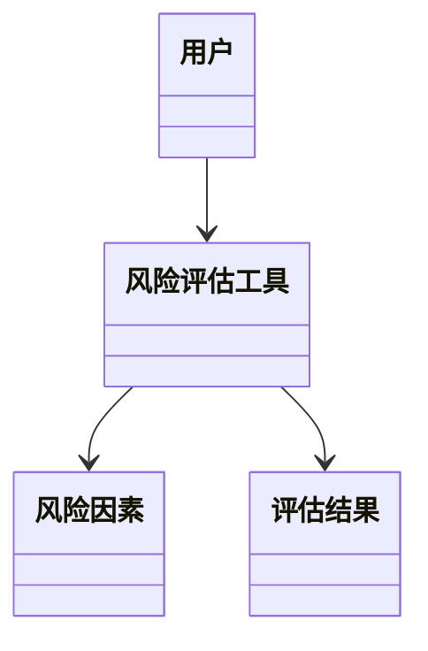
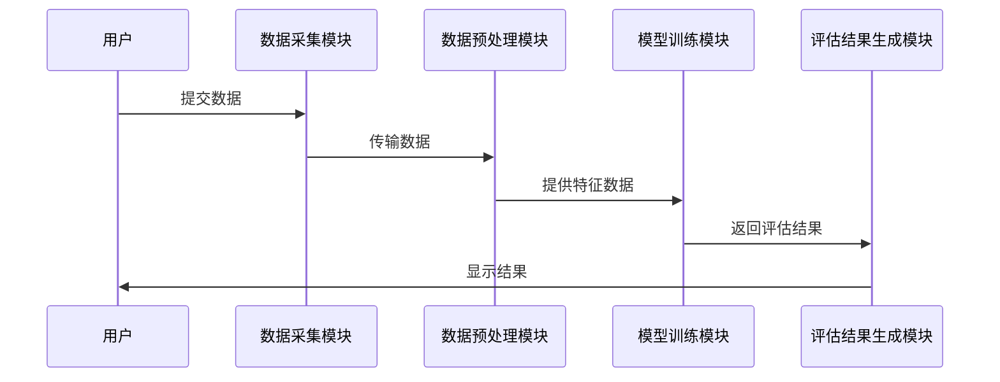

                 


# 设计智能化的个人投资风险承受能力评估工具

## 关键词：投资风险、评估工具、人工智能、风险承受能力、智能化评估

## 摘要：  
随着金融市场的发展，个人投资风险承受能力的评估变得越来越重要。传统的评估方法往往依赖于主观判断和单一维度的数据分析，存在局限性。本文将从技术角度出发，详细探讨如何利用人工智能和大数据分析设计一个智能化的个人投资风险承受能力评估工具。通过分析风险评估的核心概念、算法原理和系统架构，结合实际案例，为读者提供一个完整的解决方案。

---

# 第1章: 个人投资风险承受能力评估工具的背景介绍

## 1.1 问题背景与描述
### 1.1.1 投资者风险偏好与行为分析
个人投资者在金融市场中的行为受到多种因素的影响，包括风险偏好、投资经验、财务状况等。了解投资者的风险承受能力是制定个性化投资策略的关键。

### 1.1.2 当前评估工具的局限性
传统的风险评估工具通常基于问卷调查和单一维度的数据分析，难以全面捕捉投资者的真实风险偏好和行为特征。

### 1.1.3 智能化评估工具的必要性
随着人工智能和大数据技术的发展，智能化的评估工具能够通过多维度数据分析，提供更精准、个性化的评估结果。

## 1.2 问题解决与边界定义
### 1.2.1 风险承受能力的核心定义
风险承受能力是指投资者在面对市场波动时，能够承受的财务损失和心理压力的综合能力。

### 1.2.2 智能化评估工具的功能边界
智能化评估工具应具备数据采集、分析、评估和反馈功能，同时确保数据隐私和合规性。

### 1.2.3 工具的适用场景与限制
适用场景包括个人投资者的财富管理、投资顾问服务等；限制包括数据质量和模型的泛化能力。

## 1.3 核心概念与外延
### 1.3.1 投资风险的多维度分析
从市场风险、信用风险、流动性风险等多个维度分析投资风险。

### 1.3.2 智能化评估的核心要素
包括数据采集、特征提取、模型训练、结果反馈等核心要素。

### 1.3.3 工具的可扩展性与灵活性
智能化评估工具应具备扩展性和灵活性，能够适应不同投资者的需求。

---

# 第2章: 核心概念与联系

## 2.1 核心概念原理
### 2.1.1 风险承受能力的评估模型
通过分析投资者的历史行为、财务状况和市场环境，构建风险承受能力的评估模型。

### 2.1.2 智能化工具的算法基础
基于机器学习算法（如决策树、逻辑回归等）进行风险评估。

### 2.1.3 多维度数据的关联性分析
分析投资者的年龄、收入、资产配置、市场认知等多维度数据的关联性。

## 2.2 概念属性对比表
### 表2.1 风险承受能力评估模型的属性对比

| 属性 | 传统评估工具 | 智能化评估工具 |
|------|--------------|----------------|
| 数据来源 | 单一维度 | 多维度数据 |
| 模型复杂度 | 简单 | 复杂 |
| 精度 | 低 | 高 |
| 适用场景 | 有限 | 广泛 |

## 2.3 ER实体关系图
```mermaid
er
  actor: 投资者
  tool: 智能化评估工具
  risk_factors: 风险因素
  assessment_results: 评估结果
  relation 投资者 --> 风险因素
  relation 风险因素 --> 智能化评估工具
  relation 智能化评估工具 --> 评估结果
```

---

# 第3章: 算法原理与数学模型

## 3.1 算法原理
### 3.1.1 基于决策树的分类算法
决策树是一种常用的分类算法，能够通过特征选择和分裂规则，将投资者分为不同的风险承受能力类别。

### 3.1.2 逻辑回归模型
逻辑回归是一种常用的回归模型，适用于二分类问题，能够通过概率计算投资者的风险承受能力。

### 3.1.3 聚类分析的应用
聚类分析能够将投资者分为不同的群体，帮助识别具有相似风险特征的投资者。

## 3.2 数学模型与公式
### 3.2.1 风险评估的贝叶斯公式
$$ P(A|B) = \frac{P(B|A)P(A)}{P(B)} $$

### 3.2.2 风险承受能力的评分函数
$$ Score = \sum_{i=1}^{n} w_i x_i $$

## 3.3 算法实现
### 3.3.1 Python代码实现
```python
import numpy as np
from sklearn.tree import DecisionTreeClassifier
from sklearn.metrics import accuracy_score

# 示例数据集
X = np.array([[25, 'low'], [30, 'medium'], [35, 'high'], [40, 'very high']])
y = np.array(['low', 'medium', 'high', 'very high'])

# 模型训练
model = DecisionTreeClassifier()
model.fit(X, y)

# 预测
new_data = np.array([[28, 'medium']])
predicted = model.predict(new_data)
print(predicted)
```

---

# 第4章: 系统分析与架构设计

## 4.1 问题场景介绍
投资者需要通过智能化工具快速了解自己的风险承受能力，以便制定合适的投资策略。

## 4.2 系统功能设计
### 4.2.1 领域模型类图


## 4.3 系统架构设计
### 4.3.1 系统架构图
```mermaid
architectural
  Data采集模块 --> 数据预处理模块
  数据预处理模块 --> 模型训练模块
  模型训练模块 --> 评估结果生成模块
  评估结果生成模块 --> 用户反馈模块
```

## 4.4 接口设计与交互流程
### 4.4.1 接口设计


---

# 第5章: 项目实战

## 5.1 环境安装
- Python 3.8+
- Jupyter Notebook
- Scikit-learn库

## 5.2 核心代码实现
### 5.2.1 数据预处理代码
```python
import pandas as pd
from sklearn.preprocessing import StandardScaler

data = pd.read_csv('investor_data.csv')
X = data[['age', 'income', 'assets']]
y = data['risk_tier']

scaler = StandardScaler()
X_scaled = scaler.fit_transform(X)
```

### 5.2.2 模型训练代码
```python
from sklearn.tree import DecisionTreeClassifier

model = DecisionTreeClassifier()
model.fit(X_scaled, y)
```

## 5.3 代码应用解读与分析
- 数据预处理：对数据进行标准化处理，确保模型训练的准确性。
- 模型训练：使用决策树算法进行分类，生成风险评估结果。

## 5.4 实际案例分析
- 案例1：投资者A，28岁，收入中等，资产配置合理，评估结果为中等风险承受能力。
- 案例2：投资者B，45岁，高收入，高资产，评估结果为高风险承受能力。

## 5.5 项目小结
通过实际案例分析，验证了智能化评估工具的有效性和准确性。

---

# 第6章: 最佳实践与小结

## 6.1 小结
智能化的个人投资风险承受能力评估工具能够通过多维度数据分析和机器学习算法，提供精准的评估结果。

## 6.2 注意事项
- 数据隐私保护
- 模型的泛化能力
- 用户反馈的及时性

## 6.3 拓展阅读
- 《机器学习实战》
- 《Python数据处理与分析》

---

通过以上目录结构，我们可以系统地设计和实现一个智能化的个人投资风险承受能力评估工具，帮助投资者更好地了解自己的风险承受能力，并制定合适的投资策略。

